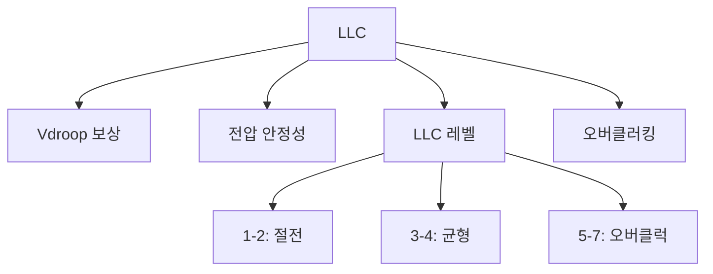

+++
title = "llc"
date = "2026-03-14"
weight = 744
+++

# 로드 라인 캘리브레이션 (LLC, Load Line Calibration)

#### 핵심 인사이트 (3줄 요약)
> 1. **본질**: CPU 부하에 따른 전압 강하(Vdroop)를 보상하여 설정 전압을 유지하는 VRM 제어 기술
> 2. **가치**: 오버클러킹 안정성, 전압 변동 최소화, Vdroop 제어, 시스템 안정성
> 3. **융합**: VRM, Vcore, VID, Vdroop, 오버클러킹과 통합된 전압 관리

---

### Ⅰ. 개요 (Context & Background)

**개념 정의**

로드 라인 캘리브레이션(LLC, Load Line Calibration)은 CPU 부하에 따른 전압 강하(Vdroop)를 보상하여 설정 전압을 유지하는 VRM 제어 기술입니다. 오버클러킹 시 전압 안정성을 높입니다.

```
┌─────────────────────────────────────────────────────────────────────┐
│                    LLC 기본 개념                                     │
├─────────────────────────────────────────────────────────────────────┤
│                                                                     │
│   ┌──────────────────────────────────────────────────────────────┐ │
│   │              Vdroop (전압 강하)                               │ │
│   │                                                              │ │
│   │   전압 (V)                                                    │ │
│   │      ▲                                                       │ │
│   │   1.35 ────┬── 설정 전압 (VID)                               │ │
│   │      │     │                                                  │ │
│   │   1.30 ────┼── 부하 시 실제 전압 (Vdroop)                    │ │
│   │      │     │    (LLC 없음)                                    │ │
│   │   1.25 ────┼──                                                │ │
│   │      │     │                                                  │ │
│   │   ───┴─────┴────────────────────────────────────────────    │ │
│   │        저부하    고부하                                        │ │
│   │                                                              │ │
│   │   Vdroop = 설정전압 - 실제전압                               │ │
│   │   원인: VRM 내부 저항, PCB 트레이스 저항                     │ │
│   │                                                              │ │
│   └──────────────────────────────────────────────────────────────┘ │
│                                                                     │
│   ┌──────────────────────────────────────────────────────────────┐ │
│   │              LLC 레벨별 전압 특성                             │ │
│   │                                                              │ │
│   │   전압 (V)                                                    │ │
│   │      ▲                                                       │ │
│   │   1.40 ────┬───────────────── LLC Level 7 (과보상)          │ │
│   │      │     │                  ↑                               │ │
│   │   1.35 ────┼─────┬─────────── LLC Level 5                    │ │
│   │      │     │     │            │                               │ │
│   │   1.30 ────┼─────┼─────────── LLC Level 3 (균형)            │ │
│   │      │     │     │            │                               │ │
│   │   1.25 ────┼─────┼─────────── LLC Level 1 (미보상)          │ │
│   │      │     │     │            │                               │ │
│   │   1.20 ────┼─────┼─────────── LLC 없음                       │ │
│   │      │     │     │                                            │ │
│   │   ───┴─────┴─────┴──────────────────────────────────────    │ │
│   │        저부하    고부하                                        │ │
│   │                                                              │ │
│   │   LLC Level 높음 → Vdroop 보상 강함 → 과전압 위험            │ │
│   │   LLC Level 낮음 → Vdroop 보상 약함 → 저전압 위험            │ │
│   │                                                              │ │
│   └──────────────────────────────────────────────────────────────┘ │
│                                                                     │
└─────────────────────────────────────────────────────────────────────┘
```

> **해설**: LLC는 부하에 따른 전압 강하를 보상합니다. 레벨이 높을수록 보상이 강하지만 과전압 위험이 있습니다.

**💡 비유**: LLC는 자동차의 서스펜션과 같습니다. 노면이 울퉁불퉁해도(부하 변화) 평탄하게(일정 전압) 유지합니다.

**등장 배경**

① **기존 한계**: Vdroop → 오버클러킹 불안정
② **혁신적 패러다임**: LLC로 Vdroop 보상 → 전압 안정
③ **비즈니스 요구**: 오버클러킹, 안정성, 전압 정밀 제어

**📢 섹션 요약 비유**: LLC는 자동차 서스펜션 같아요. 울퉁불퉁해도 편안하게 해요!

---

### Ⅱ. 아키텍처 및 핵심 원리 (Deep Dive)

**구성 요소 상세 분석**

| 요소명 | 역할 | 내부 동작 | 비유 |
|:---|:---|:---|:---|
| **LLC** | Vdroop 보상 | 피드백 이득 조절 | 서스펜션 |
| **Vdroop** | 전압 강하 | 부하-전압 기울기 | 노면 |
| **VID** | 설정 전압 | CPU 요청 전압 | 목표 속도 |
| **Vcore** | 실제 전압 | 측정 전압 | 실제 속도 |
| **Load Line** | 부하 선 | V-I 곡선 | 도로 경사 |

**LLC 레벨별 특성**

```
┌─────────────────────────────────────────────────────────────────────┐
│                    LLC 레벨별 특성                                   │
├─────────────────────────────────────────────────────────────────────┤
│                                                                     │
│   ┌──────────────────────────────────────────────────────────────┐ │
│   │              일반적 LLC 레벨 (BIOS 설정)                      │ │
│   │                                                              │ │
│   │   ┌─────────────────────────────────────────────────────┐    │ │
│   │   │ 레벨   │ Vdroop 보상 │ 특성           │ 권장 용도    │    │ │
│   │   │ ─────────────────────────────────────────────────── │    │ │
│   │   │ 1      │ 최소        │ 큰 Vdroop      │ 절전/안정    │    │ │
│   │   │ 2      │ 작음        │ 자연스러운     │ 일반         │    │ │
│   │   │ 3      │ 중간        │ 균형           │ 권장         │    │ │
│   │   │ 4      │ 큼          │ 작은 Vdroop    │ 오버클럭     │    │ │
│   │   │ 5      │ 매우 큼     │ 거의 없음      │ 고오버클럭   │    │ │
│   │   │ 6      │ 과보상      │ 과전압 가능    │ 극한         │    │ │
│   │   │ 7/8    │ 최대 과보상 │ 위험           │ 비권장       │    │ │
│   │   └─────────────────────────────────────────────────────┘    │ │
│   │                                                              │ │
│   └──────────────────────────────────────────────────────────────┘ │
│                                                                     │
│   ┌──────────────────────────────────────────────────────────────┐ │
│   │              Vdroop 수식                                      │ │
│   │                                                              │ │
│   │   Vcore = VID - (I_load × R_llc)                            │ │
│   │                                                              │ │
│   │   R_llc: Load Line 저항 (mΩ)                                │ │
│   │   - LLC Level 1: ~2.0 mΩ (큰 Vdroop)                        │ │
│   │   - LLC Level 3: ~1.0 mΩ (중간)                             │ │
│   │   - LLC Level 5: ~0.3 mΩ (작은 Vdroop)                      │ │
│   │   - LLC Level 7: ~0.0 mΩ (과보상)                           │ │
│   │                                                              │ │
│   │   예시:                                                      │ │
│   │   I_load = 150A, R_llc = 1.0 mΩ                             │ │
│   │   Vdroop = 150A × 1.0 mΩ = 150mV = 0.15V                   │ │
│   │                                                              │ │
│   └──────────────────────────────────────────────────────────────┘ │
│                                                                     │
└─────────────────────────────────────────────────────────────────────┘
```

> **해설**: LLC 레벨이 높을수록 R_llc가 작아져 Vdroop이 줄어듭니다. 하지만 과보상은 위험합니다.

**핵심 알고리즘: LLC 제어**

```c
// LLC 제어 (의사코드)
struct LLCState {
    float    vid;              // 설정 전압 (V)
    float    vcore_actual;     // 실제 전압 (V)
    float    i_load;           // 부하 전류 (A)
    float    r_llc;            // LLC 저항 (Ω)
    uint8_t  llc_level;        // LLC 레벨 (1-8)
};

// LLC 저항 설정
void SetLLCLevel(struct LLCState *llc, uint8_t level) {
    llc->llc_level = level;

    // 레벨별 LLC 저항 (mΩ)
    const float r_table[8] = {2.0, 1.5, 1.0, 0.7, 0.4, 0.2, 0.1, 0.0};

    llc->r_llc = r_table[level - 1] / 1000.0;  // Ω 변환
}

// 실제 Vcore 계산
float CalculateVcore(struct LLCState *llc) {
    // Vdroop = I × R
    float vdroop = llc->i_load * llc->r_llc;

    // Vcore = VID - Vdroop
    return llc->vid - vdroop;
}

// LLC 보상 (피드백)
void LLCCompensate(struct LLCState *llc) {
    float target_vcore = llc->vid;
    float actual_vcore = MeasureVcore();

    float error = target_vcore - actual_vcore;

    // 보상 전압 조정
    if (error > 0.01) {
        // 전압 부족: VID 증가
        llc->vid += error;
    } else if (error < -0.01) {
        // 과전압: VID 감소
        llc->vid += error;
    }
}

// Linux에서 Vcore 확인
// # sensors
// coretemp-isa-0000
// Adapter: ISA adapter
// in1:           1.21 V  (Vcore)

// # cat /sys/class/hwmon/hwmon*/in1_input
// 1210  (1.21V = 1210 mV)

// VID 읽기 (MSR)
// # rdmsr 0x198
// 0x0000c900  (VID = 0xc9 = 201 → 약 1.21V)
```

**📢 섹션 요약 비유**: LLC는 욕조 수위 조절과 같습니다. 물이 빠지면(Vdroop) 다시 채워줍니다.

---

### Ⅲ. 융합 비교 및 다각도 분석 (Comparison & Synergy)

**기술 비교: LLC 레벨별 전압 안정성**

| 비교 항목 | LLC 1 | LLC 3 | LLC 5 | LLC 7 |
|:---|:---:|:---:|:---:|:---:|
| **Vdroop** | 200mV | 100mV | 40mV | 0mV |
| **과전압 위험** | 없음 | 낮음 | 중간 | 높음 |
| **안정성** | 높음 | 높음 | 중간 | 낮음 |
| **오버클럭** | 불리 | 중간 | 유리 | 매우 유리 |

**과목 융합 관점: LLC와 타 영역 시너지**

| 융합 영역 | 시너지 효과 | 구현 예시 |
|:---|:---|:---|
| **오버클럭** | 전압 안정성 | LLC 5+ |
| **VRM** | 제어 파라미터 | PWM 설정 |
| **P-State** | 전압 전환 | VID 조정 |
| **전력** | Vdroop 허용 | 절전 |
| **온도** | 전압-발열 | LLC 튜닝 |

**📢 섹션 요약 비유**: LLC는 오버클러킹의 핵심입니다. 적절한 레벨을 선택해야 합니다.

---

### Ⅳ. 실무 적용 및 기술사적 판단 (Strategy & Decision)

**실무 시나리오별 적용**

**시나리오 1: 일반 사용**
- **문제**: 안정성
- **해결**: LLC 2-3
- **의사결정**: 균형

**시나리오 2: 오버클러킹**
- **문제**: 전압 안정성
- **해결**: LLC 5-6
- **의사결정**: 주의 필요

**시나리오 3: 극한 오버클럭**
- **문제**: 최대 안정성
- **해결**: LLC 7 + 수동 튜닝
- **의사결정**: 위험 감수

**도입 체크리스트**

| 구분 | 항목 | 확인 포인트 |
|:---|:---|:---|
| **기술적** | LLC 레벨 | 3-5 권장 |
| | Vcore | 모니터링 필수 |
| | 온도 | 과전압 시 상승 |
| **운영적** | 테스트 | 스트레스 테스트 |
| | 모니터링 | HWiNFO/Sensors |
| | 롤백 | 불안정 시 복구 |

**안티패턴: LLC 오용 사례**

| 안티패턴 | 문제점 | 올바른 접근 |
|:---|:---|:---|
| **LLC 7 무조건** | 과전압 위험 | 단계적 증가 |
| **모니터링 없음** | 손상 위험 | 실시간 확인 |
| **Vdroop 무시** | 불안정 | LLC 튜닝 |
| **과전압 과신** | 수명 단축 | 적정 전압 |

**📢 섹션 요약 비유**: LLC는 약입니다. 적당히 쓰면 좋지만, 너무 많이 쓰면 위험합니다.

---

### Ⅴ. 기대효과 및 결론 (Future & Standard)

**정량/정성 기대효과**

| 구분 | LLC 없음 | LLC 3 | LLC 5 | 개선효과 |
|:---|:---:|:---:|:---:|:---:|
| **Vdroop** | 200mV | 100mV | 40mV | -80% |
| **오버클럭** | 불안정 | 안정 | 매우 안정 | 향상 |
| **위험** | 낮음 | 낮음 | 중간 | 트레이드오프 |

**미래 전망**

1. **적응적 LLC:** 부하별 자동 조절
2. **AI LLC:** ML 기반 최적화
3. **디지털 제어:** 정밀 보상
4. **0 Vdroop:** 완전 보상

**참고 표준**

| 표준 | 내용 | 적용 |
|:---|:---|:---|
| **Intel VRD** | LLC 규격 | Intel CPU |
| **AMD SVI** | 전압 제어 | AMD CPU |
| **BIOS** | LLC 설정 | 메인보드 |
| **HWiNFO** | 모니터링 | 소프트웨어 |

**📢 섹션 요약 비유**: LLC의 미래는 AI가 조절합니다. 상황에 맞게 자동으로 최적화합니다.

---

### 📌 관련 개념 맵 (Knowledge Graph)



**연관 개념 링크**:
- VRM - 전압 조정기 모듈
- 다상 전원부 - 다상 VRM
- 과전압 보호 OVP - 보호 회로
- P-States - 전압 제어

---

### 👶 어린이를 위한 3줄 비유 설명

1. **서스펜션**: LLC는 자동차 서스펜션 같아요. 울퉁불퉁해도 편안해요!

2. **수위 조절**: 물이 빠지면 다시 채워요. 전압이 떨어지면 올려요!

3. **레벨 조절**: 너무 높이면 위험해요. 적당히 조절해요!