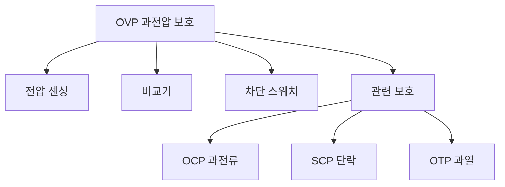

+++
title = "ovp"
date = "2026-03-14"
weight = 745
+++

# 과전압 보호 (OVP, Over Voltage Protection)

#### 핵심 인사이트 (3줄 요약)
> 1. **본질**: 전압이 설정 임계값을 초과하면 전원을 차단하여 장비를 보호하는 안전 회로
> 2. **가치**: 하드웨어 손상 방지, 화재 예방, 시스템 보호, 안전 인증 요건
> 3. **융합**: OCP, SCP, OTP, UVP, PSU 보호 회로와 통합된 전원 보호 시스템

---

### Ⅰ. 개요 (Context & Background)

**개념 정의**

과전압 보호(OVP, Over Voltage Protection)는 전압이 설정 임계값을 초과하면 전원을 차단하여 장비를 보호하는 안전 회로입니다. PSU, VRM, 메인보드 등에 필수적으로 탑재됩니다.

```
┌─────────────────────────────────────────────────────────────────────┐
│                    과전압 보호 (OVP) 기본 구조                       │
├─────────────────────────────────────────────────────────────────────┤
│                                                                     │
│   ┌──────────────────────────────────────────────────────────────┐ │
│   │              OVP 회로 블록 다이어그램                         │ │
│   │                                                              │ │
│   │   Vin (입력 전압)                                             │ │
│   │      │                                                       │ │
│   │      ▼                                                       │ │
│   │   ┌───────────────────────────────────────────────────────┐ │ │
│   │   │                    OVP 회로                            │ │ │
│   │   │                                                       │ │ │
│   │   │   ┌─────────┐    ┌─────────┐    ┌─────────┐          │ │ │
│   │   │   │ 전압    │    │ 비교기  │    │ 차단    │          │ │ │
│   │   │   │ 분배기  │───►│ (Comp)  │───►│ 스위치  │          │ │ │
│   │   │   │         │    │         │    │         │          │ │ │
│   │   │   └─────────┘    └────┬────┘    └────┬────┘          │ │ │
│   │   │                       │              │                │ │ │
│   │   │                       │ Vref         │                │ │ │
│   │   │                       ▼              │                │ │ │
│   │   │               ┌──────────────┐       │                │ │ │
│   │   │               │ 기준 전압    │       │                │ │ │
│   │   │               │ (Threshold)  │       │                │ │ │
│   │   │               └──────────────┘       │                │ │ │
│   │   │                                      │                │ │ │
│   │   │   V_sense > V_threshold → SHUTDOWN   │                │ │ │
│   │   │                                      ▼                │ │ │
│   │   └───────────────────────────────────────────────────────┘ │ │
│   │      │                                                       │ │
│   │      ▼ (정상 시)                                              │ │
│   │   Vout (출력 전압)                                            │ │
│   │                                                               │ │
│   └──────────────────────────────────────────────────────────────┘ │
│                                                                     │
│   ┌──────────────────────────────────────────────────────────────┐ │
│   │              OVP 임계값 예시                                  │ │
│   │                                                              │ │
│   │   ┌─────────────────────────────────────────────────────┐    │ │
│   │   │ 레일       │ 정상 전압 │ OVP 임계값 │ 여유율         │    │ │
│   │   │ ─────────────────────────────────────────────────── │    │ │
│   │   │ 12V 레일   │ 12.0V    │ 13.2-15.6V │ +10~30%       │    │ │
│   │   │ 5V 레일    │ 5.0V     │ 5.5-6.5V   │ +10~30%       │    │ │
│   │   │ 3.3V 레일  │ 3.3V     │ 3.6-4.3V   │ +10~30%       │    │ │
│   │   │ Vcore      │ 1.2V     │ 1.4-1.5V   │ +15~25%       │    │ │
│   │   └─────────────────────────────────────────────────────┘    │ │
│   │                                                              │ │
│   └──────────────────────────────────────────────────────────────┘ │
│                                                                     │
└─────────────────────────────────────────────────────────────────────┘
```

> **해설**: OVP는 전압 분배기로 샘플링하고, 비교기로 임계값과 비교하여 초과 시 차단합니다.

**💡 비유**: OVP는 압력 밸브와 같습니다. 압력이 너무 높으면 자동으로 열려서 압력을 해소합니다.

**등장 배경**

① **기존 한계**: 과전압 → 하드웨어 손상, 화재 위험
② **혁신적 패러다임**: 자동 차단으로 손상 방지
③ **비즈니스 요구**: 안전 인증 (UL, CE), 제품 신뢰성

**📢 섹션 요약 비유**: OVP는 압력 밸브 같아요. 압력이 높으면 자동으로 열어요!

---

### Ⅱ. 아키텍처 및 핵심 원리 (Deep Dive)

**구성 요소 상세 분석**

| 요소명 | 역할 | 내부 동작 | 비유 |
|:---|:---|:---|:---|
| **전압 분배기** | 전압 샘플링 | 저항 분배 | 센서 |
| **비교기** | 임계값 비교 | Op-Amp | 판단 |
| **기준 전압** | 임계값 | Zener/밴드갭 | 기준점 |
| **차단 스위치** | 전원 차단 | MOSFET/릴레이 | 밸브 |
| **랫치 회로** | 상태 유지 | 플립플롭 | 잠금 |

**전원 보호 회로 종류**

```
┌─────────────────────────────────────────────────────────────────────┐
│                    전원 보호 회로 종류                               │
├─────────────────────────────────────────────────────────────────────┤
│                                                                     │
│   ┌──────────────────────────────────────────────────────────────┐ │
│   │              PSU/VRM 보호 회로                                │ │
│   │                                                              │ │
│   │   ┌─────────────────────────────────────────────────────┐    │ │
│   │   │ 보호 회로 │ 명칭                    │ 트리거 조건    │    │ │
│   │   │ ─────────────────────────────────────────────────── │    │ │
│   │   │ OVP      │ Over Voltage Protection   │ V > 임계값    │    │ │
│   │   │ UVP      │ Under Voltage Protection  │ V < 임계값    │    │ │
│   │   │ OCP      │ Over Current Protection   │ I > 임계값    │    │ │
│   │   │ SCP      │ Short Circuit Protection  │ I 급증        │    │ │
│   │   │ OTP      │ Over Temperature Protect  │ T > 임계값    │    │ │
│   │   │ OPP      │ Over Power Protection     │ P > 임계값    │    │ │
│   │   │ Surge    │ Surge Protection          | 과도 전압     │    │ │
│   │   └─────────────────────────────────────────────────────┘    │ │
│   │                                                              │ │
│   └──────────────────────────────────────────────────────────────┘ │
│                                                                     │
│   ┌──────────────────────────────────────────────────────────────┐ │
│   │              OVP 동작 시퀀스                                  │ │
│   │                                                              │ │
│   │   1. 정상 상태                                                │ │
│   │      - V_sense < V_threshold                                 │ │
│   │      - 출력 유지                                               │ │
│   │                                                              │ │
│   │   2. 과전압 발생                                              │ │
│   │      - V_sense > V_threshold                                 │ │
│   │      - 비교기 트리거                                           │ │
│   │      - 랫치 회로 활성화                                        │ │
│   │                                                              │ │
│   │   3. 차단                                                     │ │
│   │      - 차단 스위치 OFF                                        │ │
│   │      - 출력 차단 (~수 μs)                                     │ │
│   │      - LED/알림 활성화                                        │ │
│   │                                                              │ │
│   │   4. 복구                                                     │ │
│   │      - 수동 리셋 필요 (랫치형)                                │ │
│   │      - 또는 자동 복구 (히스테리시스형)                        │ │
│   │                                                              │ │
│   └──────────────────────────────────────────────────────────────┘ │
│                                                                     │
└─────────────────────────────────────────────────────────────────────┘
```

> **해설**: OVP는 과전압 감지 시 즉시 차단합니다. 복구는 수동 리셋 또는 자동 복구 방식이 있습니다.

**핵심 알고리즘: OVP 구현**

```c
// OVP 구현 (의사코드)
struct OVPState {
    float    v_sense;          // 감지 전압
    float    v_threshold;      // OVP 임계값
    bool     tripped;          // 트립 상태
    bool     latched;          // 랫치 상태
};

// OVP 체크
bool CheckOVP(struct OVPState *ovp) {
    ovp->v_sense = ReadVoltage();

    if (ovp->v_sense > ovp->v_threshold) {
        // 과전압 감지
        ovp->tripped = true;
        ovp->latched = true;
        ShutdownOutput();
        SetOVPLED(true);
        return true;
    }

    return false;
}

// OVP 리셋
void ResetOVP(struct OVPState *ovp) {
    if (ovp->v_sense < ovp->v_threshold * 0.95) {  // 히스테리시스
        ovp->tripped = false;
        ovp->latched = false;
        EnableOutput();
        SetOVPLED(false);
    }
}

// IPMI로 PSU 상태 확인
// # ipmitool sensor list | grep -i voltage
// 12V Rail       | 12.100     | Volts      | ok    | 10.800  | 10.900  | 13.100  | 13.200
// 5V Rail        | 5.050      | Volts      | ok    | 4.500   | 4.600   | 5.500   | 5.600
// 3.3V Rail      | 3.310      | Volts      | ok    | 2.900   | 3.000   | 3.600   | 3.700

// OVP 이벤트 로그
// # ipmitool sel list
//  1 | 03/13/26 | 10:30:00 | Power Supply #0x01 | Over Voltage | Asserted
```

**📢 섹션 요약 비유**: OVP는 회로 차단기와 같습니다. 과전압 감지 시 즉시 차단합니다.

---

### Ⅲ. 융합 비교 및 다각도 분석 (Comparison & Synergy)

**기술 비교: OVP vs OCP vs SCP**

| 비교 항목 | OVP | OCP | SCP |
|:---|:---:|:---:|:---:|
| **감지 대상** | 전압 | 전류 | 전류 급증 |
| **트리거** | V > 임계값 | I > 임계값 | I 급증 |
| **차단 속도** | ~μs | ~μs | ~ns |
| **주요 원인** | VRM 고장 | 과부하 | 단락 |

**과목 융합 관점: OVP와 타 영역 시너지**

| 융합 영역 | 시너지 효과 | 구현 예시 |
|:---|:---|:---|
| **PSU** | 전원 보호 | ATX 표준 |
| **VRM** | Vcore 보호 | 메인보드 |
| **BMC** | 모니터링 | IPMI/Redfish |
| **UPS** | 전압 안정 | 정전압 |
| **서버** | 무정지 | 이중화 |

**📢 섹션 요약 비유**: OVP/OCP/SCP는 삼위일체입니다. 전압, 전류, 단락을 모두 보호해야 합니다.

---

### Ⅳ. 실무 적용 및 기술사적 판단 (Strategy & Decision)

**실무 시나리오별 적용**

**시나리오 1: 데이터센터**
- **문제**: PSU 신뢰성
- **해결**: OVP/OCP/SCP 이중화
- **의사결정**: 고품질 PSU

**시나리오 2: 오버클러킹**
- **문제**: VRM 과전압
- **해결**: OVP 설정 조정
- **의사결정**: 주의 필요

**시나리오 3: 임베디드**
- **문제**: 전원 노이즈
- **해결**: OVP + TVS
- **의사결정**: 외부 보호

**도입 체크리스트**

| 구분 | 항목 | 확인 포인트 |
|:---|:---|:---|
| **기술적** | OVP 임계값 | +10-30% |
| | 응답 시간 | <수 μs |
| | 랫치/자동 | 용도별 |
| **운영적** | 모니터링 | IPMI |
| | 로그 | SEL 확인 |
| | 테스트 | 정기 점검 |

**안티패턴: OVP 오용 사례**

| 안티패턴 | 문제점 | 올바른 접근 |
|:---|:---|:---|
| **임계값 너무 높음** | 보호 안 됨 | +15-25% 권장 |
| **임계값 너무 낮음** | 오작동 | 여유 확보 |
| **모니터링 없음** | 고장 미감지 | IPMI 알림 |
| **단일 보호** | 불충분 | 다중 보호 |

**📢 섹션 요약 비유**: OVP 임계값 설정은 보험 가입과 같습니다. 너무 낮으면 오작동, 너무 높으면 보호 안 됩니다.

---

### Ⅴ. 기대효과 및 결론 (Future & Standard)

**정량/정성 기대효과**

| 구분 | OVP 없음 | OVP 있음 | 개선효과 |
|:---|:---:|:---:|:---:|
| **하드웨어 손상** | 높음 | 낮음 | 방지 |
| **화재 위험** | 높음 | 낮음 | 예방 |
| **다운타임** | 길다 | 짧다 | 단축 |
| **안전 인증** | 불가 | 가능 | 획득 |

**미래 전망**

1. **디지털 OVP:** 소프트웨어 제어
2. **AI 예지:** 고장 예측
3. **다단계 보호:** 단계적 차단
4. **자가 진단:** Built-in Test

**참고 표준**

| 표준 | 내용 | 적용 |
|:---|:---|:---|
| **ATX12V** | PSU 규격 | PC |
| **UL/IEC** | 안전 인증 | 전원 |
| **IPMI 2.0** | 모니터링 | BMC |
| **EPS12V** | 서버 PSU | 서버 |

**📢 섹션 요약 비유**: OVP의 미래는 AI가 관리합니다. 고장을 예측하고 미리 알립니다.

---

### 📌 관련 개념 맵 (Knowledge Graph)



**연관 개념 링크**:
- 과전류 보호 OCP - 과전류 보호
- 단락 보호 SCP - 단락 보호
- 과열 보호 OTP - 과열 보호
- VRM - 전압 조정기

---

### 👶 어린이를 위한 3줄 비유 설명

1. **압력 밸브**: OVP는 압력 밸브 같아요. 압력이 높으면 자동으로 열어요!

2. **회로 차단기**: 전기가 너무 세면 끊어요. 집이 불나지 않게!

3. **안전장치**: 안전벨트 같아요. 사고를 막아요!