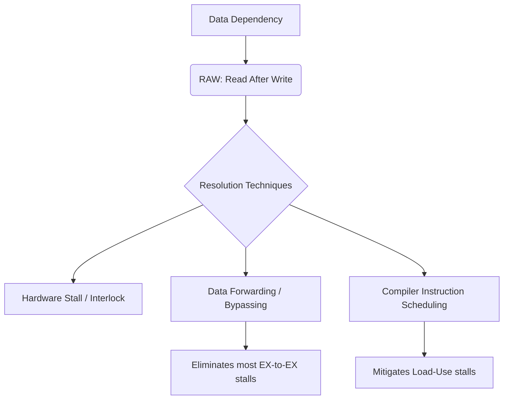

+++
title = "225. RAW (Read After Write)"
date = "2026-03-14"
weight = 225
+++

> **Insight**
> - RAW(Read After Write)는 파이프라인(Pipeline)에서 발생하는 가장 기본적인 진성 데이터 의존성(True Data Dependency)입니다.
> - 이전 명령어의 연산 결과가 레지스터(Register)에 기록되기 전에 다음 명령어가 이를 읽으려 할 때 발생하며 파이프라인 스톨(Stall)을 유발합니다.
> - 이를 해결하기 위해 데이터 포워딩(Data Forwarding) 또는 바이패싱(Bypassing) 기술이 현대 프로세서(Processor) 마이크로아키텍처(Microarchitecture)에 필수적으로 적용됩니다.

## Ⅰ. RAW (Read After Write)의 개요
### 1. 정의
RAW(Read After Write) 해저드(Hazard)는 컴퓨터 아키텍처(Computer Architecture)의 명령어 파이프라이닝(Instruction Pipelining) 환경에서, 선행 명령어(Instruction $i$)가 특정 목적지 레지스터(Destination Register)에 값을 쓰기(Write) 전에 후행 명령어(Instruction $j$)가 해당 레지스터의 값을 읽으려(Read) 할 때 발생하는 데이터 의존성(Data Dependency) 문제입니다.

### 2. 필요성 및 배경
프로세서(Processor)의 성능 향상을 위해 도입된 파이프라이닝(Pipelining)은 여러 명령어를 중첩하여 실행합니다. 그러나 명령어 간의 실행 순서가 겹치면서 아직 갱신되지 않은 과거의 데이터를 참조하는 무결성(Integrity) 오류가 발생할 수 있습니다. RAW는 프로그램의 의미론적(Semantic) 올바름을 유지하기 위해 반드시 탐지하고 해결해야 하는 필수 제약 조건입니다.

📢 섹션 요약 비유: 요리사가 재료를 다 썰기도 전에(Write), 보조 요리사가 덜 썰린 재료를 냄비에 넣으려고(Read) 손을 뻗는 아찔한 상황과 같습니다.

## Ⅱ. RAW의 핵심 메커니즘 및 아키텍처
### 1. 동작 원리
명령어 $i$ (`ADD R1, R2, R3`)와 $j$ (`SUB R4, R1, R5`)가 순차 실행될 때, $j$는 $i$가 `R1`에 연산 결과를 저장할 때까지 기다려야 합니다. 파이프라인 구조에서는 $i$의 WB(Write Back) 단계 완료 전에 $j$의 EX(Execution) 단계가 시작되므로, 잘못된 데이터(Stale Data)를 읽어오는 데이터 해저드(Data Hazard)가 발생합니다.

### 2. 아키텍처 (ASCII 다이어그램)
```text
[Pipeline Execution Timeline without Forwarding]
Time (Cycles) ->
Instr i (ADD R1,...): IF -> ID -> EX -> MEM -> WB (Writes R1)
Instr j (SUB ...,R1):       IF -> ID -> EX (Reads R1 -> Stale!)
                                  \-> STALL -> STALL -> EX (Safe Read)
```

📢 섹션 요약 비유: 컨베이어 벨트에서 앞사람이 부품을 완성할 때까지 뒷사람이 강제로 작업을 멈추고 대기해야 하는(Stall) 병목 구조입니다.

## Ⅲ. 주요 기술적 특성 및 분석
### 1. 특징
- **진성 의존성(True Dependency):** 프로그램의 논리적 흐름상 반드시 지켜져야 하는 인과관계를 나타내며, 레지스터 리네이밍(Register Renaming)으로 제거할 수 없습니다.
- **파이프라인 효율 저하:** 잦은 RAW 해저드는 파이프라인의 CPI(Cycles Per Instruction)를 증가시켜 스칼라(Scalar) 및 슈퍼스칼라(Superscalar) 아키텍처의 성능 병목(Bottleneck)이 됩니다.

### 2. 장단점 분석
- **장점(탐지 시):** 프로그램의 논리적 정확성과 레지스터(Register) 상태의 일관성(Consistency)을 완벽히 보장합니다.
- **단점:** 하드웨어 인터락(Hardware Interlock)을 통한 스톨(Stall)이 필수적이므로 파이프라인 스루풋(Throughput)이 하락합니다.

📢 섹션 요약 비유: 원인과 결과라는 자연법칙(진성 의존성)을 거스를 수는 없지만, 기다림의 시간(스톨)은 시스템 효율성을 갉아먹는 세금과 같습니다.

## Ⅳ. 구현 사례 및 응용 환경
### 1. 적용 분야
모든 파이프라인형 마이크로프로세서(Microprocessor) 및 비순차적 실행(Out-of-Order Execution, OoO) 엔진의 명령어 스케줄러(Instruction Scheduler)와 이슈 큐(Issue Queue)에서 필수적으로 고려됩니다.

### 2. 실제 구현 사례
현대의 CPU(예: Intel Core 아키텍처, ARM Cortex-A 시리즈)는 RAW 해저드에 의한 지연을 최소화하기 위해 산술 논리 장치(ALU, Arithmetic Logic Unit)의 출력을 다음 명령어의 입력으로 직접 연결하는 **전방전달(Data Forwarding/Bypassing)** 네트워크를 하드웨어적으로 구현하고 있습니다.

📢 섹션 요약 비유: 공장장이 앞 단계에서 완성된 부품을 창고(레지스터)를 거치지 않고 다음 작업자에게 직접 던져주는(Forwarding) 직통 라인을 설치한 것과 같습니다.

## Ⅴ. 한계점 및 미래 발전 방향
### 1. 현재의 한계
포워딩(Forwarding)을 사용하더라도 메모리 로드(Load) 명령어와 이를 즉시 사용하는 명령어 사이에는 최소 1사이클의 지연(Load-Use Data Hazard)이 불가피하게 발생합니다.

### 2. 발전 방향
컴파일러(Compiler) 수준의 명령어 스케줄링(Instruction Scheduling) 최적화를 통해 RAW 발생 빈도를 소프트웨어적으로 낮추고, 가치 예측(Value Prediction) 기술을 통해 결과를 추측하여 미리 실행하는 연구가 진행되고 있습니다.

📢 섹션 요약 비유: 부품이 완성되기를 기다리거나 직통으로 받는 것을 넘어, 부품의 모양을 인공지능이 미리 예측(Value Prediction)하여 조립을 강행하는 미래 지향적 기술로 진화 중입니다.

---

### 💡 Knowledge Graph


### 👧 Child Analogy
레고 성을 만들 때, 오빠가 '성벽 블록'을 다 조립해야(Write) 동생이 그 위에 '지붕 블록'을 올릴(Read) 수 있어요. 오빠가 아직 성벽을 다 안 만들었는데 동생이 지붕을 올리려고 하면 와르르 무너지잖아요? 이것이 바로 'RAW'라는 규칙이에요. 동생은 오빠가 끝낼 때까지 얌전히 기다리거나(스톨), 오빠가 완성하자마자 공중에서 바로 건네받아(포워딩) 지붕을 올려야 해요!