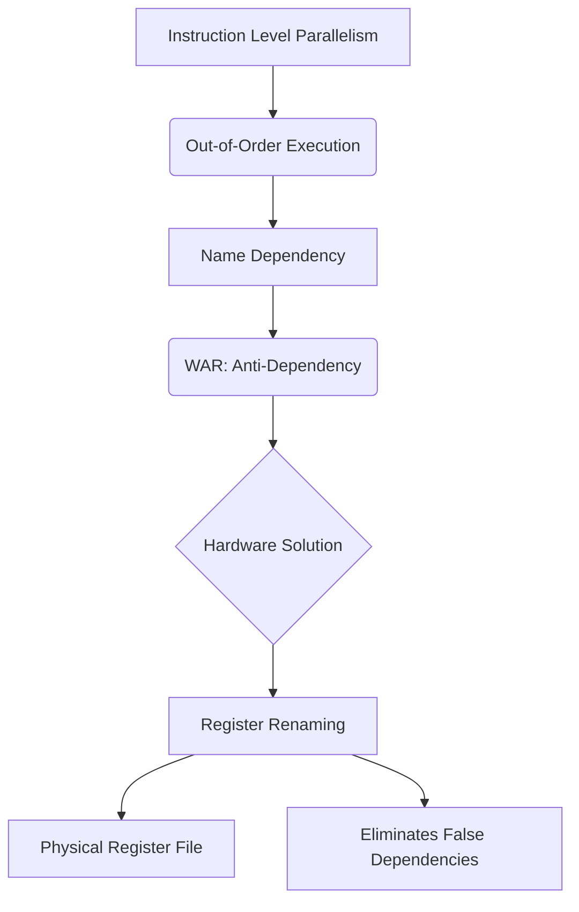

+++
title = "226. WAR (Write After Read)"
date = "2026-03-14"
weight = 226
+++

> **Insight**
> - WAR(Write After Read)는 비순차적 실행(Out-of-Order Execution)에서 발생하는 반의존성(Anti-Dependency) 문제입니다.
> - 이전 명령어가 레지스터(Register)를 읽기(Read) 전에 다음 명령어가 동일한 레지스터에 값을 쓰려(Write) 할 때 발생합니다.
> - 이는 논리적 데이터 흐름이 아닌 하드웨어 레지스터의 부족으로 인한 가짜 의존성(False Dependency)이며, 레지스터 리네이밍(Register Renaming)으로 해결 가능합니다.

## Ⅰ. WAR (Write After Read)의 개요
### 1. 정의
WAR(Write After Read) 해저드(Hazard)는 선행 명령어(Instruction $i$)가 특정 소스 레지스터(Source Register)의 값을 읽기(Read) 전에, 후행 명령어(Instruction $j$)가 동일한 레지스터에 새로운 값을 덮어쓰려(Write) 할 때 발생하는 파이프라인(Pipeline) 충돌 현상입니다. 이를 반의존성(Anti-Dependency)이라고 부릅니다.

### 2. 필요성 및 배경
순차적 실행(In-Order Execution) 환경에서는 항상 $i$가 $j$보다 먼저 실행되므로 WAR이 발생하지 않습니다. 그러나 명령어 수준 병렬성(ILP, Instruction Level Parallelism)을 극대화하기 위해 비순차적 실행(Out-of-Order Execution, OoO)을 도입하면, $j$가 $i$보다 먼저 실행될 수 있어 데이터 무결성(Data Integrity)이 훼손될 위험이 존재하며 이를 방지할 하드웨어적 제어가 필요합니다.

📢 섹션 요약 비유: 선배가 서류를 아직 다 읽지도 않았는데(Read), 후배가 그 서류 위에 새로운 내용을 덮어쓰기(Write) 하려는 무례한 상황과 같습니다.

## Ⅱ. WAR의 핵심 메커니즘 및 아키텍처
### 1. 동작 원리
명령어 $i$ (`ADD R4, R1, R2`)가 `R1`을 읽고, 명령어 $j$ (`SUB R1, R3, R5`)가 `R1`에 새로운 값을 씁니다. OoO(Out-of-Order) 프로세서(Processor)에서 $j$가 $i$보다 빠르게 파이프라인을 통과하여 `R1`을 먼저 업데이트해버리면, 뒤늦게 실행된 $i$는 원래 원했던 예전 값이 아닌 $j$가 연산한 새로운(잘못된) 값을 읽게 되어 프로그램 결과가 왜곡됩니다.

### 2. 아키텍처 (ASCII 다이어그램)
```text
[Out-of-Order Execution Hazard: WAR]
Instruction Stream:
i: ADD R4, R1, R2  (Needs to Read R1)
j: SUB R1, R3, R5  (Needs to Write R1)

OoO Execution Timeline:
Cycle 1: j Executes -> Writes to R1
Cycle 2: i Executes -> Reads R1 (Error! Reads j's result instead of old value)
```

📢 섹션 요약 비유: 도서관에서 내가 예약해둔 책(원래 값)을 대출하기 직전에, 다른 사람이 그 책을 아예 다른 내용의 새 책으로 교체해버린(덮어쓰기) 아찔한 상황입니다.

## Ⅲ. 주요 기술적 특성 및 분석
### 1. 특징
- **가짜 의존성(False/Name Dependency):** 실제 데이터의 계산 흐름(Data Flow)이 얽힌 것이 아니라, 단지 한정된 아키텍처 레지스터(Architectural Register) 이름을 재사용하기 때문에 발생하는 이름 충돌(Name Collision) 현상입니다.
- **OoO 프로세서 한정:** 순차 프로세서(In-Order Processor)에서는 명령어 발급(Issue)과 완료(Commit)가 순서대로 이루어지므로 구조적으로 발생하지 않습니다.

### 2. 장단점 분석
- **장점:** 아키텍처 레지스터 개수를 적게 유지하여 명령어 세트 아키텍처(ISA, Instruction Set Architecture)의 인코딩 비트를 절약할 수 있습니다.
- **단점:** 하드웨어 차원의 레지스터 리네이밍(Register Renaming) 로직과 매핑 테이블(Mapping Table) 관리라는 막대한 오버헤드(Overhead)를 유발합니다.

📢 섹션 요약 비유: 이름이 같은 '김철수'라는 바구니를 계속 재활용하다 보니 생기는 촌극(가짜 의존성)으로, 바구니마다 임시 번호표(리네이밍)를 붙여야 하는 번거로움이 따릅니다.

## Ⅳ. 구현 사례 및 응용 환경
### 1. 적용 분야
성능 극대화를 지향하는 모든 최신 비순차적 슈퍼스칼라 마이크로프로세서(Superscalar Microprocessor)의 토마술로 알고리즘(Tomasulo's Algorithm) 기반 스케줄러에 적용됩니다.

### 2. 실제 구현 사례
AMD의 Zen 아키텍처나 Intel의 Golden Cove 코어 등에서는 아키텍처 레지스터(예: 16개의 범용 레지스터)를 수백 개의 물리 레지스터(Physical Register File, PRF)로 동적 매핑(Dynamic Mapping)하는 **레지스터 리네이밍(Register Renaming)** 기법을 사용하여 WAR 해저드를 하드웨어적으로 완전히 제거합니다. 명령어 $j$의 타겟 `R1`을 새로운 물리 레지스터 `P2`로 할당하여 명령어 $i$가 원래 가리키던 물리 레지스터 `P1`을 보존합니다.

📢 섹션 요약 비유: 겉으로는 모두 'A번 보관함'을 쓰는 것 같지만, 시스템 내부적으로는 'A-1', 'A-2' 등 숨겨진 비밀 보관함(물리 레지스터)을 할당해 충돌을 마법처럼 없앱니다.

## Ⅴ. 한계점 및 미래 발전 방향
### 1. 현재의 한계
물리 레지스터 파일(PRF)의 크기를 무한정 키울 수 없으므로, 여전히 가용한 리네이밍 레지스터가 고갈되면 파이프라인 스톨(Stall)이 발생합니다. 또한 매핑 테이블 관리 회로가 코어의 전력 소비와 면적을 상당히 차지합니다.

### 2. 발전 방향
물리 레지스터의 할당과 해제 사이클을 최적화하는 적극적인 자원 회수(Aggressive Resource Reclamation) 알고리즘과, 머신러닝(Machine Learning)을 활용한 동적 레지스터 할당 예측을 통해 리네이밍 오버헤드를 줄이는 연구가 지속되고 있습니다.

📢 섹션 요약 비유: 무한정 늘릴 수 없는 비밀 보관함의 개수를 효율적으로 재활용하기 위해, 보관함이 비는 즉시 인공지능이 칼같이 회수해가는 스마트 시스템으로 진화하고 있습니다.

---

### 💡 Knowledge Graph


### 👧 Child Analogy
도화지(레지스터) 한 장에 오빠가 먼저 '사과'를 그리고(Write), 동생이 그 사과를 감상(Read)해야 해요. 그런데 동생이 아직 사과를 보지도 않았는데, 성격 급한 오빠가 그 위에 '바나나'를 덧칠해버리면(Write) 어떻게 될까요? 동생은 사과를 볼 수 없게 되어 화를 낼 거예요! 이것이 WAR 충돌이에요. 해결책은 오빠에게 똑같이 생긴 '새 도화지'(레지스터 리네이밍)를 주고 바나나를 그리게 하는 거랍니다!