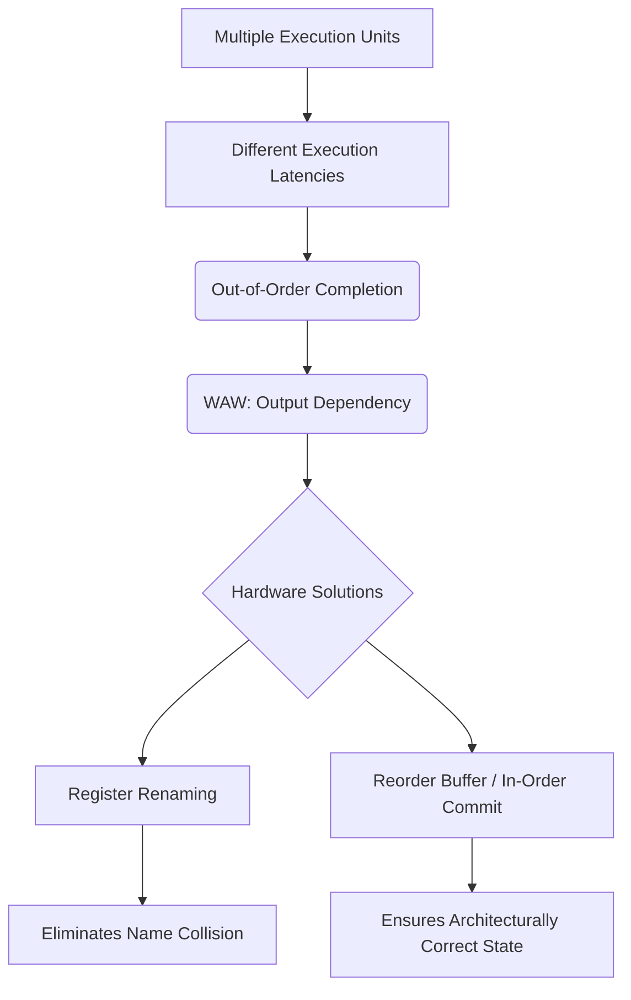

+++
title = "227. WAW (Write After Write)"
date = "2026-03-14"
weight = 227
+++

> **Insight**
> - WAW(Write After Write)는 여러 명령어가 동일한 레지스터(Register)에 순서와 다르게 값을 기록하려 할 때 발생하는 출력 의존성(Output Dependency)입니다.
> - 비순차적 완료(Out-of-Order Completion)를 지원하는 파이프라인(Pipeline) 환경에서 프로그램의 최종 상태를 훼손하는 원인이 됩니다.
> - WAR과 마찬가지로 가짜 의존성(False Dependency)으로 분류되며, 하드웨어적인 레지스터 리네이밍(Register Renaming)을 통해 구조적으로 제거됩니다.

## Ⅰ. WAW (Write After Write)의 개요
### 1. 정의
WAW(Write After Write) 해저드(Hazard)는 선행 명령어(Instruction $i$)가 특정 목적지 레지스터(Destination Register)에 값을 기록하기(Write) 전에, 후행 명령어(Instruction $j$)가 동일한 목적지 레지스터에 먼저 혹은 동시에 값을 기록하려 할 때 발생하는 충돌입니다. 이를 출력 의존성(Output Dependency)이라고 정의합니다.

### 2. 필요성 및 배경
명령어 파이프라이닝(Instruction Pipelining)에서 연산의 종류(정수 연산, 부동소수점 연산 등)에 따라 실행 파이프라인의 깊이(Depth)가 다를 수 있습니다. 따라서 프로그램 순서상 나중에 위치한 명령어가 먼저 실행을 완료(Completion)할 수 있으며, 이로 인해 아키텍처 상태(Architectural State)에 잘못된 최종값이 남게 되는 무결성(Integrity) 파괴를 막기 위해 철저한 제어가 필요합니다.

📢 섹션 요약 비유: 어제 보낸 편지(선행 Write)보다 오늘 특급 우편으로 보낸 편지(후행 Write)가 수신자의 우편함에 먼저 도착하여, 최종적으로 옛날 소식이 최신 소식을 덮어버리는 꼴입니다.

## Ⅱ. WAW의 핵심 메커니즘 및 아키텍처
### 1. 동작 원리
명령어 $i$ (`DIV R1, R2, R3`: 실행시간 10사이클)와 명령어 $j$ (`ADD R1, R4, R5`: 실행시간 1사이클)가 연속 발급됩니다. 두 명령어 모두 결과를 `R1`에 기록해야 합니다. $j$가 1사이클 만에 `R1`을 업데이트한 후, 9사이클 뒤에 $i$가 완료되어 자신의 결과를 `R1`에 다시 덮어쓰게 됩니다. 결과적으로 `R1`에는 프로그램 의도(최종값은 $j$의 결과)와 달리 과거의 값($i$의 결과)이 남아버립니다.

### 2. 아키텍처 (ASCII 다이어그램)
```text
[Pipeline with Different Execution Latencies: WAW]
Program Order:
i: DIV R1,... (Long Latency)
j: ADD R1,... (Short Latency)

Execution Timeline:
Cycle 1: IF, ID for i & j
Cycle 2: j finishes EX, writes to R1 (Newest Data)
...
Cycle 11: i finishes EX, writes to R1 (Old Data OVERWRITES New Data!) -> ERROR
```

📢 섹션 요약 비유: 거북이(DIV)와 토끼(ADD)가 같은 결승선(R1)을 향해 뛰는데, 나중에 출발한 토끼가 먼저 도착해 깃발을 꽂았건만, 한참 뒤에 온 거북이가 자신의 깃발로 바꿔치기하는 오류입니다.

## Ⅲ. 주요 기술적 특성 및 분석
### 1. 특징
- **이름 기반 가짜 의존성(Name Dependency):** WAR과 마찬가지로, 프로그래머가 사용할 수 있는 논리적 레지스터(Logical Register) 개수의 한계로 인해 동일한 이름을 재사용하면서 발생하는 가짜 의존성입니다. 실제 데이터 흐름과는 무관합니다.
- **다중 사이클 실행 유닛:** 파이프라인 내에 지연(Latency)이 서로 다른 다수의 실행 유닛(Execution Unit)이 병렬로 존재할 때만 발생 가능한 특수한 해저드입니다.

### 2. 장단점 분석
- **장점:** 제한된 명령어 세트(ISA, Instruction Set Architecture) 공간 내에서 레지스터 재사용을 극대화하여 코드 밀도(Code Density)를 높일 수 있습니다.
- **단점:** 구조적 올바름을 보장하기 위해 리오더 버퍼(ROB, Reorder Buffer)와 같은 복잡한 비순차적 완료(Out-of-Order Commit) 제어 회로가 필수적입니다.

📢 섹션 요약 비유: 한정된 게시판(레지스터)을 알뜰하게 돌려 쓰려다 보니(장점), 누가 진짜 최신 공지사항인지 추적하는 복잡한 관리 대장(ROB)이 필요해진 셈입니다.

## Ⅳ. 구현 사례 및 응용 환경
### 1. 적용 분야
비순차적 실행(OoO) 및 슈퍼스칼라(Superscalar) 구조를 채택하여 명령어 완료 순서가 뒤바뀔 수 있는 모든 고성능 CPU(Central Processing Unit) 아키텍처에서 핵심적으로 처리됩니다.

### 2. 실제 구현 사례
현대 프로세서는 토마술로 알고리즘(Tomasulo's Algorithm) 기반의 **레지스터 리네이밍(Register Renaming)**을 통해 두 `R1`에 대해 각각 다른 물리 레지스터(예: `P1`, `P2`)를 할당하여 WAW 충돌 자체를 하드웨어적으로 무효화시킵니다. 또한 **리오더 버퍼(Reorder Buffer, ROB)**를 사용하여 실행은 비순차적으로 하되, 상태 기록(Commit)은 반드시 프로그램 순서대로 보장하는 메커니즘을 채택합니다.

📢 섹션 요약 비유: 토끼와 거북이가 도착하는 순서는 마음대로지만(비순차 실행), 시상대(레지스터 기록)에 오르는 순서는 반드시 원래 명단(프로그램 순서)대로만 허락하는 철저한 통제 시스템입니다.

## Ⅴ. 한계점 및 미래 발전 방향
### 1. 현재의 한계
리네이밍(Renaming) 및 ROB 확장을 통한 WAW 해소는 논리 게이트의 스위칭 활동을 증가시켜 코어의 소비 전력(Power Consumption)과 발열을 급격히 상승시킵니다. 대규모 ROB 설계는 타이밍 클로저(Timing Closure)를 달성하기 어렵게 만듭니다.

### 2. 발전 방향
전력 효율을 극대화하기 위해, 불필요한 레지스터 기록(Dead Value Writing)을 동적으로 감지하여 아예 실행 파이프라인에서 폐기(Squash)해버리는 지능형 스케줄링(Intelligent Scheduling) 방식 등 마이크로아키텍처(Microarchitecture) 최적화가 연구되고 있습니다.

📢 섹션 요약 비유: 복잡한 순번표 시스템(ROB)을 유지하는 비용이 너무 비싸지니, 아예 읽지도 않을 무의미한 보고서는 결재판에 올리기 전에 파쇄해버리는(폐기) 스마트 오피스로 발전하고 있습니다.

---

### 💡 Knowledge Graph


### 👧 Child Analogy
도화지(레지스터) 한 장에 오빠가 '거북이'를 그리고, 바로 다음 동생이 그 자리에 '토끼'를 덧그리기로(Write After Write) 약속했어요. 동생은 쓱싹 빨리 그렸는데, 꼼꼼한 오빠가 한참 뒤에 느릿느릿 '거북이'를 그려서 완성된 도화지에는 결국 오빠의 거북이만 남아버렸어요! 최종적으로는 동생의 '토끼'가 남아있어야 하는데 말이죠. 이 실수를 막기 위해 각자에게 칠판을 따로 주고(리네이밍), 나중에 순서대로 선생님에게 검사받는(ROB) 것이 WAW 해결법이에요!