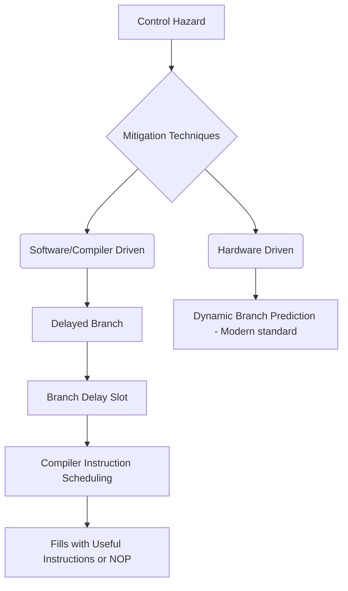

+++
title = "230. 분기 지연 (Delayed Branch)"
date = "2026-03-14"
weight = 230
+++

> **Insight**
> - 분기 지연(Delayed Branch)은 제어 해저드(Control Hazard)로 인한 파이프라인 스톨(Stall)을 줄이기 위해 도입된 구조적 기법입니다.
> - 분기 명령어(Branch Instruction) 바로 뒤에 오는 1~2개의 지연 슬롯(Delay Slot)에 배치된 명령어는 분기 결과와 무관하게 항상 실행됩니다.
> - 컴파일러(Compiler)의 최적화 스케줄링이 필수적이나, 최신 동적 분기 예측(Dynamic Branch Prediction) 기술의 발달로 현대 아키텍처에서는 사양세에 있습니다.

## Ⅰ. 분기 지연 (Delayed Branch)의 개요
### 1. 정의
분기 지연(Delayed Branch)은 컴퓨터 아키텍처(Computer Architecture)에서 조건부 분기(Conditional Branch) 명령어의 결과(Taken/Not Taken)가 평가되기까지 걸리는 시간적 공백을 메우기 위해, 분기 명령어 바로 다음에 위치한 일정 개수(Delay Slot)의 명령어를 무조건 실행하도록 강제하는 아키텍처 레벨의 기법입니다.

### 2. 필요성 및 배경
초기 RISC(Reduced Instruction Set Computer) 프로세서(Processor)는 명령어 파이프라인(Instruction Pipeline)을 단순하게 유지하기 위해 하드웨어적인 분기 예측기(Branch Predictor)를 생략했습니다. 이로 인해 분기가 발생할 때마다 파이프라인이 멈추는 페널티(Branch Penalty)가 막대했으며, 이를 해결하기 위해 하드웨어가 아닌 소프트웨어(컴파일러)에게 빈 공간(Delay Slot)을 채울 책임을 넘기면서 등장했습니다.

📢 섹션 요약 비유: 기차가 갈림길(분기)에서 방향을 결정하는 동안 가만히 서 있는 대신, 방향이 정해지기 전까지 앞칸의 승객들이 미리 짐을 싸도록(유용한 작업 강제 실행) 규칙을 정한 것과 같습니다.

## Ⅱ. 핵심 메커니즘 및 아키텍처
### 1. 동작 원리
명령어 세트 아키텍처(ISA)는 "분기 명령어 직후의 N개의 명령어는 분기 여부와 상관없이 무조건 실행된다"고 명시합니다. 컴파일러는 코드 블록을 분석하여, 분기 조건에 영향을 주지 않으면서 반드시 실행되어야 하는 유용한 명령어(예: 루프 카운터 감소 등)를 찾아 이 **분기 지연 슬롯(Branch Delay Slot)**으로 끌어올립니다.

### 2. 아키텍처 (ASCII 다이어그램)
```text
[Pipeline Execution with Branch Delay Slot]
Code Sequence:
1: ADD R1, R2, R3    (Useful instruction)
2: BEQ R4, R5, Target (Branch Instruction)
3: NOP               (Wasted Slot - Pipeline Bubble)

Optimized with Delayed Branch by Compiler:
1: BEQ R4, R5, Target (Branch Instruction moved up)
2: ADD R1, R2, R3    (Filled into Delay Slot - EXECUTED ALWAYS!)
3: (Branch Execution takes effect here)
```

📢 섹션 요약 비유: 엘리베이터 문이 열리기(분기 결정)를 무작정 기다리는 대신, 문이 열리는 3초(지연 슬롯) 동안 거울을 보며 넥타이를 고쳐 매는(유용한 명령어 채우기) 스마트한 습관입니다.

## Ⅲ. 주요 기술적 특성 및 분석
### 1. 특징
- **컴파일러(Compiler) 의존성:** 하드웨어의 복잡도를 낮추는 대신 컴파일러의 명령어 스케줄링(Instruction Scheduling) 능력에 전적으로 의존합니다.
- **구조적 노출:** ISA(Instruction Set Architecture) 자체에 딜레이 슬롯이라는 개념이 하드코딩되므로, 향후 파이프라인 단계(Pipeline Depth)가 길어지는 구조적 변화에 대응하기 어렵습니다.

### 2. 장단점 분석
- **장점:** 초기 단순한 마이크로아키텍처(Microarchitecture)에서 하드웨어 분기 예측 로직 없이도 파이프라인 효율(Throughput)을 크게 끌어올릴 수 있었습니다.
- **단점:** 컴파일러가 유용한 명령어를 찾지 못하면 쓸모없는 `NOP`(No Operation) 명령어로 채워야 하여 코드 크기가 증가하고 효과가 반감됩니다. 또한 비순차적 실행(OoO) 엔진과 결합하기 매우 까다롭습니다.

📢 섹션 요약 비유: 기계의 부품을 줄이는 대신 조종사(컴파일러)가 수동으로 타이밍을 맞춰야 하는 수동 변속기 자동차와 같아서, 숙련도에 따라 연비 차이가 심합니다.

## Ⅳ. 구현 사례 및 응용 환경
### 1. 적용 분야
초창기 RISC 아키텍처의 철학(소프트웨어를 통한 하드웨어 단순화)을 충실히 따른 임베디드(Embedded) 시스템 및 교육용 프로세서 아키텍처에서 주로 채택되었습니다.

### 2. 실제 구현 사례
**MIPS(Microprocessor without Interlocked Pipeline Stages)** 아키텍처와 **SPARC** 아키텍처가 분기 지연 슬롯을 채택한 대표적인 사례입니다. MIPS는 기본 1개의 딜레이 슬롯을 가지며, 컴파일러(GCC 등)가 휴리스틱스(Heuristics)를 활용하여 분기문 이전(Before Branch), 분기 타겟(Target), 분기 실패(Fall-through) 경로 중 하나에서 명령어를 끌어와 슬롯을 채웁니다.

📢 섹션 요약 비유: 90년대 클래식 스포츠카(MIPS, SPARC)에서 무게를 줄이기 위해 에어컨(복잡한 하드웨어 예측기)을 떼버리고, 창문을 열어 온도 조절(컴파일러 최적화)을 하던 설계 철학의 상징입니다.

## Ⅴ. 한계점 및 미래 발전 방향
### 1. 현재의 한계
현대 슈퍼스칼라(Superscalar) 및 딥 파이프라인(Deep Pipeline, 예: 10~20단계) 환경에서는 분기 조건 판별까지 여러 사이클이 소요되므로, 1개의 딜레이 슬롯만으로는 스톨(Stall)을 가릴 수 없습니다. 딜레이 슬롯을 5개, 10개로 늘리는 것은 논리적으로 불가능합니다.

### 2. 발전 방향
이러한 확장성(Scalability) 한계로 인해 ARM, x86 등 최신 아키텍처는 분기 지연 슬롯을 ISA 수준에서 폐기하고, BTB(Branch Target Buffer)와 인공지능 기반의 고도화된 **동적 분기 예측(Dynamic Branch Prediction)** 하드웨어 모듈을 탑재하는 방향으로 완전히 선회했습니다.

📢 섹션 요약 비유: 도로가 2차선에서 10차선 고속도로(딥 파이프라인)로 넓어지자, 수동으로 타이밍을 맞추던 기술은 한계에 부딪혀 결국 자율주행(동적 분기 예측) 시스템에 자리를 내주게 되었습니다.

---

### 💡 Knowledge Graph


### 👧 Child Analogy
게임 로딩 화면(분기 지연 시간)이 길어서 지루하죠? 예전에는 로딩을 기다리는 동안 가만히 있는 게 너무 아까워서(파이프라인 스톨), 로딩 화면 구석에서 '미니 게임(지연 슬롯에 넣은 유용한 명령어)'을 무조건 하도록 만들었어요. 그러면 기다리는 시간이 덜 아깝잖아요? 이것이 바로 '분기 지연' 기술이랍니다. 하지만 요즘 컴퓨터는 로딩 자체가 너무 빠르고 똑똑해져서(동적 분기 예측), 굳이 미니 게임을 넣을 필요가 없어졌어요!