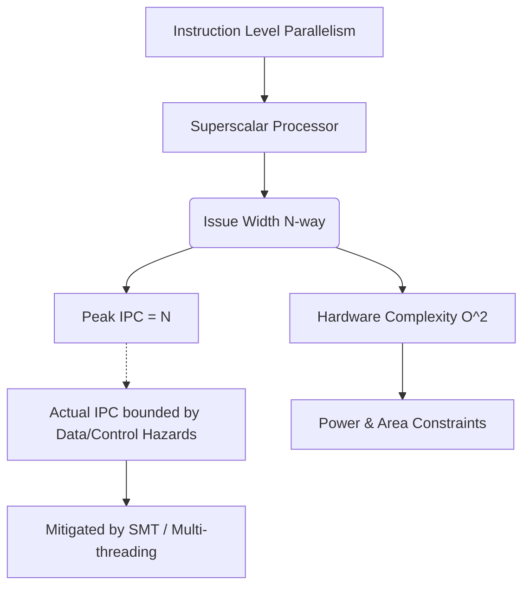

+++
title = "237. 명령어 발급 폭 (Issue Width)"
date = "2026-03-14"
weight = 237
+++

> **Insight**
> - 명령어 발급 폭(Issue Width)은 슈퍼스칼라(Superscalar) 마이크로아키텍처(Microarchitecture)의 성능 한계치(Peak Performance)를 결정하는 핵심 지표입니다.
> - 한 클럭 사이클(Clock Cycle) 내에 디코드(Decode)되어 다수의 실행 유닛(Execution Units)으로 동시에 스케줄링(Issue)될 수 있는 최대 명령어의 개수를 의미합니다.
> - 높은 발급 폭은 막대한 하드웨어 복잡도(Hardware Complexity)를 요구하며, 실제 효용성은 프로그램의 내재적 명령어 수준 병렬성(ILP)에 종속됩니다.

## Ⅰ. 명령어 발급 폭 (Issue Width)의 개요
### 1. 정의
명령어 발급 폭(Issue Width)은 프로세서(Processor)의 명령어 스케줄러(Instruction Scheduler)가 단일 클럭 사이클 동안 병렬로 실행 상태(Execution State)로 넘겨줄 수 있는 명령어(Instruction)의 최대 개수입니다. 흔히 'N-way 슈퍼스칼라'에서 'N'에 해당하는 값입니다.

### 2. 필요성 및 배경
단일 이슈(Single-issue) 스칼라 프로세서는 구조적으로 CPI(Cycles Per Instruction)가 1.0 이하로 내려갈 수 없다는 절대적인 성능 한계가 존재했습니다. 클럭 속도(Clock Frequency) 상승이 물리적 한계에 부딪히면서, 단일 사이클에 여러 명령어를 동시에 처리하여 IPC(Instructions Per Cycle)를 1 이상으로 극대화하기 위해 다중 이슈(Multiple Issue) 구조와 발급 폭(Issue Width)의 확장이 필수적으로 요구되었습니다.

📢 섹션 요약 비유: 고속도로 톨게이트에서 요금소 직원이 한 명(Single-issue)일 때는 차가 1대씩만 지나갈 수 있지만, 요금소를 4개(4-way Issue Width)로 늘리면 한 번에 4대씩 통과시켜 교통 체증을 시원하게 해결할 수 있는 원리입니다.

## Ⅱ. 핵심 메커니즘 및 아키텍처
### 1. 동작 원리
명령어 인출(Fetch) 유닛이 캐시에서 다수의 명령어를 묶음으로 가져오면, 디코더(Decoder)와 의존성 체크(Dependency Check) 로직이 이들 간의 RAW, WAR, WAW 데이터 해저드(Data Hazard)와 구조적 해저드(Structural Hazard)를 순식간에 검사합니다. 서로 독립적이고 가용 실행 유닛(ALU, FPU 등)이 충분하다면, Issue Width의 최대 허용치 내에서 명령어를 동시에 실행 유닛으로 발급(Issue)합니다.

### 2. 아키텍처 (ASCII 다이어그램)
```text
[4-Way Superscalar Issue Architecture]
Fetch Queue: [Inst1, Inst2, Inst3, Inst4, Inst5...]
     |
     v
Instruction Scheduler / Issue Queue (Issue Width = 4)
     |--> Inst1 (Independent) ----> ALU 1
     |--> Inst2 (Independent) ----> ALU 2
     |--> Inst3 (Independent) ----> FPU
     |--> Inst4 (Independent) ----> Load/Store Unit
```

📢 섹션 요약 비유: 오케스트라 지휘자(스케줄러)가 한 번의 손짓(1 사이클)으로 바이올린, 첼로, 피아노, 드럼 연주자(실행 유닛) 네 명에게 동시에 악보를 던져주어(4-way 발급) 화음을 만들어내는 웅장한 아키텍처입니다.

## Ⅲ. 주요 기술적 특성 및 분석
### 1. 특징
- **의존성 검사 오버헤드:** Issue Width가 $W$일 때, $W$개의 명령어 간 상호 의존성을 검사하기 위한 하드웨어 로직(비교기)의 복잡도는 $O(W^2)$로 기하급수적으로 증가합니다.
- **실제 IPC와의 괴리:** 이론적인 Peak IPC는 Issue Width와 같지만, 실제 달성되는 유효 IPC는 캐시 미스(Cache Miss), 분기 예측 실패(Branch Misprediction), 그리고 프로그램의 근본적인 명령어 수준 병렬성(ILP, Instruction Level Parallelism) 부족으로 인해 항상 그보다 낮습니다.

### 2. 장단점 분석
- **장점:** 풍부한 ILP를 가진 애플리케이션(과학 연산, 멀티미디어 처리 등)에서 단일 스레드(Single Thread) 성능을 비약적으로 끌어올릴 수 있습니다.
- **단점:** 실리콘 다이(Die) 면적과 전력 소비(Power Consumption)를 극심하게 증가시키며, 코어 클럭(Clock Speed)을 높이는 데 구조적인 방해물(병목 지점)로 작용할 수 있습니다.

📢 섹션 요약 비유: 톨게이트를 8개(넓은 발급 폭)로 크게 지어놨지만, 정작 지나가는 차들이 줄지어 연결되어 끊을 수 없는 견인차(데이터 의존성)들이라면 1개의 요금소밖에 쓰지 못해 건축비(전력과 면적)만 낭비하는 셈이 됩니다.

## Ⅳ. 구현 사례 및 응용 환경
### 1. 적용 분야
클라이언트 데스크톱, 스마트폰 AP, 서버용 CPU 등 고성능이 요구되는 모든 최신 범용 프로세서(General Purpose Processor) 설계의 기본 토대가 됩니다.

### 2. 실제 구현 사례
과거 Intel Pentium(초창기 슈퍼스칼라)은 2-way(명령어 2개 발급) 구조였으나, 현대의 고성능 코어인 애플(Apple)의 M1/M2 시리즈나 인텔(Intel)의 P-Core(Golden Cove 아키텍처) 등은 단일 사이클에 6-way에서 최대 **8-way 이상의 거대한 Issue Width**를 구현하여 압도적인 IPC 성능을 발휘하고 있습니다. 반면, 저전력 특화 코어(E-Core)는 3~4-way 수준으로 타협하여 전성비를 맞춥니다.

📢 섹션 요약 비유: 초기 스마트폰이 2차선 도로(2-way)를 달렸다면, 최신 아이폰의 두뇌(M 시리즈)는 한 번에 8대의 차가 나란히 달릴 수 있는 거대한 8차선 아우토반(8-way)을 칩셋 안에 건설한 것과 같습니다.

## Ⅴ. 한계점 및 미래 발전 방향
### 1. 현재의 한계
$O(W^2)$의 복잡도 법칙에 의해 발급 폭을 10-way 이상으로 늘리는 것은 코어 내 라우팅 지연(Routing Delay)을 유발하여 오히려 전체 클럭 주파수를 떨어뜨리는 역효과(Diminishing Returns)를 초래합니다. 한정된 ILP 자원을 쥐어짜는 것은 효율성이 낮습니다.

### 2. 발전 방향
이러한 물리적 한계를 극복하기 위해 단일 스레드의 넓은 발급 폭에 집착하기보다, SMT(Simultaneous Multithreading, Hyper-Threading)를 도입하여 여러 스레드의 명령어를 섞어서 낭비되는 Issue Slot을 채우거나, 코어의 개수 자체를 늘리는 멀티코어(Multi-Core) 패러다임으로 진화하였습니다.

📢 섹션 요약 비유: 10차선 고속도로를 무리하게 더 넓히려다 공사비 폭탄을 맞는 대신, 버스 전용차로(SMT)를 도입하거나 아예 다른 우회 도로(멀티코어)를 뚫는 현명한 교통 정책으로 발전한 것입니다.

---

### 💡 Knowledge Graph


### 👧 Child Analogy
학교 급식실에서 아주머니 한 분이 배식을 하면(Single-issue) 친구들이 한 줄로 서서 한참 기다려야 해요. 하지만 아주머니 네 분이서 동시에 밥, 국, 반찬, 디저트를 나누어 주시면(4-way Issue Width), 한 번에 네 명의 친구가 순식간에 급식을 받을 수 있어서 줄이 금방 줄어든답니다! 여기서 한 번에 배식을 받을 수 있는 최대 친구 숫자를 바로 '명령어 발급 폭'이라고 부르는 거예요. 더 빨리 배식하려면 아주머니(실행 유닛)도 많아야 하고 식판 놓을 자리도 엄청 넓어야 하겠죠?