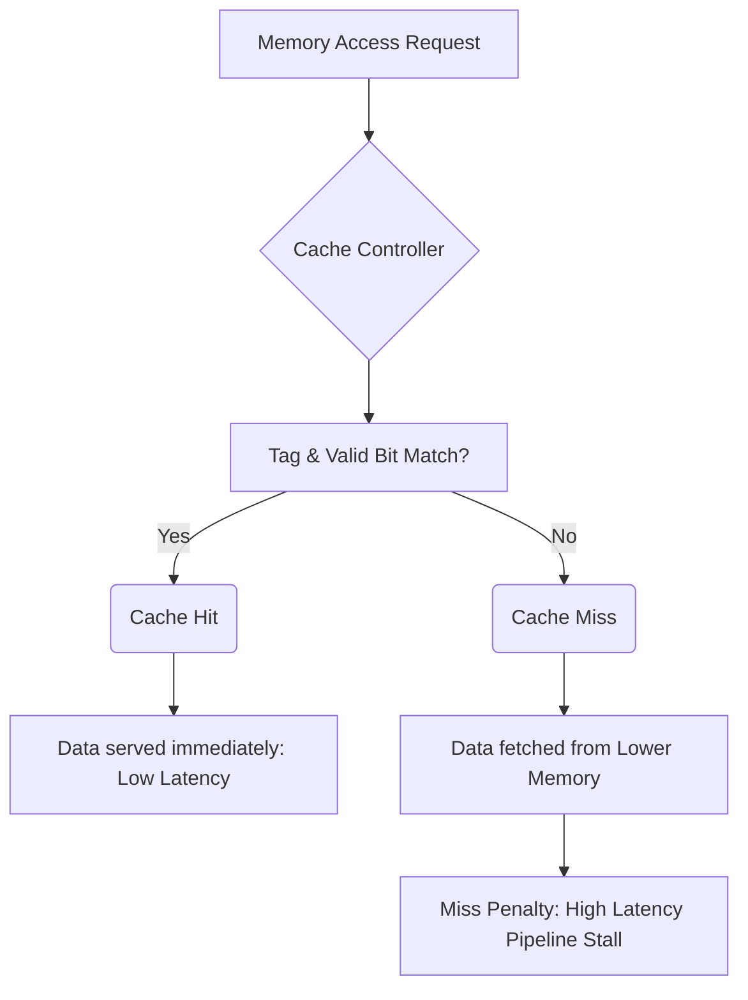

+++
title = "263. 캐시 히트 (Hit) 및 미스 (Miss)"
date = "2026-03-14"
weight = 263
+++

> **Insight**
> - 캐시 히트(Cache Hit)와 미스(Cache Miss)는 메모리 계층 구조(Memory Hierarchy)의 효율성을 결정짓는 가장 근본적인 두 가지 상태 이벤트입니다.
> - 히트는 CPU가 요구한 데이터가 빠르고 가까운 캐시 메모리에 존재하여 지연(Latency) 없이 즉시 제공되는 상태를 의미합니다.
> - 미스는 데이터가 캐시에 없어 느린 하위 메모리(Main Memory 등)에서 데이터를 가져와야 하는 페널티(Penalty)가 발생하는 상태입니다.

## Ⅰ. 캐시 히트 및 미스의 개요
### 1. 정의
**캐시 히트(Cache Hit)**는 중앙처리장치(CPU, Central Processing Unit)가 메모리 읽기/쓰기(Read/Write) 요청을 했을 때, 해당 메모리 주소의 데이터가 캐시(Cache) 내부의 데이터 블록(Block 또는 Line)에 이미 복사되어 존재하는 상태입니다.
**캐시 미스(Cache Miss)**는 CPU가 요청한 데이터가 캐시 내에 존재하지 않아, 주 메모리(Main Memory)나 더 낮은 레벨의 캐시(L2, L3)로 요청을 넘겨야 하는 상태를 정의합니다.

### 2. 필요성 및 배경
프로세서의 연산 속도와 메인 메모리의 접근 속도 간의 격차(Memory Wall)는 현대 컴퓨터 아키텍처의 가장 큰 병목입니다. 이를 완화하기 위해 소량의 초고속 SRAM 캐시를 CPU 코어 내부에 배치했습니다. 이 캐시의 존재 가치를 증명하고 시스템의 실질적인 체감 성능을 결정하는 절대적인 기준이 바로 히트와 미스의 발생 빈도입니다.

📢 섹션 요약 비유: 서재 책상 위(캐시)에서 원하는 책을 바로 찾으면 대성공(Hit)이고, 책상에 없어 결국 거실의 큰 책장(메인 메모리)까지 걸어갔다 와야 한다면 실패(Miss)입니다.

## Ⅱ. 핵심 메커니즘 및 아키텍처
### 1. 동작 원리
CPU가 가상 주소(또는 물리 주소)를 발행하면, 캐시 컨트롤러(Cache Controller)는 이 주소를 분할하여 태그(Tag), 인덱스(Index), 오프셋(Offset)을 추출합니다. 지정된 인덱스로 캐시 세트(Set)를 접근한 뒤, 유효 비트(Valid Bit)가 1인지 확인하고, 요청한 태그와 캐시 라인에 저장된 태그가 일치하는지 하드웨어 비교기(Comparator)를 통해 검사합니다. 태그가 일치하면 Hit, 불일치하거나 유효 비트가 0이면 Miss로 판정합니다.

### 2. 아키텍처 (ASCII 다이어그램)
```text
[Cache Access Mechanism: Hit vs Miss]
CPU Address: [ Tag | Index | Offset ]
                 |      |
                 V      V
Cache Directory: [Index] -> [ Valid Bit | Tag | Data Block ]
                                |          |
                                |(AND)     V
                                +-----> Comparator <--- CPU Tag
                                           |
                                      Match? (YES) -> CACHE HIT! (Data to CPU)
                                           |
                                      Match? (NO)  -> CACHE MISS! (Fetch from Memory)
```

📢 섹션 요약 비유: 도서관 사서(캐시 컨트롤러)가 학생(CPU)이 내민 청구기호(메모리 주소)를 보고, 대출대 옆 임시 보관함(캐시 인덱스)에 그 책이 있는지 정확한 이름표(태그)를 확인하여 바로 건네주거나(히트) 서고로 찾으러 가는(미스) 원리입니다.

## Ⅲ. 주요 기술적 특성 및 분석
### 1. 특징
- **시간적/공간적 지역성(Locality) 의존:** 캐시 히트는 프로그램의 데이터 접근 패턴이 최근에 사용한 데이터를 다시 사용하거나(Temporal Locality), 인접한 메모리 주소를 순차적으로 접근하는 성향(Spatial Locality)을 가질 때 기하급수적으로 증가합니다.
- **성능 비대칭성:** 히트 시의 접근 시간(Hit Time)은 대개 1~4 클럭 사이클 이내로 극히 짧지만, 미스 발생 시 부과되는 지연 시간(Miss Penalty)은 수백 사이클에 달할 정도로 비대칭적입니다.

### 2. 장단점 분석
- **히트(Hit)의 장점:** 파이프라인 스톨(Stall)을 방지하여 CPU가 최대의 성능(IPC)을 발휘하도록 유지하며, 시스템 버스(System Bus) 트래픽을 대폭 줄여 전력 효율을 높입니다.
- **미스(Miss)의 단점:** 즉각적인 하드웨어 스톨을 유발하여 코어의 연산 유닛들을 놀게 만들며(Bubble), 심한 경우 전체 애플리케이션의 반응성을 현저히 떨어뜨립니다.

📢 섹션 요약 비유: 히트는 고속도로 하이패스 차로를 논스톱으로 통과하는 상쾌함이지만, 미스는 하이패스 단말기 오류로 톨게이트에 멈춰서 수동 정산을 해야 하는 지독한 교통 체증(페널티)과 같습니다.

## Ⅳ. 구현 사례 및 응용 환경
### 1. 적용 분야
L1, L2, L3 캐시(Cache Memory)부터 운영체제(OS)의 페이지 캐시(Page Cache), 데이터베이스 버퍼 풀(Buffer Pool), 웹 브라우저의 이미지 캐싱, 그리고 CDN(Content Delivery Network)에 이르기까지 데이터를 임시 보관하여 성능을 높이는 모든 IT 계층에 동일하게 적용됩니다.

### 2. 실제 구현 사례
인텔(Intel) Core 시리즈나 ARM Cortex 시리즈 프로세서는 L1 캐시 미스가 발생하면, 이를 단순히 메모리로 보내지 않고 코어 외부에 있는 더 크고 다소 느린 L2 캐시로 요청을 전달(Forwarding)합니다. 여기서도 미스(L2 Miss)가 나면 공유 L3 캐시로, 최종적으로 L3 캐시마저 미스(LLC Miss)가 발생했을 때 비로소 DDR 메모리 컨트롤러를 통해 메인 메모리로 접근하는 다단계(Multi-level) 방어벽 아키텍처를 구현하고 있습니다.

📢 섹션 요약 비유: 동네 편의점(L1 캐시)에 물건이 없으면(미스), 대형 마트(L2 캐시)에 가보고, 거기도 없으면 물류 센터(L3 캐시)를 거쳐 최종적으로 생산 공장(메인 메모리)에 발주를 넣는 촘촘한 유통망 시스템과 같습니다.

## Ⅴ. 한계점 및 미래 발전 방향
### 1. 현재의 한계
소프트웨어의 용량이 비대해지고 데이터베이스 및 AI 모델 파라미터(Parameter) 등 작업 세트(Working Set)의 크기가 캐시 용량을 아득히 초과함에 따라, 단순히 하드웨어 구조만으로는 캐시 미스를 0으로 만드는 것이 물리적으로 불가능합니다.

### 2. 발전 방향
이러한 한계를 극복하기 위해 단순히 히트/미스를 판별하는 수동적 캐시를 넘어, 머신러닝(Machine Learning)이나 복잡한 패턴 매칭 알고리즘을 활용해 CPU가 미래에 요구할 데이터를 미리 캐시로 가져와 배치하는 **데이터 프리패칭(Data Prefetching)** 기술이 고도로 발전하며 미스 자체를 사전에 은폐(Hide)하고 있습니다.

📢 섹션 요약 비유: 손님이 주문을 하고 나서야 창고에서 물건을 찾는(수동적 미스 대응) 시대를 넘어, 단골손님의 표정만 보고도 미리 좋아하는 물건을 카운터에 꺼내놓는(데이터 프리패치) 인공지능형 서비스로 진화하고 있습니다.

---

### 💡 Knowledge Graph


### 👧 Child Analogy
학교 수업 시간에 선생님이 "빨간색 색연필 꺼내세요~" 라고 하셨을 때, 책상 위 필통에 바로 빨간색 색연필이 있으면 '캐시 히트(Hit)!' 라고 해요. 1초 만에 꺼내서 바로 그림을 그릴 수 있죠. 그런데 필통에 없고 저기 뒤쪽 사물함에 있다면? '캐시 미스(Miss)!' 예요. 자리에서 일어나 사물함까지 걸어가서 꺼내와야 하니까 시간이 엄청 오래 걸리게 된답니다. 컴퓨터도 책상 위 필통(캐시)에서 데이터를 찾으면 좋아하고, 사물함(메모리)에 다녀와야 하면 슬퍼해요!