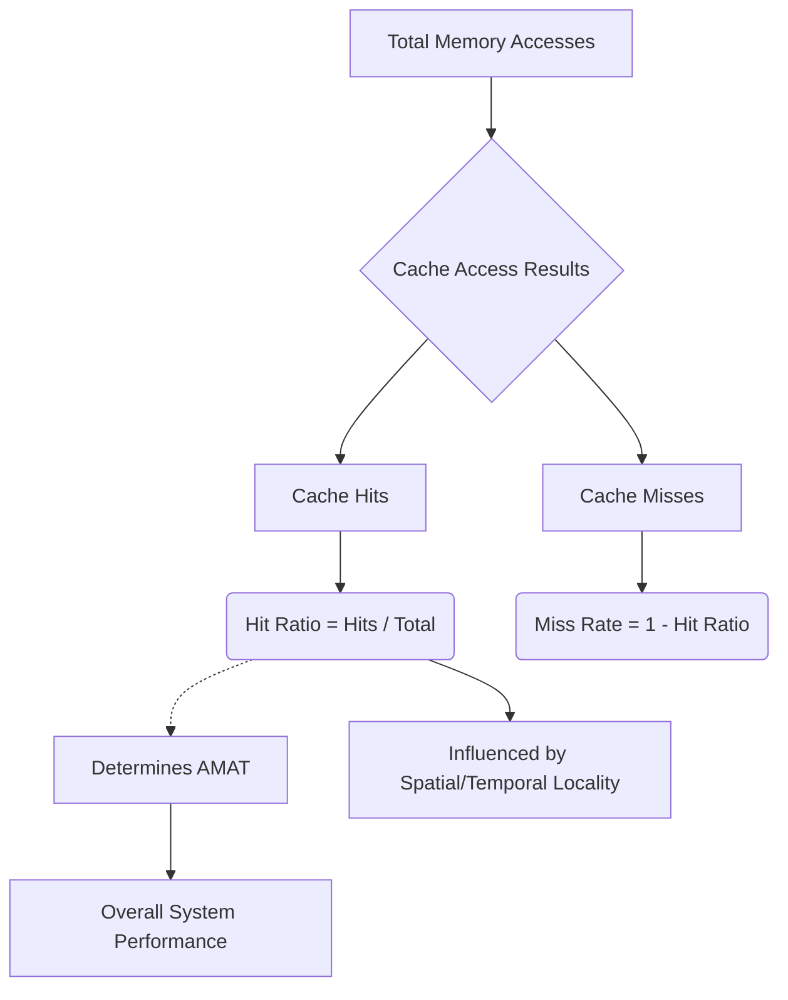

+++
title = "264. 적중률 (Hit Ratio)"
date = "2026-03-14"
weight = 264
+++

> **Insight**
> - 적중률(Hit Ratio)은 캐시 메모리(Cache Memory)의 설계 효율성과 실제 성능을 객관적으로 평가하는 가장 중요한 정량적(Quantitative) 지표입니다.
> - 전체 메모리 접근 시도 중 캐시 히트(Cache Hit)가 발생한 횟수의 비율을 의미하며, 워크로드의 지역성(Locality) 특성에 절대적인 영향을 받습니다.
> - 적중률이 단 1~2%만 하락하더라도, 미스 페널티(Miss Penalty)의 막대한 비대칭성으로 인해 전체 시스템 성능(AMAT)은 치명적으로 저하됩니다.

## Ⅰ. 적중률 (Hit Ratio)의 개요
### 1. 정의
적중률(Hit Ratio 또는 Hit Rate)은 중앙처리장치(CPU)가 요청한 전체 메모리 접근(Memory Access) 횟수 대비, 데이터를 캐시 내부에서 성공적으로 찾아낸 횟수(Cache Hit)의 백분율(Percentage) 또는 비율(Fraction)을 나타내는 공식입니다.
*수식:* `Hit Ratio = (Cache Hits) / (Cache Hits + Cache Misses)`

### 2. 필요성 및 배경
단순히 히트와 미스라는 이벤트의 발생 여부를 넘어서, 특정 크기와 구조(예: 직접 매핑, N-way 집합 연관)를 가진 캐시 아키텍처가 특정 프로그램 워크로드(Workload)에 대해 얼마나 효과적으로 작동하는지 측정할 통계적 척도가 필요했습니다. 적중률은 프로세서 설계자가 캐시 용량(Capacity), 블록 크기(Block Size), 교체 알고리즘(Replacement Policy)을 최적화하기 위한 엔지니어링 나침반 역할을 합니다.

📢 섹션 요약 비유: 야구 타자가 타석에 들어서서 안타를 칠 확률(타율)과 정확히 같습니다. 타율이 높을수록 팀(컴퓨터)이 승리(빠른 성능)할 확률이 높아집니다.

## Ⅱ. 핵심 메커니즘 및 아키텍처
### 1. 동작 원리
운영체제(OS)나 프로세서의 하드웨어 성능 카운터(Hardware Performance Counter)는 CPU의 매 사이클마다 발생하는 메모리 참조 명령어를 모니터링합니다. 캐시 컨트롤러 내부의 로직은 L1, L2 등 각 캐시 계층(Level)별로 누적 히트 카운트와 전체 접근 카운트를 레지스터(Register)에 실시간으로 기록하며, 프로파일링 도구(Profiling Tool)는 이 값을 기반으로 런타임 적중률을 산출합니다. 반대 개념인 미스율(Miss Rate)은 `1 - Hit Ratio`로 도출됩니다.

### 2. 아키텍처 (ASCII 다이어그램)
```text
[Hardware Performance Monitoring for Hit Ratio]
CPU Core
   |
   +-> Memory Access Stream (Total Accesses = 1000)
         |
         v
L1 Cache Controller
   +--> Match Logic ------------------+
   | (Found) -> Increment HIT Counter | (Hits = 950)
   | (Not Found) -> Inc MISS Counter  | (Misses = 50)
                                      V
                        Performance Monitoring Unit (PMU)
                        Hit Ratio = 950 / 1000 = 0.95 (95%)
```

📢 섹션 요약 비유: 매장 입구에 서식하는 자동 인원 계수기(PMU)가 하루 종일 매장을 방문한 전체 손님(접근) 중 실제로 물건을 사서 나간 손님(히트)의 비율을 계산하여 매장의 장사 수완을 평가하는 시스템입니다.

## Ⅲ. 주요 기술적 특성 및 분석
### 1. 특징
- **비선형적 체감 성능:** 적중률이 99%에서 98%로 1%포인트 하락하는 것은 미스율(Miss Rate)이 1%에서 2%로 두 배 폭증하는 것을 의미합니다. 미스 페널티(Miss Penalty)가 수백 사이클이기 때문에 이 1%의 차이는 전체 프로그램 실행 시간을 수십 퍼센트 지연시킬 수 있는 가공할 파괴력을 가집니다.
- **워크로드 종속성:** 행렬 곱셈(Matrix Multiplication)처럼 지역성이 높은 코드는 99% 이상의 적중률을 보이지만, 링크드 리스트(Linked List) 순회처럼 포인터 체이싱(Pointer Chasing)이 빈번한 코드는 적중률이 급감합니다.

### 2. 장단점 분석
- **장점(높은 적중률의 효과):** 평균 메모리 접근 시간(AMAT, Average Memory Access Time)을 캐시 접근 시간 수준으로 수렴하게 만들어, 느린 메인 메모리의 존재를 CPU가 전혀 느끼지 못하게(은폐) 만듭니다.
- **단점(맹점):** 적중률만으로는 시스템 성능을 완벽히 대변할 수 없습니다. L1 캐시를 비정상적으로 크게 만들면 적중률은 100%에 가까워지지만, 물리적 면적 증가로 인해 기본 L1 히트 타임(Hit Time) 자체가 느려져 전체 성능은 오히려 떨어질 수 있습니다(Capacity-Speed Tradeoff).

📢 섹션 요약 비유: 학생의 시험 점수(적중률)가 99점에서 98점으로 떨어지는 건 사소해 보이지만, 오답 1개(미스)의 감점이 어마어마한 수능 시험(막대한 페널티)에서는 그 1점 차이로 대학 합격이 좌우되는 냉혹한 구조입니다.

## Ⅳ. 구현 사례 및 응용 환경
### 1. 적용 분야
프로세서 캐시뿐만 아니라, 데이터베이스(DB) 버퍼 캐시(Buffer Cache)의 크기 튜닝 척도, 웹 서비스의 레디스(Redis) 인메모리 캐시 아키텍처 효율성 검증 등 시스템 엔지니어링 전반에 성능 지표(KPI)로 적용됩니다.

### 2. 실제 구현 사례
Linux 환경의 `perf` 도구나 Intel VTune Profiler를 사용하면 개발 중인 애플리케이션의 L1, L2, LLC(Last Level Cache) 각각의 적중률을 추적할 수 있습니다. 예를 들어 C/C++ 프로그램에서 2차원 배열의 행/열 접근 순서를 바꾸는 루프 인터체인지(Loop Interchange) 기법을 적용하면 공간적 지역성(Spatial Locality)이 개선되어 L1 적중률을 60%에서 95% 이상으로 극적으로 끌어올리는 하드웨어 친화적(Hardware-aware) 소프트웨어 최적화가 가능합니다.

📢 섹션 요약 비유: 요리사가 주방 냉장고(캐시)에서 재료를 찾는 동선을 분석 카메라(perf 도구)로 촬영하고, 적중률을 높이기 위해 자주 쓰는 양념을 앞줄에 재배치(루프 최적화)하여 요리 시간을 반으로 줄이는 생생한 최적화 과정입니다.

## Ⅴ. 한계점 및 미래 발전 방향
### 1. 현재의 한계
멀티 코어(Multi-Core) 스레드가 공유 L3 캐시를 동시에 경쟁하며 접근할 때 발생하는 쓰래싱(Thrashing) 환경에서는 개별 스레드의 적중률 지표만으로는 병목의 근본 원인을 파악하기 어렵습니다.

### 2. 발전 방향
최신 아키텍처 연구는 단순한 Hit/Miss 횟수 측정을 넘어, 어떤 데이터 구조나 변수 단위에서 잦은 미스가 발생하는지 추적하는 정밀한 메모리 프로파일링(Precision Memory Profiling)과, 각 코어마다 L3 캐시 파티션(Partitioning)을 할당하여 적중률을 보장해주는 인텔 RDT(Resource Director Technology) 같은 QoS(Quality of Service) 기술로 진화하고 있습니다.

📢 섹션 요약 비유: 단순히 "타율이 몇 퍼센트다"라는 통계를 넘어, "이 타자는 유독 바깥쪽 직구(특정 데이터 구조)에 헛스윙(미스)을 많이 한다"는 초정밀 분석과 맞춤 훈련(QoS)으로 발전하는 현대 스포츠 데이터 분석과 같습니다.

---

### 💡 Knowledge Graph


### 👧 Child Analogy
내가 제일 좋아하는 구슬 찾기 게임을 상상해 봐요! 주머니(캐시)에서 10번 구슬을 꺼내봤는데, 내가 찾던 파란 구슬이 9번이나 바로 나왔어요! 그럼 나의 '구슬 적중률'은 10번 중에 9번이니까 무려 90점(90%)인 거예요. 적중률 점수가 100점에 가까울수록 나는 방구석 사물함(메인 메모리)까지 구슬을 찾으러 멀리 걸어갈 필요 없이 주머니 속에서 즐겁게 놀 수 있는 최고로 운이 좋은 상태가 되는 거랍니다!