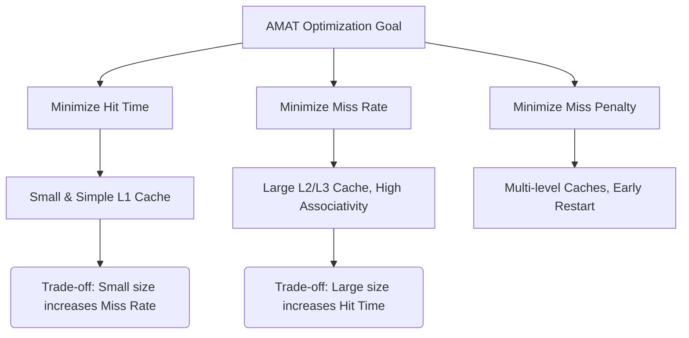

+++
title = "265. 평균 메모리 접근 시간 (AMAT)"
date = "2026-03-14"
weight = 265
+++

> **Insight**
> - 평균 메모리 접근 시간(AMAT, Average Memory Access Time)은 복잡한 다중 계층 메모리 서브시스템(Memory Hierarchy)의 전체 성능을 하나의 숫자로 정량화한 절대적인 기준(Metric)입니다.
> - AMAT = `Hit Time` + (`Miss Rate` × `Miss Penalty`)의 기본 공식을 따릅니다.
> - 현대 컴퓨터 아키텍처의 캐시 설계 최적화는 이 공식의 세 가지 핵심 변수 중 하나 이상을 최소화하여 AMAT를 낮추는 방향으로 이루어집니다.

## Ⅰ. 평균 메모리 접근 시간 (AMAT)의 개요
### 1. 정의
평균 메모리 접근 시간(AMAT)은 중앙처리장치(CPU)가 1회의 메모리 참조(데이터 읽기 또는 쓰기)를 완전히 완료하는 데 걸리는 통계적인 평균 시간(또는 클럭 사이클 수)입니다. 캐시 히트(Cache Hit) 시의 빠른 접근 속도와 미스(Cache Miss) 시 발생하는 긴 지연 시간을 발생 확률에 따라 가중 평균한 수치입니다.

### 2. 필요성 및 배경
프로세서 코어가 아무리 빠르고 높은 명령어 수준 병렬성(ILP)을 가져도, 메모리 시스템이 데이터를 제때 공급하지 못하면 성능은 메모리 속도에 귀속됩니다(Memory Bound). 단일 캐시가 아닌 L1, L2, L3 및 메인 메모리로 이어지는 계층 구조에서 설계자가 캐시 크기를 늘릴지, 계층을 더할지 결정하기 위해서는 서로 상충하는 트레이드오프(Trade-off)를 객관적으로 비교할 수 있는 통합된 수학적 모델이 필수적이었습니다.

📢 섹션 요약 비유: 출근할 때, 운 좋게 버스가 바로 와서 10분 만에 도착하는 날(히트)과 버스를 놓쳐 50분이 걸리는 날(미스)을 1년 치 통계로 내서 "내 평균 출근 시간은 정확히 14분 30초다"라고 명확히 수치화한 것입니다.

## Ⅱ. 핵심 메커니즘 및 아키텍처
### 1. 동작 원리
AMAT 공식은 다음과 같이 구성됩니다.
`AMAT = Hit Time + (Miss Rate × Miss Penalty)`
- **Hit Time (적중 시간):** 캐시에 접근하여 데이터가 있음을 확인하고 CPU로 전달하는 시간. (주로 캐시 용량과 직결됨)
- **Miss Rate (미스율):** 캐시 미스가 발생할 확률 (1 - Hit Ratio).
- **Miss Penalty (미스 페널티):** 캐시에 데이터가 없어 하위 메모리에서 블록을 가져와 교체한 뒤 재접근하는 데 걸리는 총 지연 시간.

다단계 캐시(L1, L2) 환경에서는 식이 재귀적으로 전개됩니다.
`AMAT = L1 Hit Time + (L1 Miss Rate × L1 Miss Penalty)`
(이때 `L1 Miss Penalty` = `L2 Hit Time + (L2 Miss Rate × L2 Miss Penalty)`)

### 2. 아키텍처 (ASCII 다이어그램)
```text
[AMAT Calculation Model in Memory Hierarchy]

CPU Request
   |
   +--> L1 Cache (Hit Time: 1 cycle, Miss Rate: 5%)
          |  (Hit! -> Returns in 1 cycle)
          |
        (Miss! -> 5% probability triggers Penalty)
          |
          V
        Main Memory (Miss Penalty: 100 cycles)

AMAT = 1 cycle + (0.05 * 100 cycles) = 1 + 5 = 6 cycles per access.
```

📢 섹션 요약 비유: "동네 편의점 왕복 5분(Hit Time) + (편의점에 물건이 없을 확률 10% * 대형마트 다녀오는 60분 벌금(Miss Penalty))" 공식을 통해 내 일상 쇼핑의 평균 소요 시간(AMAT)을 계산하는 직관적인 메커니즘입니다.

## Ⅲ. 주요 기술적 특성 및 분석
### 1. 특징
- **종합적 성능 지표:** 단순한 적중률(Hit Ratio)이 시스템 성능의 단면만 보여준다면, AMAT는 실제 클럭 페널티를 곱하여 시스템의 물리적 대기 시간(Latency)을 가장 정확하게 반영합니다.
- **세 변수의 길항 작용:** Hit Time, Miss Rate, Miss Penalty는 서로 얽혀 있습니다. 미스율을 줄이려고 캐시 용량을 크게 만들면 물리적 접근 시간(Hit Time)이 늘어나 오히려 AMAT가 악화될 수 있는 설계의 딜레마(Trade-off)를 내포합니다.

### 2. 장단점 분석
- **최적화 관점:** L1 캐시는 작고 빠르게 만들어 Hit Time을 최소화하는 데 집중하고, L2/L3 캐시는 크기를 대폭 늘려 Miss Rate를 낮춰 최종 메인 메모리로 가는 치명적인 Miss Penalty를 차단하는 역할 분담(Decoupling)을 유도합니다.
- **한계:** 파이프라인 프로세서에서 여러 미스가 겹쳐서 발생하는 메모리 레벨 병렬성(MLP, Memory Level Parallelism) 상황에서는 하드웨어 로직이 페널티를 중첩하여 가려주기 때문에 실제 체감 지연 시간보다 AMAT 수치가 보수적(더 느리게)으로 계산될 수 있습니다.

📢 섹션 요약 비유: 마치 3개의 다이얼(Hit Time, Miss Rate, Penalty)이 달린 오디오 앰프와 같아서, 베이스(미스율)를 줄이려고 다이얼을 돌리면 트레블(히트 시간)이 찢어지는 소리가 나기 때문에 절묘한 황금비율(최저 AMAT)을 찾는 것이 설계의 핵심입니다.

## Ⅳ. 구현 사례 및 응용 환경
### 1. 적용 분야
새로운 CPU 아키텍처의 캐시 크기와 집합 연관도(Set Associativity)를 결정하기 위한 아키텍처 시뮬레이터(예: gem5, SimpleScalar) 구동 시 가장 핵심적인 최적화 타겟 함수(Objective Function)로 사용됩니다.

### 2. 실제 구현 사례
**Miss Penalty 은폐(Hiding) 기법:** 현대 프로세서는 미스 페널티를 상쇄하여 AMAT를 줄이기 위해, 비순차적 실행(Out-of-Order Execution) 엔진을 활용합니다. 특정 명령어에서 캐시 미스가 발생해 100사이클 페널티를 기다리는 동안, 코어는 멈추지 않고 독립적인 다른 명령어 수십 개를 먼저 실행함으로써 미스로 인한 손실 시간을 배경(Background)으로 완전히 숨겨버립니다. 결과적으로 유효 AMAT(Effective AMAT)는 획기적으로 낮아집니다.

📢 섹션 요약 비유: 식당에서 스테이크(데이터) 조리에 30분(미스 페널티)이 걸린다고 할 때, 손님을 멍하니 기다리게 하는 대신 식전 빵과 수프(다른 독립 명령어)를 먼저 내어주어 체감 대기 시간(유효 AMAT)을 극적으로 줄이는 고급 레스토랑의 서빙 노하우입니다.

## Ⅴ. 한계점 및 미래 발전 방향
### 1. 현재의 한계
멀티 코어(Multi-core)와 누마(NUMA, Non-Uniform Memory Access) 아키텍처 환경에서는 데이터가 다른 코어의 캐시에 존재하거나 멀리 떨어진 노드의 메모리에 있을 수 있어, 고정된 Miss Penalty라는 단일 상수를 적용하여 AMAT를 구하기가 극도로 난해해졌습니다.

### 2. 발전 방향
단일 수치로서의 AMAT 개념을 확장하여, 꼬리 지연 시간(Tail Latency, 상위 99% 최악의 접근 시간) 보장이나, 코어 간 캐시 일관성(Cache Coherence) 프로토콜에서 발생하는 트래픽 지연을 포함하는 동적(Dynamic)이고 다차원적인 메모리 지연 모델링 연구로 발전하고 있습니다.

📢 섹션 요약 비유: 예전에는 "평균 배달 시간이 30분"이라는 통계(AMAT)면 충분했지만, 요즘 시대에는 "평균은 30분인데 폭설이 내릴 때 최악의 경우(Tail Latency)는 얼마나 걸리는가?"를 더 중요하게 따지는 복잡한 현대 택배 물류 시스템으로 진화한 것과 같습니다.

---

### 💡 Knowledge Graph


### 👧 Child Analogy
학교 앞 분식집에서 떡볶이를 사 먹는 시간을 계산해 볼게요! '평균 떡볶이 시간(AMAT)'은 이렇게 구해요. 
먼저 아주머니가 떡볶이를 그릇에 담아주는 기본 시간(1분: Hit Time)이 들어요. 그런데 가끔 떡볶이가 다 떨어져서 새로 끓여야 할 때가 있죠? 새로 끓이는 데 걸리는 벌칙 시간(10분: Miss Penalty)에, 내가 갔을 때 운 나쁘게 다 떨어져 있을 확률(10번 중 1번: Miss Rate)을 곱해서 더해주는 거예요. 그래서 나의 평균 떡볶이 시간은 1분 + (10분 x 0.1) = 총 2분이 되는 거랍니다! 이 시간을 줄이려면 큰 냄비를 쓰거나(미스율 낮추기), 더 빨리 담아주시면(히트 시간 낮추기) 되겠죠?