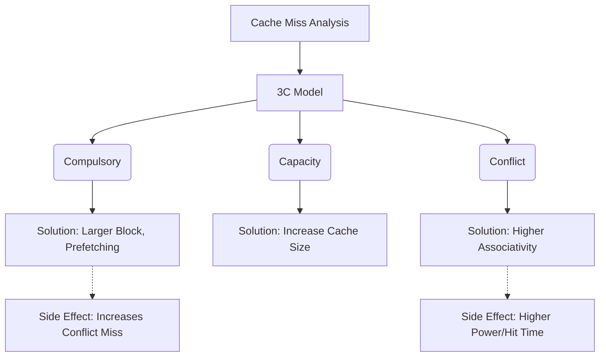

+++
title = "270. 캐시 미스의 원인 (3C: Compulsory, Capacity, Conflict)"
date = "2026-03-14"
weight = 270
+++

> **Insight**
> - 캐시 미스의 원인은 아키텍처 분석의 고전적인 모델인 '3C 모델'에 의해 Compulsory, Capacity, Conflict의 세 가지 근본 원인으로 분류됩니다.
> - **Compulsory(강제)** 미스는 최초 접근 시 불가피하게 발생하고, **Capacity(용량)** 미스는 캐시의 물리적 크기 부족, **Conflict(충돌)** 미스는 매핑 방식(연관도)의 구조적 한계에서 기인합니다.
> - 이 3C 분석은 프로세서 설계자가 블록 크기, 캐시 용량, 집합 연관도(Set Associativity)를 최적화하기 위한 진단 도구로 활용됩니다.

## Ⅰ. 캐시 미스의 원인 (3C)의 개요
### 1. 정의
Mark Hill이 제안한 3C 모델은 캐시 미스가 왜 발생하는지에 대한 정성적, 정량적 원인을 규명하는 분류 체계입니다.
1. **Compulsory (강제 미스 / 초기 미스):** 프로세스가 실행된 후 메모리 블록이 한 번도 캐시에 적재된 적이 없어, 생애 첫 번째 접근(Cold Start) 시 반드시 발생하는 절대적인 미스입니다.
2. **Capacity (용량 미스):** 프로그램이 처리하는 데이터 셋(Working Set)의 전체 크기가 물리적인 캐시의 총 용량보다 커서, 기존의 유용한 블록이 밀려나고 나중에 다시 접근할 때 발생하는 미스입니다.
3. **Conflict (충돌 미스):** 캐시의 총 용량은 충분하지만, 다수의 메모리 블록이 동일한 캐시 세트(Set)로 몰려서 매핑되는 바람에 빈 공간이 있음에도 불구하고 블록이 교체(Eviction)되어 발생하는 미스입니다. (완전 연관 매핑에서는 발생하지 않음)

### 2. 필요성 및 배경
캐시 미스율(Miss Rate)이 높다는 사실 자체만으로는 시스템 설계자가 어떤 조치를 취해야 할지 알 수 없습니다. 미스의 성격이 '집(캐시 용량)이 좁아서' 발생한 것인지, '방 배정(매핑)이 꼬여서' 발생한 것인지 명확히 진단해야만 캐시 크기를 늘릴지, 연관도를 높일지 적절한 엔지니어링 처방(Prescription)을 내릴 수 있습니다.

📢 섹션 요약 비유: 병원에서 환자(미스율 높은 컴퓨터)의 증상을 보고, 감기(초기 강제적), 영양실조(물리적 밥그릇/용량 부족), 혹은 소화불량(음식은 많은데 위장 한쪽으로 쏠린 충돌)인지 근본 원인을 진단하는 3대 의학 검사 모델입니다.

## Ⅱ. 3C 모델의 핵심 메커니즘 및 아키텍처 분석
### 1. 동작 원리 및 시뮬레이션 판별법
아키텍처 시뮬레이터에서 3C를 판별하는 논리적 과정은 다음과 같습니다.
- 특정 메모리 블록을 처음 터치했는가? -> **Yes: Compulsory Miss**
- 무한대 용량의 완전 연관(Fully Associative) 캐시라고 가정했을 때 미스가 발생하는가? -> **Yes: Capacity Miss** (캐시가 아무리 이상적이어도 쫓겨남)
- 유한한 용량의 완전 연관 캐시에서는 히트인데, 현재의 N-Way 집합 연관(Set Associative) 캐시에서는 쫓겨나 미스가 나는가? -> **Yes: Conflict Miss**

### 2. 아키텍처 (ASCII 다이어그램)
```text
[The 3C Miss Distribution Model]
Total Cache Misses = Compulsory + Capacity + Conflict

+-------------------+
| Conflict Misses   | <- Reduced by higher Set Associativity
+-------------------+
| Capacity Misses   | <- Reduced by larger Cache Size
+-------------------+
| Compulsory Misses | <- Reduced by larger Block Size or Prefetching
+-------------------+
```

📢 섹션 요약 비유: 주차장(캐시)으로 치면, Compulsory는 '차가 생전 처음 동네에 온 것', Capacity는 '동네 차가 100대인데 주차면이 50개뿐인 진짜 포화 상태', Conflict는 '다른 구역은 텅텅 비었는데 하필 A구역에만 차들이 몰려 자리가 없어 쫓겨나는 억울한 쏠림 현상'입니다.

## Ⅲ. 주요 기술적 특성 및 분석 (원인별 해결책)
### 1. Compulsory Miss 해결책과 한계
- **대책:** 블록 크기(Block Size)를 키워 한 번에 많은 인접 데이터를 가져오면 공간적 지역성으로 인해 후속 접근 시 미스를 줄일 수 있습니다. 또한 데이터 프리패치(Hardware Prefetching)가 유효합니다.
- **부작용:** 블록을 너무 크게 만들면 캐시 내 총 블록 수가 감소하여 Conflict 미스가 급증하고(Miss Penalty 타임 증가), 캐시 폴루션(Cache Pollution)이 유발될 수 있습니다.

### 2. Capacity Miss 해결책과 한계
- **대책:** L1, L2, L3 캐시의 물리적 용량(SRAM 크기)을 직접적으로 늘립니다.
- **부작용:** 캐시 용량이 커지면 Hit Time(신호 전달 지연 시간)이 길어지고 칩 면적과 전력 소비가 급상승하는 트레이드오프가 존재합니다.

### 3. Conflict Miss 해결책과 한계
- **대책:** 직접 매핑(Direct Mapped)을 버리고 다중 집합 연관 매핑(2-way, 4-way, 8-way Set Associativity)을 채택하여 해시 충돌을 분산시킵니다.
- **부작용:** 연관도를 높이면 다수의 태그(Tag) 비교기를 동시에 가동해야 하므로 복잡한 전력망(Power Grid) 설계와 논리 회로 지연이 따릅니다.

📢 섹션 요약 비유: 감기약을 먹으면 졸리고(블록 크기 부작용), 밥그릇을 키우면 무거워지고(용량 부작용), 식당 테이블 배치를 복잡하게 쪼개면 서빙 동선이 꼬이는(연관도 부작용) 것처럼, 하나를 해결하면 다른 쪽에 약점이 생기는 제로섬(Zero-sum) 게임의 연속입니다.

## Ⅳ. 구현 사례 및 응용 환경
### 1. 적용 분야
최신 CPU의 L1 데이터 캐시는 히트 타임과 Conflict 사이의 타협점인 8-way 집합 연관으로, L3 캐시는 16-way 이상의 높은 연관도 및 대용량으로 설계하여 각각의 3C 약점을 극복하는 하이브리드 계층 구조를 채택합니다.

### 2. 최신 확장 모델: 4C (Coherence Miss 추가)
단일 코어 시대의 3C 모델은 멀티 코어(Multi-core) 아키텍처 시대로 넘어오면서 한계에 봉착했습니다. 현재는 다른 코어가 내가 캐싱해둔 공유 변수를 수정하여(Write) 캐시 일관성 프로토콜(MESI 등)에 의해 내 캐시 라인이 강제로 무효화(Invalidation)되어 발생하는 **Coherence Miss(또는 Communication Miss)**가 네 번째 요소로 추가된 **4C 모델**이 업계 표준 진단 도구로 사용되고 있습니다.

📢 섹션 요약 비유: 과거에는 내 방(캐시) 안에서의 문제(3C)만 신경 쓰면 됐지만, 이제는 형제들과 거실(공유 메모리)을 같이 쓰다 보니 형이 내 물건 위치를 맘대로 바꿔서 못 찾게 되는 '소통 부재 미스(4C)'라는 새로운 가족 분란이 추가된 셈입니다.

## Ⅴ. 한계점 및 미래 발전 방향
### 1. 현재의 한계
소프트웨어 개발자가 3C 모델을 직접 이해하고 데이터 구조를 캐시 라인(예: 64바이트) 크기와 연관도에 딱 맞게 정렬(Cache-line Alignment) 및 패딩(Padding)하는 고도의 수동 최적화는 생산성이 극도로 낮고 코드를 특정 하드웨어에 종속되게 만듭니다.

### 2. 발전 방향
이러한 한계를 벗어나기 위해 캐시 용량 한계를 초월하는 **압축 캐시(Compressed Cache)** 기술, 그리고 컴파일러가 알아서 데이터 배열을 타일 형태(Loop Tiling)로 재조립하여 Capacity와 Conflict 미스를 소프트웨어적으로 회피하는 하드웨어-소프트웨어 공동 설계(Co-design) 기법이 성숙해지고 있습니다.

📢 섹션 요약 비유: 사용자가 서랍(캐시) 크기에 맞춰 물건을 정육면체로 잘라서 넣는 수고를 하는 대신, 알아서 진공 압축팩(압축 캐시)으로 부피를 줄이거나 로봇 팔(컴파일러)이 테트리스처럼 빈 공간 없이 꽉꽉 채워주는 스마트 서랍으로 진화하고 있습니다.

---

### 💡 Knowledge Graph


### 👧 Child Analogy
내가 장난감 상자(캐시)를 가지고 노는 걸 생각해 봐요! 장난감을 찾으려는데 없는 경우가 세 가지 있어요.
1. '처음 미스(Compulsory)': 내가 오늘 백화점에서 '새로 산 장난감'이라 당연히 아직 내 상자에 없을 때예요.
2. '꽉참 미스(Capacity)': 내 상자는 10개만 들어가는데 장난감이 20개라, 어쩔 수 없이 옛날 장난감을 버려야 해서 나중에 다시 찾을 때 없는 거예요.
3. '자리싸움 미스(Conflict)': 상자에 빈자리가 꽤 있는데, 하필 로봇 장난감들은 무조건 '빨간 칸'에만 넣기로 규칙을 정하는 바람에, 빨간 칸이 꽉 차서 로봇이 쫓겨나는 억울한 경우예요!