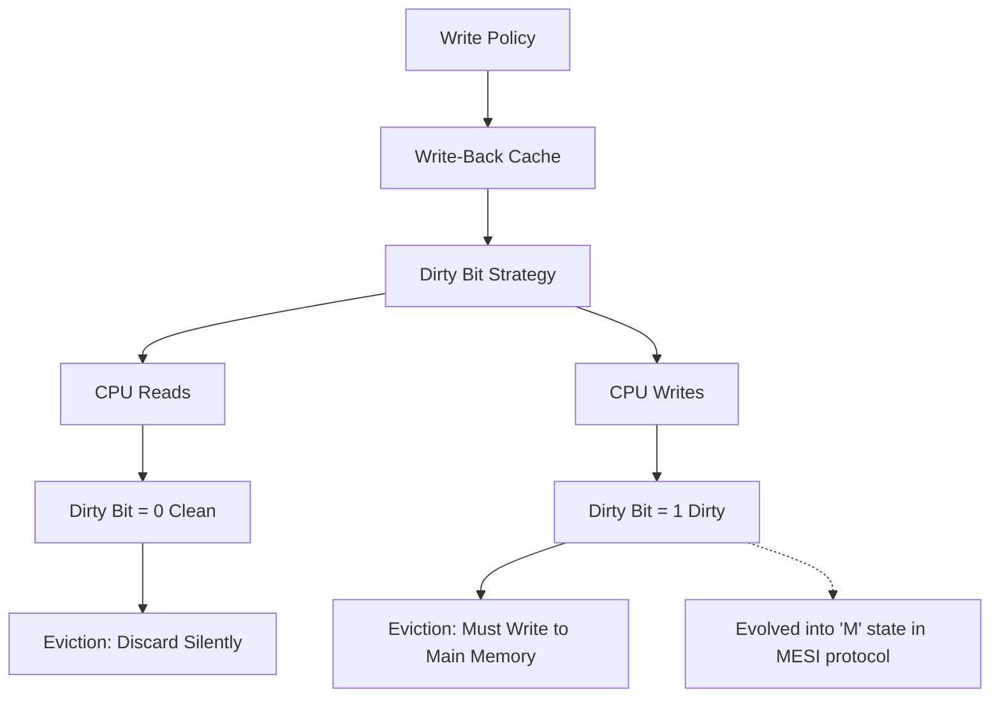

+++
title = "278. 더티 비트 (Dirty Bit)"
date = "2026-03-14"
weight = 278
+++

> **Insight**
> - 더티 비트(Dirty Bit 또는 Modified Bit)는 캐시(Cache) 내부의 데이터가 메인 메모리(Main Memory)의 원본 데이터와 일치하는지 여부를 추적하는 단일 상태 표시 비트입니다.
> - 후기록(Write-Back) 캐시 정책(Policy)을 구현하기 위한 필수적인 메타데이터 로직으로, 오직 데이터가 캐시 내부에서 갱신(수정)되었을 때만 1로 세팅됩니다.
> - 캐시 블록이 공간 부족으로 쫓겨날(Eviction) 때 불필요한 메모리 쓰기 동작을 생략하게 해주어, 시스템 버스 대역폭(Bus Bandwidth)의 낭비를 극적으로 줄여줍니다.

## Ⅰ. 더티 비트 (Dirty Bit)의 개요
### 1. 정의
더티 비트(Dirty Bit)는 메모리 계층 구조(특히 캐시나 가상 메모리의 페이지 테이블)에서 특정 데이터 블록이나 페이지가 메인 메모리에서 적재된 이후 프로세서(CPU)에 의해 내용이 한 번 이상 **수정(Write)되었음**을 나타내는 1비트의 플래그(Flag)입니다. 값이 1이면 '더티(수정됨)', 0이면 '클린(수정되지 않음, 메모리와 일치)' 상태를 의미합니다.

### 2. 필요성 및 배경
CPU가 캐시에 데이터를 쓸 때마다 매번 메인 메모리까지 동시에 쓰는 동시기록(Write-Through) 방식은 구조는 단순하지만, 느린 메인 메모리로 인해 엄청난 성능 저하와 버스 병목을 유발합니다. 이를 극복하기 위해 캐시에만 일단 쓰고 나중에 쫓겨날 때 메모리에 반영하는 **후기록(Write-Back)** 방식이 등장했으며, 쫓겨나는 블록이 진짜 수정된 놈인지 아니면 그냥 읽기만 한 놈인지를 기억해야 할 식별표가 반드시 필요해졌고 그 식별표가 바로 더티 비트입니다.

📢 섹션 요약 비유: 호텔 방을 체크아웃(Eviction)할 때, 방 안의 미니바를 건드렸는지(Dirty=1) 아니면 잠만 자고 나왔는지(Clean=0) 표시해 둔 영수증 꼬리표와 같습니다. 건드렸을 때만 프런트에 결제 데이터(메모리 쓰기)를 넘기면 됩니다.

## Ⅱ. 핵심 메커니즘 및 아키텍처
### 1. 동작 원리
1. CPU가 메모리에서 데이터를 읽어와 빈 캐시 라인에 넣으면 그 라인의 더티 비트는 `0 (Clean)`으로 초기화됩니다.
2. CPU가 해당 캐시 라인에 쓰기 연산(Store)을 수행하면 해당 라인의 더티 비트를 `1 (Dirty)`로 갱신합니다. (메인 메모리에는 쓰지 않음)
3. 나중에 용량 부족으로 해당 캐시 라인이 교체(Eviction) 대상이 되었을 때, 캐시 컨트롤러는 더티 비트를 검사합니다.
4. 더티 비트가 `1`이면 해당 블록의 내용을 메인 메모리에 덮어쓰기(Write-Back) 한 후 블록을 비웁니다.
5. 더티 비트가 `0`이면 메모리 쓰기 동작을 완전히 생략하고(메모리 원본과 똑같으므로) 바로 덮어써서 파기해버립니다.

### 2. 아키텍처 (ASCII 다이어그램)
```text
[Cache Line Directory Structure with Dirty Bit]

| Valid (1b) | Dirty (1b) | Tag (ex. 20b) | Data Block (ex. 64 Bytes) |
|------------|------------|---------------|---------------------------|
|      1     |      0     |   0x1A2B      | [Read-Only Data...]       | -> Evict: Just discard
|      1     |      1     |   0x3C4D      | [Modified Data!!!]        | -> Evict: Must write to Memory!
```

📢 섹션 요약 비유: 학교 사물함(캐시 라인)마다 붙어있는 작지만 강력한 알림 전구(1비트)입니다. 교과서에 낙서를 한 번이라도 하면 전구에 불이 켜지고(Dirty), 학년말에 사물함을 비울 때 전구가 켜진 교과서만 지우개로 빡빡 지우는 수고(메모리 쓰기)를 하고 나머지는 그냥 버리면 되는 효율적인 원리입니다.

## Ⅲ. 주요 기술적 특성 및 분석
### 1. 특징
- **메모리 대역폭 절약(Bandwidth Savings):** 특정 변수(예: 루프 카운터 `i++`)에 1,000번의 쓰기 작업이 반복되더라도, 더티 비트는 한 번만 1로 변하며 메모리 쓰기 트래픽도 최종적으로 교체될 때 단 1번만 발생합니다. Write-Through 방식의 1,000번 트래픽과 대비되는 엄청난 효율을 자랑합니다.
- **상태의 불안정성(Inconsistency):** 더티 블록이 메모리에 반영되기 전까지는 시스템의 최신 데이터가 오직 캐시에만(고립되어) 존재합니다. 갑작스러운 전원 차단 시 더티 캐시의 데이터는 영구적으로 증발(Data Loss)합니다.

### 2. 장단점 분석
- **장점:** CPU 연산이 느린 메모리 쓰기 속도에 얽매이지 않고 고속으로 실행될 수 있도록 파이프라인(Pipeline)에 여유를 제공합니다.
- **단점:** 교체 시점에 메모리 쓰기가 발생하므로 캐시 미스 페널티(Miss Penalty)가 Write-Through 방식보다 약 2배 가까이(더티 블록 쫓아내는 시간 + 새 블록 가져오는 시간) 길어질 수 있는 페널티 오버헤드가 잠재되어 있습니다.

📢 섹션 요약 비유: 메모(캐시 쓰기)를 매번 사장님(메인 메모리)에게 보고하지 않고 내 수첩에만 몰래 수백 번 고쳐 쓰는(장점) 꿀맛 같은 방식이지만, 퇴사할 때(교체 시점) 그동안 밀린 보고서를 한꺼번에 결재받아야 하는 막대한 뒷수습(단점)이 기다리고 있습니다.

## Ⅳ. 구현 사례 및 응용 환경
### 1. 적용 분야
거의 모든 현대 CPU의 L1/L2/L3 데이터 캐시(Instruction Cache는 기본적으로 Read-only라 불필요함)와 운영체제(OS)의 가상 메모리(Virtual Memory) 스와핑을 위한 페이지 테이블 엔트리(Page Table Entry, PTE)의 상태 비트로 동일하게 적용됩니다.

### 2. 멀티코어 환경으로의 확장 (캐시 일관성 프로토콜)
멀티코어 시대에서는 더티 비트의 개념이 **MESI 프로토콜**의 **'M' (Modified) 상태**로 진화했습니다. 내 캐시에 'M(더티)' 상태의 데이터가 있는데 다른 코어가 이 데이터를 읽으려 하면, 내 코어는 즉시 개입(Snoop)하여 메모리 대신 내가 가진 최신 더티 데이터를 다른 코어에게 직접 넘겨주는 매우 정교하고 복잡한 일관성(Coherence) 통신 네트워크를 형성하고 있습니다.

📢 섹션 요약 비유: 예전에는 내 수첩의 메모(더티 비트)를 나 혼자만 알면 됐지만, 이제는 동료들이 다 같이 같은 프로젝트를 하니까(멀티코어), 내 수첩의 내용이 바뀌면 동료가 엉뚱한 옛날 자료(메모리)를 보기 전에 내가 잽싸게 가로채서 새 내용을 알려주는(MESI 프로토콜) 시스템으로 엄청나게 똑똑해졌습니다.

## Ⅴ. 한계점 및 미래 발전 방향
### 1. 현재의 한계
캐시 교체 알고리즘(예: LRU)은 기본적으로 가장 오래전에 사용된 블록을 희생양(Victim)으로 삼지만, 그 블록이 더티 상태라면 막대한 메모리 쓰기 지연 시간을 유발하여 시스템 응답성을 떨어뜨립니다.

### 2. 발전 방향
이러한 더티 블록 교체의 충격을 완화하기 위해, CPU와 메모리 사이에 **희생자 캐시(Victim Cache)**나 **더티 버퍼(Write Buffer/Eviction Buffer)**를 두어 더티 블록들을 임시로 모아두고 버스(Bus)가 한가할 때(Idle) 백그라운드에서 메모리로 조용히 밀어내는(Flush) 스텔스 방식의 아키텍처로 발전했습니다.

📢 섹션 요약 비유: 퇴사할 때 사장님께 밀린 보고서를 들고 가서 결재를 한참 서서 기다리는 것(지연 발생)이 아니라, 사장님실 앞 수거함(더티 버퍼)에 던져놓고 쿨하게 떠나면 비서가 한가할 때 알아서 정리해 두는 여유로운 시스템으로 진화한 것입니다.

---

### 💡 Knowledge Graph


### 👧 Child Analogy
도서관에서 책(캐시 라인)을 빌려와서 읽기만 하고 깨끗하게 봤다면 반납할 때 사서 선생님이 그냥 원래 책장에 쓱 꽂으시면 끝나요. (클린 상태)
그런데 만약 내가 책에다 연필로 낙서를 막 했어요! 그럼 이 책은 세상에서 유일하게 바뀐 내용이 적힌 '더티 비트 켜진 책'이 된 거예요. 나중에 이 책을 반납할 때는, 사서 선생님이 도서관 창고(메인 메모리)에 있는 원래 깨끗한 원본 책을 꺼내서 내 낙서랑 똑같이 일일이 다 베껴 써야 하는(메모리에 쓰기) 엄청난 수고를 하셔야 한답니다. 이것이 더티 비트의 비밀이에요!