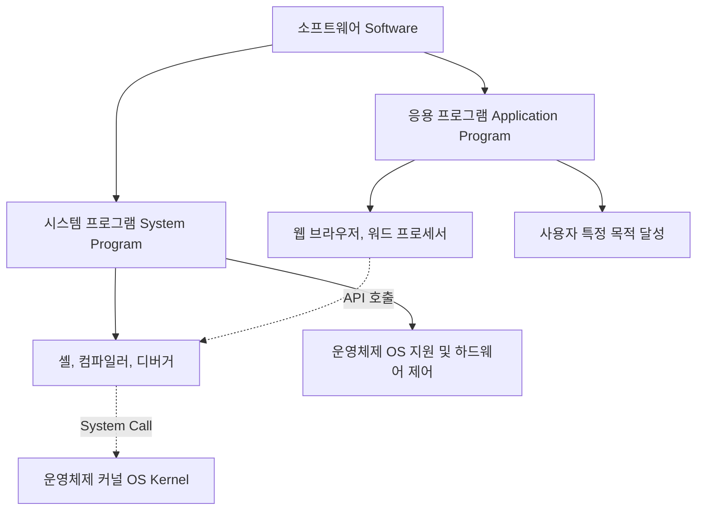

+++
title = "시스템 프로그램과 응용 프로그램의 차이"
date = "2026-03-14"
weight = 671
+++

> **💡 Insight**
> - 시스템 프로그램(System Program)은 운영체제(OS: Operating System)의 기능을 보조하고 하드웨어와 응용 프로그램 간의 중간 다리 역할을 수행합니다.
> - 응용 프로그램(Application Program)은 최종 사용자(End-User)가 특정 목적(문서 작성, 웹 서핑 등)을 달성하기 위해 사용하는 소프트웨어(SW: Software)입니다.
> - 이 두 계층의 분리는 시스템 안정성, 보안, 그리고 자원 관리의 효율성을 극대화하는 현대 컴퓨팅 아키텍처(Computing Architecture)의 핵심입니다.

### Ⅰ. 시스템 프로그램과 응용 프로그램의 본질적 차이
시스템 프로그램과 응용 프로그램은 실행 목적, 권한, 그리고 하드웨어(HW: Hardware) 접근 수준에서 명확한 차이를 보입니다. 시스템 프로그램은 운영체제(OS: Operating System)와 함께 번들로 제공되거나 시스템 관리를 위해 설치되며, 커널(Kernel)과 밀접하게 상호작용합니다. 반면, 응용 프로그램은 사용자 인터페이스(UI: User Interface)를 통해 특정 작업을 수행하며 시스템 자원에 직접 접근할 수 없고, 시스템 콜(System Call)을 통해야만 운영체제의 서비스를 받을 수 있습니다. 이러한 계층적 분리(Hierarchical Separation)는 사용자 모드(User Mode)와 커널 모드(Kernel Mode)의 이중 동작 구조(Dual-Mode Operation)를 가능하게 합니다.

> **📢 섹션 요약 비유:** 시스템 프로그램이 무대 뒤에서 조명과 음향을 조절하는 '스태프'라면, 응용 프로그램은 관객을 위해 무대 위에서 공연하는 '배우'입니다.

### Ⅱ. 구조적 계층 및 상호작용 메커니즘
시스템 프로그램과 응용 프로그램은 하드웨어 위에서 계층을 이루어 작동합니다. 

```text
+---------------------------------------------------+
|               End-User (최종 사용자)              |
+---------------------------------------------------+
|     Application Programs (응용 프로그램: 웹 브라우저, 워드 등)   |
+---------------------------------------------------+
|       System Programs (시스템 프로그램: 셸, 컴파일러, 디버거 등) |
+---------------------------------------------------+
|       Operating System Kernel (운영체제 커널)     |
|   (프로세스 관리, 메모리 관리, 파일 시스템, I/O 제어) |
+---------------------------------------------------+
|               Hardware (하드웨어: CPU, RAM, Disk)             |
+---------------------------------------------------+
```
응용 프로그램은 응용 프로그래밍 인터페이스(API: Application Programming Interface)를 호출하고, 이는 다시 시스템 프로그램(예: 표준 라이브러리)을 거쳐 시스템 콜(System Call)로 변환되어 커널에 전달됩니다. 이 과정에서 컨텍스트 스위칭(Context Switching)과 모드 전환(Mode Switch)이 발생하여 시스템 자원을 안전하게 보호합니다.

> **📢 섹션 요약 비유:** 회사의 결재 시스템과 같습니다. 평사원(응용 프로그램)이 직접 금고(하드웨어)를 열 수 없고, 중간 관리자(시스템 프로그램)를 통해 결재(시스템 콜)를 올려야만 금고지기(커널)가 돈을 내어주는 구조입니다.

### Ⅲ. 핵심 구성 요소 및 기능적 분류
시스템 프로그램은 크게 파일 관리, 상태 정보 제공, 파일 수정, 프로그래밍 언어 지원, 프로그램 적재 및 실행, 통신 등으로 분류됩니다. 대표적으로 명령어 해석기인 셸(Shell), 소스 코드를 기계어로 변환하는 컴파일러(Compiler: Compiler), 링커(Linker), 로더(Loader) 등이 있습니다. 반면, 응용 프로그램은 워드 프로세서(Word Processor), 데이터베이스 관리 시스템(DBMS: Database Management System), 웹 브라우저(Web Browser) 등 사용자의 구체적인 요구를 충족시키는 데 초점을 맞춥니다. 이들은 시스템 프로그램이 제공하는 인프라를 바탕으로 동작하므로 이식성(Portability)이 높습니다.

> **📢 섹션 요약 비유:** 시스템 프로그램은 도로, 신호등, 주유소 같은 '인프라'이고, 응용 프로그램은 그 위를 달리는 승용차, 버스, 트럭과 같은 '차량'입니다.

### Ⅳ. 자원 할당과 성능 최적화 관점
시스템 프로그램은 백그라운드 프로세스(Background Process) 또는 데몬(Daemon) 형태로 실행되는 경우가 많아 자원 소모를 최소화하도록 최적화(Optimization)되어야 합니다. 응용 프로그램은 사용자 경험(UX: User Experience)을 위해 빠른 응답 시간(Response Time)과 높은 처리량(Throughput)을 요구하며, 가상 메모리(VM: Virtual Memory)와 같은 커널의 자원 관리 기술에 의존합니다. 시스템 모니터링 프로그램은 CPU 사용률, 메모리 누수(Memory Leak) 등을 추적하여 응용 프로그램이 시스템 전체의 성능을 저하시키지 않도록 통제합니다.

> **📢 섹션 요약 비유:** 시스템 프로그램은 건물 전체의 전력과 배관 효율을 최적화하는 '건물 관리 시스템'이며, 응용 프로그램은 전기를 소모하여 방을 밝히는 '가전제품'입니다.

### Ⅴ. 결론 및 미래 동향
클라우드 컴퓨팅(Cloud Computing)과 컨테이너(Container) 기술의 발전으로 시스템 프로그램과 응용 프로그램의 경계가 재정의되고 있습니다. 도커(Docker)와 같은 기술은 응용 프로그램과 그에 필요한 시스템 프로그램 라이브러리를 하나의 패키지로 묶어 배포(Deployment)를 단순화합니다. 또한, 마이크로서비스 아키텍처(MSA: Microservices Architecture) 환경에서는 응용 프로그램들이 네트워크(Network)를 통해 분산 시스템(Distributed System)의 형태로 동작하며, 이를 조율하는 시스템 프로그램(예: Kubernetes)의 역할이 더욱 중요해지고 있습니다.

> **📢 섹션 요약 비유:** 과거에는 식재료(시스템)와 요리(응용)가 엄격히 분리된 주방이었다면, 미래는 밀키트(컨테이너)처럼 요리에 필요한 재료와 도구가 하나로 포장되어 어디서든 쉽게 요리할 수 있는 환경으로 변하고 있습니다.

---
### 💡 Knowledge Graph


### 👧 Child Analogy
컴퓨터를 커다란 장난감 공장이라고 상상해봐! '시스템 프로그램'은 공장이 잘 돌아가도록 청소도 하고, 전기도 켜주고, 기계 기름칠도 해주는 공장 관리인 아저씨들이야. 반면에 '응용 프로그램'은 네가 가지고 노는 멋진 장난감 로봇이나 인형이지. 관리인 아저씨들이 공장을 튼튼하게 지켜주기 때문에 장난감이 고장 나지 않고 재밌게 놀 수 있는 거란다!