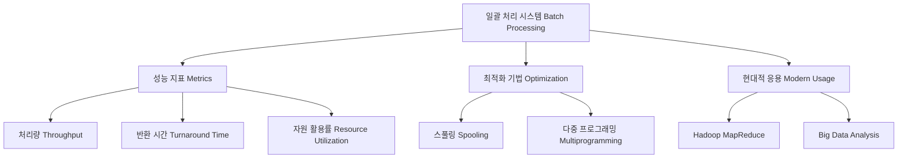

+++
title = "일괄 처리 시스템 (Batch Processing System) 성능 지표"
date = "2026-03-14"
weight = 672
+++

> **💡 Insight**
> - 일괄 처리 시스템(Batch Processing System)은 사용자의 상호작용 없이 다수의 작업(Job)을 모아 순차적으로 처리하는 초창기 컴퓨터 운영 방식입니다.
> - 주요 성능 지표(Performance Metrics)로는 처리량(Throughput), 반환 시간(Turnaround Time), 그리고 자원 활용률(Resource Utilization)이 있습니다.
> - 현대에는 대규모 데이터 분석(Big Data Analysis)이나 정산 작업 등 백그라운드(Background)에서 대량의 데이터를 효율적으로 처리할 때 여전히 핵심적으로 사용됩니다.

### Ⅰ. 일괄 처리 시스템의 개요와 중요성
일괄 처리 시스템(Batch Processing System)은 데이터나 작업을 일정량 또는 일정 기간 동안 모아 두었다가 한 번에 처리하는 방식입니다. 초기 메인프레임(Mainframe) 시대에 천공 카드(Punched Card)를 읽어 들여 순차적으로 실행하던 방식에서 유래했습니다. 이 시스템의 가장 큰 특징은 작업 실행 중 사용자 개입(User Interaction)이 없다는 점입니다. 시스템은 작업 제어 언어(JCL: Job Control Language)를 통해 작업의 요구사항을 파악하고 실행을 스케줄링(Scheduling)합니다. 현대의 대용량 데이터베이스 백업(Database Backup)이나 급여 계산 시스템 등이 이에 해당합니다.

> **📢 섹션 요약 비유:** 더러운 옷이 생길 때마다 한 벌씩 세탁기를 돌리는 대신, 빨랫바구니에 모아두었다가 주말에 한 번에 세탁기를 돌리는 것과 같습니다.

### Ⅱ. 시스템 아키텍처 및 처리 흐름도
일괄 처리 시스템은 작업을 큐(Queue)에 적재하고 스풀링(Spooling: Simultaneous Peripheral Operations On-Line)을 통해 입출력(I/O: Input/Output) 병목현상을 완화합니다.

```text
+----------------+      +------------------+      +-------------------+
|   Job Pool     | ---> |  Batch Monitor   | ---> |  CPU / Processing |
| (작업 대기열)  |      |  (일괄 모니터)   |      |   (중앙처리장치)  |
+----------------+      +------------------+      +-------------------+
        ^                        |                         |
        |                        v                         v
+-------+--------+      +------------------+      +-------------------+
|  User Submits  |      |   I/O Devices    |      | Output / Reports  |
| (사용자 제출)  |      | (입출력 디바이스)|      | (결과물 출력)     |
+----------------+      +------------------+      +-------------------+
```
사용자가 작업을 제출하면 작업 풀(Job Pool)에 저장됩니다. 일괄 모니터는 사용 가능한 자원(Resource)과 스케줄링 알고리즘(Scheduling Algorithm)에 따라 다음 작업을 선택하여 중앙처리장치(CPU: Central Processing Unit)에 할당합니다. 이 과정에서 입출력 작업은 디스크(Disk)를 버퍼(Buffer)로 사용하는 스풀링을 통해 CPU 유휴 시간(Idle Time)을 최소화합니다.

> **📢 섹션 요약 비유:** 공장의 컨베이어 벨트입니다. 재료가 한 쪽에 쌓여 있으면, 자동 제어기(모니터)가 기계(CPU)의 상태를 보고 순서대로 재료를 밀어 넣어 완제품(결과)을 뽑아내는 구조입니다.

### Ⅲ. 핵심 성능 지표 (Performance Metrics)
일괄 처리 시스템의 효율성을 평가하는 주요 지표는 다음과 같습니다.
1. **처리량(Throughput):** 단위 시간당 완료된 작업의 수입니다. 시스템의 생산성을 나타내는 가장 중요한 지표입니다.
2. **반환 시간(Turnaround Time):** 작업이 시스템에 제출된 시점부터 결과가 출력될 때까지 걸린 총 시간입니다. (대기 시간 + 실행 시간 + 입출력 시간)
3. **자원 활용률(Resource Utilization):** CPU, 메모리(Memory), 디스크 등의 시스템 자원이 유휴 상태(Idle) 없이 얼마나 활발하게 사용되는지를 나타내는 비율입니다. 일괄 처리는 이 활용률을 극대화하는 데 초점을 맞춥니다.

> **📢 섹션 요약 비유:** 식당에 비유하면, '처리량'은 하루에 팔린 햄버거 개수이고, '반환 시간'은 손님이 주문하고 햄버거를 받을 때까지 걸린 시간, '자원 활용률'은 주방장과 오븐이 쉬지 않고 일한 비율입니다.

### Ⅳ. 다중 프로그래밍 도입을 통한 성능 최적화
초기 일괄 처리 시스템(단일 프로그래밍 환경)은 입출력(I/O) 대기 시간 동안 CPU가 유휴(Idle) 상태에 빠지는 문제(I/O Bound)가 있었습니다. 이를 해결하기 위해 메모리에 여러 작업을 동시에 적재하는 다중 프로그래밍(Multiprogramming) 기법이 도입되었습니다. 현재 실행 중인 작업이 I/O를 요청하면, 운영체제(OS: Operating System)는 컨텍스트 스위칭(Context Switching)을 수행하여 대기 중인 다른 작업에 CPU를 할당합니다. 이로 인해 CPU 활용률(CPU Utilization)과 시스템 처리량(Throughput)이 비약적으로 향상되었습니다.

> **📢 섹션 요약 비유:** 주방장이 오븐에 빵이 구워지는(I/O 작업) 10분 동안 멍하니 기다리지 않고, 그 시간에 샐러드를 만들고(다른 작업의 CPU 사용) 설거지를 하는 것과 같이 시간을 알뜰하게 쓰는 방법입니다.

### Ⅴ. 결론 및 빅데이터 환경에서의 진화
과거 메인프레임의 전유물이었던 일괄 처리 시스템은 분산 컴퓨팅(Distributed Computing) 환경에서 하둡(Hadoop)의 맵리듀스(MapReduce)나 아파치 스파크(Apache Spark)와 같은 대규모 데이터 처리 프레임워크로 진화했습니다. 현대의 일괄 처리는 수천 대의 노드(Node)에서 작업을 병렬(Parallel)로 처리하여 장애 허용(Fault Tolerance)과 수평적 확장성(Horizontal Scalability)을 제공하며, 스트리밍(Streaming) 처리 시스템과 결합된 람다 아키텍처(Lambda Architecture)의 핵심 요소로 자리 잡고 있습니다.

> **📢 섹션 요약 비유:** 옛날에는 한 명의 거인(메인프레임)이 산더미 같은 일거리를 순서대로 처리했다면, 지금은 수천 명의 일꾼(분산 서버)이 일을 나눠서 동시에 끝내버리는 스마트한 작업장으로 발전했습니다.

---
### 💡 Knowledge Graph


### 👧 Child Analogy
숙제를 예로 들어볼까? '일괄 처리 시스템'은 학교에서 돌아오자마자 놀지 않고, 수학, 국어, 영어 숙제를 책상 위에 다 쌓아놓고 한 번에 끝낼 때까지 엉덩이를 떼지 않는 거야! 중간에 딴짓을 안 하니까 숙제를 끝내는 속도(처리량)는 엄청 빠르겠지? 하지만 엄마가 중간에 "간식 먹을래?" 하고 물어봐도 숙제가 다 끝날 때까지 대답을 안 하는(상호작용 없음) 무서운 집중력이란다!