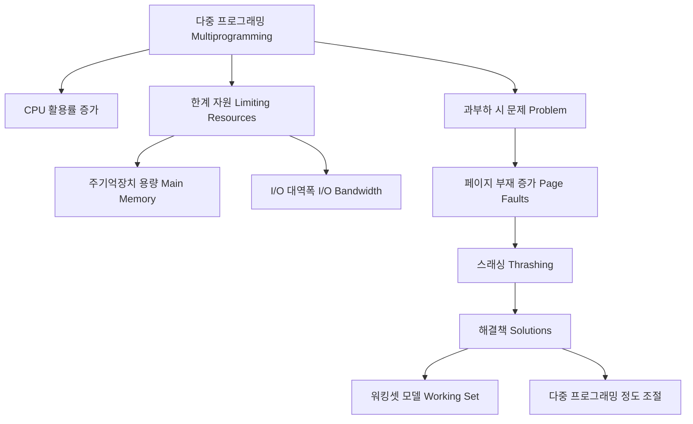

+++
title = "다중 프로그래밍 (Multiprogramming) 한계 자원"
date = "2026-03-14"
weight = 673
+++

> **💡 Insight**
> - 다중 프로그래밍(Multiprogramming)은 메모리에 여러 프로세스(Process)를 동시에 적재하여 CPU 유휴 시간을 최소화하고 자원 활용률을 높이는 기법입니다.
> - 시스템의 성능을 극대화하지만, 주기억장치(Main Memory)의 용량과 입출력(I/O: Input/Output) 대역폭이 한계 자원(Limiting Resource)으로 작용합니다.
> - 다중 프로그래밍의 정도(Degree of Multiprogramming)가 적정 수준을 넘어서면 스래싱(Thrashing)이 발생하여 오히려 성능이 급격히 저하됩니다.

### Ⅰ. 다중 프로그래밍의 목적과 기본 원리
다중 프로그래밍(Multiprogramming) 시스템은 CPU의 처리 속도와 입출력 장치(I/O Device)의 속도 차이에서 발생하는 비효율성을 극복하기 위해 등장했습니다. 프로그램 실행 중 디스크 읽기/쓰기와 같은 I/O 이벤트가 발생하면, CPU는 대기(Idle) 상태가 됩니다. 다중 프로그래밍은 이 유휴 시간에 메모리에 적재된 다른 프로세스(Process)에게 CPU를 할당(Dispatch)합니다. 이를 통해 중앙처리장치(CPU: Central Processing Unit)의 활용률(Utilization)과 시스템의 총 처리량(Throughput)을 비약적으로 증가시키는 것이 핵심 원리입니다.

> **📢 섹션 요약 비유:** 요리사 1명이 가스레인지 1구만 쓰면서 라면이 다 끓을 때까지 기다리는 것이 아니라, 가스레인지 4구를 켜놓고 라면 물이 끓는 동안 옆에서 볶음밥도 만들고 계란프라이도 부치는 멀티태스킹 주방과 같습니다.

### Ⅱ. 메모리 적재와 CPU 스위칭 아키텍처
다중 프로그래밍 환경에서는 여러 프로그램의 코드와 데이터가 동시에 메모리 공간을 분할하여 차지합니다.

```text
+-------------------------------------------------------+
|  Operating System (운영체제) - 커널 영역                |
+-------------------------------------------------------+
|  Process A (실행 중 - CPU 사용)                         |
+-------------------------------------------------------+
|  Process B (대기 중 - I/O 대기 상태)                    |
+-------------------------------------------------------+
|  Process C (준비 큐 - CPU 할당 대기 상태)               |
+-------------------------------------------------------+
|  Free Space (여유 메모리 공간)                          |
+-------------------------------------------------------+
    [ CPU ] <--- 컨텍스트 스위칭 ---> [ I/O Controller ]
```
운영체제(OS: Operating System)의 스케줄러(Scheduler)는 준비 큐(Ready Queue)를 관리하며, 프로세스 A가 I/O 요청으로 블록(Block)되면 상태를 저장(Context Save)하고 프로세스 C를 CPU에 적재(Context Restore)합니다. 이 아키텍처는 필수적으로 메모리 보호(Memory Protection) 기법과 메모리 관리 장치(MMU: Memory Management Unit)의 하드웨어 지원을 요구합니다.

> **📢 섹션 요약 비유:** 큰 회의실(메모리)에 여러 팀(프로세스)이 각자의 책상을 차지하고 앉아 있습니다. 사장님(CPU)은 한 번에 한 팀과 이야기하지만, 대화하던 팀이 자료를 가지러 간 사이(I/O 요청), 바로 옆 팀과 대화를 이어나가 시간을 아끼는 구조입니다.

### Ⅲ. 다중 프로그래밍을 제약하는 한계 자원
다중 프로그래밍의 효율성은 무한정 증가하지 않으며, 특정 임계점(Threshold)에 도달하면 물리적 한계에 부딪힙니다. 가장 큰 한계 자원은 주기억장치(RAM: Random Access Memory)의 용량입니다. 한정된 메모리에 너무 많은 프로세스를 적재하면 각 프로세스에 할당되는 프레임(Frame) 수가 부족해져 페이지 부재(Page Fault)가 빈번히 발생합니다. 또한 입출력 대역폭(I/O Bandwidth)도 병목(Bottleneck)이 됩니다. 다수의 프로세스가 동시에 I/O를 요청하면 디스크 큐(Disk Queue)가 길어지고 응답 시간이 기하급수적으로 늘어납니다.

> **📢 섹션 요약 비유:** 고속도로(I/O 대역폭)에 톨게이트(메모리)가 좁은 상황입니다. 차(프로세스)를 무작정 많이 고속도로에 진입시키면 차들이 서로 엉켜서 꼼짝도 못하는 교통체증이 발생합니다.

### Ⅳ. 스래싱(Thrashing) 현상과 워킹셋 모델
다중 프로그래밍의 정도(Degree of Multiprogramming)가 과도하게 높아지면, 시스템은 유효한 작업을 처리하는 시간보다 메모리와 디스크 간의 페이지 교체(Page Replacement) 작업(Swap In/Out)에 대부분의 CPU 시간을 소모하게 됩니다. 이처럼 시스템 성능이 급격히 붕괴하는 현상을 스래싱(Thrashing)이라고 합니다. 이를 방지하기 위해 운영체제는 프로세스가 자주 참조하는 페이지들의 집합인 워킹셋(Working Set)을 추적하고, 시스템에 적재된 프로세스들의 워킹셋 총합이 물리 메모리 크기를 초과하지 않도록 적재되는 프로세스의 수를 조절(Admission Control)합니다.

> **📢 섹션 요약 비유:** 학생이 여러 과목을 동시에 공부하겠다고 책상에 책 10권을 펼쳐놨지만, 책상이 너무 좁아 이 책 저 책을 바닥에서 꺼내고 넣느라 정작 글씨는 한 줄도 못 읽고 시간만 낭비하는 꼴입니다.

### Ⅴ. 결론: 가상 메모리와 다중 코어 시대로의 확장
다중 프로그래밍의 한계를 극복하기 위해 가상 메모리(Virtual Memory) 기술이 도입되어 물리 메모리의 한계를 논리적으로 확장했습니다. 나아가 현대 시스템에서는 단일 코어의 시분할(Time-sharing)을 넘어선 다중 처리기(Multiprocessor) 및 다중 코어(Multi-core) 아키텍처가 보편화되었습니다. 이제 다중 프로그래밍은 단일 CPU의 활용을 넘어 복수의 코어에 스레드(Thread)를 병렬(Parallel)로 스케줄링하여 진정한 동시성(Concurrency)과 병렬성(Parallelism)을 구현하는 기술적 토대로 작용하고 있습니다.

> **📢 섹션 요약 비유:** 예전에는 좁은 책상을 넓게 쓰는 마술(가상 메모리)을 부렸다면, 이제는 아예 책상 여러 개와 뇌가 여러 개인 요리사(멀티 코어)들을 고용해서 진짜로 동시에 여러 요리를 완성해내는 시대가 되었습니다.

---
### 💡 Knowledge Graph


### 👧 Child Analogy
저글링을 하는 피에로 아저씨를 생각해봐. 아저씨(CPU)는 공(프로그램)을 3개 던질 때(다중 프로그래밍)는 아주 멋지게 계속 움직이면서 공을 떨어뜨리지 않아. 하지만 욕심을 내서 공을 10개, 20개로 늘리면 어떻게 될까? 아저씨 손(메모리)은 두 개뿐이라서(한계 자원), 결국 공을 잡지도 던지지도 못하고 바닥에 다 떨어뜨리며 쩔쩔매게 되겠지? 이게 바로 컴퓨터가 욕심내다 멈춰버리는 '스래싱'이라는 현상이란다!