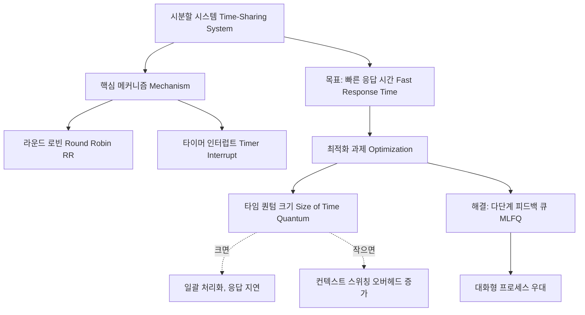

+++
title = "시분할 시스템 응답 시간 최적화"
date = "2026-03-14"
weight = 674
+++

> **💡 Insight**
> - 시분할 시스템(Time-sharing System)은 다수의 사용자가 하나의 컴퓨터 자원을 짧은 시간 조각(Time Quantum)으로 나누어 번갈아 사용함으로써 마치 혼자 시스템을 독점하는 듯한 착각을 제공합니다.
> - 이 시스템의 핵심 성능 목표는 사용자 경험(UX)과 직결되는 빠른 응답 시간(Response Time)의 보장 및 최적화입니다.
> - 응답 시간 최적화를 위해서는 스케줄링 알고리즘(Scheduling Algorithm), 컨텍스트 스위칭(Context Switching) 오버헤드 최소화, 그리고 효율적인 인터럽트(Interrupt) 처리가 필수적입니다.

### Ⅰ. 시분할 시스템과 상호작용성(Interactivity)의 본질
시분할 시스템(Time-sharing System) 또는 대화형 시스템(Interactive System)은 일괄 처리 시스템(Batch Processing)의 긴 대기 시간이라는 단점을 극복하기 위해 등장했습니다. 여러 사용자가 단말기(Terminal)를 통해 시스템에 접속하여 동시에 명령을 입력하고 결과를 즉시 확인하는 환경을 제공합니다. 이를 위해 중앙처리장치(CPU: Central Processing Unit)는 각 사용자 또는 프로세스(Process)에게 타임 슬라이스(Time Slice) 또는 타임 퀀텀(Time Quantum)이라는 짧은 실행 시간을 할당합니다. 사용자 명령에 대한 시스템의 반응 속도인 응답 시간(Response Time)을 일관되고 짧게 유지하는 것이 이 시스템의 가장 결정적인 설계 목표입니다.

> **📢 섹션 요약 비유:** 체스 고수가 여러 명의 초보자와 동시에 다면기(Simultaneous Exhibition)를 두는 것과 같습니다. 고수는 한 사람당 몇 초씩만 고민하고 바로 다음 사람으로 넘어가기 때문에, 초보자들은 고수가 자신하고만 체스를 두고 있다고 느낍니다.

### Ⅱ. 라운드 로빈 스케줄링과 시분할 아키텍처
시분할 시스템의 근간은 타이머 인터럽트(Timer Interrupt) 기반의 라운드 로빈(RR: Round Robin) 스케줄링 구조입니다.

```text
       +--- Time Quantum Expired (타임 퀀텀 만료: 타이머 인터럽트) ---+
       |                                                            |
       v                                                            |
+--------------+    Dispatch     +-----------------+     +-----------------+
| Ready Queue  | --------------> |  CPU Execution  | --> | Process Blocked | (I/O Request)
| (준비 대기열)|                 |  (CPU 실행 중)  |     | (입출력 대기)   |
+--------------+                 +-----------------+     +-----------------+
       ^                                                            |
       |                                                            |
       +--------- I/O Completion (입출력 완료: 하드웨어 인터럽트) --------+
```
운영체제(OS: Operating System)는 주기적으로 타이머 하드웨어로부터 인터럽트를 받아 현재 실행 중인 프로세스의 상태를 저장하고, 준비 큐의 다음 프로세스에게 CPU를 할당(Context Switching)합니다. 이 빠른 순환 구조가 모든 프로세스에게 공평한 기회와 빠른 응답성을 보장합니다.

> **📢 섹션 요약 비유:** 놀이공원의 회전목마입니다. 줄 서 있는 아이들(프로세스)을 한 번에 3분씩(타임 퀀텀)만 태워주고 다음 아이로 교대시킵니다. 모두가 조금씩 자주 탈 수 있어 불만이 적어집니다.

### Ⅲ. 응답 시간 최적화의 핵심: 타임 퀀텀(Time Quantum) 크기 결정
응답 시간(Response Time)을 최적화하는 가장 중요한 매개변수(Parameter)는 타임 퀀텀의 크기입니다. 타임 퀀텀이 너무 크면 먼저 큐에 들어온 프로세스가 오랫동안 CPU를 독점하게 되어 다른 사용자들의 대기 시간이 길어지고, 시스템은 일괄 처리(Batch) 방식으로 퇴화합니다. 반대로 타임 퀀텀이 너무 작으면 응답 시간은 짧아지는 것처럼 보이지만, 빈번한 컨텍스트 스위칭(Context Switching) 오버헤드(Overhead)로 인해 실제 프로세스가 유효한 작업을 수행하는 시간보다 교체에 드는 시간이 더 많아져 전체 시스템 성능이 저하됩니다. 따라서 통계적으로 전체 프로세스의 80%가 하나의 타임 퀀텀 내에 CPU 버스트(CPU Burst)를 완료할 수 있는 최적의 크기를 설정해야 합니다.

> **📢 섹션 요약 비유:** 발표 수업에서 선생님이 학생 1명당 발표 시간을 길게 주면(큰 퀀텀) 뒷번호 학생이 하루 종일 기다려야 하고, 10초씩만 주면(작은 퀀텀) 무대 올라갔다 내려오는 시간만 걸리고 정작 발표는 못 하는 것과 같은 딜레마입니다.

### Ⅳ. 다단계 피드백 큐(MLFQ)를 통한 고도화된 스케줄링
순수한 라운드 로빈 스케줄링의 한계를 극복하고 응답성을 극대화하기 위해 현대 운영체제는 다단계 피드백 큐(MLFQ: Multi-Level Feedback Queue)를 사용합니다. I/O 바운드(I/O Bound) 프로세스, 즉 사용자의 키보드 입력 등 대화형(Interactive) 요청이 잦은 프로세스에는 높은 우선순위(Priority)와 짧은 퀀텀을 부여하여 즉각적인 응답을 보장합니다. 반면 복잡한 연산을 수행하는 CPU 바운드(CPU Bound) 프로세스는 낮은 우선순위 큐로 강등시키되 긴 퀀텀을 부여하여 컨텍스트 스위칭 비용을 줄입니다. 기아 상태(Starvation)를 방지하기 위해 오래 대기한 프로세스의 우선순위를 높여주는 에이징(Aging) 기법도 함께 적용됩니다.

> **📢 섹션 요약 비유:** 병원의 응급실 분류 체계(Triage)입니다. 찰과상으로 온 환자나 처방전만 필요한 사람(대화형 작업)은 우선순위가 높은 창구에서 즉시 처리해주고, 정밀 검사가 필요한 중증 환자(CPU 집중 작업)는 안쪽 병동으로 모셔 장시간 꼼꼼히 진료하는 스마트한 시스템입니다.

### Ⅴ. 결론: 실시간 시스템과의 차이 및 현대적 의의
시분할 시스템은 '수 밀리초 이내'라는 통계적으로 만족스러운(Soft) 응답 시간을 목표로 할 뿐, 실시간 운영체제(RTOS: Real-Time Operating System)처럼 절대적인 마감 시간(Hard Deadline)을 보장하지는 않습니다. 하지만 이 시스템은 클라우드 환경(Cloud Environment)의 가상 머신(VM: Virtual Machine) 스케줄링이나 서버리스 컴퓨팅(Serverless Computing) 자원 할당의 기초 개념으로 여전히 사용되고 있으며, 사용자의 작업 몰입도와 생산성을 결정짓는 핵심적인 운영체제 기술입니다.

> **📢 섹션 요약 비유:** 시분할 시스템은 주문 후 5분 안에 피자가 나온다고 '약속'은 못 하지만 평균적으로 5분 안에 주려고 '최선을 다하는' 피자 가게이고, 실시간 시스템은 1초라도 늦으면 환자의 목숨이 위험한 심장 제어기와 같은 절대적 '보증'의 영역입니다.

---
### 💡 Knowledge Graph


### 👧 Child Analogy
엄마가 피자 한 판을 가져오셨어. 그런데 자식이 4명이나 있네! 한 명씩 한 판을 다 먹을 때까지 기다리면(일괄 처리) 마지막 동생은 배가 고파서 울고 말 거야. 그래서 엄마는 피자를 한 조각씩(타임 퀀텀) 4명에게 돌아가면서 나눠주셔(시분할 시스템). 그러면 아이들은 모두 피자를 입에 물고 있으니까 "금방 또 내 차례가 오네!" 하고 기다리는 시간(응답 시간)을 짧게 느끼면서 신나게 먹을 수 있는 거란다!