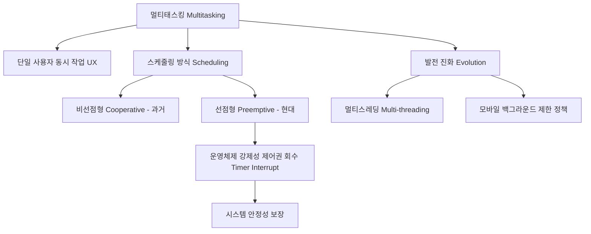

+++
title = "멀티태스킹 (Multitasking) 용어"
date = "2026-03-14"
weight = 675
+++

> **💡 Insight**
> - 멀티태스킹(Multitasking)은 단일 사용자가 컴퓨터 시스템에서 여러 작업(Task)을 동시에 수행하는 것처럼 보이게 하는 운영체제(OS: Operating System)의 핵심 기능입니다.
> - 시분할(Time-sharing)과 다중 프로그래밍(Multiprogramming)의 개념이 개인용 컴퓨터(PC: Personal Computer) 환경에 맞춰 진화한 형태를 지칭합니다.
> - 현대 멀티태스킹은 선점형(Preemptive) 스케줄링을 통해 악의적이거나 결함이 있는 애플리케이션으로부터 시스템 전체의 안정성을 보호합니다.

### Ⅰ. 멀티태스킹의 정의와 다중 프로그래밍과의 관계
멀티태스킹(Multitasking)은 하나 이상의 태스크(Task: 프로세스 또는 스레드)가 중앙처리장치(CPU: Central Processing Unit)의 시간을 분할하여 논리적으로 동시에(Concurrently) 실행되는 환경을 말합니다. 엄밀히 말해 '다중 프로그래밍(Multiprogramming)'은 CPU 활용률을 높이기 위해 메모리에 여러 프로그램을 적재하는 아키텍처 자체를 뜻하며, '시분할(Time-sharing)'은 다수의 사용자를 지원하는 것에 초점이 맞춰져 있습니다. 반면 '멀티태스킹'은 주로 단일 사용자 환경(Single-user Environment)의 PC나 스마트폰에서 음악을 들으며 웹 서핑을 하고 문서를 작성하는 사용자 경험(UX: User Experience) 측면의 동시성을 강조하는 용어로 정착되었습니다.

> **📢 섹션 요약 비유:** 다중 프로그래밍이 '가스레인지 여러 구를 쓰는 주방 구조'라면, 멀티태스킹은 한 명의 요리사가 음악을 들으며 고기도 굽고 수프도 젓는 '동시다발적인 요리 행위' 자체를 말합니다.

### Ⅱ. 멀티태스킹의 구조 및 메모리 레이아웃
멀티태스킹을 지원하는 운영체제는 메모리 상에 여러 프로세스의 독립된 공간(Virtual Address Space)을 유지하고, 빠르게 문맥 교환(Context Switching)을 수행합니다.

```text
+-------------------------------------------------------+
|  Operating System Scheduler (OS 스케줄러 - 타이머 의존) |
+-------------------------------------------------------+
|  Task 1 (웹 브라우저) | Task 2 (MP3 플레이어) | Task 3 (워드)  |
|  [Code][Data][Stack]  | [Code][Data][Stack]  | [Code][Data]  |
+-------------------------------------------------------+
      \                        |                       /
       \---- Context Switch ---+--- Context Switch ---/
                               v
                     +-------------------+
                     |        CPU        |
                     +-------------------+
```
각 태스크는 자신만의 프로그램 카운터(PC: Program Counter), 레지스터(Register) 상태, 스택(Stack)을 가지며 프로세스 제어 블록(PCB: Process Control Block)으로 관리됩니다. CPU는 1개지만 매우 빠른 속도로 Task 1, 2, 3을 번갈아 실행하여 물리적 병렬성(Parallelism)이 아닌 논리적 동시성(Concurrency)을 창출해 냅니다.

> **📢 섹션 요약 비유:** 여러 개의 다른 TV 채널을 0.01초 단위로 빠르게 돌려가며 보여주는 1대의 TV와 같습니다. 사람의 눈에는 화면이 겹쳐 보여 마치 여러 방송이 동시에 나오는 것처럼 착각하게 됩니다.

### Ⅲ. 비선점형(Cooperative) vs 선점형(Preemptive) 멀티태스킹
멀티태스킹의 역사적 발전 과정에서 CPU 제어권(Control)을 누가 갖느냐에 따라 패러다임이 전환되었습니다. 과거 Windows 3.1이나 초기 Mac OS에서 사용된 **비선점형(협력적, Cooperative) 멀티태스킹**은 실행 중인 애플리케이션이 자발적으로 `yield()`와 같은 시스템 콜을 호출해 CPU를 운영체제에 양보해야만 다른 프로그램이 실행될 수 있었습니다. 하나의 프로그램이 멈추면(무한 루프 등) 시스템 전체가 마비되는 치명적 단점이 있었습니다. 이를 극복한 현대의 **선점형(Preemptive) 멀티태스킹**은 하드웨어 타이머(Hardware Timer) 인터럽트를 이용해 운영체제가 강제로 애플리케이션의 CPU 제어권을 회수합니다. 이를 통해 시스템 안정성과 응답성이 획기적으로 향상되었습니다.

> **📢 섹션 요약 비유:** 비선점형은 마이크를 잡은 사람이 스스로 내려놓아야 다음 사람이 말할 수 있는 토론장이고(한 명이 고집부리면 행사 망침), 선점형은 사회자(OS)가 발언 시간이 지나면 마이크 전원을 강제로 끄고 다음 사람에게 넘기는 체계적인 토론장입니다.

### Ⅳ. 스레드(Thread) 단위 멀티태스킹으로의 진화
프로세스(Process) 기반의 멀티태스킹은 격리성이 높아 안전하지만, 문맥 교환 과정에서 메모리 맵(MMU)을 교체해야 하는 무거운 오버헤드(Overhead)를 동반합니다. 현대 애플리케이션은 이를 최적화하기 위해 하나의 프로세스 내에서 코드와 데이터 영역을 공유하면서 실행 흐름만 분리하는 스레드(Thread)를 활용한 멀티스레딩(Multi-threading)을 기본으로 채택합니다. 운영체제 스케줄러 또한 프로세스 단위가 아닌 커널 수준 스레드(Kernel-level Thread) 단위를 멀티태스킹의 기본 디스패치(Dispatch) 단위로 취급하여 처리 효율성을 극대화합니다.

> **📢 섹션 요약 비유:** 예전에는 집(프로세스)을 통째로 이사 다니며 일을 했다면, 지금은 한 집 안에서 방만 여러 개(스레드) 만들어 거실(메모리)을 같이 쓰면서 문만 열고 닫으며 재빠르게 일을 바꾸는 방식입니다.

### Ⅴ. 결론: 모바일 생태계와 멀티태스킹의 미래
멀티태스킹은 배터리 제약이 심한 모바일 운영체제(iOS, Android)에서 새로운 도전에 직면했습니다. 무제한적인 백그라운드 멀티태스킹은 배터리 방전과 발열을 초래하므로, 모바일 OS는 포그라운드(Foreground) 앱에 자원을 집중하고 백그라운드(Background) 앱의 CPU 실행을 엄격히 제한(Suspended)하거나 푸시 알림(Push Notification)과 같은 제한된 API만 허용하는 하이브리드(Hybrid) 멀티태스킹 정책을 사용합니다. 데스크톱에서는 이기종 컴퓨팅(Heterogeneous Computing, 예: big.LITTLE 아키텍처)과 결합하여 태스크의 부하 특성에 맞춰 전력 효율적으로 스케줄링하는 방향으로 고도화되고 있습니다.

> **📢 섹션 요약 비유:** 데스크톱 멀티태스킹이 전기가 철철 넘치는 뷔페에서 먹고 싶은 것을 다 꺼내놓는 파티라면, 모바일 멀티태스킹은 한정된 식량(배터리)을 아끼기 위해 안 먹는 음식은 냉장고(Suspend)에 바로바로 얼려버리는 생존 전략입니다.

---
### 💡 Knowledge Graph


### 👧 Child Analogy
게임하면서 음악도 듣고, 친구랑 메신저도 할 수 있게 해주는 마법이 바로 '멀티태스킹'이야. 컴퓨터 뇌(CPU)는 하나뿐인데 엄청나게 손이 빠른 요정이라서, 게임 0.01초 켜주고, 음악 0.01초 켜주고, 메신저 0.01초 켜주는 걸 눈 깜짝할 새에 반복하고 있는 거지. 그래서 너는 "우와, 컴퓨터가 동시에 3가지를 다 해주네!" 하고 즐겁게 느낄 수 있는 거란다.