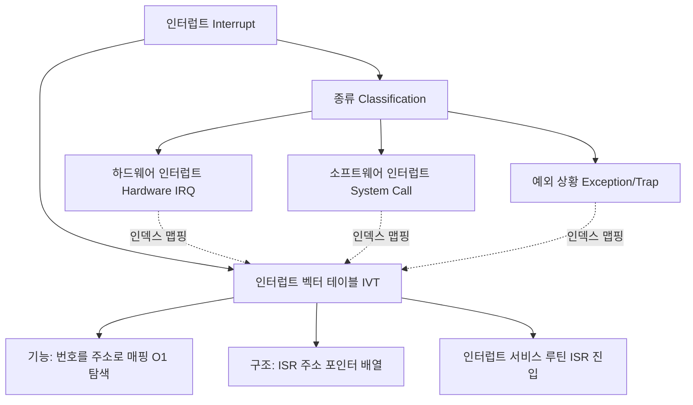

+++
title = "인터럽트 벡터 테이블 구조화"
date = "2026-03-14"
weight = 676
+++

> **💡 Insight**
> - 인터럽트 벡터 테이블(IVT: Interrupt Vector Table)은 운영체제(OS: Operating System)가 다양한 하드웨어 및 소프트웨어 인터럽트에 신속하고 정확하게 대응하기 위한 메모리 내의 핵심 데이터 구조입니다.
> - 인터럽트 번호(Interrupt Number)를 배열의 인덱스(Index)로 사용하여 해당 인터럽트를 처리할 인터럽트 서비스 루틴(ISR: Interrupt Service Routine)의 시작 메모리 주소를 매핑합니다.
> - 이 테이블 구조화는 분기(Branch) 탐색 시간을 $O(1)$로 단축시켜, 지연 시간(Latency)이 치명적인 하드웨어 장치 제어의 성능을 극대화합니다.

### Ⅰ. 인터럽트 메커니즘과 벡터 테이블의 필요성
컴퓨터 시스템에서 CPU는 프로그램을 순차적으로 실행하다가 마우스 클릭, 패킷 수신, 타이머 완료, 0으로 나누기 오류(Divide by Zero) 등 예외적이고 비동기적인 이벤트(Event)가 발생하면 즉각적인 주의가 필요합니다. 이를 인터럽트(Interrupt)라고 합니다. 수십, 수백 가지의 인터럽트가 발생할 수 있는데, CPU가 인터럽트 종류를 파악하기 위해 수많은 `if-else` 분기문을 실행한다면(폴링 방식) 처리 지연(Overhead)이 심각해집니다. 이 문제를 해결하기 위해 도입된 것이 인터럽트 벡터 테이블(IVT)로, 인터럽트 고유 번호를 인덱스로 삼아 처리 코드(ISR)의 진입점 주소를 포인터(Pointer) 배열 형태로 구조화하여 즉각적인 점프(Jump)를 가능하게 합니다.

> **📢 섹션 요약 비유:** 수백 개의 부서가 있는 큰 병원에서 환자(인터럽트)가 들어왔을 때, 접수원이 일일이 병동을 돌아다니며 의사를 찾는 것이 아니라, '진료과목 번호안내도(IVT)'를 보고 곧바로 7번 방(ISR 주소)으로 직행하도록 안내하는 시스템입니다.

### Ⅱ. 인터럽트 벡터 테이블의 아키텍처 및 동작 구조
IVT는 일반적으로 메인 메모리(RAM)의 가장 낮은 주소 영역이나 커널 영역의 고정된 위치에 적재됩니다. (x86 아키텍처의 경우 IDT: Interrupt Descriptor Table로 불립니다)

```text
  [Interrupt Request (IRQ #3 발생)]
           |
           v (Hardware / Interrupt Controller)
+-------------------------+
| Interrupt Vector Table  | (메모리 주소 공간)
| Index (인터럽트 번호)   |
+------+------------------+
| #0   |  Divide Error    | ----> [ISR 주소: 0x80010]
+------+------------------+
| #1   |  Debug Exception | ----> [ISR 주소: 0x80050]
+------+------------------+
| #2   |  NMI Interrupt   | ----> [ISR 주소: 0x800A0]
+------+------------------+
| #3   |  Keyboard        | ----> [ISR 주소: 0x801F4]  =======> Jump to 0x801F4
+------+------------------+                                      |
| ...  |  ...             |                                      v
+------+------------------+                         +-------------------------+
                                                    |  Keyboard ISR Code      |
                                                    |  (키보드 버퍼 읽기)     |
                                                    |  IRET (Return from Int) |
                                                    +-------------------------+
```
하드웨어 인터럽트 컨트롤러(PIC/APIC)가 인터럽트 번호를 CPU 버스(Bus)에 실어 보내면, CPU는 (IVT Base Address) + (Interrupt Number * Pointer Size) 연산을 통해 즉시 해당 ISR의 주소를 추출하고 프로그램 카운터(PC: Program Counter)를 변경하여 인터럽트 서비스 루틴을 실행합니다.

> **📢 섹션 요약 비유:** 아파트 우편함과 같습니다. 우체부가 '101동 305호'라는 호수(인터럽트 번호)만 알면, 건물을 다 뒤질 필요 없이 우편함 배열에서 정확히 305호 칸(ISR 주소)을 열어 편지를 넣을 수 있습니다.

### Ⅲ. IVT의 초기화와 커널 영역의 역할
인터럽트 벡터 테이블은 시스템 부팅(Booting) 과정에서 운영체제의 커널(Kernel)에 의해 초기화됩니다. 디바이스 드라이버(Device Driver)가 시스템에 로드될 때, 드라이버는 자신의 ISR 주소를 커널에 등록하고 커널은 이를 IVT의 적절한 슬롯(Slot)에 기록합니다. IVT는 사용자 프로세스(User Process)가 임의로 수정하여 악성 코드를 실행(Privilege Escalation)하는 것을 막기 위해 반드시 커널 모드(Kernel Mode)에서만 접근 및 수정이 가능하도록 메모리 보호(Memory Protection) 하드웨어(MMU)에 의해 엄격하게 통제됩니다. 

> **📢 섹션 요약 비유:** 관공서의 핵심 비상 연락망(IVT)은 시장님(커널)만 작성하고 수정할 수 있으며, 일반 시민(사용자 프로그램)은 연락망을 고쳐서 소방서 번호를 장난전화 번호로 바꾸지 못하도록 유리 상자에 잠겨 있는 것과 같습니다.

### Ⅳ. 예외(Exception), 하드웨어 인터럽트, 시스템 콜의 통합 관리
현대의 IVT(또는 IDT)는 단순한 하드웨어 신호(IRQ)뿐만 아니라 CPU가 내부적으로 발생시키는 예외(Exception: 페이지 부재, 불법 명령어 등)와 사용자 프로그램이 커널 서비스를 요청하는 소프트웨어 인터럽트(Software Interrupt: System Call)를 포괄적으로 관리합니다. 예를 들어 리눅스(Linux) x86 시스템에서는 사용자 프로그램이 `int 0x80` 명령을 실행하면, CPU는 IVT의 128번(0x80) 인덱스를 찾아가 '시스템 콜 처리기(System Call Handler)'로 진입합니다. 즉, IVT는 시스템 상태를 변화시키는 모든 동기적/비동기적 트랜지션(Transition)의 중앙 출입구 역할을 수행합니다.

> **📢 섹션 요약 비유:** 큰 빌딩의 1층 중앙 로비와 같습니다. 외부에서 택배 기사가 오든(하드웨어 인터럽트), 건물 내부에서 화재 경보가 울리든(예외), 직원이 사장님 면담을 신청하든(시스템 콜), 모두 중앙 로비 안내 데스크(IVT)를 거쳐야만 올바른 부서로 연결됩니다.

### Ⅴ. 결론: 동적 인터럽트 할당과 가상화(Virtualization) 환경
과거에는 하드웨어 장치마다 고정된 IRQ 번호와 IVT 슬롯이 할당되었으나, 플러그 앤 플레이(PnP)와 USB 같은 동적 장치의 증가로 인해 MSI(Message Signaled Interrupts) 기법이 도입되었습니다. 이는 물리적 인터럽트 핀 대신 메모리 쓰기 트랜잭션을 통해 인터럽트를 전달하며, IVT 인덱스를 동적으로 할당할 수 있게 해줍니다. 또한, 클라우드 서버의 하이퍼바이저(Hypervisor) 환경에서는 가상 머신(VM)마다 독립적인 가상 IVT를 유지하며, 물리적 하드웨어 인터럽트를 캡처하여 적절한 가상 머신의 IVT로 주입(Interrupt Injection)하는 고도화된 메커니즘이 발전하고 있습니다.

> **📢 섹션 요약 비유:** 예전에는 책상마다 유선 전화선(물리적 IRQ)을 깔고 번호를 고정했다면, 요즘은 스마트폰(MSI)을 나눠주고 직원이 어디 앉든 인터넷(메모리)으로 가상 전화번호를 자동 연결해주는 최첨단 사무실 환경으로 진화한 것입니다.

---
### 💡 Knowledge Graph


### 👧 Child Analogy
학교에 엄청나게 많은 교실이 있다고 해보자. 복도에서 "불이야!(하드웨어 오류)", "선생님 질문 있어요!(시스템 콜)", "친구가 다쳤어요!(예외상황)" 하고 외치면, 교장 선생님이 어디로 가야 할지 책을 처음부터 끝까지 읽어보면 너무 늦겠지? 그래서 교장실 벽에 '비상상황 번호판(IVT)'을 딱 붙여놓은 거야. 1번 누르면 보건실, 2번 누르면 교무실로 순식간에 텔레포트(Jump)할 수 있게 만든 마법의 지도판이란다!