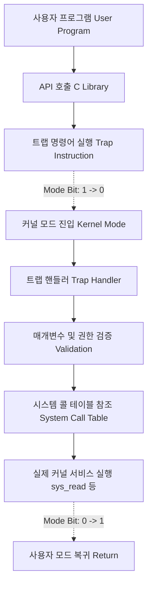

+++
title = "트랩 (Trap) 기반 시스템 콜 구현"
date = "2026-03-14"
weight = 677
+++

> **💡 Insight**
> - 트랩(Trap)은 응용 프로그램(Application Program)이 운영체제(OS: Operating System)의 커널(Kernel) 서비스를 요청하기 위해 의도적으로 발생시키는 소프트웨어 인터럽트(Software Interrupt)입니다.
> - 사용자 모드(User Mode)에서 커널 모드(Kernel Mode)로 안전하게 진입하는 권한 상승(Privilege Escalation)의 유일한 합법적 통로를 제공합니다.
> - 시스템 콜(System Call) 인터페이스는 이 트랩 메커니즘을 기반으로 구현되어, 하드웨어 자원을 악의적 조작으로부터 철저히 격리(Isolation)하고 보호합니다.

### Ⅰ. 트랩(Trap)의 개념과 시스템 콜의 필요성
컴퓨터 아키텍처는 보안과 안정성을 위해 CPU 실행 권한을 최소 두 가지, 사용자 모드(User Mode)와 커널 모드(Kernel Mode)로 나눕니다(Dual-mode Operation). 응용 프로그램은 사용자 모드에서 실행되며 디스크 읽기, 네트워크 통신, 프로세스 생성 등의 하드웨어 직접 제어 권한이 없습니다. 만약 응용 프로그램이 파일 읽기가 필요하다면, 스스로 디스크 컨트롤러에 접근하는 대신 운영체제에 부탁해야 합니다. 이때 응용 프로그램이 스스로 "예외 상황"을 일으켜 CPU의 실행 흐름을 커널의 코드로 강제로 넘기는 메커니즘이 바로 트랩(Trap)입니다. 트랩은 시스템 콜(System Call)을 구현하는 하부의 하드웨어/소프트웨어적 메커니즘을 지칭합니다.

> **📢 섹션 요약 비유:** 일반 시민(사용자 프로그램)은 은행 금고(하드웨어)에 직접 들어갈 수 없습니다. 대신 창구에 가서 번호표를 뽑고 "호출벨(Trap)"을 누르면, 권한을 가진 은행원(운영체제)이 나와서 시민의 요청(시스템 콜)을 듣고 대신 금고에서 돈을 꺼내다 줍니다.

### Ⅱ. 트랩을 통한 커널 진입 및 처리 아키텍처
사용자 프로그램이 C 라이브러리(예: `printf()`)를 호출하면 내부적으로 트랩 명령어(x86의 `int 0x80` 또는 `sysenter/syscall`)가 실행됩니다.

```text
[ User Space (사용자 영역) ]
  Application Program
       |
       v
  C Library (API 래퍼)
  --> Set CPU Registers (예: EAX = 시스템 콜 번호)
  --> Execute 'TRAP' Instruction (예: syscall)
       |
-------|------------------------ (Mode Switch: User -> Kernel) ----
       |
[ Kernel Space (커널 영역) ]
       v
  Trap Handler / System Call Dispatcher
  (인터럽트 벡터 테이블 IDT 참조)
       |
       v
  System Call Table (시스템 콜 번호 유효성 검사 및 분기)
       |
       v
  Specific System Call Implementation (예: sys_read(), sys_fork())
       |
  Return from Trap (예: IRET / sysret) -- 결과를 EAX에 담아 복귀
-------|------------------------ (Mode Switch: Kernel -> User) ----
       |
[ User Space ]
  <-- Application Continues
```
트랩 명령어가 실행되면 하드웨어는 현재 사용자 프로세스의 문맥(Program Counter, Registers)을 커널 스택(Kernel Stack)에 저장하고, CPU 모드 비트(Mode Bit)를 0(커널 모드)으로 변경합니다. 이후 지정된 트랩 핸들러로 점프하여 요청된 작업을 안전하게 수행합니다.

> **📢 섹션 요약 비유:** 여권을 보여주고 국경(트랩 명령어)을 넘는 과정과 같습니다. 국경을 넘는 순간 신분이 까다롭게 검사되고, 해당 국가의 법(커널 모드)에 따라 지정된 경찰(디스패처)의 에스코트를 받으며 안전한 경로로만 이동해야 합니다.

### Ⅲ. 파라미터 전달과 포인터 검증의 중요성
트랩을 발생시킬 때 응용 프로그램은 커널에게 자신이 무엇을 원하는지(예: 파일 디스크립터 번호, 읽을 버퍼 주소, 바이트 수) 매개변수(Parameter)를 전달해야 합니다. 일반적으로 레지스터(Registers)에 시스템 콜 번호와 파라미터를 담아 전달합니다. 이때 커널의 트랩 핸들러에서 가장 중요한 작업은 **사용자 제공 포인터(Pointer)의 유효성 검증**입니다. 악의적인 프로그램이 커널 영역의 메모리 주소를 버퍼로 지정하여 커널 메모리를 덮어쓰거나(Overwrite) 유출(Leak)하려 시도할 수 있기 때문입니다. 운영체제는 파라미터가 유효한 사용자 주소 공간 내에 있는지 철저히 검사해야 합니다.

> **📢 섹션 요약 비유:** 손님이 은행원에게 신분증과 심부름 쪽지(파라미터)를 줍니다. 은행원은 쪽지에 적힌 주소가 진짜 손님의 집인지, 혹시 은행장님 방 주소를 적어놓고 물건을 훔치려는 건 아닌지 아주 꼼꼼하게 검사(포인터 검증)해야 합니다.

### Ⅳ. 트랩 처리의 오버헤드와 최적화(vdso)
트랩을 통한 시스템 콜은 모드 전환(Mode Switch), 레지스터 상태 저장 및 복원, 메모리 권한 검사 등 많은 하드웨어적 작업을 동반하므로 일반 함수 호출에 비해 성능 오버헤드(Overhead)가 큽니다. 시계를 읽는 `gettimeofday()` 같이 보안상 위험하지 않고 매우 빈번히 호출되는 시스템 콜은 매번 트랩을 발생시키면 성능이 크게 저하됩니다. 현대의 Linux와 같은 운영체제는 vDSO(Virtual Dynamically-linked Shared Object) 기법을 사용하여, 커널이 읽기 전용 데이터를 사용자 메모리 공간에 매핑해 줌으로써 트랩 발생(모드 전환) 없이 사용자 모드에서 직접 시스템 콜의 결과를 가져가도록 최적화합니다.

> **📢 섹션 요약 비유:** 시간을 알고 싶을 때마다 은행 창구 벨을 누르고 신분증 검사를 받는 것(트랩 오버헤드)은 너무 비효율적입니다. 그래서 은행 로비 벽에 커다란 시계(vDSO)를 걸어두어, 창구 직원을 귀찮게 하지 않고도 손님 스스로 시간을 확인할 수 있게 만든 최적화 기술입니다.

### Ⅴ. 결론: 하드웨어 진화와 명령어의 발전
과거의 트랩은 순수한 소프트웨어 인터럽트 명령(`int`)을 사용하여 인터럽트 벡터 테이블을 거치는 방식이라 느렸습니다. 최근의 x86-64 및 ARM 아키텍처는 시스템 콜 처리를 위해 전용으로 설계된 `syscall`, `sysenter`, `svc` 와 같은 고속 트랩 명령어(Fast System Call Instruction)를 하드웨어적으로 지원합니다. 이러한 명령어는 인터럽트 벡터 탐색 과정을 생략하고 특정 CPU 제어 레지스터(MSR)에 저장된 커널 진입점 주소로 직접 분기하여 파이프라인(Pipeline) 플러시를 최소화함으로써, 현대 고성능 운영체제의 시스템 콜 지연(Latency)을 획기적으로 낮추었습니다.

> **📢 섹션 요약 비유:** 예전에는 관공서에 들어갈 때 정문 보안 검색대를 거쳐 로비로 가서 다시 부서 지도를 보고 엘리베이터를 타야 했다면(기존 트랩), 최신 건물은 '민원인 전용 직통 고속 엘리베이터(Fast System Call)'를 설치해서 버튼 하나만 누르면 바로 목적지 층으로 쏴주는 기술이 발전한 것입니다.

---
### 💡 Knowledge Graph


### 👧 Child Analogy
컴퓨터 세상은 두 개의 방으로 나뉘어 있어. 하나는 네가 마음껏 놀 수 있는 '장난감 방(사용자 모드)'이고, 다른 하나는 위험한 도구들이 있는 '아빠의 작업실(커널 모드)'이야. 장난감 방에서 놀다가 새 건전지(하드웨어 자원)가 필요해지면, 네가 직접 작업실에 들어가는 건 위험하니까 문에 달린 '도움 벨(Trap)'을 누르는 거야! 그러면 아빠(운영체제)가 나와서 안전하게 건전지를 갈아주시고 다시 장난감 방으로 보내주신단다. 이 도움 벨 메커니즘이 바로 트랩이야!