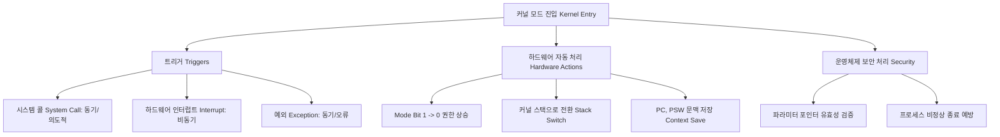

+++
title = "커널 모드 진입 메커니즘"
date = "2026-03-14"
weight = 678
+++

> **💡 Insight**
> - 커널 모드 진입(Kernel Mode Entry)은 운영체제가 컴퓨터 시스템의 절대적인 제어권을 확보하여 하드웨어를 보호하고 프로세스를 스케줄링하기 위한 필수적인 상태 전이(State Transition) 메커니즘입니다.
> - 진입의 트리거(Trigger)는 크게 시스템 콜(System Call), 하드웨어 인터럽트(Hardware Interrupt), 그리고 예외(Exception/Fault)의 세 가지 비동기적 및 동기적 이벤트로 분류됩니다.
> - 진입 과정에서의 핵심은 사용자 문맥(Context)의 안전한 저장과 CPU 권한 수준(Privilege Level)의 하드웨어적 격상(Elevation)입니다.

### Ⅰ. 이중 모드(Dual-Mode) 구조의 당위성
현대의 CPU 아키텍처는 시스템의 무결성을 유지하기 위해 명령어 세트(Instruction Set)를 사용자 모드(User Mode, Ring 3)와 커널 모드(Kernel Mode, Ring 0)로 분리합니다. 입출력 장치 제어, 메모리 관리 장치(MMU) 설정, 타이머 인터럽트 마스킹(Masking) 등 시스템 전체에 치명적 영향을 미칠 수 있는 특권 명령어(Privileged Instruction)는 오직 커널 모드에서만 실행 가능합니다. 따라서 사용자 응용 프로그램이 이러한 자원을 필요로 하거나, 하드웨어 장치가 응답을 요구할 때 CPU는 현재 실행 흐름을 멈추고 안전하게 권한을 상승시켜 커널 영역으로 진입하는 공식적인 '통로'와 메커니즘이 필요합니다.

> **📢 섹션 요약 비유:** 군대에서 일반 병사(사용자 모드)는 소총(일반 명령어)만 쏠 수 있고, 미사일 발사 버튼(특권 명령어)은 장군(커널 모드)만이 누를 수 있습니다. 병사가 미사일 지원이 필요하면 무전기(진입 메커니즘)를 통해 지휘통제실에 정식으로 요청해야만 합니다.

### Ⅱ. 커널 모드 진입의 3대 트리거 (Triggers)
CPU가 사용자 모드에서 커널 모드로 진입하게 만드는 원인은 다음 세 가지로 요약됩니다.

1. **시스템 콜 (System Call / Trap):** 프로그램이 파일 입출력, 프로세스 생성 등을 위해 **의도적(동기적)**으로 발생시키는 소프트웨어 인터럽트입니다. (예: `open()`, `fork()`)
2. **하드웨어 인터럽트 (Hardware Interrupt):** 키보드 입력, 네트워크 패킷 도착, 디스크 읽기 완료 등 외부 하드웨어 장치가 CPU에 신호를 보내는 **비동기적** 이벤트입니다. 또한 스케줄링을 위한 타임 슬라이스(Time Slice) 만료를 알리는 타이머 인터럽트(Timer Interrupt)가 가장 중요합니다.
3. **예외 및 폴트 (Exception / Fault):** 프로그램이 0으로 나누기, 잘못된 메모리 주소 참조(Segmentation Fault), 혹은 페이지 부재(Page Fault)를 발생시켜 CPU가 해당 명령어를 정상적으로 수행할 수 없을 때 발생하는 **동기적** 오류 이벤트입니다.

> **📢 섹션 요약 비유:** 교장실(커널 모드)로 학생이 불려 가는 3가지 경우와 같습니다. 1) 학생증 재발급을 위해 스스로 찾아간 경우(시스템 콜), 2) 외부에서 전화가 와서 교환원이 학생을 호출한 경우(하드웨어 인터럽트), 3) 복도에서 유리창을 깨뜨려 선도부원에게 강제로 끌려간 경우(예외)입니다.

### Ⅲ. 하드웨어 관점의 진입 아키텍처 (Context Save & Mode Switch)
트리거가 발생하면 하드웨어(CPU)는 운영체제의 개입 없이 즉각적으로 다음의 원자적(Atomic) 작업을 수행하여 커널 진입을 준비합니다.

```text
[ User Execution ] 
        | (Interrupt / Trap / Exception 발생)
        v
+-----------------------------------------------------------+
| 하드웨어(CPU) 자동 수행 단계:                               |
| 1. Mode Bit 전환: 상태 레지스터(PSW)의 모드 비트를 1->0으로.  |
| 2. 스택 스위칭: User Stack Pointer(USP) -> Kernel Stack(KSP) |
| 3. 문맥 저장: 현재 Program Counter(PC), Processor Status    |
|    Word(PSW)를 커널 스택에 Push하여 복귀 지점 기억.            |
| 4. 분기(Jump): 인터럽트 벡터 테이블(IVT)을 참조하여 해당     |
|    Handler(ISR)의 주소로 PC 갱신.                         |
+-----------------------------------------------------------+
        |
        v
[ Kernel Execution (ISR/Syscall Handler 시작) ]
```
이 과정에서 중요한 것은 사용자 공간(User Space)의 스택(Stack)을 신뢰할 수 없으므로, 하드웨어가 자동으로 프로세스마다 할당된 안전한 커널 스택(Kernel Stack)으로 스택 포인터(SP)를 전환한다는 점입니다.

> **📢 섹션 요약 비유:** 무균실(커널)에 들어가는 의사의 과정입니다. 경보(트리거)가 울리면 밖에서 입던 사복(사용자 스택)을 벗고, 가장 먼저 멸균복(커널 스택)으로 갈아입은 뒤(모드 비트 변경), 수술 지침서(IVT)를 보고 지정된 수술실(Handler)로 뛰어 들어가는 완벽히 통제된 절차입니다.

### Ⅳ. 보안 및 예외 처리(Exception Handling)의 중요성
커널 모드 진입 직후, 운영체제 코드가 가장 먼저 수행하는 작업은 철저한 검증(Validation)입니다. 시스템 콜의 경우 전달된 매개변수와 포인터가 사용자 메모리 영역 내에 있는지 검증하여 커널 메모리 유출(Leak)을 방지합니다. 예외(Exception)로 인해 진입한 경우, 예를 들어 페이지 부재(Page Fault)라면 디스크에서 메모리로 페이지를 로드하는 유효한 복구 작업을 수행하고 원래 프로그램으로 복귀시킵니다. 하지만 치명적인 오류(예: 허용되지 않은 메모리 침범)라면 운영체제는 해당 프로세스에게 `SIGSEGV` 같은 시그널(Signal)을 보내 강제로 종료(Kill)시켜 시스템 전체의 안정성을 수호합니다.

> **📢 섹션 요약 비유:** 국경 검문소(커널 진입점)입니다. 여행객이 왔을 때, 비자가 유효한지(파라미터 검사), 여권에 문제가 생겨서 잠시 대기하는 것인지(페이지 부재 복구), 아니면 밀수범인지(메모리 침범)를 철저히 조사하고, 밀수범은 그 자리에서 체포(프로세스 종료)하여 나라(시스템)를 안전하게 지킵니다.

### Ⅴ. 결론: 진입 오버헤드와 하이퍼바이저(Hypervisor)로의 확장
사용자 모드와 커널 모드 간의 빈번한 전환(Context Switch, Mode Switch)은 TLB(Translation Lookaside Buffer) 플러시(Flush)와 파이프라인(Pipeline) 정지를 유발하여 큰 성능 오버헤드(Overhead)를 초래합니다. 이를 최소화하기 위해 비동기 I/O(예: `io_uring`), 사용자 공간 네트워킹(DPDK) 같이 커널 우회(Kernel Bypass) 기술이 발전하고 있습니다. 한편 가상화(Virtualization) 환경에서는 게스트 운영체제(Guest OS)와 하이퍼바이저(Hypervisor) 간의 관계를 위해 Ring -1(Root Mode)이라는 더 높은 특권 계층이 도입되었으며, 게스트 OS의 커널 모드 진입 자체가 하이퍼바이저로의 또 다른 트랩(VM Exit)을 발생시키는 복잡한 중첩 구조(Nested Transition)로 진화하였습니다.

> **📢 섹션 요약 비유:** 예전에는 동사무소(커널)만 왔다 갔다 하면 됐는데 이 과정조차 귀찮아서 우편으로 처리(커널 우회)하려는 사람들이 생겼고, 요즘 클라우드 환경에서는 동사무소 위에 구청, 시청(하이퍼바이저)이 또 있어서 동사무소 직원이 시청에 한 번 더 결재를 받으러 가야 하는(VM Exit) 다층적인 시스템으로 발전한 것입니다.

---
### 💡 Knowledge Graph


### 👧 Child Analogy
게임 속에서 네가 전사 캐릭터(사용자 모드)를 조종한다고 해봐. 전사는 평범한 칼질만 할 수 있어. 그런데 갑자기 드래곤이 나타나서 '신의 마법(특권 명령어)'이 필요해졌어! 전사는 마법을 쓸 수 없으니까 무릎을 꿇고 하늘에 기도를 올리지(커널 모드 진입 트리거). 그럼 잠시 화면이 멈추고 빛이 번쩍하면서(문맥 저장과 모드 전환), 시스템의 절대자인 게임 마스터(운영체제 커널)가 내려와서 마법을 쾅 쏴주고 다시 하늘로 돌아가는 거야. 이처럼 평범한 캐릭터가 위대한 마스터의 힘을 빌리러 가는 과정이 바로 커널 모드 진입이란다!