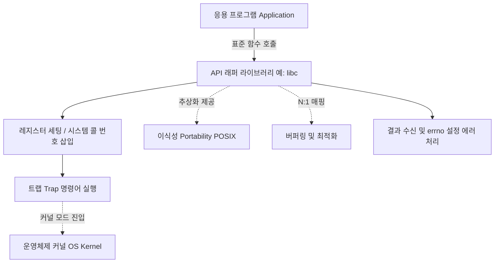

+++
title = "시스템 콜 API 래퍼"
date = "2026-03-14"
weight = 679
+++

> **💡 Insight**
> - 시스템 콜 API 래퍼(System Call API Wrapper)는 응용 프로그램(Application Program)이 운영체제(OS: Operating System)의 커널(Kernel) 서비스를 호출할 때 직접적인 어셈블리어 트랩(Trap) 명령어를 몰라도 되게 해주는 라이브러리 함수입니다.
> - 이는 높은 수준의 프로그래밍 언어(예: C, C++)에서 이식성(Portability)을 보장하고, 하드웨어 아키텍처에 종속적인 세부 구현을 추상화(Abstraction)합니다.
> - POSIX(Portable Operating System Interface) 규격을 준수하는 C 표준 라이브러리(libc, glibc 등)가 대표적인 시스템 콜 래퍼의 역할을 수행합니다.

### Ⅰ. API 래퍼의 개념과 추상화의 필요성
응용 프로그램이 파일 읽기, 메모리 할당, 네트워크 통신 등을 수행하려면 커널의 시스템 콜(System Call)을 호출해야 합니다. 그러나 커널에 진입하려면 CPU 레지스터에 특정 시스템 콜 번호를 세팅하고 `syscall`이나 `int 0x80` 같은 아키텍처 종속적인 어셈블리 명령어를 실행해야 합니다. 일반적인 애플리케이션 개발자가 모든 CPU 아키텍처(x86, ARM, RISC-V 등)의 레지스터 규칙을 외우고 코딩하는 것은 불가능에 가깝습니다. 이를 해결하기 위해 운영체제는 C 라이브러리 형태의 시스템 콜 API 래퍼(Wrapper)를 제공합니다. 래퍼는 복잡한 하드웨어 제어 과정을 하나의 함수 호출(예: `read()`, `write()`)로 추상화(Abstraction)하여 개발자에게 편의성을 제공합니다.

> **📢 섹션 요약 비유:** 해외 직구를 할 때(시스템 콜), 직접 통관 절차를 알아보고 세관에 서류를 제출하는 대신, 배송 대행지(API 래퍼)에 한글로 주소만 적어주면 알아서 통관부터 배송까지 처리해 주는 것과 같습니다.

### Ⅱ. API 래퍼의 내부 동작 메커니즘
애플리케이션이 API 래퍼 함수를 호출하면, 래퍼 내부에서는 레지스터 세팅과 모드 전환(Mode Switch)이 일어납니다.

```text
[ User Space ]
+-------------------------------------------------+
| Application (예: C 프로그램)                      |
| ssize_t bytes = read(fd, buffer, 100);          |
+-------------------------------------------------+
        | (함수 호출 Call)
        v
+-------------------------------------------------+
| System Call API Wrapper (예: glibc의 read 함수)   |
| 1. 파라미터(fd, buffer, 100)를 CPU 레지스터에 복사 |
| 2. EAX 레지스터에 'read'의 시스템 콜 번호(예: 3) 삽입|
| 3. TRAP 명령어 실행 (syscall 또는 int 0x80)       | <--- Context Switch & Mode Switch
+-------------------------------------------------+
                                                  |
[ Kernel Space ]                                  v
+-------------------------------------------------+
| System Call Dispatcher / Trap Handler           |
| (EAX 값 '3'을 보고 sys_read() 호출)               |
+-------------------------------------------------+
```
작업이 완료되면 커널은 결과를 반환하고 사용자 모드로 돌아옵니다. 래퍼 함수는 커널이 반환한 상태 코드(보통 성공 시 결과값, 실패 시 음수)를 확인하고, 에러가 발생한 경우 전역 변수인 `errno`를 설정한 뒤 응용 프로그램에 `-1`을 반환하여 에러 처리를 돕습니다.

> **📢 섹션 요약 비유:** 식당에서 손님(응용 프로그램)이 종업원(API 래퍼)에게 "김치찌개 주세요"라고 말하면, 종업원은 주방(커널)의 규칙에 맞춰 "3번 테이블, 찌개 1개!"라는 약어(시스템 콜 번호)로 주문을 넣고, 요리가 나오면 다시 손님상에 정갈하게 내려놓는 과정입니다.

### Ⅲ. 이식성(Portability)과 POSIX 표준
API 래퍼의 가장 중요한 가치 중 하나는 소스 코드 수준의 이식성(Portability) 확보입니다. 개발자가 POSIX(Portable Operating System Interface) 표준을 따르는 `read()`, `fork()`, `open()` 등의 API를 사용하여 프로그램을 작성하면, 이 코드는 리눅스(Linux), 맥OS(macOS), 유닉스(UNIX) 등 어떤 POSIX 호환 운영체제에서든 재컴파일(Recompile)만으로 동일하게 동작합니다. 하부 커널의 시스템 콜 번호가 리눅스와 맥OS가 서로 다르더라도, 각 운영체제에 맞게 빌드된 libc 래퍼가 그 차이를 내부적으로 숨겨주기 때문입니다.

> **📢 섹션 요약 비유:** 전 세계 어디서나 '220V 돼지코 플러그(POSIX API)' 모양만 맞추면, 벽 뒤의 전기 배선망(커널)이 한국 방식이든 유럽 방식이든 상관없이 가전제품(응용 프로그램)을 똑같이 사용할 수 있게 해주는 어댑터입니다.

### Ⅳ. 래퍼와 실제 시스템 콜의 1:N 및 N:1 매핑
API 래퍼 함수가 항상 커널의 시스템 콜과 1:1로 매핑되는 것은 아닙니다. `read()`나 `write()`처럼 1:1로 매핑되는 경우도 있지만, `printf()` 같은 C 표준 입출력 함수는 내부적으로 버퍼링(Buffering)과 문자열 포맷팅을 수행한 후 버퍼가 찰 때만 `write()` 시스템 콜을 한 번 호출하는 **다대일(N:1)** 관계를 가집니다. 반대로, 하나의 복잡한 API 호출(예: `malloc()`)이 내부적으로 `brk()`나 `mmap()` 같은 여러 개의 시스템 콜을 상황에 맞게 선택하여 호출하는 **일대다(1:N)** 관계도 존재합니다. 이는 성능 최적화와 사용자 편의를 위해 래퍼 계층에 복잡한 로직이 포함될 수 있음을 의미합니다.

> **📢 섹션 요약 비유:** 자판기에서 커피를 뽑을 때(N:1), 동전을 100원씩 세 번 넣어도(API 호출) 기계 내부에서는 한 번에 300원어치 처리를 할 수도 있고, 버튼 하나만 눌러도(1:N) 내부에서는 컵 내리기, 커피 붓기, 물 붓기 등 여러 동작(시스템 콜)이 일어나는 것과 같습니다.

### Ⅴ. 결론: 보안과 샌드박싱(Sandboxing)에서의 역할
현대의 운영체제 보안 아키텍처에서 API 래퍼는 보안을 강제하는 1차 방어선 역할도 수행합니다. Windows의 경우 시스템 콜 번호가 버전마다 자주 바뀌기 때문에, Microsoft는 개발자가 시스템 콜을 직접 호출하지 못하게 하고 반드시 `ntdll.dll` 등의 공식 API 래퍼(Win32 API)를 거치도록 강제합니다. 또한 리눅스의 seccomp(Secure Computing Mode)나 컨테이너(Container) 환경에서는 프로세스가 호출하는 시스템 콜을 필터링하는데, 개발자들은 API 래퍼를 통해 안전한 하위 집합의 시스템 콜만 사용하도록 설계된 라이브러리에 의존함으로써 애플리케이션의 샌드박싱(Sandboxing)을 구현합니다.

> **📢 섹션 요약 비유:** 놀이공원(시스템)에서 놀이 기구(하드웨어 자원)를 탈 때 아무 문으로나 막 들어가면 사고가 나니까, 반드시 표를 검사하는 공식 정문(API 래퍼)으로만 입장하도록 철조망(보안 정책)을 쳐놓은 것입니다.

---
### 💡 Knowledge Graph


### 👧 Child Analogy
레고 블록을 조립할 때, 아주 작은 부품들을 하나하나 핀셋으로 끼우는 건(시스템 콜 직접 호출) 손가락이 너무 아프고 힘들겠지? 그래서 '마법의 장갑(API 래퍼)'을 끼는 거야. 이 장갑을 끼고 "성벽 만들어줘!" 하고 큼직하게 손짓만 하면, 장갑이 알아서 빠르고 정확하게 작은 부품들을 척척 조립해 준단다! 네가 어려운 규칙을 몰라도 멋진 성을 쉽게 만들 수 있게 도와주는 착한 친구지.