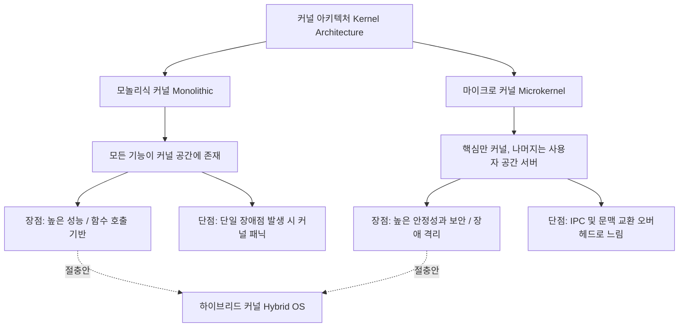

+++
title = "모놀리식 vs 마이크로 커널 성능 비교"
date = "2026-03-14"
weight = 680
+++

> **💡 Insight**
> - 모놀리식 커널(Monolithic Kernel)은 운영체제의 모든 핵심 기능(프로세스, 메모리, 파일 시스템, 디바이스 드라이버)을 하나의 거대한 커널 공간(Kernel Space)에서 실행하여 최고의 성능(Performance)을 냅니다.
> - 마이크로 커널(Microkernel)은 커널의 크기를 최소화하고, 대부분의 서비스를 사용자 공간(User Space)의 독립된 서버(Server) 프로세스로 분리하여 높은 안정성(Reliability)과 확장성(Extensibility)을 확보합니다.
> - 두 아키텍처의 성능 차이는 주로 모드 전환(Mode Switch)과 프로세스 간 통신(IPC: Inter-Process Communication) 오버헤드(Overhead)의 빈도에서 기인합니다.

### Ⅰ. 아키텍처 철학의 근본적 차이
운영체제(OS: Operating System)의 설계 아키텍처는 성능과 유지보수성 사이의 트레이드오프(Trade-off)를 반영합니다. 모놀리식 커널(예: Linux, 전통적 UNIX)은 '모든 것을 하나로(All-in-one)'라는 철학 아래, 커널 영역 내에 수많은 모듈이 거대한 단일 바이너리(Binary) 형태로 묶여 동작합니다. 반면 마이크로 커널(예: Mach, QNX, L4)은 '최소 권한의 원칙'에 따라 스케줄링, 기본 메모리 관리, IPC 등 필수 기능만 커널에 남기고, 파일 시스템이나 네트워크 스택 같은 서비스는 사용자 모드의 서버 프로세스로 분리(Decoupling)합니다.

> **📢 섹션 요약 비유:** 모놀리식 커널은 요리, 서빙, 계산, 청소를 모두 한 명의 만능 직원이 다 하는 '작은 식당'이고, 마이크로 커널은 요리사, 웨이터, 카운터 직원이 철저히 분업화되어 인터폰(IPC)으로만 소통하는 '대형 레스토랑'입니다.

### Ⅱ. 구조도 및 성능 병목(Bottleneck) 메커니즘
성능 차이를 이해하기 위해서는 시스템 콜(System Call) 발생 시의 메시지 흐름을 보아야 합니다.

```text
[ 모놀리식 커널 (Monolithic Kernel) ]     [ 마이크로 커널 (Microkernel) ]
+-------------------------+             +-------------------------+
| User Space (응용 프로그램)|             | User Space (응용 프로그램)|
|           |             |             |        |    ^            |
|----- System Call -------|             |-- IPC--|----|-- IPC -----|
|           v             |             |        v    |            |
| Kernel Space            |             | +---------------------+  |
|  [VFS] -> [File System] |             | | File System Server  |  |
|  -> [Device Driver]     |             | +---------------------+  |
+-------------------------+             | Kernel Space (IPC 라우팅)|
                                        +-------------------------+
```
모놀리식 환경에서 응용 프로그램이 파일 읽기를 요청하면 1번의 커널 진입(Mode Switch) 후, 커널 내부의 함수 호출(Function Call)만으로 파일 시스템과 드라이버를 거쳐 즉시 데이터를 가져옵니다. 반면 마이크로 커널 환경에서는 응용 프로그램이 마이크로 커널에 IPC 메시지를 보내고, 커널은 이를 다시 사용자 영역의 '파일 시스템 서버'로 전달합니다. 이 과정에서 문맥 교환(Context Switching)과 모드 전환이 여러 번 반복 발생합니다.

> **📢 섹션 요약 비유:** 모놀리식은 한 사무실 안에서 옆자리 동료에게 "이 서류 좀 처리해줘" 하고 직접 넘겨주는 것이고, 마이크로 커널은 다른 층에 있는 부서에 결재 서류를 우편(IPC)으로 보내고 답장이 올 때까지 기다려야 하는 복잡한 결재선과 같습니다.

### Ⅲ. 성능 비교: 속도(Performance) vs 오버헤드(Overhead)
성능(Performance) 측면에서는 모놀리식 커널이 압도적으로 우수합니다. 커널 내부의 모듈들은 같은 주소 공간을 공유하므로 메모리 복사 없이 포인터(Pointer)만 전달하여 빠르게 데이터를 처리할 수 있습니다. 반면 마이크로 커널은 서비스 요청 시마다 사용자 공간과 커널 공간을 넘나드는 컨텍스트 스위칭 오버헤드가 발생하며, 메시지 패싱(Message Passing)을 위한 메모리 복사 비용이 추가됩니다. 초기 마이크로 커널인 Mach는 이러한 IPC 오버헤드 때문에 극심한 성능 저하를 겪었습니다.

> **📢 섹션 요약 비유:** 모놀리식은 공장 안에 모든 부품 창고가 있어서 작업자가 바로바로 가져다 쓰는 구조라 생산 속도가 빠릅니다. 마이크로 커널은 부품이 필요할 때마다 외부 창고에 트럭(IPC)을 보내서 실어와야 하니 운송 시간(오버헤드)이 많이 걸립니다.

### Ⅳ. 안정성(Reliability)과 보안(Security) 관점의 트레이드오프
성능의 희생을 대가로 마이크로 커널은 극강의 안정성과 보안을 얻습니다. 모놀리식 커널에서는 수백만 줄의 코드 중 디바이스 드라이버 하나에 버그(예: Null 포인터 참조)가 발생하면 시스템 전체가 패닉(Kernel Panic)에 빠져 멈춥니다(단일 장애점, SPOF). 반면 마이크로 커널에서는 파일 시스템이나 드라이버가 사용자 모드의 일반 프로세스로 동작하므로, 해당 서버가 죽더라도 커널은 무사하며 해당 프로세스만 재시작(Restart)하여 시스템을 복구할 수 있습니다. 이 때문에 높은 신뢰성이 요구되는 항공, 의료기기, 자율주행 자동차(예: QNX) 등에서 마이크로 커널이 선호됩니다.

> **📢 섹션 요약 비유:** 모놀리식은 커다란 배에 모든 승객이 칸막이 없이 타서 배 밑바닥에 구멍이 나면 다 같이 가라앉는 구조입니다. 마이크로 커널은 벌집 모양의 격벽(사용자 모드 격리)이 있어서 한 칸에 물이 차도 배 전체는 무사히 항해할 수 있는 안전한 구조입니다.

### Ⅴ. 결론: 하이브리드 커널(Hybrid Kernel)의 등장
현대의 범용 운영체제는 순수한 모놀리식이나 마이크로 커널을 고집하지 않고 타협점인 하이브리드 커널(Hybrid Kernel) 구조를 채택했습니다. Windows NT나 macOS(XNU)는 기본적으로 마이크로 커널의 설계 철학(메시지 패싱, 모듈화)을 가지지만, 성능이 중요한 파일 시스템이나 그래픽 드라이버 등을 커널 공간(Ring 0) 안으로 끌어들여 성능 저하를 막았습니다. 리눅스 또한 기본은 모놀리식이지만, 커널 모듈(LKM: Loadable Kernel Module)을 통해 동적으로 기능을 뗐다 붙였다 할 수 있는 유연성을 갖추어 두 아키텍처의 장점을 흡수하는 방향으로 진화했습니다.

> **📢 섹션 요약 비유:** 맛집(성능)과 위생(안정성)을 모두 잡기 위한 퓨전 레스토랑입니다. 꼭 필요한 핵심 요리(파일 시스템 등)는 주방장(커널)이 직접 빠르게 처리하고, 서빙이나 잡일(기타 서비스)만 철저히 분업화하여 빠르면서도 안전한 시스템을 구축한 것입니다.

---
### 💡 Knowledge Graph


### 👧 Child Analogy
레고로 만든 성을 생각해봐! '모놀리식 커널'은 성벽, 탑, 문이 모두 본드로 단단하게 붙어있는 커다란 통짜 성이야. 엄청 튼튼해서 부수기 힘들지만(성능 최고), 만약 문 하나가 부서지면 성 전체를 새로 사야 해(커널 패닉). 반면에 '마이크로 커널'은 작은 레고 블록들이 그냥 끼워져 있는 성이야. 탑 하나가 망가져도 그것만 빼서 새 블록으로 쏙 갈아 끼우면 되니까 정말 안전하지! 하지만 이리저리 부품을 옮기느라 성을 관리하는 시간(오버헤드)은 조금 더 걸린단다.