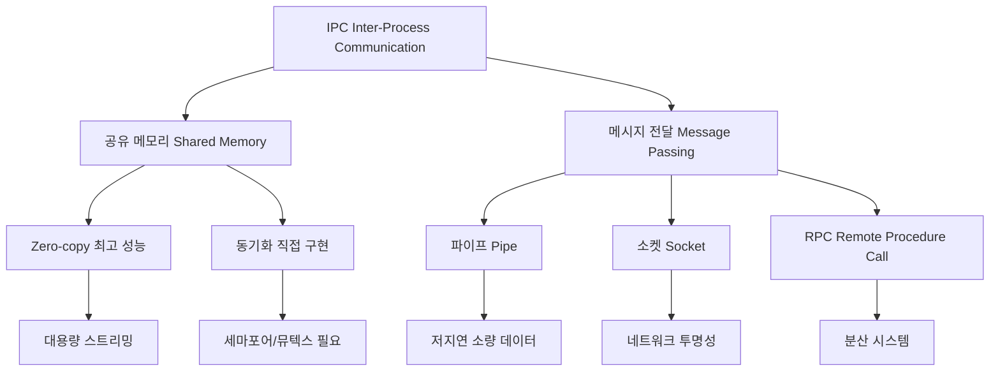

+++
title = "IPC 기법 성능 오버헤드"
date = "2026-03-14"
weight = 681
+++

> **💡 Insight**
> - IPC (Inter-Process Communication)는 프로세스 간 데이터 교환을 위한 핵심 메커니즘으로, 각 기법별로 상이한 성능 오버헤드(Overhead)를 가집니다.
> - 공유 메모리(Shared Memory)는 최초 설정 비용 후 zero-copy로 최고 성능을 제공하며, 메시지 전달(Message Passing)은 커널 개입으로 인한 시스템 콜(System Call) 오버헤드가 발생합니다.
> - 파이프(Pipe), 소켓(Socket), RPC (Remote Procedure Call) 등은 통신 거리와 추상화 수준에 따라 오버헤드가 증가합니다.

### Ⅰ. IPC 오버헤드의 근본 원인

IPC (Inter-Process Communication)의 성능 오버헤드는 주로 **커널 개입(Kernel Involvement)**, **데이터 복사(Data Copy)**, **문맥 교환(Context Switch)**의 조합에서 발생합니다. 사용자 모드(User Mode) 프로세스 간 통신은 보안과 격리를 위해 반드시 커널(Kernel)의 중재를 거쳐야 하며, 이 과정에서 모드 전환(Mode Switch)과 메모리 복사가 불가피합니다.

```text
┌─────────────────────────────────────────────────────────────────┐
│              IPC 오버헤드 발생 지점 분석                          │
├─────────────────────────────────────────────────────────────────┤
│                                                                 │
│   [프로세스 A]                      [프로세스 B]                 │
│   사용자 공간                       사용자 공간                  │
│   ┌───────────┐                    ┌───────────┐               │
│   │ 데이터    │                    │           │               │
│   │ 송신      │                    │ 수신      │               │
│   └─────┬─────┘                    └─────▲─────┘               │
│         │                                │                     │
│   ──────┼────── 시스템 콜 진입 ──────────┼──────               │
│         │ ① 모드 전환(Mode Switch)      │                     │
│         │ ② 데이터 복사(Copy to Kernel)  │                     │
│         ▼                                │                     │
│   ┌─────────────────────────────────────────────────┐          │
│   │              커널 공간 (Kernel Space)            │          │
│   │  ┌─────────────────────────────────────────┐    │          │
│   │  │ IPC 버퍼 / 큐 / 파이프 버퍼              │    │          │
│   │  │ ③ 커널 내부 처리 및 동기화               │    │          │
│   │  └─────────────────────────────────────────┘    │          │
│   │                    │ ④ 대기/깨움(Sleep/Wakeup)  │          │
│   └────────────────────┼────────────────────────────┘          │
│                        │ ⑤ 데이터 복사(Copy to User)          │
│                        ▼                                       │
└─────────────────────────────────────────────────────────────────┘

오버헤드 구성요소:
┌────────────────┬────────────────┬────────────────────────────┐
│ ① Mode Switch  │ ② Data Copy   │ ③ Context Switch (대기 시) │
├────────────────┼────────────────┼────────────────────────────┤
│ ~1-2 μs        │ 메모리 대역폭  │ ~5-20 μs (프로세스 전환)   │
│ (시스템 콜)    │ 의존적         │ 스레드는 ~1-5 μs          │
└────────────────┴────────────────┴────────────────────────────┘
```

**[다이어그램 해설]** 프로세스 A가 B에게 데이터를 전송할 때, 최소 2회의 모드 전환(사용자→커널→사용자)과 2회의 데이터 복사(사용자→커널→사용자)가 발생합니다. 블로킹(Blocking) 통신의 경우 수신측이 데이터를 기다리며 슬립(Sleep) 상태로 전환되고, 송신 완료 시 웨이크업(Wakeup)되는 문맥 교환(Context Switch) 오버헤드가 추가됩니다. 이 오버헤드는 마이크로 커널(Microkernel) 아키텍처에서 특히 두드러지며, 모든 서비스가 IPC를 통해 통신하기 때문입니다.

> **📢 섹션 요약 비유:** IPC는 아파트 이웃 간 편지 전달과 같습니다. 직접 문을 두드리면(공유 메모리) 즉시 전달되지만, 경비실(커널)을 거쳐야 하면 우편함에 넣고 수신자가 찾아갈 때까지 기다려야 하는 지연이 발생합니다.

### Ⅱ. IPC 기법별 성능 비교 분석

IPC 기법별 오버헤드 특성을 비교하면, 각 기법의 적용 시나리오를 명확히 파악할 수 있습니다.

| IPC 기법 | 커널 개입 | 데이터 복사 | 동기화 방식 | 전형적 지연시간 | 적합한 용도 |
|:---:|:---:|:---:|:---:|:---:|:---|
| **공유 메모리 (Shared Memory)** | 최소(초기화만) | **0회** (직접 접근) | 사용자 직접 구현 | **~100 ns** | 대용량 데이터 교환 |
| **메시지 큐 (Message Queue)** | 각 메시지마다 | 2회 | 커널 관리 | ~5-20 μs | 비동기 메시징 |
| **파이프 (Pipe)** | 각 쓰기/읽기 | 2회 | 블로킹/논블로킹 | ~3-15 μs | 부모-자식 통신 |
| **소켓 (Socket)** | TCP/IP 스택 | 3-4회 | 다양한 모드 | ~20-100 μs | 네트워크/로컬 통신 |
| **RPC (Remote Procedure Call)** | 전체 스택 | 마샬링 + 복사 | 동기 호출 | ~100 μs - ms | 분산 시스템 |
| **신호 (Signal)** | 커널 핸들링 | 없음 | 비동기 | ~1-5 μs | 이벤트 통지 |

```text
┌───────────────────────────────────────────────────────────────────┐
│          IPC 기법별 데이터 전송 경로 비교                          │
├───────────────────────────────────────────────────────────────────┤
│                                                                   │
│ [1] 공유 메모리 (Shared Memory) - 최고 성능                       │
│                                                                   │
│     Process A          Process B                                  │
│     ┌───────┐          ┌───────┐                                 │
│     │       │   공유   │       │                                 │
│     │  ─────┼──────────┼─────  │  ← 직접 메모리 접근              │
│     │       │  메모리  │       │    복사 없음!                    │
│     └───────┘          └───────┘                                 │
│                                                                   │
│ [2] 파이프/메시지 큐 - 커널 버퍼 경유                              │
│                                                                   │
│     Process A        Kernel           Process B                   │
│     ┌───────┐     ┌──────────┐       ┌───────┐                  │
│     │ Data  │ ──▶ │ Buffer   │ ───▶ │ Data  │                  │
│     │(복사1)│     │(커널공간)│       │(복사2)│                  │
│     └───────┘     └──────────┘       └───────┘                  │
│                    ▲                                              │
│                시스템 콜                                          │
│                                                                   │
│ [3] 소켓 (Socket) - 프로토콜 스택 추가                             │
│                                                                   │
│     Process A     Kernel TCP/IP     Kernel TCP/IP    Process B   │
│     ┌───────┐     ┌──────────┐      ┌──────────┐     ┌───────┐  │
│     │ Data  │ ──▶ │ Socket   │ ───▶ │ Socket   │ ──▶ │ Data  │  │
│     │(복사) │     │ Buffer   │      │ Buffer   │     │(복사) │  │
│     └───────┘     │+ Protocol│      │+ Protocol│     └───────┘  │
│                   │+ Headers │      │+ Headers │                │
│                   └──────────┘      └──────────┘                │
│                    (3-4회 복사 발생)                              │
│                                                                   │
│ [4] RPC (Remote Procedure Call) - 최대 오버헤드                   │
│                                                                   │
│     Client              Network               Server             │
│     ┌──────┐         ┌─────────┐            ┌──────┐            │
│     │ Call │ ──마샬──▶│ 패킷    │ ──네트워크─▶│ 언마 │ ──실행──▶ │
│     │      │   링    │ 전송    │            │샬링  │            │
│     └──────┘         └─────────┘            └──────┘            │
│       ▲                                          │              │
│       └──────────── 결과 반환 (전 과정 역순) ──────┘            │
└───────────────────────────────────────────────────────────────────┘
```

**[다이어그램 해설]** 공유 메모리는 두 프로세스가 동일한 물리 메모리 페이지를 매핑하여 커널 개입 없이 직접 데이터를 교환합니다. 초기 shmget()/mmap() 시스템 콜 비용만 발생하고 이후에는 순수 메모리 접근 속도(~100ns)로 통신이 가능합니다. 반면 파이프와 메시지 큐는 매 전송마다 커널 버퍼를 거치며 2회 복사가 발생합니다. 소켓은 로컬 통신이라도 TCP/IP (Transmission Control Protocol/Internet Protocol) 스택을 거치며 3-4회 복사와 프로토콜 헤더 처리 오버헤드가 추가됩니다. RPC는 마샬링(Marshalling)/언마샬링(Unmarshalling) 과정과 네트워크 지연까지 합쳐져 ms 단위의 지연이 발생할 수 있습니다.

> **📢 섹션 요약 비유:** 공유 메모리는 냉장고(공유 저장소)에 음식을 넣어두고 가족들이 자유롭게 꺼내 먹는 것과 같습니다. 파이프는 컨베이어 벨트에 물건을 올려 보내는 것이고, 소켓은 택배로 보내는 것, RPC는 해외 배송을 의뢰하는 것과 같습니다.

### Ⅲ. 공유 메모리 vs 메시지 전달 심층 비교

IPC 설계에서 가장 중요한 의사결정은 **공유 메모리(Shared Memory)**와 **메시지 전달(Message Passing)** 사이의 선택입니다. 이 두 방식은 성능과 프로그래밍 복잡도 사이의 명확한 트레이드오프(Trade-off)를 보입니다.

```text
┌───────────────────────────────────────────────────────────────────┐
│     공유 메모리와 메시지 전달의 성능/복잡도 트레이드오프            │
├───────────────────────────────────────────────────────────────────┤
│                                                                   │
│  성능(Performance)                                                │
│       ▲                                                           │
│       │           ┌─────────────── 공유 메모리                     │
│       │          /│  • Zero-copy                                  │
│       │         / │  • 사용자 모드 직접 접근                       │
│       │        /  │  • 동기화 직접 구현 필요                       │
│       │       /   │  • 버그 시 디버깅 어려움                       │
│       │      /    │                                               │
│       │     /     └────────────────────────────────────           │
│       │    /                                                      │
│       │   /                                                       │
│       │  /   ┌─────────────── 메시지 전달                          │
│       │ /    │  • 커널 버퍼링                                     │
│       │/     │  • 자동 동기화                                     │
│       │      │  • 버그 추적 용이                                  │
│       │      │  • 성능 오버헤드 존재                               │
│       │      └────────────────────────────────────                 │
│       │                                                           │
│       └────────────────────────────────────────────▶ 복잡도       │
│                      (Complexity)                                 │
│                                                                   │
│  ┌─────────────────────────────────────────────────────────────┐ │
│  │  대용량 데이터 전송 성능 비교 (1MB 전송 기준)                  │ │
│  ├─────────────────────────────────────────────────────────────┤ │
│  │  공유 메모리:    ~0.5 - 2 ms (초기 매핑 후)                   │ │
│  │  메시지 큐:      ~5 - 20 ms                                   │ │
│  │  파이프:         ~10 - 30 ms                                  │ │
│  │  TCP 소켓:       ~20 - 50 ms (로컬)                           │ │
│  │  RPC:            ~50 - 200 ms (로컬, 마샬링 포함)             │ │
│  └─────────────────────────────────────────────────────────────┘ │
└───────────────────────────────────────────────────────────────────┘
```

**[다이어그램 해설]** 공유 메모리는 성능 면에서 압도적이지만, 프로그래머가 세마포어(Semaphore)나 뮤텍스(Mutex)를 직접 사용하여 동기화를 구현해야 합니다. 경쟁 조건(Race Condition)이나 데드락(Deadlock) 발생 시 디버깅이 매우 어렵습니다. 반면 메시지 전달은 커널이 자동으로 동기화를 처리하여 프로그래밍이 간단하지만, 매 전송마다 시스템 콜과 데이터 복사 오버헤드가 발생합니다. 대용량 데이터(수 MB 이상)를 빈번하게 교환해야 하는 경우(예: 비디오 처리, 데이터베이스 버퍼)에는 공유 메모리가 필수적입니다.

> **📢 섹션 요약 비유:** 공유 메모리는 화이트보드에 두 사람이 동시에 글을 쓰는 것과 같아서, 지우개(동기화)를 누가 먼저 쓸지 싸우면 문제가 됩니다. 메시지 전달은 사서(Mediator)에게 쪽지를 전달해서 상대방에게 주는 방식이라 안전하지만, 사서가 바쁘면 대기 시간이 길어집니다.

### Ⅳ. 실무 적용 및 성능 최적화 전략

IPC 성능 최적화를 위해서는 통신 패턴 분석 후 적절한 기법을 선택해야 합니다.

**실무 시나리오별 최적 IPC 선택:**

| 시나리오 | 권장 IPC | 이유 |
|:---|:---|:---|
| **대용량 데이터 스트리밍** (비디오/오디오) | 공유 메모리 + 세마포어 | Zero-copy로 대역폭 최대화 |
| **빈번한 소량 메시지** (이벤트 통지) | 파이프 / 이벤트 FD | 단순, 낮은 지연 |
| **비동기 작업 큐** (웹 서버) | 메시지 큐 | 순서 보장, 비동기 처리 |
| **마이크로서비스 통신** | gRPC (HTTP/2) | 직렬화 효율, 스트리밍 지원 |
| **실시간 제어 시스템** | 공유 메모리 + Lock-free | 최저 지연, 결정적 응답 |

```text
┌───────────────────────────────────────────────────────────────────┐
│              IPC 성능 최적화 체크리스트                            │
├───────────────────────────────────────────────────────────────────┤
│                                                                   │
│  ✅ 데이터 크기 기준 선택                                          │
│  ┌─────────────────────────────────────────────────────────────┐ │
│  │  < 1KB   : 파이프, 소켓, 메시지 큐 (오버헤드 무시 가능)       │ │
│  │  1KB-1MB : 메시지 큐 (편의성) 또는 공유 메모리 (성능)        │ │
│  │  > 1MB   : 공유 메모리 필수 (복사 비용 회피)                 │ │
│  └─────────────────────────────────────────────────────────────┘ │
│                                                                   │
│  ✅ 통신 빈도 고려                                                 │
│  ┌─────────────────────────────────────────────────────────────┐ │
│  │  낮은 빈도 : 어떤 IPC든 허용                                 │ │
│  │  높은 빈도 : 공유 메모리로 시스템 콜 횟수 최소화              │ │
│  │  실시간   : Lock-free 자료구조 + 공유 메모리                 │ │
│  └─────────────────────────────────────────────────────────────┘ │
│                                                                   │
│  ✅ 배칭(Batching) 전략                                           │
│  ┌─────────────────────────────────────────────────────────────┐ │
│  │  여러 작은 메시지를 모아서 한 번에 전송                       │ │
│  │  시스템 콜 횟수: N회 → 1회                                   │ │
│  │  오버헤드 감소: 최대 10-100배                                │ │
│  └─────────────────────────────────────────────────────────────┘ │
│                                                                   │
│  ✅ Zero-copy 기법 활용                                           │
│  ┌─────────────────────────────────────────────────────────────┐ │
│  │  sendfile() : 파일 → 소켓 직접 전송                          │ │
│  │  splice()   : 파이프 간 데이터 이동 (커널 내부)               │ │
│  │  mmap()     : 파일을 메모리에 매핑 후 공유                    │ │
│  │  vmsplice() : 사용자 메모리 → 파이프 zero-copy               │ │
│  └─────────────────────────────────────────────────────────────┘ │
└───────────────────────────────────────────────────────────────────┘
```

**[다이어그램 해설]** IPC 성능 최적화의 핵심은 시스템 콜 횟수와 데이터 복사 횟수를 최소화하는 것입니다. 배칭(Batching)은 100개의 100바이트 메시지를 개별 전송하는 대신, 10KB 블록으로 묶어 한 번에 전송함으로써 시스템 콜 오버헤드를 1/100로 줄입니다. Zero-copy 기법들은 커널 내부에서 데이터를 이동시켜 사용자 공간 복사를 건너뜁니다. 특히 `sendfile()`은 웹 서버에서 정적 파일 전송 시 CPU (Central Processing Unit) 사용량을 크게 줄여줍니다.

> **📢 섹션 요약 비유:** IPC 최적화는 식당 주방의 효율과 같습니다. 재료를 필요할 때마다 1개씩 주문(빈번한 IPC)하면 배달비(오버헤드)가 많이 들지만, 한 번에 대량으로 주문(배칭)하거나 창고(공유 메모리)에 비축해두면 비용을 크게 절약할 수 있습니다.

### Ⅴ. 결론 및 기대효과

IPC 기법 선택은 시스템 전체 성능에 직접적인 영향을 미치며, 적절한 선택 시 다음과 같은 효과를 기대할 수 있습니다.

| 구분 | 비최적화 IPC | 최적화된 IPC | 개선 효과 |
|:---|:---|:---|:---|
| **지연 시간** | TCP 소켓 ~100μs | 공유 메모리 ~0.1μs | **1000배 단축** |
| **CPU 사용률** | 잦은 시스템 콜 30% | Zero-copy 5% | **6배 절감** |
| **처리량** | 100MB/s | 2GB/s+ | **20배 향상** |

**핵심 교훈:**
- 소량 데이터 + 낮은 빈도 → **간단한 IPC** (파이프, 소켓)
- 대량 데이터 + 높은 빈도 → **공유 메모리 + 직접 동기화**
- 분산 환경 → **gRPC/메시지 큐** (신뢰성 우선)

> **📢 섹션 요약 비유:** 올바른 IPC 선택은 교통수단 선택과 같습니다. 가까운 거리는 걷거나(간단한 IPC), 먼 거리는 고속도로(공유 메모리), 해외는 비행기(네트워크 IPC)를 타는 것처럼, 목적에 맞는 도구를 선택해야 효율적입니다.

---

### 💡 Knowledge Graph


### 👧 Child Analogy
IPC는 친구들과 장난감을 공유하는 방법과 같아! '공유 메모리'는 큰 장난감 상자를 두고 친구들이 함께 거기서 꺼내 쓰는 거야. 엄청 빠르지만 동시에 잡으면 싸울 수 있지(동기화 문제). '메시지 전달'은 친구가 필요한 장난감을 전달해달라고 쪽지를 보내는 거야. 안전하지만 쪽지를 쓰고 읽는 시간이 걸려서 조금 느려!