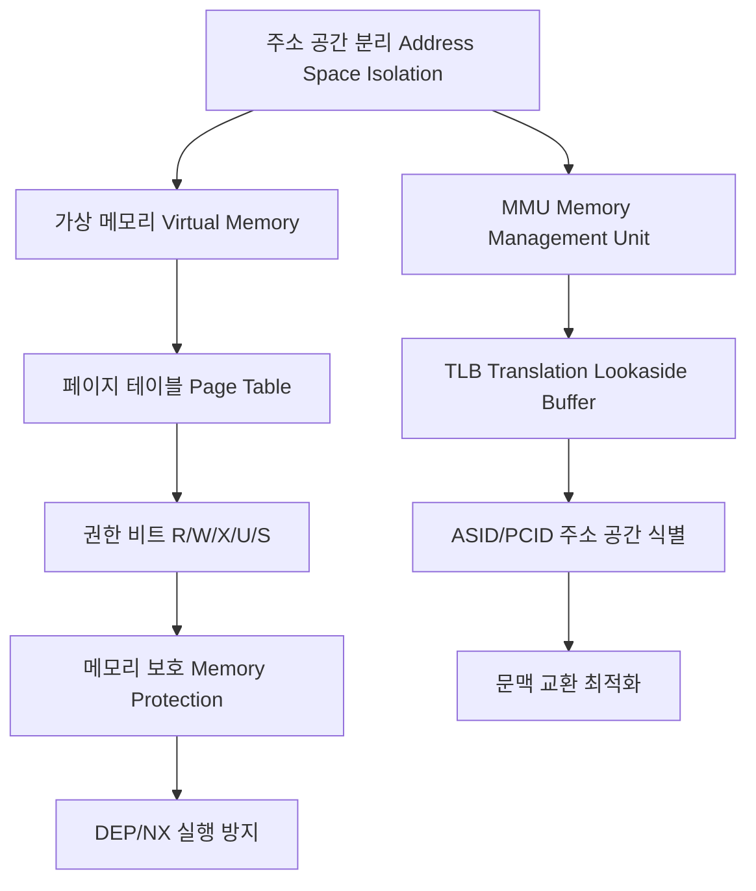

+++
title = "프로세스 주소 공간 분리"
date = "2026-03-14"
weight = 682
+++

> **💡 Insight**
> - 프로세스 주소 공간 분리(Process Address Space Isolation)는 각 프로세스가 독립적인 가상 주소 공간(Virtual Address Space)을 가지며, 다른 프로세스의 메모리에 직접 접근할 수 없는 보안 및 안정성 메커니즘입니다.
> - MMU (Memory Management Unit)와 페이지 테이블(Page Table)을 통해 논리 주소(Logical Address)를 물리 주소(Physical Address)로 변환하며, 각 프로세스마다 독립된 매핑을 유지합니다.
> - 주소 공간 분리는 프로세스 간 간섭을 방지하여 시스템 안정성(Stability)과 보안(Security)을 보장하지만, IPC (Inter-Process Communication) 시 커널 개입을 필요로 합니다.

### Ⅰ. 주소 공간 분리의 필요성과 기본 원리

현대 운영체제에서 **주소 공간 분리(Address Space Isolation)**는 가장 기본적인 보호 메커니즘입니다. 각 프로세스는 자신만의 **가상 주소 공간(Virtual Address Space)**을 가지며, 이 공간 내에서는 0x0000부터 최대 주소(64비트 시스템에서 2^64-1)까지의 모든 주소를 자유롭게 사용할 수 있습니다. 그러나 이 주소는 실제 물리 메모리(RAM) 주소와 다르며, MMU (Memory Management Unit)가 페이지 테이블(Page Table)을 참조하여 동적으로 변환합니다.

```text
┌─────────────────────────────────────────────────────────────────┐
│        프로세스별 독립된 가상 주소 공간 구조                       │
├─────────────────────────────────────────────────────────────────┤
│                                                                 │
│  [프로세스 A의 가상 주소 공간]    [프로세스 B의 가상 주소 공간]   │
│  ┌──────────────────┐            ┌──────────────────┐          │
│  │ Kernel Space     │            │ Kernel Space     │          │
│  │ (공유됨)         │            │ (공유됨)         │          │
│  ├──────────────────┤            ├──────────────────┤          │
│  │ Stack ↓         │            │ Stack ↓         │          │
│  │ (지역변수)       │            │ (지역변수)       │          │
│  │       ⋮         │            │       ⋮         │          │
│  ├──────────────────┤            ├──────────────────┤          │
│  │ Heap ↑          │            │ Heap ↑          │          │
│  │ (동적할당)       │            │ (동적할당)       │          │
│  ├──────────────────┤            ├──────────────────┤          │
│  │ BSS             │            │ BSS             │          │
│  │ (초기화X 전역)   │            │ (초기화X 전역)   │          │
│  ├──────────────────┤            ├──────────────────┤          │
│  │ Data            │            │ Data            │          │
│  │ (초기화된 전역)  │            │ (초기화된 전역)  │          │
│  ├──────────────────┤            ├──────────────────┤          │
│  │ Text (Code)     │            │ Text (Code)     │          │
│  │ (실행 코드)     │            │ (실행 코드)     │          │
│  └────────┬─────────┘            └────────┬─────────┘          │
│           │                               │                    │
│           ▼                               ▼                    │
│  ┌────────────────────────────────────────────────────────┐    │
│  │                    MMU 변환                             │    │
│  │  ┌──────────┐         ┌──────────────────────────┐     │    │
│  │  │ Page     │  가상   │    물리 메모리 (RAM)     │     │    │
│  │  │ Table A  │ ────▶  │  ┌────┐ ┌────┐ ┌────┐   │     │    │
│  │  └──────────┘  주소   │  │ A  │ │ B  │ │ A  │   │     │    │
│  │                        │  └────┘ └────┘ └────┘   │     │    │
│  │  ┌──────────┐  가상   │    ↑         ↑     ↑     │     │    │
│  │  │ Page     │ ────▶  │    │         │     │     │     │    │
│  │  │ Table B  │  주소   │  서로 다른 물리 페이지!  │     │    │
│  │  └──────────┘         └──────────────────────────┘     │    │
│  └────────────────────────────────────────────────────────┘    │
│                                                                 │
│  동일한 가상 주소(예: 0x1000)가 서로 다른 물리 주소로 매핑됨!    │
└─────────────────────────────────────────────────────────────────┘
```

**[다이어그램 해설]** 두 프로세스 A와 B는 모두 가상 주소 0x1000을 가질 수 있지만, MMU는 각각의 페이지 테이블을 통해 이를 서로 다른 물리 메모리 위치로 매핑합니다. 프로세스 A가 0x1000에 접근하면 MMU는 Page Table A를 조회하여 물리 페이지 1을 반환하고, 프로세스 B의 0x1000은 물리 페이지 5를 가리킵니다. 이렇게 각 프로세스는 자신만의 페이지 테이블을 소유하여 완전한 메모리 격리가 이루어집니다. 커널 공간(Kernel Space)은 모든 프로세스에서 동일하게 매핑되어 시스템 콜 시 주소 전환 없이 커널 코드를 실행할 수 있습니다.

> **📢 섹션 요약 비유:** 각 프로세스는 자신만의 '비밀 일기장'을 가진 것과 같습니다. 모두 1페이지부터 시작하지만(동일한 가상 주소), 각자 다른 실제 장소(물리 메모리)에 보관되어 남이 훔쳐볼 수 없습니다.

### Ⅱ. MMU와 주소 변환 메커니즘

MMU (Memory Management Unit)는 CPU (Central Processing Unit)와 물리 메모리 사이에서 가상 주소를 물리 주소로 변환하는 전용 하드웨어입니다. 변환 과정에서 페이지 단위(Page, 일반적으로 4KB)로 분할하여 관리하며, TLB (Translation Lookaside Buffer)를 통해 자주 사용하는 변환 정보를 캐싱하여 성능을 최적화합니다.

```text
┌───────────────────────────────────────────────────────────────────┐
│              가상 주소 → 물리 주소 변환 과정                        │
├───────────────────────────────────────────────────────────────────┤
│                                                                   │
│  가상 주소 (32비트 예시, 4KB 페이지):                              │
│  ┌───────────────────────────────────────────────────────────┐   │
│  │   페이지 번호 (20비트)      │  페이지 오프셋 (12비트)       │   │
│  │      Page Number           │      Page Offset            │   │
│  │      [31:12]               │       [11:0]                │   │
│  │      (2^20 = 1M개 페이지)   │       (2^12 = 4KB 크기)      │   │
│  └───────────────────────────────────────────────────────────┘   │
│              │                              │                    │
│              ▼                              │                    │
│  ┌────────────────────────────────────────────────────────────┐  │
│  │                      TLB 조회                               │  │
│  │  ┌────────────────────────────────────────────────────┐    │  │
│  │  │  VPN (가상 페이지)  │  PFN (물리 프레임)  │  권한   │    │  │
│  │  ├────────────────────┼────────────────────┼────────┤    │  │
│  │  │      0x12345       │      0xABC         │  RW-   │    │  │
│  │  │      0x67890       │      0xDEF         │  R-X   │    │  │
│  │  └────────────────────┴────────────────────┴────────┘    │  │
│  │                                                          │  │
│  │  TLB Hit → 즉시 PFN 반환 (~1 사이클)                      │  │
│  │  TLB Miss → Page Table Walk (메모리 접근 필요)            │  │
│  └────────────────────────────────────────────────────────────┘  │
│              │                              │                    │
│              ▼                              ▼                    │
│  물리 주소 = (PFN × 페이지크기) + 오프셋                          │
│                                                                   │
│  ┌────────────────────────────────────────────────────────────┐  │
│  │              물리 주소 조합                                 │  │
│  │                                                            │  │
│  │   PFN (20비트)              오프셋 (12비트)                 │  │
│  │  ┌────────────────────┐   ┌────────────────────┐          │  │
│  │  │     0xABC          │ + │      0x123         │          │  │
│  │  └────────────────────┘   └────────────────────┘          │  │
│  │           │                        │                       │  │
│  │           ▼                        ▼                       │  │
│  │  물리 주소 = 0xABC000 + 0x123 = 0xABC123                   │  │
│  └────────────────────────────────────────────────────────────┘  │
└───────────────────────────────────────────────────────────────────┘
```

**[다이어그램 해설]** 가상 주소는 페이지 번호(VPN, Virtual Page Number)와 페이지 오프셋(Offset)으로 분할됩니다. VPN은 페이지 테이블(Page Table)에서 물리 프레임 번호(PFN, Physical Frame Number)를 찾는 인덱스로 사용되고, 오프셋은 페이지 내 위치를 나타내므로 변환 없이 그대로 사용됩니다. TLB (Translation Lookaside Buffer)는 최근 사용한 VPN→PFN 매핑을 캐싱하는 연관 메모리로, TLB Hit 시 메모리 접근 없이 1~2 CPU 사이클 만에 변환을 완료합니다. TLB Miss 시에는 메모리에서 페이지 테이블을 순회(Page Table Walk)해야 하므로 수십~수백 사이클이 소요됩니다.

> **📢 섹션 요약 비유:** MMU는 우편물 배달 시스템의 '주소 변환기'와 같습니다. 집 주소(가상 주소)를 입력하면, 실제 지도 좌표(물리 주소)로 변환해줍니다. 자주 찾는 주소는 별도의 빠른 기억 공간(TLB)에 저장해두어 다음에는 즉시 찾을 수 있죠.

### Ⅲ. 메모리 보호와 권한 제어

주소 공간 분리는 **메모리 보호(Memory Protection)** 기능을 통해 각 프로세스의 메모리 영역을 보호합니다. 페이지 테이블 엔트리(PTE, Page Table Entry)에는 읽기(R), 쓰기(W), 실행(X) 권한 비트와 사용자/커널 모드(U/S) 비트가 포함되어 있어, 권한 위반 시 페이지 폴트(Page Fault) 예외를 발생시킵니다.

```text
┌───────────────────────────────────────────────────────────────────┐
│             페이지 테이블 엔트리(PTE) 구조와 권한 비트              │
├───────────────────────────────────────────────────────────────────┤
│                                                                   │
│  x86-64 페이지 테이블 엔트리 (64비트):                             │
│  ┌─────────────────────────────────────────────────────────────┐ │
│  │ 비트  │  이름  │              의미                          │ │
│  ├───────┼────────┼────────────────────────────────────────────┤ │
│  │  0    │  P     │ Present (페이지가 메모리에 존재)            │ │
│  │  1    │  R/W   │ Read/Write (0=읽기전용, 1=읽기/쓰기)       │ │
│  │  2    │  U/S   │ User/Supervisor (0=커널, 1=사용자)         │ │
│  │  3    │  PWT   │ Write-Through 캐시 정책                    │ │
│  │  4    │  PCD   │ Cache Disable                             │ │
│  │  5    │  A     │ Accessed (읽기 발생 표시)                  │ │
│  │  6    │  D     │ Dirty (쓰기 발생 표시)                     │ │
│  │  7    │  PS    │ Page Size (4KB 또는 대형 페이지)           │ │
│  │  8    │  G     │ Global (TLB에서 제외 안 함)                │ │
│  │  9-11 │  Ignored│ 소프트웨어 사용 가능 비트                 │ │
│  │ 12-51 │  PFN   │ Physical Frame Number (물리 주소)          │ │
│  │ 52-62 │  Ignored│ 예약                                     │ │
│  │  63   │  XD    │ Execute Disable (실행 방지, NX 비트)       │ │
│  └───────┴────────┴────────────────────────────────────────────┘ │
│                                                                   │
│  ┌─────────────────────────────────────────────────────────────┐ │
│  │           권한 검사 예시                                      │ │
│  ├─────────────────────────────────────────────────────────────┤ │
│  │                                                             │ │
│  │  [상황 1] 사용자 프로세스가 커널 영역 읽기 시도               │ │
│  │  PTE.U/S = 0 (Supervisor), CPU mode = User                 │ │
│  │  → ❌ Page Fault (#GP: General Protection Fault)           │ │
│  │  → 커널이 프로세스 종료 (Segmentation Fault)                │ │
│  │                                                             │ │
│  │  [상황 2] 코드 영역(.text)에 쓰기 시도                       │ │
│  │  PTE.R/W = 0 (Read-only), 쓰기 요청                         │ │
│  │  → ❌ Page Fault (#PF: Page Fault)                         │ │
│  │                                                             │ │
│  │  [상황 3] 힙 영역에 코드 실행 시도 (버퍼 오버플로우 공격)     │ │
│  │  PTE.XD = 1 (Execute Disable), 명령어 인출(fetch) 요청      │ │
│  │  → ❌ Page Fault (DEP/W^X 보호)                            │ │
│  │                                                             │ │
│  └─────────────────────────────────────────────────────────────┘ │
└───────────────────────────────────────────────────────────────────┘
```

**[다이어그램 해설]** 페이지 테이블 엔트리의 권한 비트들은 세밀한 메모리 보호를 가능하게 합니다. U/S 비트는 사용자 모드 프로세스가 커널 메모리에 접근하는 것을 차단하여 커널 데이터를 보호합니다. R/W 비트는 코드 영역을 읽기 전용으로 설정하여 실수로 인한 수정을 방지하고, XD (Execute Disable) 비트는 데이터 영역에서 코드 실행을 차단하여 버퍼 오버플로우(Buffer Overflow) 공격을 방어합니다. 이러한 보호 기능들은 하드웨어(MMU) 차원에서 검사되므로 성능 오버헤드가 거의 없습니다.

> **📢 섹션 요약 비유:** 페이지 테이블의 권한 비트는 건물의 출입 카드 시스템과 같습니다. 일반 직원(사용자 모드)은 사무실만 이용할 수 있고, 임원 구역(커널 모드)에는 출입할 수 없죠. 또한 회의실(읽기 전용)에서는 문서를 읽기만 하고 수정할 수 없는 것과 같습니다.

### Ⅳ. 문맥 교환과 주소 공간 전환

프로세스 문맥 교환(Context Switch) 시, 새로 실행될 프로세스의 페이지 테이블로 전환해야 합니다. 이 과정에서 **TLB 플러시(TLB Flush)** 또는 **ASID (Address Space Identifier)** 기반의 TLB 관리가 필요합니다.

```text
┌───────────────────────────────────────────────────────────────────┐
│           문맥 교환 시 주소 공간 전환 과정                          │
├───────────────────────────────────────────────────────────────────┤
│                                                                   │
│  [1] 기존 방식: 전체 TLB 플러시 (TLB Flush)                        │
│                                                                   │
│      Process A → Process B 전환                                   │
│                                                                   │
│      ┌──────────────┐      ┌──────────────┐                      │
│      │  TLB (A의    │      │  TLB (비움)  │                      │
│      │  매핑 정보)  │ ───▶ │  모든 엔트리 │                      │
│      │              │      │  삭제됨     │                       │
│      └──────────────┘      └──────────────┘                      │
│             │                      │                             │
│             │    CR3 레지스터       │                             │
│             │    (페이지 테이블     │   이후 B 실행 시             │
│             │     베이스 주소)      │   TLB 미스 발생!             │
│             │    변경               │   → 성능 저하               │
│             ▼                      ▼                             │
│      ┌──────────────────────────────────────────────┐            │
│      │  1. CR3 ← Process B의 Page Directory 주소   │            │
│      │  2. TLB 전체 무효화 (INVLPG 또는 CR3 재기록) │            │
│      │  3. 새 프로세스 실행 시작                    │            │
│      └──────────────────────────────────────────────┘            │
│                                                                   │
│  [2] 최신 방식: ASID (Address Space Identifier) 사용               │
│                                                                   │
│      TLB 엔트리에 프로세스 식별자(ASID) 추가                        │
│                                                                   │
│      ┌────────────────────────────────────────────────┐          │
│      │  VPN    │   PFN    │  권한  │   ASID          │          │
│      ├─────────┼──────────┼────────┼─────────────────┤          │
│      │ 0x12345 │  0xABC   │  RW-   │   ASID=1 (A)    │          │
│      │ 0x12345 │  0xDEF   │  RW-   │   ASID=2 (B)    │ ◀ 동일한 │
│      │ 0x67890 │  0x111   │  R-X   │   ASID=1 (A)    │   VPN이  │
│      │ 0x67890 │  0x222   │  R-X   │   ASID=2 (B)    │   공존!  │
│      └─────────┴──────────┴────────┴─────────────────┘          │
│                                                                   │
│      전환 시: ASID만 변경, TLB 유지 → 성능 향상                    │
│                                                                   │
└───────────────────────────────────────────────────────────────────┘
```

**[다이어그램 해설]** 전통적인 TLB 플러시 방식에서는 문맥 교환마다 모든 TLB 엔트리를 무효화해야 하므로, 새 프로세스 실행初期에 대량의 TLB 미스가 발생하여 성능이 저하됩니다. 최신 CPU (ARM, x86-64)는 TLB 엔트리에 ASID (Address Space Identifier) 또는 PCID (Process-Context Identifier)를 추가하여, 여러 프로세스의 매핑 정보가 TLB에 공존할 수 있게 합니다. 문맥 교환 시 ASID만 변경하면 되므로 TLB를 유지할 수 있고, 이전에 실행했던 프로세스로 다시 전환할 때도 TLB 엔트리가 이미 존재하여 성능이 크게 향상됩니다.

> **📢 섹션 요약 비유:** TLB 플러시는 식당에서 단체 손님이 바뀔 때마다 모든 메뉴판을 치우고 새로 가져오는 것과 같습니다. ASID는 각 단체별로 색깔 메뉴판을 사용해서, 다른 단체 메뉴판도 그대로 두고 필요한 것만 꺼내 쓰는 효율적인 방식입니다.

### Ⅴ. 결론 및 보안적 의의

프로세스 주소 공간 분리는 현대 운영체제 보안의 근간입니다.

| 보안 위협 | 분리 없는 시스템 | 분리 있는 시스템 |
|:---|:---|:---|
| **악성 코드 메모리 변조** | 모든 프로세스 영향 | 해당 프로세스만 격리 |
| **커널 데이터 유출** | 직접 읽기 가능 | Page Fault로 차단 |
| **버퍼 오버플로우 공격** | 코드 삽입/실행 가능 | NX 비트로 실행 차단 |
| **프로세스 크래시 전파** | 시스템 전체 붕괴 | 해당 프로세스만 종료 |

**핵심 교훈:** 주소 공간 분리는 성능 오버헤드(MMU 변환, TLB 관리)를 감수하더라도 반드시 필요한 보안 메커니즘입니다.

> **📢 섹션 요약 비유:** 주소 공간 분리는 아파트의 각 호수와 같습니다. 각 가구는 독립된 공간을 가지며, 이웃이 내 방에 들어올 수 없죠. 공용 공간(커널)은 있지만, 관리자(커널 모드)만 접근할 수 있어 보안이 유지됩니다.

---

### 💡 Knowledge Graph


### 👧 Child Analogy
각 프로세스는 자신만의 '비밀 노트'를 가진 것과 같아! 노트 안에는 내가 쓰고 싶은 모든 내용이 있지만, 친구의 노트 내용은 절대 볼 수 없어. 운영체제 선생님이(MMU) 각 노트에 번호를 붙여서 관리하거든. 만약 내가 친구 노트를 훔쳐보려 하면 선생님이 바로 잡아서 벌을 주실 거야(Page Fault)!