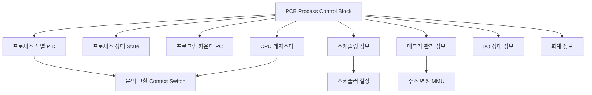

+++
title = "PCB 구성 요소 필수 암기"
date = "2026-03-14"
weight = 683
+++

> **💡 Insight**
> - PCB (Process Control Block) 또는 TCB (Task Control Block)는 운영체제가 각 프로세스를 관리하기 위해 유지하는 핵심 데이터 구조로, 프로세스의 모든 상태 정보를 저장합니다.
> - PCB에는 PID, 상태, PC, 레지스터, 스케줄링 정보, 메모리 정보, I/O 상태, 회계 정보 등 프로세스 실행에 필요한 모든 메타데이터가 포함됩니다.
> - 문맥 교환(Context Switch) 시 PCB의 레지스터 정보를 저장/복원하며, 스케줄러(Scheduler)는 PCB의 우선순위 정보를 기반으로 CPU 할당을 결정합니다.

### Ⅰ. PCB의 정의와 핵심 역할

PCB (Process Control Block)는 운영체제 커널이 각 프로세스에 대해 유지하는 **프로세스 설명자(Process Descriptor)**입니다. 프로세스가 생성될 때 함께 할당되며, 프로세스의 전체 수명 주기(Life Cycle) 동안 모든 제어 정보를 담고 있습니다. Linux 커널에서는 `task_struct` 구조체로 구현되며, 수백 개의 필드를 포함합니다.

```text
┌─────────────────────────────────────────────────────────────────┐
│               PCB의 커널 내부 위치와 역할                        │
├─────────────────────────────────────────────────────────────────┤
│                                                                 │
│  사용자 공간 (User Space)                                        │
│  ┌───────────────────────────────────────────────────────────┐ │
│  │                    프로세스 P1, P2, P3...                   │ │
│  │    (각각 자신의 주소 공간만 보고 PCB는 볼 수 없음)           │ │
│  └───────────────────────────────────────────────────────────┘ │
│  ══════════════════════════════════════════════════════════════ │
│  커널 공간 (Kernel Space)                                        │
│  ┌───────────────────────────────────────────────────────────┐ │
│  │  ┌─────────┐  ┌─────────┐  ┌─────────┐  ┌─────────┐      │ │
│  │  │  PCB 1  │  │  PCB 2  │  │  PCB 3  │  │  PCB 4  │      │ │
│  │  │ Process │  │ Process │  │ Process │  │ Process │      │ │
│  │  │    A    │  │    B    │  │    C    │  │    D    │      │ │
│  │  └─────────┘  └─────────┘  └─────────┘  └─────────┘      │ │
│  │       │            │            │            │            │ │
│  │       └────────────┼────────────┼────────────┘            │ │
│  │                    ▼            ▼                          │ │
│  │            ┌───────────────────────────┐                  │ │
│  │            │    프로세스 테이블         │                  │ │
│  │            │  (Process Table/Array)    │                  │ │
│  │            │  PID → PCB 매핑           │                  │ │
│  │            └───────────────────────────┘                  │ │
│  │                                                          │ │
│  │  ┌─────────────────────────────────────────────────────┐ │ │
│  │  │  스케줄링 큐 (Ready Queue, Wait Queue)               │ │ │
│  │  │  PCB들을 연결 리스트로 관리                           │ │ │
│  │  └─────────────────────────────────────────────────────┘ │ │
│  └───────────────────────────────────────────────────────────┘ │
│                                                                 │
│  PCB 접근: 커널 모드에서만 가능 (사용자 직접 접근 금지)          │
└─────────────────────────────────────────────────────────────────┘
```

**[다이어그램 해설]** PCB는 커널 메모리 영역에 저장되며, 사용자 모드 프로세스는 직접 접근할 수 없습니다. 커널은 모든 PCB를 프로세스 테이블(Process Table)로 관리하며, PID (Process Identifier)를 통해 해당 프로세스의 PCB를 빠르게 찾을 수 있습니다. 스케줄링 시에는 준비 큐(Ready Queue)나 대기 큐(Wait Queue)의 연결 리스트로 PCB들을 연결하여 관리합니다. 문맥 교환 시 실행 중인 프로세스의 PCB에 레지스터를 저장하고, 다음 프로세스의 PCB에서 레지스터를 복원합니다.

> **📢 섹션 요약 비유:** PCB는 응급실의 '환자 차트'와 같습니다. 환자(프로세스)의 이름, 현재 상태, 투약 기록, 담당 의사, 입원 정보 등 모든 것이 적혀 있죠. 의사(커널)는 이 차트를 보고 다음 치료(CPU 할당)를 결정합니다.

### Ⅱ. PCB 핵심 구성 요소 상세 분석

PCB는 크게 8가지 핵심 구성 요소로 분류됩니다. 기술사 시험에서는 이 8가지를 정확히 암기하는 것이 필수입니다.

```text
┌───────────────────────────────────────────────────────────────────┐
│                    PCB 8대 핵심 구성 요소                          │
├───────────────────────────────────────────────────────────────────┤
│                                                                   │
│  ┌─────────────────────────────────────────────────────────────┐ │
│  │ 1. 프로세스 식별자 (PID: Process Identifier)                  │ │
│  │    • 고유 정수 ID (Linux: 1~32768, 확장 시 더 큼)            │ │
│  │    • 부모 PID (PPID), 사용자 ID (UID, GID)                   │ │
│  │    • 프로세스 그룹 ID, 세션 ID                               │ │
│  ├─────────────────────────────────────────────────────────────┤ │
│  │ 2. 프로세스 상태 (Process State)                             │ │
│  │    • New, Ready, Running, Waiting, Terminated               │ │
│  │    • 상태 전이 다이어그램의 핵심                              │ │
│  ├─────────────────────────────────────────────────────────────┤ │
│  │ 3. 프로그램 카운터 (PC: Program Counter)                     │ │
│  │    • 다음에 실행할 명령어 주소                               │ │
│  │    • 문맥 교환 시 저장/복원 핵심                             │ │
│  ├─────────────────────────────────────────────────────────────┤ │
│  │ 4. CPU 레지스터 저장 영역 (CPU Registers)                    │ │
│  │    • 범용 레지스터 (R0-Rn, AX/BX/CX/DX 등)                  │ │
│  │    • 스택 포인터 (SP), 베이스 포인터 (BP)                    │ │
│  │    • 플래그 레지스터 (PSW, EFLAGS)                          │ │
│  ├─────────────────────────────────────────────────────────────┤ │
│  │ 5. CPU 스케줄링 정보 (CPU Scheduling Info)                   │ │
│  │    • 우선순위 (Priority), nice 값                            │ │
│  │    • 스케줄링 클래스 (CFS, RT 등)                           │ │
│  │    • 실행 시간 통계, 대기 시간                               │ │
│  ├─────────────────────────────────────────────────────────────┤ │
│  │ 6. 메모리 관리 정보 (Memory Management Info)                 │ │
│  │    • 페이지 테이블 베이스 (CR3, PTBR)                        │ │
│  │    • 코드/데이터/힙/스택 영역 포인터                         │ │
│  │    • 가상 주소 공간 구조 (mm_struct in Linux)                │ │
│  ├─────────────────────────────────────────────────────────────┤ │
│  │ 7. I/O 상태 정보 (I/O Status Info)                           │ │
│  │    • 열린 파일 디스크립터 테이블                             │ │
│  │    • 할당된 I/O 장치 목록                                    │ │
│  │    • 대기 중인 I/O 요청                                      │ │
│  ├─────────────────────────────────────────────────────────────┤ │
│  │ 8. 회계 정보 (Accounting Info)                               │ │
│  │    • CPU 사용 시간, 실제 실행 시간                           │ │
│  │    • 시간 제한 (Time Limit), 타이머                          │ │
│  │    • 작업/프로세스 번호, 사용자 ID                           │ │
│  └─────────────────────────────────────────────────────────────┘ │
│                                                                   │
│  암기 팁: "PID-상태-PC-레지스터-스케줄링-메모리-I/O-회계"          │
│          = "아이 상태 PC 레스토랑 메뉴 아이오 회계"               │
└───────────────────────────────────────────────────────────────────┘
```

**[다이어그램 해설]** 이 8가지 구성 요소는 프로세스 관리의 모든 측면을 포괄합니다. PID는 프로세스 식별, 상태는 스케줄링 결정, PC와 레지스터는 실행 흐름 복원, 스케줄링 정보는 CPU 할당 우선순위, 메모리 정보는 주소 변환, I/O 정보는 장치 관리, 회계 정보는 자원 사용량 추적에 각각 사용됩니다. Linux의 `task_struct`는 이 외에도 수백 개의 필드를 포함하지만, 기술사 시험에서는 이 8가지를 정확히 암기하는 것이 핵심입니다.

> **📢 섹션 요약 비유:** PCB의 8가지 요소는 신분증, 건강 상태, 현재 위치, 지갑 내용물, 우선순위, 집 주소, 소지품, 사용 내역을 적어둔 '완전한 개인 파일'과 같습니다. 이 파일만 있으면 그 사람을 완벽하게 파악할 수 있죠.

### Ⅲ. 문맥 교환에서의 PCB 활용

문맥 교환(Context Switch)은 실행 중인 프로세스의 상태를 PCB에 저장하고, 새 프로세스의 PCB에서 상태를 복원하는 과정입니다. 이때 PCB의 **레지스터 저장 영역**이 핵심 역할을 합니다.

```text
┌───────────────────────────────────────────────────────────────────┐
│              문맥 교환 시 PCB 저장/복원 과정                       │
├───────────────────────────────────────────────────────────────────┤
│                                                                   │
│  [Step 1] 현재 프로세스 A의 상태 저장                              │
│                                                                   │
│  CPU 레지스터                    PCB A                           │
│  ┌────────────┐                 ┌────────────────────────┐       │
│  │ PC  = 0x100│ ──── 저장 ────▶ │ saved_PC    = 0x100   │       │
│  │ SP  = 0xFFF│ ──── 저장 ────▶ │ saved_SP    = 0xFFF   │       │
│  │ R0  = 42   │ ──── 저장 ────▶ │ saved_R0    = 42      │       │
│  │ R1  = 100  │ ──── 저장 ────▶ │ saved_R1    = 100     │       │
│  │ PSW = 0x202│ ──── 저장 ────▶ │ saved_PSW   = 0x202   │       │
│  └────────────┘                 │ state = READY          │       │
│                                 └────────────────────────┘       │
│                                                                   │
│  [Step 2] 다음 프로세스 B의 PCB에서 복원                           │
│                                                                   │
│  PCB B                          CPU 레지스터                     │
│  ┌────────────────────────┐     ┌────────────┐                  │
│  │ saved_PC    = 0x500   │ ──▶ │ PC  = 0x500│                  │
│  │ saved_SP    = 0xAAA   │ ──▶ │ SP  = 0xAAA│                  │
│  │ saved_R0    = 77      │ ──▶ │ R0  = 77   │                  │
│  │ saved_R1    = 200     │ ──▶ │ R1  = 200  │                  │
│  │ saved_PSW   = 0x200   │ ──▶ │ PSW = 0x200│                  │
│  │ state = RUNNING        │     │            │                  │
│  └────────────────────────┘     └────────────┘                  │
│                                                                   │
│  [Step 3] 프로세스 B 실행 재개                                     │
│  PC(0x500)가 가리키는 명령어부터 실행 계속                         │
│                                                                   │
│  ┌─────────────────────────────────────────────────────────────┐ │
│  │  문맥 교환 오버헤드 요소                                     │ │
│  ├─────────────────────────────────────────────────────────────┤ │
│  │  ① 레지스터 저장/복원: ~10-100 ns (CPU 속도 의존)            │ │
│  │  ② PCB 상태 업데이트: ~50-200 ns                            │ │
│  │  ③ TLB 플러시/ASID 변경: ~100-500 ns                        │ │
│  │  ④ 캐시 워밍업: ~수 μs (새 프로세스 데이터 로드)             │ │
│  │  ─────────────────────────────────────────────────────────  │ │
│  │  전체 오버헤드: ~1-20 μs (현대 시스템 기준)                  │ │
│  └─────────────────────────────────────────────────────────────┘ │
└───────────────────────────────────────────────────────────────────┘
```

**[다이어그램 해설]** 문맥 교환 시 커널은 먼저 현재 실행 중인 프로세스의 PC, SP, 범용 레지스터, PSW (Program Status Word) 등을 해당 PCB의 저장 영역에 기록합니다. 그 후 스케줄러가 선택한 다음 프로세스의 PCB에서 레지스터 값을 복원합니다. 이때 PC 값을 복원하면 CPU는 그 주소의 명령어부터 실행을 재개합니다. 문맥 교환 오버헤드는 순수 레지스터 저장/복원 외에도 TLB 갱신, 캐시 워밍업 등이 포함되어 실제로는 수 마이크로초가 소요됩니다. 스레드(Thread) 문맥 교환은 주소 공간을 공유하므로 TLB 플러시가 불필요해 더 빠릅니다.

> **📢 섹션 요약 비유:** 문맥 교환은 책 읽다가 전화 받을 때 책갈피를 끼워두는 것과 같습니다. 몇 페이지까지 읽었는지(PC), 무슨 생각 하고 있었는지(레지스터)를 책갈피에 적어두죠. 전화 끝나면 책갈피를 보고 바로 그 페이지부터 읽을 수 있습니다.

### Ⅳ. Linux task_struct 실제 구조

Linux 커널에서 PCB는 `task_struct` 구조체로 구현됩니다. 실제 구조를 통해 PCB의 구체적인 필드를 확인할 수 있습니다.

```text
┌───────────────────────────────────────────────────────────────────┐
│           Linux task_struct 주요 필드 (수백 개 중 핵심만)          │
├───────────────────────────────────────────────────────────────────┤
│                                                                   │
│  struct task_struct {                                            │
│      /* [1] 식별자 */                                             │
│      pid_t pid;                  // 프로세스 ID                   │
│      pid_t tgid;                 // 스레드 그룹 ID                │
│      pid_t ppid;                 // 부모 프로세스 ID              │
│                                                                   │
│      /* [2] 상태 */                                               │
│      volatile long state;        // TASK_RUNNING, TASK_...       │
│      unsigned int flags;         // PF_EXITING, PF_FORKNOEXEC... │
│                                                                   │
│      /* [3/4] 실행 컨텍스트 */                                    │
│      struct thread_info thread_info;  // 저수준 아키텍처 정보      │
│      void *stack;                // 커널 스택 포인터              │
│                                                                   │
│      /* [5] 스케줄링 정보 */                                      │
│      int prio;                   // 정적 우선순위                 │
│      int static_prio;            // nice 값 기반                  │
│      int normal_prio;            // 정규화된 우선순위             │
│      unsigned int rt_priority;   // 실시간 우선순위               │
│      const struct sched_class *sched_class;                      │
│      struct sched_entity se;     // CFS 스케줄링 엔티티           │
│      u64 vruntime;               // 가상 실행 시간 (CFS용)        │
│                                                                   │
│      /* [6] 메모리 관리 */                                        │
│      struct mm_struct *mm;       // 사용자 주소 공간              │
│      struct mm_struct *active_mm;// 커널 스레드용                 │
│                                                                   │
│      /* [7] 파일/IO */                                            │
│      struct files_struct *files; // 열린 파일 테이블              │
│      struct fs_struct *fs;       // 파일시스템 정보               │
│                                                                   │
│      /* [8] 회계/시간 */                                          │
│      u64 utime;                  // 사용자 모드 CPU 시간          │
│      u64 stime;                  // 커널 모드 CPU 시간            │
│      unsigned long nvcsw;        // 자발적 문맥 교환 횟수         │
│      unsigned long nivcsw;       // 비자발적 문맥 교환 횟수       │
│                                                                   │
│      /* 기타 중요 필드 */                                         │
│      struct task_struct *parent; // 부모 PCB 포인터               │
│      struct list_head children;  // 자식 리스트                   │
│      struct list_head sibling;   // 형제 리스트                   │
│      struct signal_struct *signal; // 시그널 처리                │
│      struct cred *cred;          // 권한/자격증명                 │
│  };                                                              │
│                                                                   │
│  약 1.5KB ~ 수 KB 크기 (커널 버전, 아키텍처에 따라 다름)           │
└───────────────────────────────────────────────────────────────────┘
```

**[다이어그램 해설]** `task_struct`는 수백 개의 필드를 포함하는 거대한 구조체입니다. Linux에서는 프로세스와 스레드를 모두 '태스크(Task)'로 통일하여 관리하므로, 스레드도 별도의 `task_struct`를 가지며 `mm` 포인터를 통해 동일한 주소 공간을 공유합니다. `vruntime`은 CFS (Completely Fair Scheduler)가 공정한 CPU 분배를 위해 사용하는 핵심 필드로, 실행 시간이 짧은 프로세스가 우선 스케줄링됩니다. `files` 구조체는 파일 디스크립터 0(stdin), 1(stdout), 2(stderr) 등을 포함합니다.

> **📢 섹션 요약 비유:** Linux의 `task_struct`는 군대의 '병적부'와 같습니다. 군번, 계급, 소속, 훈련 기록, 포상/징계 내역, 건강 상태, 가족 관계 등 모든 것이 한 파일에 정리되어 있죠.

### Ⅴ. 결론 및 암기 포인트

기술사 시험을 위한 PCB 핵심 암기 포인트를 정리합니다.

| 구분 | 핵심 내용 | 암기 키워드 |
|:---|:---|:---|
| **정의** | 프로세스 관리용 커널 데이터 구조 | "프로세스 설명자" |
| **위치** | 커널 메모리 (사용자 접근 불가) | "커널 전용" |
| **용도** | 문맥 교환, 스케줄링, 자원 관리 | "실행 복원" |
| **8대 구성요소** | PID, 상태, PC, 레지스터, 스케줄링, 메모리, I/O, 회계 | 암기 필수! |
| **Linux 구현** | `task_struct` 구조체 | 수백 개 필드 |

**암기 킥:** **"아이(PID) 상태(State) PC 레지스터 스케줄링 메모리(Memory) 아이오(I/O) 회계"**

> **📢 섹션 요약 비유:** PCB는 운영체제의 '비서'가 관리하는 '업무 파일'입니다. 이 파일만 있으면 어떤 업무(프로세스)가 진행 중이고, 어디까지 처리했는지, 누가 담당하는지, 얼마나 자원을 썼는지 모든 것을 파악할 수 있죠.

---

### 💡 Knowledge Graph


### 👧 Child Analogy
PCB는 학교의 '학생부'와 같아! 학생(프로세스)의 이름(PID), 학년(상태), 현재 수업 중인 교과서 페이지(PC), 책가방 내용물(레지스터), 성적(스케줄링), 사물함 번호(메모리), 빌린 도서(I/O), 출석 기록(회계)이 모두 적혀 있어. 선생님(커널)은 이 학생부를 보고 누구를 다음에 발표시킬지(스케줄링) 결정하시지!