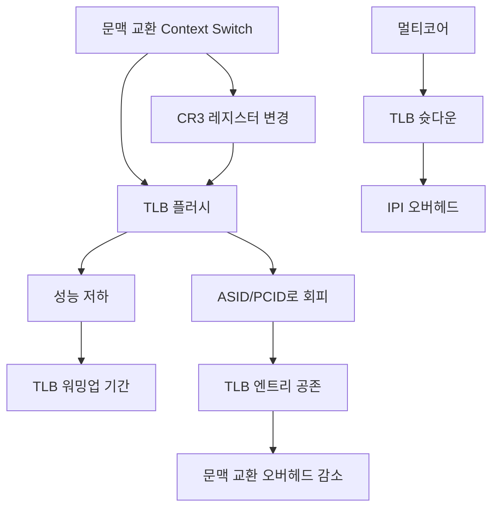

+++
title = "문맥 교환 TLB 플러시"
date = "2026-03-14"
weight = 684
+++

> **💡 Insight**
> - 문맥 교환(Context Switch) 시 새 프로세스의 주소 공간으로 전환하려면 TLB (Translation Lookaside Buffer) 갱신이 필요합니다.
> - 전통적인 방식은 전체 TLB 플러시(Flush)로, 문맥 교환마다 모든 엔트리를 무효화하여 성능 저하를 유발합니다.
> - 현대 CPU는 ASID (Address Space Identifier) 또는 PCID (Process-Context Identifier)를 사용하여 TLB 엔트리에 프로세스 식별자를 추가함으로써 불필요한 플러시를 방지합니다.

### Ⅰ. TLB 플러시가 필요한 이유

TLB (Translation Lookaside Buffer)는 가상 주소(Virtual Address)를 물리 주소(Physical Address)로 변환하는 캐시입니다. 문맥 교환으로 새 프로세스가 실행되면, 기존 TLB 엔트리는 이전 프로세스의 주소 매핑을 가리키고 있어 그대로 사용할 수 없습니다. 잘못된 매핑을 사용하면 다른 프로세스의 메모리에 접근하는 보안 사고가 발생합니다.

```text
┌───────────────────────────────────────────────────────────────────┐
│          TLB 플러시 없이 문맥 교환 시 발생하는 문제                 │
├───────────────────────────────────────────────────────────────────┤
│                                                                   │
│  [상황] Process A에서 Process B로 문맥 교환                       │
│                                                                   │
│  TLB 상태 (Process A 실행 후):                                    │
│  ┌─────────────────────────────────────────────────────────────┐ │
│  │  가상 페이지 (VPN)  │  물리 프레임 (PFN)  │  유효?           │ │
│  ├─────────────────────┼─────────────────────┼────────────────┤ │
│  │     0x1000          │     0xAAAA          │  ✅ (A의 매핑)  │ │
│  │     0x2000          │     0xBBBB          │  ✅ (A의 매핑)  │ │
│  │     0x3000          │     0xCCCC          │  ✅ (A의 매핑)  │ │
│  └─────────────────────┴─────────────────────┴────────────────┘ │
│                                                                   │
│  [문제] Process B가 가상 주소 0x1000 접근 시도                    │
│                                                                   │
│  Process B의 Page Table:                                         │
│  ┌─────────────────────────────────────────────────────────────┐ │
│  │  0x1000 → 0xDDDD (B의 실제 물리 페이지)                     │ │
│  └─────────────────────────────────────────────────────────────┘ │
│                                                                   │
│  하지만 TLB Hit 발생! (오래된 A의 매핑 사용)                      │
│  ┌─────────────────────────────────────────────────────────────┐ │
│  │  ❌ TLB 반환: 0xAAAA (A의 메모리!)                          │ │
│  │  → Process B가 Process A의 메모리에 접근!                   │ │
│  │  → 보안 위반, 데이터 오염, 크래시 가능                       │ │
│  └─────────────────────────────────────────────────────────────┘ │
│                                                                   │
│  [해결] 문맥 교환 시 TLB 전체 무효화 (Flush) 필요                  │
│  ┌─────────────────────────────────────────────────────────────┐ │
│  │  CR3 레지스터 변경 시 자동으로 TLB 무효화                    │ │
│  │  또는 INVLPG 명령어로 개별/전체 엔트리 무효화                │ │
│  └─────────────────────────────────────────────────────────────┘ │
└───────────────────────────────────────────────────────────────────┘
```

**[다이어그램 해설]** TLB는 가상 페이지 번호(VPN)를 물리 프레임 번호(PFN)로 매핑하는 캐시입니다. 문맥 교환 후 페이지 테이블이 변경되어도 TLB 엔트리가 갱신되지 않으면, 새 프로세스가 이전 프로세스의 물리 메모리에 접근하게 됩니다. 이는 보안상 심각한 취약점입니다. 따라서 x86 아키텍처에서는 CR3 레지스터(페이지 디렉토리 베이스) 변경 시 자동으로 TLB를 플러시하거나, `INVLPG` 명령어로 특정 엔트리를 무효화합니다.

> **📢 섹션 요약 비유:** TLB 플러시 없는 문맥 교환은 이전 손님의 주문서를 그대로 사용하는 것과 같습니다. 새 손님이 '김치찌개'를 주문했는데(가상 주소), 주문서에는 '된장찌개'(이전 매핑)가 적혀 있어 엉뚱한 요리가 나오는 셈이죠.

### Ⅱ. TLB 플러시 방식과 성능 영향

TLB 플러시는 문맥 교환 오버헤드의 주요 원인 중 하나입니다. 플러시 후 새 프로세스 실행 초기에는 대량의 TLB 미스가 발생하여 성능이 저하됩니다.

```text
┌───────────────────────────────────────────────────────────────────┐
│              TLB 플러시 방식과 성능 영향 분석                       │
├───────────────────────────────────────────────────────────────────┤
│                                                                   │
│  [방식 1] 전체 TLB 플러시 (Traditional)                           │
│                                                                   │
│  ┌─────────────────────────────────────────────────────────────┐ │
│  │  문맥 교환 발생                                              │ │
│  │       │                                                      │ │
│  │       ▼                                                      │ │
│  │  ┌─────────────┐                                             │ │
│  │  │ CR3 변경    │ ──▶ 자동 TLB 전체 무효화                    │ │
│  │  └─────────────┘                                             │ │
│  │       │                                                      │ │
│  │       ▼                                                      │ │
│  │  ┌─────────────────────────────────────────────────────────┐│ │
│  │  │ 새 프로세스 실행 시작                                    ││ │
│  │  │ • 첫 메모리 접근 → TLB Miss                              ││ │
│  │  │ • Page Table Walk → 메모리 접근 (수십~수백 사이클)       ││ │
│  │  │ • TLB 적재 후 재접근 → Hit                               ││ │
│  │  │ • 반복... (워밍업 기간)                                  ││ │
│  │  └─────────────────────────────────────────────────────────┘│ │
│  └─────────────────────────────────────────────────────────────┘ │
│                                                                   │
│  성능 영향:                                                       │
│  ┌─────────────────────────────────────────────────────────────┐ │
│  │  TLB 워밍업 기간: ~수천~수만 명령어                          │ │
│  │  초기 TLB 미스율: 90%+ → 점진적으로 1-5%로 감소              │ │
│  │  각 TLB 미스: ~20-200 사이클 (4-level Page Table Walk)      │ │
│  └─────────────────────────────────────────────────────────────┘ │
│                                                                   │
│  [방식 2] 선택적 TLB 무효화 (INVLPG)                              │
│                                                                   │
│  ┌─────────────────────────────────────────────────────────────┐ │
│  │  특정 페이지만 변경된 경우                                   │ │
│  │  INVLPG <가상주소> 명령어로 해당 엔트리만 무효화             │ │
│  │  → 다른 엔트리는 유지됨                                      │ │
│  │  → 성능 향상 (공유 페이지, COW 등에서 유용)                  │ │
│  └─────────────────────────────────────────────────────────────┘ │
└───────────────────────────────────────────────────────────────────┘
```

**[다이어그램 해설]** 전체 TLB 플러시 후 새 프로세스 실행 시, 첫 메모리 접근마다 TLB 미스가 발생하여 4단계 페이지 테이블 순회(Page Table Walk)가 필요합니다. 이는 각 미스당 20~200 CPU 사이클을 소모합니다. TLB가 점진적으로 채워지면서(Warm-up) 미스율이 감소하지만, 이 워밍업 기간 동안 성능이 크게 저하됩니다. `INVLPG` 명령어는 특정 가상 주소에 대한 TLB 엔트리만 무효화하므로, 페이지 교체나 COW (Copy-on-Write) 발생 시 유용합니다.

> **📢 섹션 요약 비유:** 전체 TLB 플러시는 도서관 사서가 교대할 때마다 모든 도서 위치를 잊어버리는 것과 같습니다. 새 사서는 책을 찾을 때마다 처음부터 목록을 뒤져야 하죠. 선택적 무효화는 특정 책만 위치가 바뀌었다는 것만 기억하면 되는 효율적인 방식입니다.

### Ⅲ. ASID/PCID를 통한 TLB 플러시 회피

현대 CPU는 TLB 엔트리에 **주소 공간 식별자(Address Space Identifier)**를 추가하여, 문맥 교환 시에도 TLB를 플러시하지 않고 여러 프로세스의 매핑을 공존시킬 수 있습니다.

```text
┌───────────────────────────────────────────────────────────────────┐
│         ASID/PCID 기반 TLB 관리 (TLB Flush 회피)                   │
├───────────────────────────────────────────────────────────────────┤
│                                                                   │
│  [기존 TLB 엔트리 구조]                                           │
│  ┌─────────────────────────────────────────────────────────────┐ │
│  │  VPN (가상 페이지)  │  PFN (물리 프레임)  │  권한 비트       │ │
│  │      0x1000         │      0xAAAA         │  RW-            │ │
│  └─────────────────────┴─────────────────────┴────────────────┘ │
│  문제: 어떤 프로세스의 매핑인지 알 수 없음                         │
│                                                                   │
│  [ASID/PCID 추가된 TLB 엔트리 구조]                               │
│  ┌─────────────────────────────────────────────────────────────┐ │
│  │  VPN   │   PFN    │ 권한 │  ASID/PCID  │  Global  │        │ │
│  │ 0x1000 │  0xAAAA  │ RW-  │    0x01     │    0     │ (Proc A)│ │
│  │ 0x1000 │  0xBBBB  │ RW-  │    0x02     │    0     │ (Proc B)│ │
│  │ 0x3000 │  0xCCCC  │ R-X  │    0x01     │    0     │ (Proc A)│ │
│  │ 0xF000 │  0xFFFF  │ RW-  │    ----     │    1     │ (Kernel)│ │
│  └─────────┴──────────┴───────┴─────────────┴──────────┘        │
│                                                                   │
│  장점: 동일 VPN이 서로 다른 ASID와 공존 가능                      │
│        Global=1인 커널 매핑은 모든 프로세스에서 사용               │
│                                                                   │
│  [문맥 교환 프로세스]                                             │
│  ┌─────────────────────────────────────────────────────────────┐ │
│  │  Process A → Process B 전환                                 │ │
│  │                                                             │ │
│  │  1. ASID 레지스터만 0x02로 변경 (TLB 플러시 없음!)           │ │
│  │                                                             │ │
│  │  2. 메모리 접근 시:                                         │ │
│  │     VPN + 현재 ASID(0x02)로 TLB 검색                        │ │
│  │     → ASID=0x02인 엔트리만 매칭                             │ │
│  │     → Process B의 올바른 매핑 사용                          │ │
│  │                                                             │ │
│  │  3. 이전에 실행했던 Process A로 복귀 시:                    │ │
│  │     ASID=0x01로 변경 → TLB 엔트리 이미 존재!                │ │
│  │     → TLB 미스 없이 즉시 실행 재개                          │ │
│  └─────────────────────────────────────────────────────────────┘ │
│                                                                   │
│  x86-64: PCID (12비트, 최대 4096개)                              │
│  ARM: ASID (8비트, 최대 256개)                                   │
└───────────────────────────────────────────────────────────────────┘
```

**[다이어그램 해설]** ASID/PCID가 추가되면 TLB 엔트리는 가상 페이지 번호뿐 아니라 프로세스 식별자와 함께 저장됩니다. 문맥 교환 시 ASID/PCID 레지스터만 변경하면 되므로 TLB 플러시가 필요 없습니다. 메모리 접근 시에는 (VPN, ASID) 쌍으로 TLB를 검색하므로, 동일한 가상 주소라도 ASID가 다르면 다른 매핑이 반환됩니다. Global 비트가 설정된 커널 매핑은 모든 주소 공간에서 공유됩니다. x86-64는 12비트 PCID로 최대 4096개, ARM은 8비트 ASID로 최대 256개의 주소 공간을 동시에 캐싱할 수 있습니다.

> **📢 섹션 요약 비유:** ASID/PCID는 각 주문서에 '테이블 번호'를 적어두는 것과 같습니다. 모든 테이블의 주문서를 한 곳에 보관해도, 테이블 번호(ASID)를 보면 어떤 테이블의 주문인지 구분할 수 있죠. 이전 손님이 다시 오면 아직 주문서가 남아있어 빠르게 서빙할 수 있습니다.

### Ⅳ. 멀티코어 환경의 TLB 슛다운 (TLB Shootdown)

멀티코어 시스템에서 한 코어가 페이지 테이블을 수정하면, 다른 코어의 TLB에 있는 오래된 엔트리도 무효화해야 합니다. 이를 **TLB 슛다운(TLB Shootdown)**이라고 하며, 코어 간 인터럽트(IPI: Inter-Processor Interrupt)를 사용합니다.

```text
┌───────────────────────────────────────────────────────────────────┐
│                멀티코어 TLB 슛다운 과정                            │
├───────────────────────────────────────────────────────────────────┤
│                                                                   │
│  Core 0                      Core 1          Core 2              │
│  (페이지 해제)               (실행 중)        (실행 중)            │
│                                                                   │
│  ┌──────────┐               ┌──────────┐    ┌──────────┐        │
│  │ 페이지   │               │ TLB에    │    │ TLB에    │        │
│  │ 테이블   │               │ 오래된   │    │ 오래된   │        │
│  │ 수정!    │               │ 매핑!    │    │ 매핑!    │        │
│  └────┬─────┘               └──────────┘    └──────────┘        │
│       │                                                          │
│       │ IPI 전송 (TLB Shootdown 요청)                            │
│       ├──────────────────────▶│              │                   │
│       └──────────────────────────────────────▶│                  │
│       │                                                          │
│       │  Core 1, 2가 INVLPG 또는 TLB Flush 수행                  │
│       │  Core 0은 완료 대기 (Barrier)                            │
│       ▼                                                          │
│  ┌──────────┐               ┌──────────┐    ┌──────────┐        │
│  │ 진행     │◀───────────── │ 완료     │    │ 완료     │        │
│  │ 계속     │               │ 응답     │    │ 응답     │        │
│  └──────────┘               └──────────┘    └──────────┘        │
│                                                                   │
│  오버헤드:                                                        │
│  ┌─────────────────────────────────────────────────────────────┐ │
│  │  • IPI 전송/수신: ~1-5 μs                                   │ │
│  │  • 코어 수 증가 시 선형적으로 증가                           │ │
│  │  • 대규모 시스템에서 병목 가능                               │ │
│  │  • Linux: flush_tlb_page(), flush_tlb_mm() 함수              │ │
│  └─────────────────────────────────────────────────────────────┘ │
└───────────────────────────────────────────────────────────────────┘
```

**[다이어그램 해설]** 한 코어가 페이지를 해제하거나 권한을 변경하면, 해당 페이지가 다른 코어의 TLB에 캐시되어 있을 수 있습니다. 이때 코어 0은 다른 모든 코어에 IPI (Inter-Processor Interrupt)를 보내 TLB 엔트리 무효화를 요청합니다. 다른 코어들은 현재 작업을 중단하고 TLB 플러시를 수행한 후 완료를 응답합니다. 코어 0은 모든 코어가 완료할 때까지 대기해야 하므로, 코어 수가 많은 시스템에서는 TLB 슛다운이 상당한 오버헤드가 됩니다. 이를 최적화하기 위해 deferred TLB flush나 RCU 기반 기법이 연구되고 있습니다.

> **📢 섹션 요약 비유:** TLB 슛다운은 식당 주방에서 "이 메뉴 단종되었습니다!"라고 모든 주방장에게 방송하는 것과 같습니다. 한 주방장이 메뉴를 없앴는데, 다른 주방장이 모르고 계속 만들면 문제가 되니까요. 모든 주방장이 "알겠습니다!"라고 응답할 때까지 기다려야 합니다.

### Ⅴ. 결론 및 성능 최적화 전략

TLB 관리는 시스템 성능에 직접적인 영향을 미치며, 다음 전략으로 최적화할 수 있습니다.

| 전략 | 설명 | 효과 |
|:---|:---|:---|
| **ASID/PCID 활성화** | TLB에 프로세스 식별자 추가 | 문맥 교환 오버헤드 **50-80% 감소** |
| **Huge Pages** | 4KB → 2MB/1GB 페이지 | TLB 커버리지 **512배~262144배 증가** |
| **PCID 할당 최적화** | 자주 전환되는 프로세스에만 PCID | PCID 공간 절약 |
| **Deferred Flush** | 즉시 플러시 대신 지연 처리 | IPI 횟수 감소 |

**핵심 교훈:** TLB 플러시는 문맥 교환 오버헤드의 숨은 원인입니다. ASID/PCID와 Huge Pages를 적절히 활용하면 성능을 크게 향상시킬 수 있습니다.

> **📢 섹션 요약 비유:** TLB 최적화는 자주 찾는 책을 책상 위에 두는 것과 같습니다. ASID는 책마다 이름표를 붙여서 섞여도 구분하게 하고, Huge Pages는 두꺼운 책 한 권으로 얇은 책 여러 권을 대체하는 것입니다.

---

### 💡 Knowledge Graph


### 👧 Child Analogy
TLB는 책갈피 같은 거야! 읽던 책의 페이지를 기억해두는 거지. 근데 다른 책을 읽으려고 하면 책갈피가 엉뚱한 책의 페이지를 가리키고 있어서 문제가 돼. 그래서 책을 바꿀 때마다 책갈피를 다 빼야 했는데(플러시), 요즘은 책갈피마다 책 이름(ASID)을 적어둬서 그냥 쓸 수 있게 됐어!