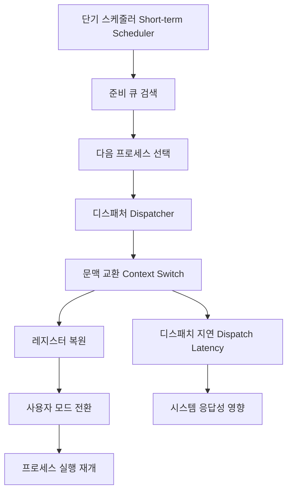

+++
title = "단기 스케줄러 디스패치"
date = "2026-03-14"
weight = 685
+++

> **💡 Insight**
> - 단기 스케줄러(Short-term Scheduler)는 CPU 스케줄러라고도 하며, 준비 큐(Ready Queue)에서 실행할 다음 프로세스를 선택합니다.
> - 디스패처(Dispatcher)는 스케줄러가 선택한 프로세스에게 실제 CPU 제어권을 이양하는 모듈입니다.
> - 디스패치 지연(Dispatch Latency)은 문맥 교환 시작부터 새 프로세스가 실제 실행을 시작할 때까지의 시간입니다.

### Ⅰ. 스케줄러와 디스패처의 역할 구분

운영체제의 스케줄링 시스템에서 **스케줄러(Scheduler)**는 "누구를 실행할까?"를 결정하고, **디스패처(Dispatcher)**는 "어떻게 실행을 시작할까?"를 수행합니다. 이 두 기능은 밀접하게 연관되어 있지만 역할이 다릅니다.

```text
┌───────────────────────────────────────────────────────────────────┐
│          스케줄러 vs 디스패처 역할 비교                            │
├───────────────────────────────────────────────────────────────────┤
│                                                                   │
│  ┌─────────────────────────────────────────────────────────────┐ │
│  │                      CPU 스케줄링 시스템                      │ │
│  │  ┌───────────────────────┐  ┌───────────────────────────┐   │ │
│  │  │   단기 스케줄러        │  │       디스패처            │   │ │
│  │  │   (Short-term         │  │      (Dispatcher)        │   │ │
│  │  │    Scheduler)         │  │                          │   │ │
│  │  ├───────────────────────┤  ├───────────────────────────┤   │ │
│  │  │ • 스케줄링 알고리즘    │  │ • 문맥 교환 수행          │   │ │
│  │  │   실행 (FCFS, RR,     │  │ • 커널 → 사용자 모드     │   │ │
│  │  │   SJF, Priority,      │  │   전환                   │   │ │
│  │  │   MLFQ 등)            │  │ • PC 점프 (프로그램     │   │ │
│  │  │ • 준비 큐에서 다음    │  │   재개 위치)            │   │ │
│  │  │   실행 프로세스 선택   │  │ • 실행 시작             │   │ │
│  │  │ • 스케줄링 결정만 수행 │  │ • 실제 CPU 이양         │   │ │
│  │  └───────────┬───────────┘  └───────────┬───────────────┘   │ │
│  │              │                          │                   │ │
│  │              │  선택된 프로세스          │                   │ │
│  │              │  PCB 포인터 전달         │                   │ │
│  │              ▼                          │                   │ │
│  │  ┌───────────────────────────────────────────────────────┐  │ │
│  │  │                    실행 흐름                          │  │ │
│  │  │  준비 큐 ──▶ 스케줄러 선택 ──▶ 디스패처 ──▶ CPU 실행  │  │ │
│  │  └───────────────────────────────────────────────────────┘  │ │
│  └─────────────────────────────────────────────────────────────┘ │
│                                                                   │
│  ┌─────────────────────────────────────────────────────────────┐ │
│  │  질문으로 구분하기                                           │ │
│  ├─────────────────────────────────────────────────────────────┤ │
│  │  Q: "준비 큐에서 누구를 뽑을까?" → 스케줄러                  │ │
│  │  Q: "뽑힌 프로세스를 어떻게 실행시킬까?" → 디스패처          │ │
│  └─────────────────────────────────────────────────────────────┘ │
└───────────────────────────────────────────────────────────────────┘
```

**[다이어그램 해설]** 단기 스케줄러는 준비 큐(Ready Queue)에 있는 프로세스들 중에서 스케줄링 알고리즘(FCFS, Round Robin, Priority 등)에 따라 다음에 실행할 프로세스를 선택합니다. 선택만 하고 실제 실행은 하지 않습니다. 디스패처는 스케줄러가 선택한 프로세스의 PCB에서 문맥을 복원하고, 커널 모드에서 사용자 모드로 전환한 후 프로그램 카운터(PC)가 가리키는 위치로 점프하여 실행을 시작합니다. 이 두 과정이 합쳐져서 하나의 스케줄링 사이클을 구성합니다.

> **📢 섹션 요약 비유:** 스케줄러는 식당에서 "다음 손님 누구세요?"를 결정하는 대기열 관리자입니다. 디스패처는 그 손님을 실제 자리로 안내하고 메뉴판을 주는 직원이죠. 둘 다 필요하지만 역할은 다릅니다.

### Ⅱ. 디스패처의 상세 동작 과정

디스패처가 수행하는 **문맥 교환(Context Switch)**은 매우 정교한 과정을 거칩니다. 이 과정에서 발생하는 시간이 **디스패치 지연(Dispatch Latency)**입니다.

```text
┌───────────────────────────────────────────────────────────────────┐
│              디스패처 상세 동작 단계                                │
├───────────────────────────────────────────────────────────────────┤
│                                                                   │
│  [현재 실행 중인 Process A에서 Process B로 전환]                   │
│                                                                   │
│  Step 1: 현재 프로세스 상태 저장                                   │
│  ┌─────────────────────────────────────────────────────────────┐ │
│  │  ① 인터럽트/시스템 콜 발생 (타이머, I/O 요청 등)             │ │
│  │  ② 커널 모드 진입                                           │ │
│  │  ③ 현재 레지스터(PC, SP, 범용레지스터) → PCB A에 저장        │ │
│  │  ④ Process A 상태 = READY 또는 WAITING                      │ │
│  └─────────────────────────────────────────────────────────────┘ │
│                          │                                       │
│                          ▼                                       │
│  Step 2: 스케줄러 호출 (다음 프로세스 선택)                        │
│  ┌─────────────────────────────────────────────────────────────┐ │
│  │  ⑤ schedule() 함수 호출                                     │ │
│  │  ⑥ 스케줄링 알고리즘 실행 (Ready Queue 검색)                 │ │
│  │  ⑦ Process B 선택 (최고 우선순위, 최소 vruntime 등)         │ │
│  │  ⑧ Process B 상태 = RUNNING                                 │ │
│  └─────────────────────────────────────────────────────────────┘ │
│                          │                                       │
│                          ▼                                       │
│  Step 3: 디스패치 (문맥 교환 완료)                                 │
│  ┌─────────────────────────────────────────────────────────────┐ │
│  │  ⑨ PCB B에서 레지스터 값 복원                               │ │
│  │  ⑩ 페이지 테이블 전환 (CR3 변경, TLB 갱신)                  │ │
│  │  ⑪ 커널 스택 → Process B의 커널 스택으로 전환               │ │
│  │  ⑫ iret/sysret 명령어로 사용자 모드 복귀                    │ │
│  │  ⑬ PC가 가리키는 주소부터 실행 재개                          │ │
│  └─────────────────────────────────────────────────────────────┘ │
│                                                                   │
│  ┌─────────────────────────────────────────────────────────────┐ │
│  │           디스패치 지연(Dispatch Latency) 구성               │ │
│  ├─────────────────────────────────────────────────────────────┤ │
│  │                                                             │ │
│  │  │◀─────── 디스패치 지연(Dispatch Latency) ─────────────▶│  │ │
│  │  │                                                        │  │ │
│  │  │  레지스터   │ 스케줄러  │  레지스터   │  모드   │ TLB  │  │ │
│  │  │  저장      │ 호출     │  복원      │  전환   │ 갱신 │  │ │
│  │  │  (~100ns)  │(~1-5μs) │  (~100ns)  │(~50ns)  │(가변)│  │ │
│  │  │                                                        │  │ │
│  │  총 디스패치 지연: 전형적으로 1-20 μs                      │  │ │
│  │  (시스템 복잡도, 아키텍처, 캐시 상태에 따라 다름)           │  │ │
│  └─────────────────────────────────────────────────────────────┘ │
└───────────────────────────────────────────────────────────────────┘
```

**[다이어그램 해설]** 디스패치 과정은 크게 3단계로 구성됩니다. 첫째, 현재 실행 중인 프로세스의 레지스터를 PCB에 저장합니다. 둘째, 스케줄러가 다음 실행할 프로세스를 선택합니다. 셋째, 선택된 프로세스의 PCB에서 레지스터를 복원하고 사용자 모드로 전환하여 실행을 재개합니다. 디스패치 지연은 이 전체 과정의 소요 시간을 의미하며, 전형적으로 1~20 마이크로초가 소요됩니다. 스레드(Thread) 문맥 교환은 주소 공간을 공유하므로 페이지 테이블 전환이 필요 없어 더 빠릅니다.

> **📢 섹션 요약 비유:** 디스패치 과정은 TV 채널을 바꾸는 것과 같습니다. 현재 보던 채널(프로세스 A)의 위치를 기억해두고(저장), 리모컨으로 새 채널(프로세스 B)을 선택한 뒤(스케줄링), 화면이 바뀌고 소리가 나오기까지(모드 전환) 시간이 걸리죠. 그 시간이 디스패치 지연입니다.

### Ⅲ. 스케줄링 vs 디스패치 타이밍 다이어그램

스케줄러와 디스패처가 언제 동작하는지를 타임라인으로 확인하면 두 구성 요소의 관계가 명확해집니다.

```text
┌───────────────────────────────────────────────────────────────────┐
│             CPU 스케줄링 타임라인 (선점형 스케줄링)                 │
├───────────────────────────────────────────────────────────────────┤
│                                                                   │
│  시간 ─────────────────────────────────────────────────────────▶  │
│                                                                   │
│  Process A 실행    │문맥교환│  Process B 실행   │문맥교환│ ...    │
│  ═════════════════╪═══════╪═══════════════════╪═══════╪        │
│                    │       │                    │       │        │
│  ▲                 │       │                    │       │        │
│  │                 │       │                    │       │        │
│  │                 ▼       ▼                    ▼       ▼        │
│  │              ┌────────────┐               ┌────────────┐      │
│  │              │ 스케줄러   │               │ 스케줄러   │      │
│  │              │ 호출       │               │ 호출       │      │
│  │              └─────┬──────┘               └─────┬──────┘      │
│  │                    │                            │             │
│  타임 슬라이스        ▼                            ▼             │
│  만료!            ┌────────────┐               ┌────────────┐    │
│  (인터럽트)       │ 디스패처   │               │ 디스패처   │    │
│  │               │ 문맥교환   │               │ 문맥교환   │    │
│  │               └────────────┘               └────────────┘    │
│  │                                                             │
│  │◀─ Dispatch ─▶│                                             │
│  │   Latency    │                                             │
│                                                                   │
│  ┌─────────────────────────────────────────────────────────────┐ │
│  │  스케줄링 결정 발생 시점 (Scheduling Points)                 │ │
│  ├─────────────────────────────────────────────────────────────┤ │
│  │  1. 프로세스 상태 변화: Running → Waiting (I/O 요청)         │ │
│  │  2. 프로세스 상태 변화: Running → Terminated (종료)          │ │
│  │  3. 프로세스 상태 변화: Waiting → Ready (I/O 완료)           │ │
│  │  4. 타임 슬라이스 만료 (Timer Interrupt)                     │ │
│  │  5. 인터럽트 처리 완료 후 복귀 시                             │ │
│  │  6. 프로세스 생성(fork) 완료 시                               │ │
│  └─────────────────────────────────────────────────────────────┘ │
└───────────────────────────────────────────────────────────────────┘
```

**[다이어그램 해설]** 스케줄링 결정은 프로세스 상태가 변화할 때마다 발생합니다. 실행 중인 프로세스가 I/O 요청으로 대기 상태로 전환되거나, 타임 슬라이스가 만료되거나, 종료되면 스케줄러가 호출됩니다. 디스패처는 스케줄러의 결정을 실제로 실행하는 역할을 합니다. 선점형 스케줄링(Preemptive Scheduling)에서는 타이머 인터럽트가 주기적으로 발생하여 실행 중인 프로세스를 중단하고 스케줄링을 트리거합니다. 비선점형(Non-preemptive)에서는 프로세스가 자발적으로 CPU를 양보할 때만 스케줄링이 발생합니다.

> **📢 섹션 요약 비유:** 스케줄링 타이밍은 게임의 턴 전환과 같습니다. 한 플레이어가 턴을 마치거나(종료), 시간이 다 되거나(타임 슬라이스), 카드를 내고 대기해야 하면(I/O), 다음 차례를 누가 할지 결정하죠.

### Ⅳ. 디스패치 지연 최적화

디스스패치 지연(Dispatch Latency)은 시스템 응답성에 직접적인 영향을 미치므로 최적화가 중요합니다.

```text
┌───────────────────────────────────────────────────────────────────┐
│              디스패치 지연 최적화 기법                              │
├───────────────────────────────────────────────────────────────────┤
│                                                                   │
│  [1] 빠른 문맥 교환 기법                                          │
│  ┌─────────────────────────────────────────────────────────────┐ │
│  │  • 레지스터 lazy 저장: 실제 사용된 레지스터만 저장           │ │
│  │  • FPU/SIMD 지연 저장: float/벡터 연산 없으면 스킵          │ │
│  │  • 커널 진입/출구 최적화: syscall fast path                 │ │
│  └─────────────────────────────────────────────────────────────┘ │
│                                                                   │
│  [2] 스케줄러 결정 최적화                                          │
│  ┌─────────────────────────────────────────────────────────────┐ │
│  │  • O(1) 스케줄러: 상수 시간 선택 (Active/Expired 배열)       │ │
│  │  • CFS 레드블랙트리: O(log n) 삽입/삭제                     │ │
│  │  • 캐시된 선택: 자주 실행되는 프로세스 우선                  │ │
│  │  • Per-CPU Runqueue: 코어별 큐로 락 경합 감소               │ │
│  └─────────────────────────────────────────────────────────────┘ │
│                                                                   │
│  [3] TLB/캐시 친화적 스케줄링                                      │
│  ┌─────────────────────────────────────────────────────────────┐ │
│  │  • Cache-aware scheduling: 같은 코어에서 실행 유지           │ │
│  │  • NUMA-aware scheduling: 로컬 메모리 노드 우선              │ │
│  │  • ASID/PCID 활용: TLB 플러시 회피                          │ │
│  └─────────────────────────────────────────────────────────────┘ │
│                                                                   │
│  ┌─────────────────────────────────────────────────────────────┐ │
│  │           디스패치 지연 벤치마크 (대략적 수치)                │ │
│  ├─────────────────────────────────────────────────────────────┤ │
│  │  시스템              │ 프로세스 전환 │ 스레드 전환          │ │
│  ├─────────────────────┼───────────────┼──────────────────────┤ │
│  │  x86-64 (Linux)     │   1-5 μs     │   0.5-2 μs           │ │
│  │  ARM (모바일)       │   2-10 μs    │   1-5 μs             │ │
│  │  실시간 OS (RTOS)   │   <1 μs      │   <0.5 μs            │ │
│  └─────────────────────┴───────────────┴──────────────────────┘ │
└───────────────────────────────────────────────────────────────────┘
```

**[다이어그램 해설]** 디스패치 지연 최적화는 세 가지 영역에서 이루어집니다. 첫째, 문맥 교환 자체를 빠르게 만드는 것으로, 사용하지 않는 레지스터는 저장하지 않는 lazy 기법이나 FPU (Floating Point Unit) 상태의 지연 저장 등이 있습니다. 둘째, 스케줄러 알고리즘 자체의 최적화로, Linux CFS는 레드블랙 트리로 O(log n) 성능을, O(1) 스케줄러는 상수 시간을 보장합니다. 셋째, 캐시와 TLB 친화적 스케줄링으로, 같은 코어에서 실행을 유지하거나(Cache Affinity), ASID를 사용하여 TLB 플러시를 피합니다. 스레드 문맥 교환은 주소 공간을 공유하므로 프로세스 전환보다 2~3배 빠릅니다.

> **📢 섹션 요약 비유:** 디스패치 지연 최적화는 자동차 경주의 피트 스톱과 같습니다. 타이어 교체(문맥 교환)를 빠르게 하고, 다음 주자를 미리 선택해두며(스케줄러), 자주 쓰는 도구는 가까이 두는 것(캐시 친화적)이죠.

### Ⅴ. 결론 및 핵심 요약

| 구분 | 스케줄러(Scheduler) | 디스패처(Dispatcher) |
|:---|:---|:---|
| **질문** | 누구를 실행할까? | 어떻게 실행할까? |
| **입력** | 준비 큐(Ready Queue) | 선택된 PCB |
| **출력** | 선택된 프로세스 | CPU 제어권 이양 |
| **주요 작업** | 알고리즘에 따른 선택 | 문맥 교환, 모드 전환 |
| **성능 지표** | 공정성, 처리량 | 디스패치 지연 |

**핵심 교훈:** 스케줄러는 "무엇(What)"을, 디스패처는 "어떻게(How)"를 담당합니다. 두 기능이 조화롭게 동작해야 효율적인 CPU 스케줄링이 가능합니다.

> **📢 섹션 요약 비유:** 스케줄러와 디스패처는 마피아 조직의 '보스'와 '실무자' 관계입니다. 보스(스케줄러)는 "누구를 처리할지" 결정만 하고, 실무자(디스패처)가 실제 현장에서 실행하죠. 결정과 실행의 분리입니다.

---

### 💡 Knowledge Graph


### 👧 Child Analogy
단기 스케줄러는 놀이공원 대기줄에서 "다음 탑승자!"를 정하는 직원이야. 디스패처는 그 사람을 실제 놀이기구 좌석에 앉혀주고 안전벨트를 매어주는 직원이지. "누가 탈지" 정하는 것과 "어떻게 태울지" 수행하는 건 다른 일이야!