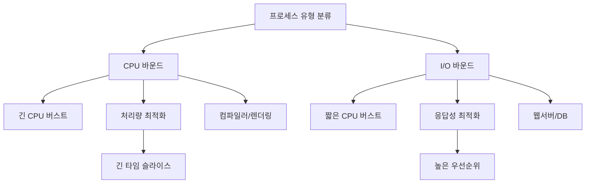

+++
title = "CPU 바운드 vs I/O 바운드"
date = "2026-03-14"
weight = 686
+++

> **💡 Insight**
> - CPU 바운드(CPU-bound) 프로세스는 대부분의 시간을 CPU 연산에 소비하며(예: 암호화, 컴파일, 과학 연산), 짧고 드문 I/O를 수행합니다.
> - I/O 바운드(I/O-bound) 프로세스는 대부분의 시간을 I/O 대기에 소비하며(예: 텍스트 편집기, DB 쿼리), CPU 사용은 짧고 빈번하지 않습니다.
> - 스케줄러는 이 두 유형을 구분하여 CPU 바운드에는 긴 타임 슬라이스를, I/O 바운드에는 짧은 타임 슬라이스와 높은 우선순위를 부여하는 것이 효율적입니다.

### Ⅰ. 프로세스 유형 분류의 필요성

운영체제는 모든 프로세스를 동일하게 취급하지 않습니다. 프로세스의 **행동 패턴(Behavior Pattern)**에 따라 스케줄링 정책을 달리해야 시스템 전체 성능(Throughput)과 응답성(Response Time)을 모두 최적화할 수 있습니다.

```text
┌───────────────────────────────────────────────────────────────────┐
│          CPU 바운드 vs I/O 바운드 프로세스 특성 비교               │
├───────────────────────────────────────────────────────────────────┤
│                                                                   │
│  [CPU 바운드 (CPU-Bound) 프로세스]                                │
│  ┌─────────────────────────────────────────────────────────────┐ │
│  │  실행 패턴: ████████████████████████████░░░███████████████  │ │
│  │            │◀──── 긴 CPU 버스트 ────▶│I/O│◀── CPU ──▶       │ │
│  │                                                             │ │
│  │  • CPU 버스트: 길다 (수 ms ~ 수 초)                          │ │
│  │  • I/O 버스트: 짧고 드물다                                   │ │
│  │  • 예시: 컴파일러, 암호화, 영상 렌더링, 과학 연산            │ │
│  │  • 목표: 처리량(Throughput) 최적화, 문맥 교환 최소화         │ │
│  └─────────────────────────────────────────────────────────────┘ │
│                                                                   │
│  [I/O 바운드 (I/O-Bound) 프로세스]                                │
│  ┌─────────────────────────────────────────────────────────────┐ │
│  │  실행 패턴: ██░░░░░██░░░░░░██░░░░░░██░░░░░░██               │ │
│  │            CPU│I/O 대기│CPU│I/O 대기│CPU│I/O 대기│           │ │
│  │                                                             │ │
│  │  • CPU 버스트: 짧다 (수 μs ~ 수 ms)                          │ │
│  │  • I/O 버스트: 빈번하고 길다                                 │ │
│  │  • 예시: 텍스트 에디터, 웹 서버, DB 쿼리, 파일 복사          │ │
│  │  • 목표: 응답성(Response Time) 최적화, 대기 시간 최소화      │ │
│  └─────────────────────────────────────────────────────────────┘ │
│                                                                   │
│  ┌─────────────────────────────────────────────────────────────┐ │
│  │            버스트(Burst) 분포 시각화                          │ │
│  ├─────────────────────────────────────────────────────────────┤ │
│  │                                                             │ │
│  │  CPU 사용률                                                 │ │
│  │  100%│ ████████████████                  ████  (CPU bound)  │ │
│  │      │ ████████████████                  ████               │ │
│  │   50%│ ████  ████  ████  ████  ████  ████  ████ (IO bound) │ │
│  │      │ ████  ████  ████  ████  ████  ████  ████            │ │
│  │    0%└───────────────────────────────────────────────────── │ │
│  │      시간 ────────────────────────────────────────────────▶ │ │
│  │                                                             │ │
│  │  CPU-bound: 드문 I/O로 인해 대부분 CPU 사용                  │ │
│  │  I/O-bound: 빈번한 I/O 대기로 CPU 사용률 낮음                │ │
│  └─────────────────────────────────────────────────────────────┘ │
└───────────────────────────────────────────────────────────────────┘
```

**[다이어그램 해설]** CPU 버스트(Burst)는 프로세스가 연속적으로 CPU를 사용하는 구간이고, I/O 버스트는 I/O 완료를 기다리는 구간입니다. CPU 바운드 프로세스는 긴 CPU 버스트와 짧은 I/O 버스트를 가지며, I/O 바운드 프로세스는 짧은 CPU 버스트와 긴 I/O 대기 구간이 반복됩니다. 시스템에는 보통 I/O 바운드 프로세스가 더 많지만, CPU 바운드 프로세스가 CPU 시간의 대부분을 소비합니다. 스케줄러는 이 패턴을 인식하여 각 유형에 적합한 정책을 적용해야 합니다.

> **📢 섹션 요약 비유:** CPU 바운드는 마라톤 선수입니다. 한번 뛰면(실행하면) 오래 달리고 쉬는 건 잠깐뿐이죠. I/O 바운드는 100m 단거리 선수가 택배 기다리는 것과 같습니다. 잠깐 뛰고(실행하고) 오래 기다립니다.

### Ⅱ. 스케줄링 관점에서의 최적화 전략

두 프로세스 유형에 따라 스케줄링 파라미터를 다르게 설정하면 시스템 전체 효율이 향상됩니다.

```text
┌───────────────────────────────────────────────────────────────────┐
│          유형별 최적 스케줄링 파라미터 설정                        │
├───────────────────────────────────────────────────────────────────┤
│                                                                   │
│  ┌─────────────────────────────────────────────────────────────┐ │
│  │  파라미터         │  CPU 바운드      │  I/O 바운드          │ │
│  ├───────────────────┼──────────────────┼──────────────────────┤ │
│  │  타임 슬라이스    │  길게 (100ms+)   │  짧게 (10-50ms)      │ │
│  │  우선순위         │  낮게            │  높게                │ │
│  │  문맥 교환 빈도   │  최소화          │  빈번해도 OK         │ │
│  │  스케줄링 클래스  │  CFS (배치)      │  CFS (인터랙티브)    │ │
│  │  nice 값          │  높게 (낮은 우선)│  낮게 (높은 우선)    │ │
│  └───────────────────┴──────────────────┴──────────────────────┘ │
│                                                                   │
│  [전략적 이유]                                                    │
│  ┌─────────────────────────────────────────────────────────────┐ │
│  │  CPU 바운드에 긴 타임 슬라이스:                              │ │
│  │  • 문맥 교환 오버헤드 최소화                                 │ │
│  │  • 캐시 지역성(Cache Locality) 유지                          │ │
│  │  • 전체 처리량(Throughput) 증가                              │ │
│  │                                                             │ │
│  │  I/O 바운드에 높은 우선순위:                                 │ │
│  │  • I/O 완료 시 즉시 CPU 획득 (인터랙티브 응답성)             │ │
│  │  • 짧은 CPU 버스트라 긴 타임 슬라이스 불필요                 │ │
│  │  • I/O 장치 활용률 향상                                      │ │
│  │  • 사용자 체감 응답성 개선                                   │ │
│  └─────────────────────────────────────────────────────────────┘ │
│                                                                   │
│  [Linux CFS 자동 분류 예시]                                       │
│  ┌─────────────────────────────────────────────────────────────┐ │
│  │  vruntime 증가 속도 = 실행시간 × (nice 가중치)               │ │
│  │  • I/O 바운드: 짧게 실행 → vruntime 적게 증가                │ │
│  │  • CPU 바운드: 길게 실행 → vruntime 많이 증가                │ │
│  │  • 결과: I/O 바운드가 더 자주 스케줄링됨!                    │ │
│  └─────────────────────────────────────────────────────────────┘ │
└───────────────────────────────────────────────────────────────────┘
```

**[다이어그램 해설]** CPU 바운드 프로세스에는 긴 타임 슬라이스를 주어 문맥 교환 오버헤드를 줄이고 캐시 효율을 높입니다. 반면 I/O 바운드 프로세스는 CPU를 짧게 쓰고 바로 I/O 대기로 들어가므로, 짧은 타임 슬라이스로도 충분하며 오히려 높은 우선순위를 주어 I/O 완료 시 즉시 응답하게 합니다. Linux CFS (Completely Fair Scheduler)는 가상 실행 시간(vruntime)을 통해 자동으로 이 균형을 맞춥니다. I/O 바운드 프로세스는 짧게 실행되므로 vruntime이 천천히 증가하고, 결과적으로 더 자주 스케줄링됩니다.

> **📢 섹션 요약 비유:** 놀이공원에서 롤러코스터(CPU 바운드)는 한 번 타면 오래 즐기니 긴 타임슬라이스를 주고, 회전목마(I/O 바운드)는 자주 타고 내리니 빠르게 교체해 주는 것과 같습니다.

### Ⅲ. 다중 프로그래밍에서의 상호작용

CPU 바운드와 I/O 바운드 프로세스가 혼재할 때, 적절한 혼합은 **CPU 이용률(CPU Utilization)**과 **시스템 처리량(Throughput)**을 모두 향상시킵니다.

```text
┌───────────────────────────────────────────────────────────────────┐
│       다중 프로그래밍에서 CPU/I/O 바운드 혼합 효과                 │
├───────────────────────────────────────────────────────────────────┤
│                                                                   │
│  [시나리오 1] CPU 바운드만 실행                                   │
│  ┌─────────────────────────────────────────────────────────────┐ │
│  │  Process A: ████████████████████████████████████████████    │ │
│  │  Process B:                     ████████████████████████████│ │
│  │                                                             │ │
│  │  CPU 이용률: 100% (좋음)                                     │ │
│  │  문제: A가 끝날 때까지 B 대기 (응답성 저하)                   │ │
│  │  타임 슬라이스로 교대 실행 필요                              │ │
│  └─────────────────────────────────────────────────────────────┘ │
│                                                                   │
│  [시나리오 2] I/O 바운드만 실행                                   │
│  ┌─────────────────────────────────────────────────────────────┐ │
│  │  Process X: ██░░░░░██░░░░░░██░░░░░░██                       │ │
│  │  Process Y: ░░░░██░░░░░░██░░░░░░██░░░░░░                    │ │
│  │  CPU 이용률: ~20-40% (CPU 유휴 시간 많음)                    │ │
│  │  문제: CPU 자원 낭비                                         │ │
│  └─────────────────────────────────────────────────────────────┘ │
│                                                                   │
│  [시나리오 3] 혼합 (최적)                                         │
│  ┌─────────────────────────────────────────────────────────────┐ │
│  │  CPU bound: ████████████████████████████████████████████    │ │
│  │  I/O bound: ██░░░░░██░░░░░░██░░░░░░██                       │ │
│  │                   ▲   ▲   ▲   ▲                              │ │
│  │             I/O 대기 중 CPU bound가 CPU 활용                 │ │
│  │                                                             │ │
│  │  CPU 이용률: 80-95% (우수)                                   │ │
│  │  응답성: I/O bound는 짧은 CPU 버스트로 빠른 응답              │ │
│  │  처리량: CPU bound는 긴 실행으로 높은 처리량                  │ │
│  └─────────────────────────────────────────────────────────────┘ │
│                                                                   │
│  ┌─────────────────────────────────────────────────────────────┐ │
│  │  핵심 원리: I/O 바운드가 대기할 때 CPU 바운드가 CPU 활용      │ │
│  │  → 다중 프로그래밍 정도(Degree)의 균형이 중요                │ │
│  └─────────────────────────────────────────────────────────────┘ │
└───────────────────────────────────────────────────────────────────┘
```

**[다이어그램 해설]** 시스템에 CPU 바운드와 I/O 바운드 프로세스가 적절히 섞여 있으면, I/O 바운드 프로세스가 I/O 대기 상태로 들어갈 때 CPU 바운드 프로세스가 CPU를 활용할 수 있어 CPU 이용률이 높아집니다. 이것이 다중 프로그래밍(Multiprogramming)의 핵심 이점입니다. 스케줄러는 I/O 완료 인터럽트 발생 시 I/O 바운드 프로세스에게 우선권을 주어 인터랙티브 응답성을 유지합니다. 다중 프로그래밍 정도(Degree of Multiprogramming)가 너무 낮으면 CPU가 유휴 상태가 되고, 너무 높으면 스래싱(Thrashing)이 발생합니다.

> **📢 섹션 요약 비유:** 주방에서 요리사(CPU) 한 명이 여러 주문을 처리한다고 가정해 봅시다. 오븐 요리(CPU 바운드)는 오래 조리하고, 샐러드(I/O 바운드)는 재료를 기다리는 시간이 깁니다. 오븐 요리를 하면서 샐러드 재료가 오면 잠깐 처리하고 다시 오븐으로 돌아오면 효율적이죠.

### Ⅳ. 실무 적용: Linux 프로세스 분류

Linux는 `sched_getaffinity`, `nice`, `ionice` 등을 통해 프로세스 유형에 맞는 튜닝을 지원합니다.

```text
┌───────────────────────────────────────────────────────────────────┐
│            Linux 프로세스 유형별 튜닝 명령어                       │
├───────────────────────────────────────────────────────────────────┤
│                                                                   │
│  [CPU 바운드 최적화 예시]                                         │
│  ┌─────────────────────────────────────────────────────────────┐ │
│  │  # 낮은 우선순위, CPU 선호도 설정                            │ │
│  │  $ nice -n 19 ./cpu_intensive_task    # 낮은 우선순위       │ │
│  │  $ taskset -c 0,2 ./compilation       # 특정 코어만 사용    │ │
│  │  $ chrt -b 0 ./batch_job              # SCHED_BATCH 클래스  │ │
│  └─────────────────────────────────────────────────────────────┘ │
│                                                                   │
│  [I/O 바운드 최적화 예시]                                         │
│  ┌─────────────────────────────────────────────────────────────┐ │
│  │  # 높은 우선순위, I/O 스케줄러 튜닝                          │ │
│  │  $ nice -n -5 ./interactive_app       # 높은 우선순위       │ │
│  │  $ ionice -c 1 -n 0 ./db_server       # 실시간 I/O 클래스   │ │
│  │  $ chrt -f 50 ./realtime_task         # SCHED_FIFO 클래스   │ │
│  └─────────────────────────────────────────────────────────────┘ │
│                                                                   │
│  ┌─────────────────────────────────────────────────────────────┐ │
│  │  스케줄링 클래스(Scheduling Classes)                         │ │
│  ├─────────────────────────────────────────────────────────────┤ │
│  │  SCHED_NORMAL  : 일반 프로세스 (CFS)                         │ │
│  │  SCHED_BATCH   : CPU 집약적 배치 작업                        │ │
│  │  SCHED_IDLE    : 우선순위 최하위 (유휴 시에만)               │ │
│  │  SCHED_FIFO    : 실시간, 선점 불가                           │ │
│  │  SCHED_RR      : 실시간, 라운드 로빈                         │ │
│  │  SCHED_DEADLINE: 마감 시간 보장                              │ │
│  └─────────────────────────────────────────────────────────────┘ │
└───────────────────────────────────────────────────────────────────┘
```

**[다이어그램 해설]** Linux에서는 `nice` 명령어로 프로세스 우선순위를 조정하고, `taskset`으로 CPU 친화성(Affinity)을 설정하며, `chrt`로 스케줄링 클래스를 변경할 수 있습니다. CPU 바운드 작업에는 `SCHED_BATCH`를 사용하여 문맥 교환을 줄이고, I/O 바운드 대화형 작업에는 `nice` 값을 낮추어 높은 우선순위를 부여합니다. `ionice`는 I/O 스케줄러 레벨에서 우선순위를 조정하여 데이터베이스나 실시간 애플리케이션의 디스크 I/O 성능을 최적화합니다.

> **📢 섹션 요약 비유:** 이 명령어들은 직원의 업무 스타일에 맞춰 책상과 도구를 배치하는 것과 같습니다. 집중해서 오래 일해야 하는 직원(CPU 바운드)은 조용한 구석에 배치하고, 자주 이동해야 하는 직원(I/O 바운드)은 문 근처에 배치하죠.

### Ⅴ. 결론 및 핵심 요약

| 특성 | CPU 바운드 | I/O 바운드 |
|:---|:---|:---|
| **CPU 버스트** | 길다 | 짧다 |
| **I/O 버스트** | 짧고 드물다 | 길고 빈번하다 |
| **대표 예시** | 컴파일러, 렌더링 | 웹서버, DB |
| **스케줄링 목표** | 처리량 최대화 | 응답성 최소화 |
| **타임 슬라이스** | 길게 | 짧게 |
| **우선순위** | 낮게 | 높게 |

**핵심 교훈:** 시스템 효율을 위해서는 CPU 바운드와 I/O 바운드 프로세스를 구분하고 각각에 적합한 스케줄링 정책을 적용해야 합니다.

> **📢 섹션 요약 비유:** CPU 바운드는 "깊이 파고드는 연구원", I/O 바운드는 "여기저기 연락하는 영업사원"입니다. 연구원은 방해받지 않게 하고, 영업사원은 즉시 응답하게 해야 조직이 효율적입니다.

---

### 💡 Knowledge Graph


### 👧 Child Analogy
CPU 바운드는 시험 공부하는 학생이야! 한 자리에 앉아서 오랫동안 집중해서 문제를 풀지. I/O 바운드는 배달 아저씨야! 잠깐 가게에 들러서(실행하고) 다시 배달 가고(I/O 대기), 또 들러서 다시 나가고. 배달 아저씨가 가게 올 때마다 빨리 받아주면(높은 우선순위) 배달이 늦지 않겠지?