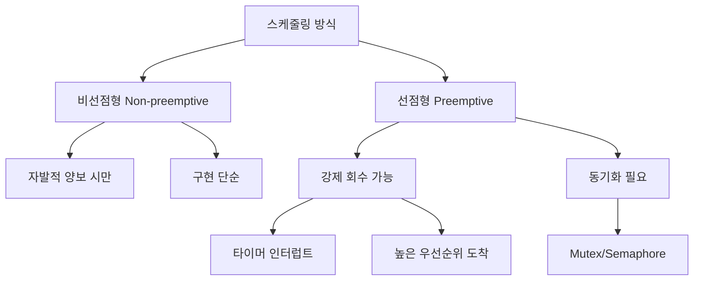

+++
title = "선점 / 비선점 스케줄링 차이"
date = "2026-03-14"
weight = 687
+++

> **💡 Insight**
> - 선점형 스케줄링(Preemptive Scheduling)은 OS가 실행 중인 프로세스로부터 CPU를 강제로 회수할 수 있습니다.
> - 비선점형 스케줄링(Non-preemptive Scheduling)은 프로세스가 자발적으로 CPU를 양보할 때까지(종료 또는 I/O 대기) 기다립니다.
> - 선점형은 응답성(Response Time)과 공정성(Fairness)에 유리하고, 비선점형은 구현 단순성과 문맥 교환 오버헤드 감소에 유리합니다.

### Ⅰ. 선점형 vs 비선점형 스케줄링의 정의

**선점형 스케줄링(Preemptive Scheduling)**에서 운영체제는 타이머 인터럽트나 더 높은 우선순위 프로세스의 도착 등으로 인해 현재 실행 중인 프로세스를 강제로 중단하고 CPU를 회수할 수 있습니다. 반면 **비선점형 스케줄링(Non-preemptive Scheduling)**에서는 실행 중인 프로세스가 스스로 CPU를 양보할 때까지(종료하거나 I/O 요청 등) 계속 실행됩니다.

```text
┌───────────────────────────────────────────────────────────────────┐
│          선점형 vs 비선점형 스케줄링 동작 비교                      │
├───────────────────────────────────────────────────────────────────┤
│                                                                   │
│  [비선점형 스케줄링 (Non-preemptive)]                             │
│  ┌─────────────────────────────────────────────────────────────┐ │
│  │                                                             │ │
│  │  Process A: ████████████████████████████████████████████   │ │
│  │             │◀──────── 자발적 양보까지 계속 실행 ────────▶│  │ │
│  │                                                             │ │
│  │  Process B:                                               Y │ │
│  │  (대기 중)                                                     │
│  │                                                             │ │
│  │  스케줄링 포인트: 프로세스 종료 or I/O 요청 or 자발적 양보     │ │
│  └─────────────────────────────────────────────────────────────┘ │
│                                                                   │
│  [선점형 스케줄링 (Preemptive)]                                   │
│  ┌─────────────────────────────────────────────────────────────┐ │
│  │                                                             │ │
│  │  Process A: ████████│   │████████│   │████████│            │ │
│  │             │  강제  │   │  강제   │   │  강제   │            │ │
│  │             │  중단  │   │  중단   │   │  중단   │            │ │
│  │             ▼       ▼   ▼        ▼   ▼        ▼            │ │
│  │  Process B:       ████│████████│████│                    │ │
│  │  Process C:             ████│████████│████                │ │
│  │                                                             │ │
│  │  스케줄링 포인트: 타이머 인터럽트, 높은 우선순위 도착 등       │ │
│  └─────────────────────────────────────────────────────────────┘ │
│                                                                   │
│  ┌─────────────────────────────────────────────────────────────┐ │
│  │  비교 요약표                                                  │ │
│  ├───────────────────┬───────────────────┬─────────────────────┤ │
│  │  구분              │  비선점형          │  선점형             │ │
│  ├───────────────────┼───────────────────┼─────────────────────┤ │
│  │  CPU 회수          │  자발적 양보 시만   │  언제든 가능        │ │
│  │  스케줄링 시점      │  제한적            │  빈번함            │ │
│  │  응답성            │  나쁨              │  좋음              │ │
│  │  구현 복잡도       │  단순              │  복잡              │ │
│  │  문맥 교환 빈도     │  낮음              │  높음              │ │
│  │  일관성 문제       │  적음              │  많음 (락 필요)    │ │
│  │  대표 알고리즘      │  FCFS, SJF         │  RR, Priority      │ │
│  └───────────────────┴───────────────────┴─────────────────────┘ │
└───────────────────────────────────────────────────────────────────┘
```

**[다이어그램 해설]** 비선점형에서는 Process A가 실행을 시작하면 종료하거나 I/O를 요청할 때까지 계속 실행됩니다. 이 동안 Process B는 아무리 급해도 대기해야 합니다. 반면 선점형에서는 타이머 인터럽트(타임 슬라이스 만료)나 더 높은 우선순위의 Process C가 도착하면 즉시 Process A를 중단하고 스케줄링이 발생합니다. 선점형은 시분할 시스템(Time-sharing System)과 실시간 시스템(Real-time System)에서 필수적이지만, 구현이 복잡하고 공유 자원 접근 시 동기화 문제가 발생할 수 있습니다.

> **📢 섹션 요약 비유:** 비선점형은 화장실에 들어간 사람이 나올 때까지 무한정 기다려야 하는 "자취방 화장실"입니다. 선점형은 "비상 사태"나 "시간 제한"으로 강제로 나오게 할 수 있는 "공중화장실"입니다.

### Ⅱ. 스케줄링 발생 시점 비교

선점형과 비선점형의 가장 큰 차이는 **스케줄링 결정이 발생하는 시점**입니다. 이를 통해 각 방식의 특성을 명확히 이해할 수 있습니다.

```text
┌───────────────────────────────────────────────────────────────────┐
│              스케줄링 발생 시점 상세 비교                           │
├───────────────────────────────────────────────────────────────────┤
│                                                                   │
│  [비선점형 스케줄링 - 스케줄링 발생 시점]                          │
│  ┌─────────────────────────────────────────────────────────────┐ │
│  │  1. 프로세스 종료 (Termination)                              │ │
│  │     ┌─────────┐                                              │ │
│  │     │ Running │ ──exit()──▶ │ Terminated │ ──▶ 스케줄링     │ │
│  │     └─────────┘                                              │ │
│  │                                                             │ │
│  │  2. 프로세스가 I/O 요청 (I/O Request)                        │ │
│  │     ┌─────────┐                                              │ │
│  │     │ Running │ ──read()──▶ │ Waiting    │ ──▶ 스케줄링     │ │
│  │     └─────────┘                                              │ │
│  │                                                             │ │
│  │  3. 프로세스가 wait() 호출 (자식 대기)                        │ │
│  │     ┌─────────┐                                              │ │
│  │     │ Running │ ──wait()──▶ │ Waiting    │ ──▶ 스케줄링     │ │
│  │     └─────────┘                                              │ │
│  └─────────────────────────────────────────────────────────────┘ │
│                                                                   │
│  [선점형 스케줄링 - 스케줄링 발생 시점 (비선점형 시점 + 아래 추가)]  │
│  ┌─────────────────────────────────────────────────────────────┐ │
│  │  4. 타임 슬라이스 만료 (Time Quantum Expiry)                 │ │
│  │     ┌─────────┐                                              │ │
│  │     │ Running │ ──Timer INT─▶ │ Ready      │ ──▶ 스케줄링   │ │
│  │     └─────────┘                                              │ │
│  │                                                             │ │
│  │  5. 더 높은 우선순위 프로세스 도착 (Higher Priority Arrival) │ │
│  │     ┌─────────┐         ┌─────────────┐                     │ │
│  │     │ Running │         │ New Process │                     │ │
│  │     │ (Low)   │ ◀───────│ (High)      │ ──▶ 선점!          │ │
│  │     └─────────┘  인터럽트 └─────────────┘                    │ │
│  │                                                             │ │
│  │  6. 인터럽트 처리 완료 후 (Interrupt Return)                 │ │
│  │     ┌─────────────────────────────────────┐                 │ │
│  │     │ Interrupt Handler 완료              │                 │ │
│  │     │ ──▶ 커널이 스케줄링 결정 가능        │                 │ │
│  │     └─────────────────────────────────────┘                 │ │
│  └─────────────────────────────────────────────────────────────┘ │
│                                                                   │
│  ┌─────────────────────────────────────────────────────────────┐ │
│  │  선점형 스케줄링의 타이밍 다이어그램                           │ │
│  ├─────────────────────────────────────────────────────────────┤ │
│  │                                                             │ │
│  │  시간 ──────────────────────────────────────────────────▶   │ │
│  │                                                             │ │
│  │  Process A: ════╪══════╪══════╪══════                      │ │
│  │              실행  │타이머 │실행  │I/O 요청                  │ │
│  │                    │인터럽트│     │                          │ │
│  │                    ▼       ▼     ▼                          │ │
│  │  스케줄링:      ○       ○     ○     ○                       │ │
│  │              (실행)  (선점) (선점) (I/O)                     │ │
│  │                                                             │ │
│  │  Process B:       ═══════╪════════                          │ │
│  │                   실행    │선점                              │ │
│  └─────────────────────────────────────────────────────────────┘ │
└───────────────────────────────────────────────────────────────────┘
```

**[다이어그램 해설]** 비선점형 스케줄링에서는 프로세스가 능동적으로 상태를 변경할 때만(종료, I/O 요청, wait) 스케줄링이 발생합니다. 반면 선점형에서는 이 외에도 타이머 인터럽트(타임 슬라이스 만료), 높은 우선순위 프로세스 도착, 인터럽트 처리 완료 시에도 스케줄링 결정이 이루어집니다. 타이밍 다이어그램에서 Process A는 타이머 인터럽트로 선점되어 Process B에게 CPU가 넘어가고, 다시 선점되거나 I/O 요청으로 실행이 중단됩니다. 이처럼 선점형에서는 스케줄링 결정이 훨씬 빈번하게 발생합니다.

> **📢 섹션 요약 비유:** 비선점형은 "발표자가 마칠 때까지"만 질문할 수 있는 강의입니다. 선점형은 "타이머가 울리면"이나 "긴급 질문이 있으면" 즉시 말을 끊을 수 있는 토론회입니다.

### Ⅲ. 선점형 스케줄링의 동기화 이슈

선점형 스케줄링에서는 프로세스가 언제든 중단될 수 있으므로, **임계 구역(Critical Section)** 보호가 필수적입니다.

```text
┌───────────────────────────────────────────────────────────────────┐
│          선점형 스케줄링의 동기화 문제와 해결                        │
├───────────────────────────────────────────────────────────────────┤
│                                                                   │
│  [문제 상황: 선점 중단으로 인한 데이터 무결성 위반]                 │
│  ┌─────────────────────────────────────────────────────────────┐ │
│  │                                                             │ │
│  │  공유 변수: int balance = 1000;                             │ │
│  │                                                             │ │
│  │  Process A (출금 $100):                                     │ │
│  │  ┌─────────────────────────────────────────────────────┐    │ │
│  │  │ 1. temp = balance;      // temp = 1000             │    │ │
│  │  │ 2. temp = temp - 100;   // temp = 900              │    │ │
│  │  │ 3. ◀── 여기서 선점 발생! ──▶                        │    │ │
│  │  │ 4. balance = temp;      // 아직 실행 안 됨          │    │ │
│  │  └─────────────────────────────────────────────────────┘    │ │
│  │                         │                                   │ │
│  │                         ▼                                   │ │
│  │  Process B (입금 $200):                                     │ │
│  │  ┌─────────────────────────────────────────────────────┐    │ │
│  │  │ 1. temp = balance;      // temp = 1000 (이전 값!)  │    │ │
│  │  │ 2. temp = temp + 200;   // temp = 1200             │    │ │
│  │  │ 3. balance = temp;      // balance = 1200          │    │ │
│  │  └─────────────────────────────────────────────────────┘    │ │
│  │                         │                                   │ │
│  │                         ▼                                   │ │
│  │  Process A 재개:                                             │ │
│  │  ┌─────────────────────────────────────────────────────┐    │ │
│  │  │ 4. balance = temp;      // balance = 900 (B 손실!) │    │ │
│  │  └─────────────────────────────────────────────────────┘    │ │
│  │                                                             │ │
│  │  결과: balance = 900 (정상이면 1100이어야 함)                │ │
│  │        Process B의 입금이 사라짐!                            │ │
│  └─────────────────────────────────────────────────────────────┘ │
│                                                                   │
│  [해결책: 뮤텍스(Mutex) 또는 세마포어(Semaphore) 사용]            │
│  ┌─────────────────────────────────────────────────────────────┐ │
│  │                                                             │ │
│  │  lock(&mutex);        // 임계 구역 진입                      │ │
│  │  // ─── 임계 구역 시작 ───                                  │ │
│  │  temp = balance;                                            │ │
│  │  temp = temp - 100;                                         │ │
│  │  balance = temp;                                            │ │
│  │  // ─── 임계 구역 끝 ───                                    │ │
│  │  unlock(&mutex);      // 임계 구역 탈출 (이때만 선점 가능)   │ │
│  │                                                             │ │
│  │  또는 커널에서:                                              │ │
│  │  spin_lock_irqsave(&lock, flags);  // 인터럽트 비활성화     │ │
│  │  // 임계 구역                                                │ │
│  │  spin_unlock_irqrestore(&lock, flags); // 인터럽트 복원      │ │
│  └─────────────────────────────────────────────────────────────┘ │
└───────────────────────────────────────────────────────────────────┘
```

**[다이어그램 해설]** 선점형 스케줄링에서는 Process A가 공유 변수를 수정하던 중 타이머 인터럽트 등으로 선점될 수 있습니다. 이때 문맥 교환으로 Process B가 실행되어 같은 변수를 수정하면, Process A가 재개될 때 덮어쓰기 때문에 Process B의 변경 사항이 손실됩니다. 이것이 **경쟁 조건(Race Condition)**입니다. 해결책은 뮤텍스(Mutex), 세마포어(Semaphore), 스핀락(Spinlock) 등을 사용하여 임계 구역을 보호하는 것입니다. 커널 코드에서는 `spin_lock_irqsave()`처럼 인터럽트까지 비활성화하여 선점 자체를 방지하기도 합니다.

> **📢 섹션 요약 비유:** 선점형 동기화 문제는 두 요리사가 같은 냄비에 동시에 재료를 넣는 것과 같습니다. 한 요리사가 소금을 넣으려는데 다른 요리사가 설탕을 먼저 넣어버리면, 요리가 망가지죠. "냄비 잠금장치(Mutex)"로 해결합니다.

### Ⅳ. 커널 선점성 (Kernel Preemptibility)

현대 운영체제에서는 커널 모드 실행 중에도 선점을 허용하는 **선점형 커널(Preemptive Kernel)**이 일반적입니다.

```text
┌───────────────────────────────────────────────────────────────────┐
│             커널 선점성: 비선점형 vs 선점형 커널                     │
├───────────────────────────────────────────────────────────────────┤
│                                                                   │
│  [비선점형 커널 (Non-preemptive Kernel)]                          │
│  ┌─────────────────────────────────────────────────────────────┐ │
│  │  • 커널 모드 실행 중에는 선점 불가                            │ │
│  │  • 시스템 콜/인터럽트 처리가 완료될 때까지 대기               │ │
│  │  • 구현 단순, 커널 데이터 구조 동기화 용이                   │ │
│  │  • 단점: 실시간 응답성 저하 (긴 시스템 콜 시 대기)            │ │
│  │  • 예: 전통적 UNIX, 초기 Linux                               │ │
│  └─────────────────────────────────────────────────────────────┘ │
│                                                                   │
│  [선점형 커널 (Preemptive Kernel)]                                │
│  ┌─────────────────────────────────────────────────────────────┐ │
│  │  • 커널 모드 실행 중에도 선점 가능                            │ │
│  │  • preempt_count == 0일 때만 선점 허용                       │ │
│  │  • spinlock, 인터럽트 비활성 구간은 선점 불가                 │ │
│  │  • 장점: 낮은 인터럽트 지연, 실시간 응답성                    │ │
│  │  • 예: Linux with PREEMPT, Linux with PREEMPT_RT            │ │
│  └─────────────────────────────────────────────────────────────┘ │
│                                                                   │
│  ┌─────────────────────────────────────────────────────────────┐ │
│  │  Linux 커널 선점 수준                                        │ │
│  ├─────────────────────────────────────────────────────────────┤ │
│  │  CONFIG_PREEMPT_NONE   : 서버용, 처리량 우선                 │ │
│  │  CONFIG_PREEMPT_VOLUNTARY : 자발적 선점 지점만               │ │
│  │  CONFIG_PREEMPT        : 데스크탑용, 선점형 커널             │ │
│  │  CONFIG_PREEMPT_RT     : 실시간용, 대부분의 락을 뮤텍스로    │ │
│  └─────────────────────────────────────────────────────────────┘ │
│                                                                   │
│  ┌─────────────────────────────────────────────────────────────┐ │
│  │  인터럽트 지연 시간 비교 (대략적)                             │ │
│  ├─────────────────────────────────────────────────────────────┤ │
│  │  비선점형 커널    : 수 ms ~ 수백 ms (시스템 콜 길이 의존)    │ │
│  │  선점형 커널      : 수십 μs ~ 수 ms                          │ │
│  │  PREEMPT_RT       : 수 μs ~ 수십 μs (실시간 보장)           │ │
│  └─────────────────────────────────────────────────────────────┘ │
└───────────────────────────────────────────────────────────────────┘
```

**[다이어그램 해설]** 비선점형 커널에서는 프로세스가 시스템 콜을 호출하여 커널 모드로 진입하면, 시스템 콜이 완료될 때까지 선점할 수 없습니다. 긴 시스템 콜(예: 대용량 파일 읽기)이 실행 중이면 다른 프로세스는 오랫동안 대기해야 합니다. 선점형 커널에서는 커널 실행 중에도 `preempt_count`가 0이면 선점이 가능합니다. 단, 스핀락(Spinlock)을 잡고 있거나 인터럽트가 비활성화된 구간에서는 선점이 금지됩니다. Linux PREEMPT_RT 패치는 대부분의 스핀락을 뮤텍스로 변환하여 거의 완전한 선점성을 제공합니다.

> **📢 섹션 요약 비유:** 비선점형 커널은 "회의 중에는 절대 방해 금지"인 엄격한 회의실입니다. 선점형 커널은 "긴급한 일이 있으면 잠깐 나가도 OK"인 유연한 회의실입니다.

### Ⅴ. 결론 및 선택 기준

| 구분 | 비선점형 스케줄링 | 선점형 스케줄링 |
|:---|:---|:---|
| **응답성** | 나쁨 (긴 프로세스 대기) | 좋음 (타임 슬라이스 보장) |
| **처리량** | 문맥 교환 적어 좋음 | 문맥 교환 많아 약간 손해 |
| **구현** | 단순 | 복잡 (동기화 필요) |
| **공정성** | 나쁨 (호위 효과) | 좋음 |
| **적합 환경** | 배치 시스템, 임베디드 | 시분할, 실시간 시스템 |

**핵심 교훈:** 현대 운영체제는 거의 모두 **선점형 스케줄링**을 사용합니다. 비선점형은 특수 목적(배치, 일부 RTOS)에서만 사용됩니다.

> **📢 섹션 요약 비유:** 선점형은 "공정한 운동경기"입니다. 규칙(타임 슬라이스)에 따라 공을 넘겨주니 모두가 기회를 갖죠. 비선점형은 "뺏기면 지는 게임"입니다. 공을 잡은 사람이 놓을 때까지 계속 가집니다.

---

### 💡 Knowledge Graph


### 👧 Child Analogy
비선점형은 놀이터 미끄럼틀이야! 한 번 타기 시작하면 내려올 때까지 다른 친구가 끌어내릴 수 없지. 선점형은 타이머가 있는 놀이터야! "10초 됐어!" 하면 선생님이 불러서 내려오게 하고 다음 친구가 탈 수 있어. 모두가 공평하게 놀 수 있지!