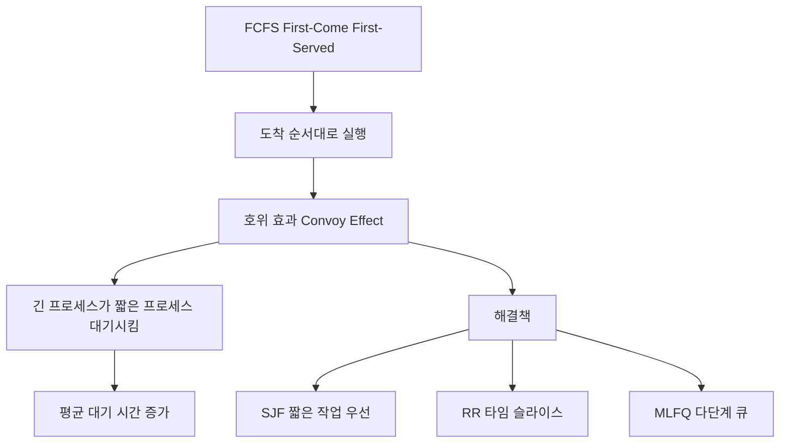

+++
title = "FCFS 호위 효과 (Convoy Effect)"
date = "2026-03-14"
weight = 688
+++

> **💡 Insight**
> - FCFS (First-Come, First-Served) 스케줄링은 도착 순서대로 CPU를 할당하는 가장 단순한 비선점형 알고리즘입니다.
> - 호위 효과(Convoy Effect)는 긴 CPU 버스트를 가진 프로세스가 짧은 프로세스들을 "호위"하듯 대기시켜 평균 대기 시간을 급증시키는 현상입니다.
> - FCFS는 구현이 간단하지만, 평균 대기 시간이 길고 최적이 아님으로 실시간/대화형 시스템에는 부적합합니다.

### Ⅰ. FCFS 스케줄링 기본 원리

FCFS (First-Come, First-Served)는 **도착한 순서대로** CPU를 할당하는 가장 직관적인 스케줄링 알고리즘입니다. 준비 큐(Ready Queue)를 FIFO (First-In, First-Out) 큐로 관리하며, 선입선출로 처리합니다.

```text
┌───────────────────────────────────────────────────────────────────┐
│              FCFS 스케줄링 기본 동작                               │
├───────────────────────────────────────────────────────────────────┤
│                                                                   │
│  준비 큐 (FIFO):                                                  │
│  ┌─────┬─────┬─────┬─────┐                                       │
│  │ P1  │ P2  │ P3  │ P4  │  ───▶ 도착 순서대로 실행              │
│  │24ms │ 3ms │ 3ms │ 3ms │                                      │
│  └─────┴─────┴─────┴─────┘                                       │
│                                                                   │
│  실행 타임라인:                                                   │
│  ┌─────────────────────────────────────────────────────────────┐ │
│  │ P1 (24ms)    │ P2 (3ms)│ P3 (3ms)│ P4 (3ms)│               │ │
│  │████████████████████████│███│███│███│                       │ │
│  │◀─────── 24ms ────────▶│3ms│3ms│3ms│                       │ │
│  └─────────────────────────────────────────────────────────────┘ │
│                                                                   │
│  대기 시간 계산:                                                  │
│  ┌─────────────────────────────────────────────────────────────┐ │
│  │  P1: 0ms (첫 번째 도착, 즉시 실행)                          │ │
│  │  P2: 24ms (P1 완료 후)                                      │ │
│  │  P3: 27ms (P1+P2 완료 후)                                   │ │
│  │  P4: 30ms (P1+P2+P3 완료 후)                                │ │
│  │  ────────────────────────────────────────────────────────   │ │
│  │  평균 대기 시간 = (0 + 24 + 27 + 30) / 4 = 20.25ms          │ │
│  └─────────────────────────────────────────────────────────────┘ │
└───────────────────────────────────────────────────────────────────┘
```

**[다이어그램 해설]** FCFS에서 P1이 먼저 도착하면 24ms 동안 실행되는 동안 P2, P3, P4는 모두 대기해야 합니다. 이 예시에서 평균 대기 시간은 20.25ms입니다. 만약 짧은 프로세스들이 먼저 실행되었다면 대기 시간이 크게 줄어들었을 것입니다. FCFS는 비선점형이므로 실행 중인 프로세스를 중단할 수 없습니다.

> **📢 섹션 요약 비유:** FCFS는 식당에서 줄 선 순서대로 주문받는 것과 같습니다. 앞에 있는 사람이 복잡한 주문(긴 CPU 버스트)을 하면, 뒷사람은 간단한 주문(짧은 CPU 버스트)이어도 오래 기다려야 합니다.

### Ⅱ. 호위 효과(Convoy Effect) 심층 분석

호위 효과는 **긴 CPU 버스트를 가진 프로세스 하나가 여러 짧은 프로세스들의 대기 시간을 급증**시키는 현상입니다. 마치 긴 행렬의 호위대를 따라가는 것처럼 보입니다.

```text
┌───────────────────────────────────────────────────────────────────┐
│              호위 효과(Convoy Effect) 시각화                       │
├───────────────────────────────────────────────────────────────────┤
│                                                                   │
│  [시나리오] 긴 프로세스 P1가 먼저 도착                             │
│                                                                   │
│  도착 순서: P1(24ms) → P2(3ms) → P3(3ms) → P4(3ms)               │
│                                                                   │
│  ┌─────────────────────────────────────────────────────────────┐ │
│  │                                                             │ │
│  │  P1: ████████████████████████ (24ms)                        │ │
│  │                             │                               │ │
│  │  P2:                        ██████ (대기 24ms + 실행 3ms)   │ │
│  │                             │                               │ │
│  │  P3:                        ██████████ (대기 27ms + 실행)   │ │
│  │                             │                               │ │
│  │  P4:                        ████████████ (대기 30ms + 실행) │ │
│  │                             │                               │ │
│  │                             ▼                               │ │
│  │                    ⚠ 호위 효과 발생!                         │ │
│  │                    짧은 프로세스들이 긴 프로세스를 "호위"      │ │
│  │                    하듯 길게 대기                            │ │
│  └─────────────────────────────────────────────────────────────┘ │
│                                                                   │
│  [시나리오] 짧은 프로세스들이 먼저 도착 (SJF 순서)                  │
│                                                                   │
│  실행 순서: P2(3ms) → P3(3ms) → P4(3ms) → P1(24ms)               │
│                                                                   │
│  ┌─────────────────────────────────────────────────────────────┐ │
│  │                                                             │ │
│  │  P2: ███ (3ms)                                              │ │
│  │  P3:    ███ (대기 3ms + 실행)                               │ │
│  │  P4:       ███ (대기 6ms + 실행)                            │ │
│  │  P1:          ████████████████████████ (대기 9ms + 실행)    │ │
│  │                                                             │ │
│  │  평균 대기 시간 = (0 + 3 + 6 + 9) / 4 = 4.5ms               │ │
│  │                                                             │ │
│  │  ✅ 호위 효과 해결! 평균 대기 시간 20.25ms → 4.5ms (78% 감소) │ │
│  └─────────────────────────────────────────────────────────────┘ │
└───────────────────────────────────────────────────────────────────┘
```

**[다이어그램 해설]** 호위 효과는 FCFS의 가장 큰 단점입니다. 긴 프로세스 P1이 먼저 실행되면 평균 대기 시간이 20.25ms이지만, 짧은 프로세스들(P2, P3, P4)을 먼저 실행하면 4.5ms로 78% 감소합니다. 이는 SJF (Shortest Job First) 알고리즘의 이론적 근거가 됩니다. I/O 바운드 프로세스(짧은 CPU 버스트)가 CPU 바운드 프로세스(긴 CPU 버스트) 뒤에 있으면, I/O 장치들은 유휴 상태가 되어 시스템 전체 효율이 저하됩니다.

> **📢 섹션 요약 비유:** 호위 효과는 복잡한 주문을 한 단체 손님 뒤에 간단한 주문만 한 손님들이 줄 서 있는 것과 같습니다. 단체 손님 주문이 끝날 때까지 다른 손님들은 굶주리죠. 반대로 간단한 주문 먼저 처리하면 모두가 빨리 밥을 먹을 수 있습니다.

### Ⅲ. FCFS 성능 분석 및 한계

FCFS의 성능 특성을 정량적으로 분석하고 다른 알고리즘과 비교합니다.

```text
┌───────────────────────────────────────────────────────────────────┐
│              FCFS 성능 분석                                        │
├───────────────────────────────────────────────────────────────────┤
│                                                                   │
│  [장점]                                                           │
│  ┌─────────────────────────────────────────────────────────────┐ │
│  │  ✅ 구현이 가장 단순 (FIFO 큐만 있으면 됨)                    │ │
│  │  ✅ 기아 상태(Starvation) 없음 (모든 프로세스가 순서대로 실행)│ │
│  │  ✅ 비선점형이므로 문맥 교환 오버헤드 최소                    │ │
│  │  ✅ 공정한 순서 보장 (도착 순서 존중)                         │ │
│  └─────────────────────────────────────────────────────────────┘ │
│                                                                   │
│  [단점]                                                           │
│  ┌─────────────────────────────────────────────────────────────┐ │
│  │  ❌ 평균 대기 시간이 길다 (호위 효과)                         │ │
│  │  ❌ 최적이 아님 (다른 순서가 더 나을 수 있음)                 │ │
│  │  ❌ I/O 장치 활용률 저하 가능                                │ │
│  │  ❌ 대화형/실시간 시스템에 부적합                             │ │
│  └─────────────────────────────────────────────────────────────┘ │
│                                                                   │
│  [알고리즘별 평균 대기 시간 비교] (동일 프로세스 집합 기준)         │
│  ┌─────────────────────────────────────────────────────────────┐ │
│  │  알고리즘        │ 평균 대기 시간 │ 특성                     │ │
│  ├──────────────────┼────────────────┼─────────────────────────┤ │
│  │  FCFS           │   20.25ms      │ 도착 순서 의존           │ │
│  │  SJF            │   4.5ms        │ 최적 (구현 어려움)       │ │
│  │  SRTF           │   ~3.5ms       │ 선점형 SJF              │ │
│  │  RR (q=5ms)     │   ~10ms        │ 공정, 응답성 좋음        │ │
│  │  Priority       │   가변적       │ 우선순위 기준            │ │
│  └──────────────────┴────────────────┴─────────────────────────┘ │
│                                                                   │
│  ┌─────────────────────────────────────────────────────────────┐ │
│  │  FCFS가 유리한 상황                                          │ │
│  ├─────────────────────────────────────────────────────────────┤ │
│  │  • 모든 프로세스의 CPU 버스트가 비슷할 때                     │ │
│  │  • 배치 시스템 (Batch System)에서 처리 순서 중요 시           │ │
│  │  • 단순성이 우선시되는 임베디드 시스템                        │ │
│  └─────────────────────────────────────────────────────────────┘ │
└───────────────────────────────────────────────────────────────────┘
```

**[다이어그램 해설]** FCFS는 구현 단순성과 기아 상태 없음이 장점이지만, 평균 대기 시간 측면에서는 SJF나 SRTF에 비해 현저히 떨어집니다. 특히 CPU 버스트 분포가 다양한 시스템에서는 호위 효과로 인해 성능이 급격히 저하됩니다. FCFS가 유리한 경우는 모든 프로세스의 실행 시간이 비슷하거나, 처리 순서가 성능보다 중요한 배치 시스템뿐입니다.

> **📢 섹션 요약 비유:** FCFS는 "먼저 온 사람이 먼저 밥 먹는다"는 가장 직관적인 원칙입니다. 하지만 앞사람이 1시간씩 걸리는 코스 요리를 주문하면 뒷사람은 굶습니다. SJF는 "간단한 주문 먼저"라는 효율적인 원칙이죠.

### Ⅳ. 호위 효과 해결 방안

호위 효과를 완화하기 위한 여러 접근 방식이 있습니다.

```text
┌───────────────────────────────────────────────────────────────────┐
│              호위 효과 해결 방안                                   │
├───────────────────────────────────────────────────────────────────┤
│                                                                   │
│  [1] SJF/SRTF 스케줄링 사용                                       │
│  ┌─────────────────────────────────────────────────────────────┐ │
│  │  • 짧은 작업 우선 처리로 대기 시간 최소화                     │ │
│  │  • SJF: 비선점형, 다음 CPU 버스트 길이 알아야 함             │ │
│  │  • SRTF: 선점형, 실행 중인 것보다 짧으면 교체                │ │
│  │  • 단점: CPU 버스트 길이 예측 어려움, 긴 작업 기아 가능       │ │
│  └─────────────────────────────────────────────────────────────┘ │
│                                                                   │
│  [2] 라운드 로빈(Round Robin) 사용                                │
│  ┌─────────────────────────────────────────────────────────────┐ │
│  │  • 타임 슬라이스로 선점형 스케줄링                           │ │
│  │  • 긴 작업도 타임 슬라이스 후 CPU 양보                       │ │
│  │  • 짧은 작업이 빠르게 완료 가능                              │ │
│  │  • 단점: 타임 슬라이스 설정에 따른 오버헤드                   │ │
│  └─────────────────────────────────────────────────────────────┘ │
│                                                                   │
│  [3] 다단계 피드백 큐(MLFQ) 사용                                  │
│  ┌─────────────────────────────────────────────────────────────┐ │
│  │  • 여러 큐에 우선순위 할당                                   │ │
│  │  • 짧은 작업은 높은 우선순위 큐에서 빠르게 실행               │ │
│  │  • 긴 작업은 점진적으로 낮은 우선순위로 이동                  │ │
│  │  • CPU 버스트 길이를 미리 알 필요 없음                        │ │
│  └─────────────────────────────────────────────────────────────┘ │
│                                                                   │
│  ┌─────────────────────────────────────────────────────────────┐ │
│  │  알고리즘 선택 가이드                                        │ │
│  ├─────────────────────────────────────────────────────────────┤ │
│  │  상황                           │ 권장 알고리즘              │ │
│  │  ───────────────────────────────┼────────────────────────── │ │
│  │  구현 단순성 우선               │ FCFS                      │ │
│  │  평균 대기 시간 최소화          │ SJF/SRTF                  │ │
│  │  대화형 시스템 (응답성)         │ Round Robin               │ │
│  │  버스트 길이 모름 + 공정성      │ MLFQ                      │ │
│  └─────────────────────────────────────────────────────────────┘ │
└───────────────────────────────────────────────────────────────────┘
```

**[다이어그램 해설]** 호위 효과 해결의 핵심은 **짧은 프로세스에게 우선권을 주는 것**입니다. SJF/SRTF는 이론적으로 최적이지만 CPU 버스트 길이를 알거나 예측해야 합니다. Round Robin은 모든 프로세스에게 공평한 타임 슬라이스를 보장하여 응답성을 높입니다. MLFQ는 실행 패턴을 관찰하여 짧은 작업과 긴 작업을 자동으로 구분하므로 실제 시스템에서 가장 널리 사용됩니다.

> **📢 섹션 요약 비유:** 호위 효과 해결은 "빨리 끝날 일 먼저 처리하기"입니다. 식당에서 간단한 커피 주문은 즉시 처리하고, 복잡한 코스 요리는 나중에 처리하면 전체 대기 시간이 줄어듭니다.

### Ⅴ. 결론 및 핵심 요약

| 항목 | FCFS 특성 |
|:---|:---|
| **유형** | 비선점형 |
| **기준** | 도착 순서 |
| **장점** | 구현 단순, 기아 없음 |
| **단점** | 호위 효과, 평균 대기 시간 김 |
| **해결책** | SJF, RR, MLFQ 사용 |

**핵심 교훈:** FCFS는 교육적 목적으로 중요하지만, 실제 시스템에서는 호위 효과로 인해 거의 단독으로 사용되지 않습니다. 현대 OS는 Round Robin이나 MLFQ와 같은 선점형 알고리즘을 사용합니다.

> **📢 섹션 요약 비유:** FCFS는 "줄은 공평하지만 효율은 아니다"라는 교훈을 줍니다. 공정성과 효율성 사이에는 트레이드오프가 있으며, 시스템 목표에 맞는 선택이 필요합니다.

---

### 💡 Knowledge Graph


### 👧 Child Analogy
FCFS는 놀이공원 줄서기와 같아! 먼저 온 사람이 먼저 타는 건 공평해 보이지만, 앞에 롤러코스터 10번 연속으로 타는 사람이 있으면 뒷사람은 엄청 기다려야 해. 호위 효과는 그 긴 줄이 마치 행렬처럼 보이는 거야! 해결책은 빨리 끝나는 놀이기구(짧은 작업)를 먼저 태워주는 거지.