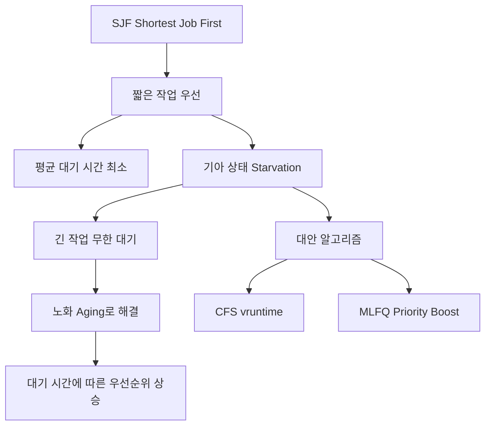

+++
title = "SJF 기아 (Starvation) 발생"
date = "2026-03-14"
weight = 689
+++

> **💡 Insight**
> - SJF (Shortest Job First)는 CPU 버스트가 가장 짧은 프로세스를 먼저 실행하여 평균 대기 시간을 최소화합니다.
> - 기아 상태(Starvation)는 긴 CPU 버스트를 가진 프로세스가 계속해서 뒤로 밀려나 무한정 대기하는 현상입니다.
> - 노화(Aging) 기법을 통해 대기 시간이 긴 프로세스의 우선순위를 점진적으로 높여 기아를 방지할 수 있습니다.

### Ⅰ. SJF 스케줄링과 기아 상태의 관계

SJF (Shortest Job First)는 이론적으로 **평균 대기 시간을 최소화**하는 최적의 알고리즘이지만, 긴 작업이 계속 미뤄지는 **기아 상태(Starvation/Indefinite Blocking)** 문제가 있습니다.

```text
┌───────────────────────────────────────────────────────────────────┐
│          SJF에서의 기아 상태 발생 메커니즘                         │
├───────────────────────────────────────────────────────────────────┤
│                                                                   │
│  [상황] 긴 작업 P_Long이 있고, 짧은 작업들이 계속 도착             │
│                                                                   │
│  시간 0: P_Long 도착 (CPU 버스트 100ms)                           │
│  시간 1: P1 도착 (CPU 버스트 2ms)                                 │
│  시간 2: P2 도착 (CPU 버스트 3ms)                                 │
│  시간 3: P3 도착 (CPU 버스트 2ms)                                 │
│  ... 계속해서 짧은 작업 도착 ...                                   │
│                                                                   │
│  ┌─────────────────────────────────────────────────────────────┐ │
│  │  SJF 실행 순서 (짧은 것 우선):                               │ │
│  │                                                             │ │
│  │  P1 (2ms) ─▶ P3 (2ms) ─▶ P2 (3ms) ─▶ P4 (2ms) ─▶ ...       │ │
│  │                                                             │ │
│  │  P_Long (100ms): ████████████████████████████████████████  │ │
│  │                  ↑                                          │ │
│  │                  │                                          │ │
│  │           영원히 대기...?                                    │ │
│  │                                                             │ │
│  │  ⚠ 기아 상태 (Starvation)!                                  │ │
│  │  짧은 작업이 계속 도착하면 P_Long은 실행 기회를 얻지 못함      │ │
│  └─────────────────────────────────────────────────────────────┘ │
│                                                                   │
│  ┌─────────────────────────────────────────────────────────────┐ │
│  │  기아 상태 발생 조건                                         │ │
│  ├─────────────────────────────────────────────────────────────┤ │
│  │  ① 긴 CPU 버스트를 가진 프로세스 존재                        │ │
│  │  ② 짧은 CPU 버스트를 가진 프로세스가 지속적으로 도착          │ │
│  │  ③ 스케줄러가 짧은 작업만 계속 선택                          │ │
│  │  ④ 긴 프로세스의 대기 시간이 무한히 증가                      │ │
│  └─────────────────────────────────────────────────────────────┘ │
└───────────────────────────────────────────────────────────────────┘
```

**[다이어그램 해설]** SJF에서 P_Long이 100ms의 CPU 버스트를 가지고 도착했을 때, 2~3ms짜리 짧은 작업들이 계속 도착하면 스케줄러는 항상 짧은 작업을 선택합니다. 이 경우 P_Long은 실행 기회를 얻지 못하고 무한정 대기하게 됩니다. 이것이 기아 상태(Starvation) 또는 무한 블로킹(Indefinite Blocking)입니다. SJF는 평균 대기 시간을 최소화하지만, 개별 프로세스의 공정성을 보장하지 않습니다.

> **📢 섹션 요약 비유:** SJF의 기아 상태는 "빨리 끝날 일만 계속 시키는 상사"와 같습니다. 중요하지만 오래 걸리는 대형 프로젝트는 계속 뒤로 미뤄지고, 자잘한 일만 처리하다 보니 대형 프로젝트는 영원히 시작도 못 하는 상황입니다.

### Ⅱ. 기아 상태 vs 호위 효과 비교

기아 상태(Starvation)와 호위 효과(Convoy Effect)는 모두 대기 시간 문제지만, 발생 원인과 영향이 다릅니다.

```text
┌───────────────────────────────────────────────────────────────────┐
│          기아 상태 vs 호위 효과 비교 분석                          │
├───────────────────────────────────────────────────────────────────┤
│                                                                   │
│  ┌─────────────────────────────────────────────────────────────┐ │
│  │                     호위 효과 (Convoy Effect)                │ │
│  ├─────────────────────────────────────────────────────────────┤ │
│  │  발생 알고리즘: FCFS                                         │ │
│  │  원인: 긴 프로세스가 먼저 도착                                │ │
│  │  영향: 뒤에 있는 짧은 프로세스들이 길게 대기                   │ │
│  │  특징: 일시적, 긴 프로세스 완료 후 해결                       │ │
│  │  시각화:                                                     │ │
│  │  ┌────────────────────────────────────────────────────────┐│ │
│  │  │ Long ─████████████████████████████████████████████████││ │
│  │  │ Short1 ───────────────────────────────────────────█   ││ │
│  │  │ Short2 ─────────────────────────────────────────────██││ │
│  │  │        (긴 작업 하나 때문에 모두 대기)                  ││ │
│  │  └────────────────────────────────────────────────────────┘│ │
│  └─────────────────────────────────────────────────────────────┘ │
│                                                                   │
│  ┌─────────────────────────────────────────────────────────────┐ │
│  │                     기아 상태 (Starvation)                   │ │
│  ├─────────────────────────────────────────────────────────────┤ │
│  │  발생 알고리즘: SJF, Priority                                │ │
│  │  원인: 짧은/높은 우선순위 프로세스가 계속 도착                │ │
│  │  영향: 긴/낮은 우선순위 프로세스가 무한 대기                   │ │
│  │  특징: 영구적 가능성, 능동적 해결책 필요                      │ │
│  │  시각화:                                                     │ │
│  │  ┌────────────────────────────────────────────────────────┐│ │
│  │  │ Long ─(영원히 대기)...                                 ││ │
│  │  │ Short1 ─██                                             ││ │
│  │  │ Short2 ───██                                           ││ │
│  │  │ Short3 ──────██                                        ││ │
│  │  │ Short4 ─────────██  (계속 도착하는 짧은 작업들)         ││ │
│  │  └────────────────────────────────────────────────────────┘│ │
│  └─────────────────────────────────────────────────────────────┘ │
│                                                                   │
│  ┌─────────────────────────────────────────────────────────────┐ │
│  │  핵심 차이점                                                 │ │
│  ├─────────────────────────────────────────────────────────────┤ │
│  │  호위 효과: "긴 녀석 하나가 짧은 녀석들을 괴롭힘"             │ │
│  │  기아 상태: "짧은 녀석들이 긴 녀석을 영원히 무시"             │ │
│  │                                                             │ │
│  │  호위 효과 → FCFS 문제 (순서 운)                             │ │
│  │  기아 상태 → SJF/Priority 문제 (우선순위 체계 문제)          │ │
│  └─────────────────────────────────────────────────────────────┘ │
└───────────────────────────────────────────────────────────────────┘
```

**[다이어그램 해설]** 호위 효과는 FCFS에서 발생하며, 긴 프로세스가 완료되면 자연스럽게 해결됩니다. 반면 기아 상태는 SJF나 우선순위 스케줄링에서 발생하며, 짧은/높은 우선순위 프로세스가 계속 도착하면 영구적으로 지속될 수 있습니다. 기아 상태는 시스템 설계상의 문제로, **노화(Aging)** 같은 능동적 해결책이 필요합니다.

> **📢 섹션 요약 비유:** 호위 효과는 "큰 버스 한 대가 좁은 길을 막아서 승용차들이 기다리는 상황"입니다. 버스가 지나가면 해결되죠. 기아 상태는 "승용차들이 계속 와서 큰 버스가 길을 건널 수 없는 상황"입니다. 승용차가 끊이지 않으면 버스는 영원히 기다립니다.

### Ⅲ. 노화(Aging) 기법으로 기아 방지

노화(Aging)는 대기 시간이 길어질수록 우선순위를 점진적으로 높여주는 기법입니다. 긴 프로세스라도 충분히 기다리면 결국 실행됩니다.

```text
┌───────────────────────────────────────────────────────────────────┐
│              노화(Aging) 기법 동작 원리                             │
├───────────────────────────────────────────────────────────────────┤
│                                                                   │
│  [기본 개념]                                                      │
│  ┌─────────────────────────────────────────────────────────────┐ │
│  │  우선순위 = 원래 우선순위 + (대기 시간 × 에이징 팩터)         │ │
│  │                                                             │ │
│  │  또는                                                       │ │
│  │                                                             │ │
│  │  우선순위 = 원래 우선순위 - (대기 시간) [숫자 낮을수록 높음]  │ │
│  └─────────────────────────────────────────────────────────────┘ │
│                                                                   │
│  [노화 적용 예시] (1초마다 우선순위 1씩 증가)                      │
│  ┌─────────────────────────────────────────────────────────────┐ │
│  │  시간  │ P_Long 대기  │ P_Long 우선순위  │ 실행 여부        │ │
│  ├───────┼─────────────┼──────────────────┼────────────────┤ │
│  │  0s   │    0s       │     100 (낮음)    │ ❌ (짧은 것 우선)│ │
│  │  5s   │    5s       │     95 (↑)        │ ❌               │ │
│  │  10s  │   10s       │     90 (↑)        │ ❌               │ │
│  │  50s  │   50s       │     50 (↑)        │ ❌               │ │
│  │  99s  │   99s       │      1 (↑)        │ ❌               │ │
│  │ 100s  │  100s       │      0 (최고!)     │ ✅ 실행 시작!    │ │
│  └─────────────────────────────────────────────────────────────┘ │
│                                                                   │
│  [노화 적용 전/후 비교]                                           │
│  ┌─────────────────────────────────────────────────────────────┐ │
│  │                                                             │ │
│  │  [노화 없음]                                                │ │
│  │  ┌────────────────────────────────────────────────────────┐│ │
│  │  │ Short1 ─██                                              ││ │
│  │  │ Short2 ───██                                            ││ │
│  │  │ Short3 ──────██                                         ││ │
│  │  │ Short4 ─────────██                                      ││ │
│  │  │ ... (무한 반복)                                         ││ │
│  │  │ Long ────────────────────────────────────(영원히 대기) ││ │
│  │  └────────────────────────────────────────────────────────┘│ │
│  │                                                             │ │
│  │  [노화 적용 후]                                             │ │
│  │  ┌────────────────────────────────────────────────────────┐│ │
│  │  │ Short1 ─██                                              ││ │
│  │  │ Short2 ───██                                            ││ │
│  │  │ Short3 ──────██                                         ││ │
│  │  │ Long ─────────████████████████████████████████████████││ │
│  │  │      ↑ 대기 시간 충분히 지나면 우선순위 상승하여 실행   ││ │
│  │  └────────────────────────────────────────────────────────┘│ │
│  └─────────────────────────────────────────────────────────────┘ │
└───────────────────────────────────────────────────────────────────┘
```

**[다이어그램 해설]** 노화(Aging) 기법에서는 대기 시간이 길어질수록 우선순위가 점진적으로 상승합니다. P_Long이 처음에는 우선순위 100(낮음)이었지만, 100초를 기다리면 우선순위가 0(최고)가 되어 어떤 짧은 작업보다 먼저 실행됩니다. 이렇게 하면 기아 상태가 발생해도 유한한 시간 내에 해결됩니다. Linux CFS는 가상 실행 시간(vruntime)을 통해 유사한 효과를 달성합니다. 오래 기다린 프로세스는 vruntime이 상대적으로 작아 보이므로 자연스럽게 우선 실행됩니다.

> **📢 섹션 요약 비유:** 노화는 식당에서 "오래 기다린 손님에게 우선 서빙" 규칙을 추가하는 것과 같습니다. 간단한 주문(짧은 작업)을 먼저 하더라도, 30분 넘게 기다린 손님(긴 작업)에게는 바로 서빙해주는 거죠.

### Ⅳ. SJF 실제 구현과 기아 방지 전략

실제 시스템에서 SJF의 기아 문제를 어떻게 해결하는지 확인합니다.

```text
┌───────────────────────────────────────────────────────────────────┐
│          실제 시스템의 SJF 기아 방지 전략                          │
├───────────────────────────────────────────────────────────────────┤
│                                                                   │
│  [1] Linux CFS (Completely Fair Scheduler) 접근                   │
│  ┌─────────────────────────────────────────────────────────────┐ │
│  │  • vruntime(가상 실행 시간) 기반 스케줄링                    │ │
│  │  • 가장 적은 vruntime을 가진 프로세스 선택                   │ │
│  │  • 대기 중인 프로세스는 vruntime이 그대로                    │ │
│  │  • 실행 중인 프로세스는 vruntime 증가                        │ │
│  │  → 오래 기다린 프로세스가 자연스럽게 우선                    │ │
│  │  → 기아 상태 자동 방지                                       │ │
│  └─────────────────────────────────────────────────────────────┘ │
│                                                                   │
│  [2] MLFQ (Multilevel Feedback Queue) 접근                       │
│  ┌─────────────────────────────────────────────────────────────┐ │
│  │  • 여러 우선순위 큐 사용                                     │ │
│  │  • Priority Boost: 주기적으로 모든 프로세스 최상위 큐로 승격  │ │
│  │  • 긴 작업도 부스트 시점에 실행 기회 획득                     │ │
│  │  → 기아 상태 주기적 해결                                     │ │
│  └─────────────────────────────────────────────────────────────┘ │
│                                                                   │
│  [3] UNIX nice 값 + Time Sharing                                 │
│  ┌─────────────────────────────────────────────────────────────┐ │
│  │  • nice 값으로 기본 우선순위 설정                            │ │
│  │  • 타임 슬라이스로 모든 프로세스 실행 보장                   │ │
│  │  • nice + (대기 시간 보정) = 동적 우선순위                   │ │
│  └─────────────────────────────────────────────────────────────┘ │
│                                                                   │
│  ┌─────────────────────────────────────────────────────────────┐ │
│  │  기아 방지 체크리스트                                        │ │
│  ├─────────────────────────────────────────────────────────────┤ │
│  │  ✅ 노화(Aging) 메커니즘 구현                                │ │
│  │  ✅ 대기 시간 상한 설정 (보장 스케줄링)                       │ │
│  │  ✅ 주기적 우선순위 부스트 (MLFQ)                            │ │
│  │  ✅ 최소 CPU 시간 보장                                       │ │
│  │  ✅ 타임 슬라이스 기반 선점형 스케줄링                        │ │
│  └─────────────────────────────────────────────────────────────┘ │
└───────────────────────────────────────────────────────────────────┘
```

**[다이어그램 해설]** 현대 운영체제는 SJF의 기아 문제를 다양한 방식으로 해결합니다. Linux CFS는 vruntime을 통해 오래 기다린 프로세스가 자연스럽게 우선권을 갖게 합니다. MLFQ는 주기적인 Priority Boost로 모든 프로세스에게 실행 기회를 보장합니다. 이러한 기법들은 SJF의 장점(평균 대기 시간 최소화)을 유지하면서 기아 상태를 방지합니다.

> **📢 섹션 요약 비유:** 실제 시스템의 기아 방지는 "버프 카운터"가 있는 게임과 같습니다. 아무리 공격받아도 일정 시간이 지나면 무적 상태가 되거나 버프를 받아서 반격 기회를 얻죠. 긴 작업도 충분히 기다리면 "버프(우선순위 상승)"를 받아 실행됩니다.

### Ⅴ. 결론 및 핵심 요약

| 항목 | SJF 기아 상태 |
|:---|:---|
| **원인** | 짧은 작업만 계속 선택됨 |
| **영향** | 긴 작업 무한 대기 |
| **해결책** | 노화(Aging) 기법 |
| **대안** | CFS, MLFQ, Round Robin |
| **핵심 공식** | 우선순위 = 기본 + 대기시간 × α |

**핵심 교훈:** SJF는 평균 성능은 최적이지만 개별 프로세스의 공정성을 보장하지 않습니다. 노화(Aging) 같은 기아 방지 메커니즘이 필수적입니다.

> **📢 섹션 요약 비유:** SJF의 기아 상태는 "능력 위주 인사"의 어두운 면입니다. 실력(짧은 실행 시간) 있는 사람만 승진하면, 오래 근무하며 묵묵히 일한 사람(긴 작업)은 영영 승진 못 합니다. "근속 연수 가산점(Aging)"이 있어야 공정한 회사가 되죠.

---

### 💡 Knowledge Graph


### 👧 Child Analogy
SJF 기아 상태는 점심시간 급식 줄과 같아! 빨리 먹을 애들(짧은 작업)만 계속 앞으로 새치기하면, 도시락 싸 온 애(긴 작업)는 영영 못 먹어! 노화는 "10분 넘게 기다린 애부터 먹어!" 규칙을 추가하는 거야. 그러면 아무리 느린 애도 결국엔 밥을 먹을 수 있지!