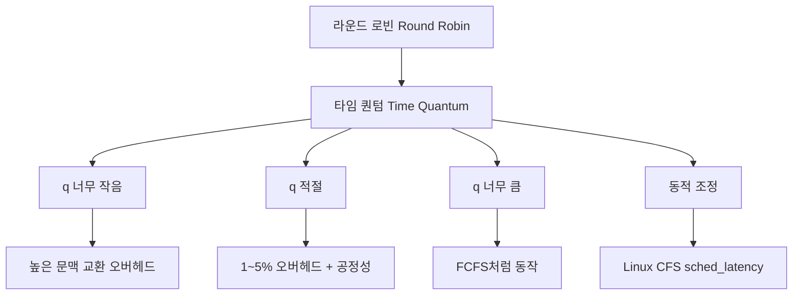

+++
title = "라운드 로빈 시간 할당량 (Quantum)"
date = "2026-03-14"
weight = 690
+++

> **💡 Insight**
> - 라운드 로빈(Round Robin, RR) 스케줄링은 각 프로세스에게 동일한 크기의 **타임 슬라이스/시간 할당량(Time Quantum)**을 할당하고, 할당량 소진 시 다음 프로세스로 전환합니다.
> - 타임 퀀텀(Time Quantum)의 크기는 시스템 성능에 결정적 영향을 미치며, 너무 작으면 문맥 교환 오버헤드가 증가하고, 너무 크면 FCFS처럼 동작합니다.
> - 이상적인 타임 퀀텀은 문맥 교환 오버헤드(약 1~5%)를 유지하면서 공정한 응답성을 제공하는 값(전형적으로 10~100ms)입니다.

### Ⅰ. 라운드 로빈 기본 원리와 타임 퀀텀

라운드 로빈(Round Robin, RR)은 **시분할 시스템(Time-sharing System)**을 위해 설계된 선점형 스케줄링 알고리즘입니다. 각 프로세스에게 동일한 크기의 **타임 퀀텀(Time Quantum)** 또는 **타임 슬라이스(Time Slice)**를 할당하고, 할당량을 소진하면 준비 큐의 맨 뒤로 이동시킵니다.

```text
┌───────────────────────────────────────────────────────────────────┐
│          라운드 로빈 스케줄링 기본 동작                            │
├───────────────────────────────────────────────────────────────────┤
│                                                                   │
│  준비 큐 (Circular Queue):                                       │
│  ┌─────┬─────┬─────┬─────┬─────┐                                │
│  │ P1  │ P2  │ P3  │ P4  │ P5  │ ──▶ 순환                       │
│  │24ms │ 5ms │10ms │ 7ms │ 8ms │                                │
│  └─────┴─────┴─────┴─────┴─────┘                                │
│                                                                   │
│  타임 퀀텀 q = 5ms 인 경우 실행 타임라인:                         │
│  ┌─────────────────────────────────────────────────────────────┐ │
│  │ P1  │ P2  │ P3  │ P4  │ P5  │ P1  │ P3  │ P4  │ P5  │ P1  │ │
│  │ 5ms │ 5ms │ 5ms │ 5ms │ 5ms │ 5ms │ 5ms │ 2ms │ 5ms │ 5ms │ │
│  │█████│█████│█████│█████│█████│█████│█████│██  │█████│█████│ │
│  │     │완료 │     │     │     │     │완료 │     │     │     │ │
│  │     │     │     │     │     │     │     │     │     │     │ │
│  │ ←─── q=5ms ───→│←─── q=5ms ───→│                         │ │
│  │   (선점 발생)  │   (선점 발생)                             │ │
│  └─────────────────────────────────────────────────────────────┘ │
│                                                                   │
│  ┌─────────────────────────────────────────────────────────────┐ │
│  │  프로세스별 실행/완료 시점                                   │ │
│  ├─────────────────────────────────────────────────────────────┤ │
│  │  P2: 5ms에 완료 (한 퀀텀 내)                                 │ │
│  │  P4: 22ms에 완료 (3번째 턴에서 2ms 추가 실행)                │ │
│  │  P3: 27ms에 완료 (2번의 퀀텀 사용)                           │ │
│  │  P5: 32ms에 완료                                            │ │
│  │  P1: 37ms에 완료 (가장 긴 작업, 5번 턴)                      │ │
│  └─────────────────────────────────────────────────────────────┘ │
└───────────────────────────────────────────────────────────────────┘
```

**[다이어그램 해설]** 타임 퀀텀이 5ms인 RR 스케줄링에서 각 프로세스는 최대 5ms씩 실행한 후 준비 큐의 뒤로 이동합니다. P2는 5ms만에 완료되어 즉시 큐에서 제거됩니다. P1은 24ms가 필요하므로 5번의 턴(5×5ms=25ms, 하지만 24ms만 필요)을 거쳐 완료됩니다. RR은 모든 프로세스에게 공평한 CPU 시간을 보장하며, 짧은 작업이 긴 작업을 기다리는 호위 효과를 방지합니다.

> **📢 섹션 요약 비유:** 라운드 로빈은 게임의 "턴제 방식"과 같습니다. 각 플레이어가 5분씩(타임 퀀텀) 차례를 갖고, 시간이 다 되면 다음 플레이어에게 넘깁니다. 모두가 공평하게 플레이할 수 있죠.

### Ⅱ. 타임 퀀텀 크기의 영향 분석

타임 퀀텀(Time Quantum)의 크기는 시스템 성능에 결정적인 영향을 미칩니다. 이상적인 값은 트레이드오프(Trade-off)를 고려하여 결정해야 합니다.

```text
┌───────────────────────────────────────────────────────────────────┐
│          타임 퀀텀 크기에 따른 성능 변화                           │
├───────────────────────────────────────────────────────────────────┤
│                                                                   │
│  ┌─────────────────────────────────────────────────────────────┐ │
│  │                                                             │ │
│  │  문맥 교환                                                  │ │
│  │  오버헤드                                                   │ │
│  │    100%│                                                   │ │
│  │        │ \\                                                 │ │
│  │     50%│  \\                                                │ │
│  │        │   \\  너무 작은 q                                  │ │
│  │     10%│    \\   ↓                                         │ │
│  │        │     \\  과도한 문맥 교환                           │ │
│  │      5%│      ─────────────────────────────                 │ │
│  │        │                   \\                               │ │
│  │      0%│                    \\  너무 큰 q                    │ │
│  │        │                     \\  ↓                          │ │
│  │        │                      \\  FCFS처럼 동작              │ │
│  │        └────────────────────────────────────────────────▶   │ │
│  │         1ms    10ms   50ms  100ms  500ms    타임 퀀텀(q)     │ │
│  │                                                             │ │
│  └─────────────────────────────────────────────────────────────┘ │
│                                                                   │
│  ┌─────────────────────────────────────────────────────────────┐ │
│  │  [q가 너무 작은 경우 (예: 1ms)]                              │ │
│  ├─────────────────────────────────────────────────────────────┤ │
│  │  • 문맥 교환 빈도 급증                                       │ │
│  │  • CPU 사이클 대부분이 문맥 교환에 소모                       │ │
│  │  • 실질적인 작업 처리량 급감                                  │ │
│  │  • 시스템이 스레싱(Thrashing) 상태                           │ │
│  │                                                             │ │
│  │  예: q=1ms, 문맥 교환=0.5ms → 33% CPU 낭비                  │ │
│  └─────────────────────────────────────────────────────────────┘ │
│                                                                   │
│  ┌─────────────────────────────────────────────────────────────┐ │
│  │  [q가 너무 큰 경우 (예: 500ms)]                              │ │
│  ├─────────────────────────────────────────────────────────────┤ │
│  │  • FCFS와 동일하게 동작                                      │ │
│  │  • 호위 효과(Convoy Effect) 발생                             │ │
│  │  • 대화형 시스템에서 응답성 저하                              │ │
│  │  • 공정성 보장 실패                                          │ │
│  │                                                             │ │
│  │  예: 10개 프로세스, q=500ms → 마지막 프로세스 4.5초 대기     │ │
│  └─────────────────────────────────────────────────────────────┘ │
│                                                                   │
│  ┌─────────────────────────────────────────────────────────────┐ │
│  │  [이상적인 q (일반적으로 10~100ms)]                          │ │
│  ├─────────────────────────────────────────────────────────────┤ │
│  │  • 문맥 교환 오버헤드 < 전체 CPU 시간의 1~5%                 │ │
│  │  • 대화형 프로세스의 응답 시간 보장                           │ │
│  │  • 공정한 CPU 분배                                           │ │
│  │  • 적절한 처리량 유지                                        │ │
│  │                                                             │ │
│  │  경험적 공식: q ≈ 0.8 × 평균 CPU 버스트 길이                 │ │
│  │  또는 문맥 교환 시간의 10~100배                              │ │
│  └─────────────────────────────────────────────────────────────┘ │
└───────────────────────────────────────────────────────────────────┘
```

**[다이어그램 해설]** 타임 퀀텀이 너무 작으면(예: 1ms), 문맥 교환 오버헤드가 전체 CPU 시간의 상당 부분을 차지합니다. 문맥 교환에 0.5ms가 걸린다면 q=1ms일 때 33%의 CPU 시간이 낭비됩니다. 반대로 타임 퀀텀이 너무 크면(예: 500ms), RR은 FCFS와 동일하게 동작하여 호위 효과가 발생합니다. 이상적인 타임 퀀텀은 문맥 교환 오버헤드를 1~5% 이내로 유지하면서 응답성을 보장하는 값으로, 전형적으로 10~100ms입니다.

> **📢 섹션 요약 비유:** 타임 퀀텀 설정은 회의 발표 시간 배정과 같습니다. 1분씩만 발표하면(q 너무 작음) 발표자 교체하는 데 시간 다 쓰고, 1시간씩 발표하면(q 너무 큼) 뒷사람은 반나절 기다립니다. 10~15분이 적당하죠.

### Ⅲ. 타임 퀀텀과 문맥 교환 오버헤드 계산

타임 퀀텀 설정의 정량적 분석을 통해 최적 값을 계산할 수 있습니다.

```text
┌───────────────────────────────────────────────────────────────────┐
│          타임 퀀텀과 문맥 교환 오버헤드 수식                       │
├───────────────────────────────────────────────────────────────────┤
│                                                                   │
│  [기본 공식]                                                      │
│  ┌─────────────────────────────────────────────────────────────┐ │
│  │                                                             │ │
│  │  문맥 교환 오버헤드 비율 = ──────────────────────            │ │
│  │                               타임 퀀텀(q) + 문맥교환시간(t) │ │
│  │                          문맥 교환 시간(t)                   │ │
│  │                                                             │ │
│  │  예: q=10ms, t=0.5ms                                        │ │
│  │  오버헤드 = 0.5 / (10 + 0.5) = 0.5 / 10.5 ≈ 4.8%            │ │
│  │                                                             │ │
│  └─────────────────────────────────────────────────────────────┘ │
│                                                                   │
│  [다양한 q에 대한 오버헤드 계산] (문맥 교환 = 0.5ms 가정)         │
│  ┌─────────────────────────────────────────────────────────────┐ │
│  │  타임 퀀텀(q)  │  오버헤드 비율  │  평가                     │ │
│  ├────────────────┼──────────────────┼─────────────────────────┤ │
│  │     1ms        │     33.3%        │  ❌ 너무 높음            │ │
│  │     5ms        │      9.1%        │  ⚠ 경계선               │ │
│  │    10ms        │      4.8%        │  ✅ 적절                 │ │
│  │    20ms        │      2.4%        │  ✅ 양호                 │ │
│  │    50ms        │      1.0%        │  ✅ 매우 양호             │ │
│  │   100ms        │      0.5%        │  ✅ 오버헤드 무시 가능    │ │
│  │   500ms        │      0.1%        │  ⚠ FCFS화 가능성         │ │
│  └────────────────┴──────────────────┴─────────────────────────┘ │
│                                                                   │
│  [응답 시간 계산]                                                 │
│  ┌─────────────────────────────────────────────────────────────┐ │
│  │  n개의 프로세스가 있을 때, 특정 프로세스의 최대 응답 시간:    │ │
│  │                                                             │ │
│  │  최대 응답 시간 = (n - 1) × q                                │ │
│  │                                                             │ │
│  │  예: n=10, q=50ms → 최대 응답 시간 = 9 × 50ms = 450ms       │ │
│  │      n=10, q=10ms → 최대 응답 시간 = 9 × 10ms = 90ms        │ │
│  │                                                             │ │
│  │  작은 q → 짧은 응답 시간 (대화형 시스템 유리)                │ │
│  │  큰 q → 긴 응답 시간 (배치 시스템 유리)                      │ │
│  └─────────────────────────────────────────────────────────────┘ │
└───────────────────────────────────────────────────────────────────┘
```

**[다이어그램 해설]** 문맥 교환 오버헤드 비율은 q가 커질수록 감소하지만, q가 너무 커지면 응답성이 저하됩니다. n개의 프로세스가 있을 때, 특정 프로세스가 CPU를 얻기까지 최대 (n-1)×q 시간을 기다려야 합니다. 따라서 대화형 시스템에서는 작은 q(10~20ms)를 사용하여 빠른 응답성을 보장하고, 배치 시스템에서는 큰 q(100ms+)를 사용하여 처리량을 높입니다. Linux CFS는 타임 퀀텀을 동적으로 조정하여 이 균형을 자동으로 맞춥니다.

> **📢 섹션 요약 비유:** 오버헤드 계산은 "공장의 기계 교체 시간"과 같습니다. 기계를 너무 자주 바꾸면(q 작음) 교체하는 데 시간 다 쓰고, 너무 안 바꾸면(q 큼) 한 제품만 계속 만듭니다. 적절한 교체 주기가 생산 효율을 결정하죠.

### Ⅳ. 실제 시스템의 타임 퀀텀 설정

다양한 운영체제에서 사용하는 타임 퀀텀 값을 비교합니다.

```text
┌───────────────────────────────────────────────────────────────────┐
│          실제 OS별 타임 퀀텀 설정 비교                             │
├───────────────────────────────────────────────────────────────────┤
│                                                                   │
│  ┌─────────────────────────────────────────────────────────────┐ │
│  │  운영체제           │ 타임 퀀텀       │ 특성                │ │
│  ├─────────────────────┼─────────────────┼─────────────────────┤ │
│  │  Linux (CFS)        │ 동적 (1~20ms)   │ vruntime 기반       │ │
│  │  Windows            │ ~15.6ms         │ 우선순위 보정       │ │
│  │  macOS (XNU)        │ ~10ms           │ Mach 스케줄러       │ │
│  │  FreeBSD            │ ~10ms           │ ULE 스케줄러        │ │
│  │  Solaris            │ ~10ms           │ TSIA 클래스         │ │
│  │  RTOS (VxWorks)     │ ~1ms 또는 미사용│ 실시간 보장         │ │
│  └─────────────────────┴─────────────────┴─────────────────────┘ │
│                                                                   │
│  [Linux CFS의 동적 타임 퀀텀]                                     │
│  ┌─────────────────────────────────────────────────────────────┐ │
│  │  • sched_latency (기본 6ms): 목표 대기 시간                  │ │
│  │  • min_granularity (기본 0.75ms): 최소 실행 시간             │ │
│  │  • 실제 타임 슬라이스 = sched_latency / 실행 가능 태스크 수   │ │
│  │                                                             │ │
│  │  예: 태스크 3개 → 6ms / 3 = 2ms 각각                        │ │
│  │      태스크 12개 → 6ms / 12 = 0.5ms (min_granularity 적용)  │ │
│  │                           → 각각 0.75ms 실행                 │ │
│  └─────────────────────────────────────────────────────────────┘ │
│                                                                   │
│  [타임 퀀텀 설정 가이드라인]                                      │
│  ┌─────────────────────────────────────────────────────────────┐ │
│  │  시스템 유형          │ 권장 타임 퀀텀     │ 이유            │ │
│  ├───────────────────────┼────────────────────┼────────────────┤ │
│  │  대화형 데스크탑      │ 10~20ms           │ 빠른 응답성     │ │
│  │  서버                 │ 50~100ms          │ 처리량 중심     │ │
│  │  실시간 제어          │ 1~5ms 또는 미사용  │ 결정적 응답     │ │
│  │  모바일               │ 5~15ms            │ 배터리 + 응답성 │ │
│  │  고성능 컴퓨팅        │ 100ms+            │ 캐시 효율       │ │
│  └───────────────────────┴────────────────────┴────────────────┘ │
└───────────────────────────────────────────────────────────────────┘
```

**[다이어그램 해설]** Linux CFS는 타임 퀀텀을 동적으로 계산합니다. 실행 가능한 태스크 수에 따라 타임 슬라이스를 조정하여, 많은 태스크가 있을 때도 공정성을 보장합니다. `sched_latency`(기본 6ms)를 n개의 태스크로 나누되, 최소 `min_granularity`(기본 0.75ms)는 보장합니다. Windows는 약 15.6ms의 기본 퀀텀을 사용하며 우선순위에 따라 조정합니다. RTOS는 실시간 보장을 위해 매우 작은 퀀텀이나 협력적 스케줄링을 사용합니다.

> **📢 섹션 요약 비유:** 실제 OS의 타임 퀀텀 설정은 "식당 종류별 서빙 방식"과 같습니다. 패스트푸드점(대화형)은 빠르게 돌려주고, 코스 요리집(서버)은 천천히 제공하죠. 고급 레스토랑(실시간)은 예약된 시간에 정확히 서빙합니다.

### Ⅴ. 결론 및 핵심 요약

| 타임 퀀텀 크기 | 장점 | 단점 | 적합한 환경 |
|:---|:---|:---|:---|
| **매우 작음 (<5ms)** | 빠른 응답성 | 높은 오버헤드 | 실시간 시스템 |
| **적절함 (10~50ms)** | 균형 | - | 대화형/범용 |
| **큼 (100ms+)** | 낮은 오버헤드 | 느린 응답 | 배치 서버 |

**핵심 교훈:** 이상적인 타임 퀀텀은 **문맥 교환 오버헤드 1~5%**를 유지하면서 **n×q < 응답 시간 요구사항**을 만족하는 값입니다. 현대 OS는 동적 조정으로 이 균형을 자동으로 맞춥니다.

> **📢 섹션 요약 비유:** 타임 퀀텀은 "황금 비율"을 찾는 것과 같습니다. 너무 짧아도, 너무 길어도 안 됩니다. 시스템의 목적에 맞는 적절한 균형점을 찾아야 합니다.

---

### 💡 Knowledge Graph


### 👧 Child Analogy
타임 퀀텀은 게임기 앞에서 차례 기다리는 시간이야! 1분씩만 하면(q 작음) 너무 자주 자리 바꿔서 게임할 시간 없고, 1시간씩 하면(q 큼) 뒷친구들이 다 집에 가! 10~15분이면 딱 좋아. 다들 공평하게 재밌게 놀 수 있지!