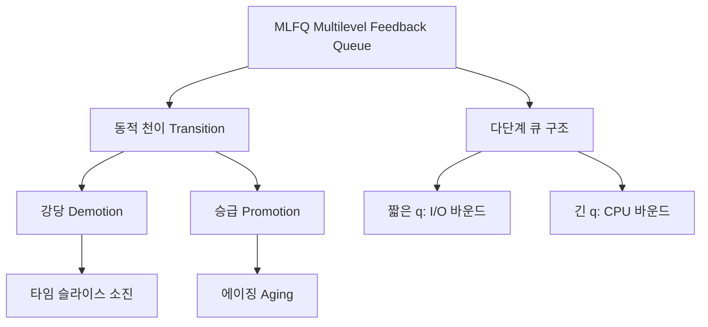

+++
title = "다단계 피드백 큐 MLFQ 천이"
date = "2026-03-14"
weight = 691
+++

> **💡 Insight**
> - MLFQ (Multilevel Feedback Queue)는 여러 개의 우선순위 큐와 **동적 우선순위 조정(천이, Transition)** 메커니즘을 결합한 스케줄링 알고리즘입니다.
> - 새 프로세스는 최상위 큐에서 시작하고, 타임 슬라이스를 모두 사용하면 하위 큐로 **강등(Demotion)**, 오래 대기하면 상위 큐로 **승급(Promotion)**합니다.
> - MLFQ는 CPU 버스트 길이를 미리 알지 않아도 짧은 작업을 우선 처리하고, 긴 작업에도 공정한 기회를 부여합니다.

### Ⅰ. MLFQ 구조와 기본 동작

MLFQ는 **N개의 우선순위 큐**를 사용하며, 각 큐는 서로 다른 타임 슬라이스를 가집니다. 높은 우선순위 큐는 짧은 타임 슬라이스, 낮은 우선순위 큐는 긴 타임 슬라이스를 할당합니다.

```text
┌───────────────────────────────────────────────────────────────────┐
│              MLFQ 기본 구조 (다단계 피드백 큐)                      │
├───────────────────────────────────────────────────────────────────┤
│                                                                   │
│  우선순위 (높음)                                                  │
│  ▲                                                               │
│  │   ┌─────────────────────────────────────────┐                 │
│  │   │ Queue 0 (최상위) - q = 8ms             │ ◀ 새 프로세스   │
│  │   │ [P1][P2][P3]...                         │    진입점      │
│  │   └─────────────────────────────────────────┘                 │
│  │                     │                                         │
│  │                     │ 타임 슬라이스 초과 시 강등               │
│  │                     ▼                                         │
│  │   ┌─────────────────────────────────────────┐                 │
│  │   │ Queue 1 - q = 16ms                      │                 │
│  │   │ [P4][P5]...                             │                 │
│  │   └─────────────────────────────────────────┘                 │
│  │                     │                                         │
│  │                     ▼                                         │
│  │   ┌─────────────────────────────────────────┐                 │
│  │   │ Queue 2 - q = 32ms                      │                 │
│  │   │ [P6][P7][P8]...                         │                 │
│  │   └─────────────────────────────────────────┘                 │
│  │                     │                                         │
│  │                     ▼                                         │
│  │   ┌─────────────────────────────────────────┐                 │
│  │   │ Queue N-1 (최하위) - q = 64ms+          │ ◀ CPU 바운드   │
│  │   │ [P9][P10]...                            │    프로세스     │
│  │   └─────────────────────────────────────────┘                 │
│  │                                                               │
│  ▼                                                               │
│  우선순위 (낮음)                                                  │
│                                                                   │
│  스케줄링 규칙:                                                   │
│  1. 우선순위(Priority): Queue 0 > Queue 1 > Queue 2 > ...        │
│  2. 같은 큐 내에서는 Round Robin                                  │
│  3. 상위 큐가 비어 있어야 하위 큐 실행                            │
│  4. 높은 우선순위 작업 도착 시 선점                                │
└───────────────────────────────────────────────────────────────────┘
```

**[다이어그램 해설]** MLFQ는 다단계 큐(Multilevel Queue)와 달리 프로세스가 큐 간에 이동할 수 있습니다. 새 프로세스는 항상 최상위 큐(Queue 0)에서 시작합니다. 타임 슬라이스를 모두 사용하면 하위 큐로 강등되고, 더 긴 타임 슬라이스를 받습니다. 상위 큐일수록 짧은 타임 슬라이스를 사용하여 I/O 바운드(짧은 CPU 버스트) 프로세스를 빠르게 처리합니다. 최하위 큐는 긴 타임 슬라이스를 사용하여 CPU 바운드 프로세스가 효율적으로 실행될 수 있게 합니다.

> **📢 섹션 요약 비유:** MLFQ는 병원 응급실의 분류 시스템과 같습니다. 모든 환자(프로세스)는 처음에 응급 분류를 받고(최상위 큐), 빨리 치료되면 퇴원, 오래 걸리면 일반 병동(하위 큐)으로 이송됩니다.

### Ⅱ. 큐 간 천이(Transition) 규칙

MLFQ의 핵심은 **동적 우선순위 조정**입니다. 프로세스의 행동에 따라 큐 간에 이동합니다.

```text
┌───────────────────────────────────────────────────────────────────┐
│              MLFQ 천이 규칙 (Transition Rules)                     │
├───────────────────────────────────────────────────────────────────┤
│                                                                   │
│  [규칙 1] 강등 (Demotion) - CPU를 오래 사용한 프로세스             │
│  ┌─────────────────────────────────────────────────────────────┐ │
│  │                                                             │ │
│  │  Queue 0           Queue 1           Queue 2                │ │
│  │  ┌───────┐         ┌───────┐        ┌───────┐              │ │
│  │  │ P_A   │ ──────▶ │ P_A   │ ────▶ │ P_A   │              │ │
│  │  │(8ms)  │  타임   │(16ms) │ 타임  │(32ms) │              │ │
│  │  │       │ 슬라이스│       │슬라이스│       │              │ │
│  │  └───────┘  소진   └───────┘ 소진  └───────┘              │ │
│  │                                                             │ │
│  │  조건: 할당된 타임 슬라이스를 모두 사용                       │ │
│  │  의미: CPU 바운드일 가능성 높음 → 낮은 우선순위로             │ │
│  │                                                             │ │
│  └─────────────────────────────────────────────────────────────┘ │
│                                                                   │
│  [규칙 2] 승급 (Promotion) - 오래 대기한 프로세스                  │
│  ┌─────────────────────────────────────────────────────────────┐ │
│  │                                                             │ │
│  │  Queue 2           Queue 1           Queue 0                │ │
│  │  ┌───────┐         ┌───────┐        ┌───────┐              │ │
│  │  │ P_B   │ ──────▶ │ P_B   │ ────▶ │ P_B   │              │ │
│  │  │       │  에이징 │       │에이징 │       │              │ │
│  │  │대기중 │  (기아  │       │(기아  │       │              │ │
│  │  └───────┘  방지)  └───────┘방지) └───────┘              │ │
│  │                                                             │ │
│  │  조건: 일정 시간(S) 이상 실행되지 않음                        │ │
│  │  의미: 기아 방지, I/O 바운드였을 가능성                       │ │
│  │  주기: 보통 1초~수초마다 모든 프로세스 최상위로 리셋          │ │
│  │                                                             │ │
│  └─────────────────────────────────────────────────────────────┘ │
│                                                                   │
│  [규칙 3] I/O 발생 시 유지 또는 승급                               │
│  ┌─────────────────────────────────────────────────────────────┐ │
│  │                                                             │ │
│  │  Queue 1                                                   │ │
│  │  ┌───────┐         I/O 요청              ┌───────┐         │ │
│  │  │ P_C   │ ──────────────────────────▶  │ P_C   │         │ │
│  │  │       │    타임 슬라이스 전에         │       │         │ │
│  │  │       │    I/O 대기 진입             │       │         │ │
│  │  └───────┘                              └───────┘         │ │
│  │       │                                      │             │ │
│  │       │  I/O 완료 후                         │             │ │
│  │       │  (짧은 버스트 사용)                  │             │ │
│  │       ▼                                      ▼             │ │
│  │  ┌───────┐                              ┌───────┐         │ │
│  │  │ P_C   │   동일 큐 또는               │ P_C   │         │ │
│  │  │(유지) │   상위 큐로 복귀             │(승급) │         │ │
│  │  └───────┘                              └───────┘         │ │
│  │                                                             │ │
│  │  조건: 타임 슬라이스 소진 전 I/O 요청                        │ │
│  │  의미: I/O 바운드 프로세스 → 높은 우선순위 유지              │ │
│  │                                                             │ │
│  └─────────────────────────────────────────────────────────────┘ │
└───────────────────────────────────────────────────────────────────┘
```

**[다이어그램 해설]** MLFQ의 천이 규칙은 프로세스의 행동을 관찰하여 자동으로 분류합니다. 타임 슬라이스를 모두 사용하면 CPU 바운드로 판단하여 강당합니다. I/O를 자주 요청하면 I/O 바운드로 판단하여 높은 우선순위를 유지하거나 승급합니다. 기아 방지를 위해 일정 시간 이상 대기한 프로세스는 상위 큐로 승급(Priority Boost)합니다. 이 규칙들을 통해 CPU 버스트 길이를 미리 알지 않아도 SJF와 유사한 효과를 얻을 수 있습니다.

> **📢 섹션 요약 비유:** 천이 규칙은 직장의 성과 평가 시스템과 같습니다. 일을 빨리 끝내는 직원(I/O 바운드)은 승진하고, 오래 걸리는 직원(CPU 바운드)은 낮은 우선순위 업무를 맡습니다. 너무 오래 승진 못 하면(기아) 특별 승진 기회를 줍니다.

### Ⅲ. MLFQ 매개변수와 튜닝

MLFQ의 성능은 여러 매개변수 설정에 따라 달라집니다. 시스템 관리자가 조정할 수 있습니다.

```text
┌───────────────────────────────────────────────────────────────────┐
│              MLFQ 매개변수 설정                                    │
├───────────────────────────────────────────────────────────────────┤
│                                                                   │
│  ┌─────────────────────────────────────────────────────────────┐ │
│  │  매개변수         │ 설명                    │ 일반적 설정    │ │
│  ├───────────────────┼─────────────────────────┼────────────────┤ │
│  │  큐 개수 (N)      │ 우선순위 레벨 수        │ 3~8개          │ │
│  │  타임 슬라이스    │ 각 큐의 퀀텀 값         │ 8→16→32→...ms  │ │
│  │  에이징 주기 (S)  │ 승급/리셋 간격          │ 1~수초         │ │
│  │  강당 임계값      │ 하향 이동 기준          │ 퀀텀 소진      │ │
│  │  승급 임계값      │ 상향 이동 기준          │ 대기 시간      │ │
│  └───────────────────┴─────────────────────────┴────────────────┘ │
│                                                                   │
│  [매개변수별 영향]                                                │
│  ┌─────────────────────────────────────────────────────────────┐ │
│  │                                                             │ │
│  │  큐 개수 (N):                                               │ │
│  │  • 많음 → 세밀한 분류 가능, 관리 복잡                       │ │
│  │  • 적음 → 단순, 분류가 거침                                 │ │
│  │                                                             │ │
│  │  타임 슬라이스 비율:                                        │ │
│  │  • 2배씩 증가 (8→16→32→64): 전통적 설정                     │ │
│  │  • 동일: 모든 큐에서 같은 RR                                │ │
│  │  • 점진적 증가: 부드러운 전환                               │ │
│  │                                                             │ │
│  │  에이징 주기 (S):                                           │ │
│  │  • 짧음 → 빈번한 승급, 공정성 높음, 오버헤드 증가           │ │
│  │  • 김 → CPU 바운드 효율 증가, 기아 가능성                   │ │
│  │                                                             │ │
│  └─────────────────────────────────────────────────────────────┘ │
│                                                                   │
│  ┌─────────────────────────────────────────────────────────────┐ │
│  │  BSD Unix MLFQ 예시 (Traditional)                           │ │
│  ├─────────────────────────────────────────────────────────────┤ │
│  │  큐 0: 우선순위 0-19, 타임 슬라이스 = 기본값                 │ │
│  │  큐 1: 우선순위 20-39, 타임 슬라이스 = 2×기본값              │ │
│  │  큐 2: 우선순위 40-59, 타임 슬라이스 = 4×기본값              │ │
│  │  ...                                                        │ │
│  │  nice 값으로 수동 조정 가능 (-20 ~ +19)                     │ │
│  └─────────────────────────────────────────────────────────────┘ │
└───────────────────────────────────────────────────────────────────┘
```

**[다이어그램 해설]** MLFQ는 많은 튜닝 가능성을 제공합니다. 큐 개수가 많을수록 프로세스 분류가 세밀해지지만 관리가 복잡해집니다. 타임 슬라이스는 전통적으로 2배씩 증가시키는 기하급수적 스케일을 사용합니다. 에이징 주기가 너무 짧으면 빈번한 리셋으로 오버헤드가 증가하고, 너무 길면 기아 상태가 발생할 수 있습니다. BSD Unix는 nice 값을 통해 사용자가 우선순위를 수동으로 조정할 수 있게 합니다.

> **📢 섹션 요약 비유:** MLFQ 매개변수 튜닝은 자동차의 기어 설정과 같습니다. 기어 개수(큐 수), 각 기어의 속도 범위(타임 슬라이스), 변속 시점(에이징 주기)을 조정하여 차량의 성능을 최적화합니다.

### Ⅳ. MLFQ 장단점 분석

MLFQ는 복잡하지만 강력한 스케줄링 알고리즘입니다. 장단점을 분석합니다.

```text
┌───────────────────────────────────────────────────────────────────┐
│              MLFQ 장단점 분석                                      │
├───────────────────────────────────────────────────────────────────┤
│                                                                   │
│  [장점]                                                           │
│  ┌─────────────────────────────────────────────────────────────┐ │
│  │  ✅ CPU 버스트 길이를 미리 알 필요 없음                       │ │
│  │  ✅ 짧은 작업(I/O 바운드)에 빠른 응답성 제공                  │ │
│  │  ✅ 긴 작업(CPU 바운드)에도 공정한 CPU 시간 보장              │ │
│  │  ✅ 기아 상태(Starvation) 방지 메커니즘 내장                  │ │
│  │  ✅ 다양한 워크로드에 적응적 적응                            │ │
│  │  ✅ SJF의 장점(평균 대기 시간 최소화)를 선점형으로 구현       │ │
│  └─────────────────────────────────────────────────────────────┘ │
│                                                                   │
│  [단점]                                                           │
│  ┌─────────────────────────────────────────────────────────────┐ │
│  │  ❌ 구현 복잡도 높음 (여러 큐, 천이 로직)                     │ │
│  │  ❌ 매개변수 튜닝이 어려움 (최적값 찾기)                      │ │
│  │  ❌ 시스템 콜이나 게임(running game)을 속일 수 있음           │ │
│  │     (의도적 I/O로 높은 우선순위 유지)                        │ │
│  │  ❌ 문맥 교환 오버헤드 (큐 간 이동)                          │ │
│  │  ❌ 우선순위 역전 가능성                                     │ │
│  └─────────────────────────────────────────────────────────────┘ │
│                                                                   │
│  [비교: 다단계 큐 vs MLFQ]                                        │
│  ┌─────────────────────────────────────────────────────────────┐ │
│  │  구분          │ 다단계 큐 (MQ)  │ MLFQ                     │ │
│  ├────────────────┼────────────────┼─────────────────────────┤ │
│  │  큐 간 이동    │ 불가능          │ 가능                     │ │
│  │  프로세스 분류 │ 사전 지정       │ 동적 분류                │ │
│  │  유연성        │ 낮음            │ 높음                     │ │
│  │  구현 복잡도   │ 단순            │ 복잡                     │ │
│  │  적응성        │ 없음            │ 있음                     │ │
│  └────────────────┴────────────────┴─────────────────────────┘ │
└───────────────────────────────────────────────────────────────────┘
```

**[다이어그램 해설]** MLFQ의 가장 큰 장점은 CPU 버스트 길이를 미리 알지 않아도 SJF와 유사한 성능을 낼 수 있다는 점입니다. I/O 바운드 프로세스는 자연스럽게 상위 큐에 머물고, CPU 바운드는 하위 큐로 이동합니다. 단점으로는 구현이 복잡하고, 악의적인 프로그램이 타임 슬라이스 직전에 의도적으로 I/O를 요청하여 높은 우선순위를 유지하는 "게임" 문제가 있습니다. 다단계 큐(Multilevel Queue)는 프로세스를 시작할 때 분류하면 더 이동할 수 없지만, MLFQ는 동적으로 분류를 조정합니다.

> **📢 섹션 요약 비유:** MLFQ는 "적응형 트레이너"입니다. 회원의 운동 패턴을 관찰하여 자동으로 프로그램을 조정합니다. 단, 회원이 시스템을 속이려 하면(게임) 제대로 작동하지 않을 수 있습니다.

### Ⅴ. 결론 및 핵심 요약

| 항목 | MLFQ 특성 |
|:---|:---|
| **기반** | 다단계 큐 + 동적 천이 |
| **강당(Demotion)** | 타임 슬라이스 소진 시 하위 큐 |
| **승급(Promotion)** | 오래 대기 시 상위 큐 (에이징) |
| **목표** | 짧은 작업 우선 + 기아 방지 |
| **복잡도** | 높음 (매개변수 튜닝 필요) |

**핵심 교훈:** MLFQ는 SJF의 이론적 최적성과 Round Robin의 공정성을 결합한 실용적 알고리즘입니다. 현대 OS(특히 BSD 계열)에서 널리 사용됩니다.

> **📢 섹션 요약 비유:** MLFQ는 "스마트한 줄 관리 시스템"입니다. 빨리 끝날 일은 빠른 줄(상위 큐), 오래 걸릴 일은 느린 줄(하위 큐)로 자동 분류합니다. 너무 오래 기다리면 빠른 줄로 이동시켜 공정성도 보장하죠.

---

### 💡 Knowledge Graph


### 👧 Child Analogy
MLFQ는 놀이공원의 여러 놀이기구 줄이야! 처음엔 다 빠른 줄(Queue 0)에 서. 근데 천천히 타는 사람은 점점 느린 줄로 이동시켜(강등). 반대로 너무 오래 기다린 사람은 빠른 줄로 다시 보내줘(승급). 이렇게 하면 다들 공평하게 재밌게 놀 수 있어!