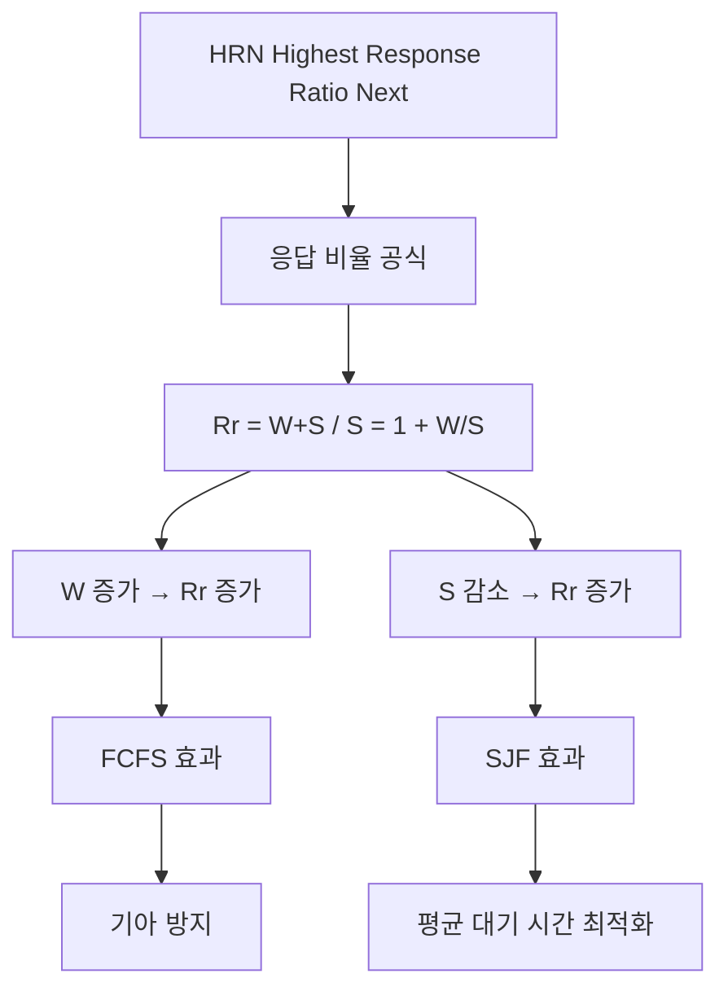

+++
title = "HRN 대기 시간 공식"
date = "2026-03-14"
weight = 692
+++

> **💡 Insight**
> - HRN (Highest Response Ratio Next) 스케줄링은 대기 시간과 서비스 시간을 모두 고려하여 **응답 비율(Response Ratio)**이 가장 높은 프로세스를 선택합니다.
> - 응답 비율 = (대기 시간 + 서비스 시간) / 서비스 시간 = 1 + (대기 시간 / 서비스 시간)
> - HRN은 SJF의 기아 상태(Starvation) 문제를 해결하면서도 평균 대기 시간을 최적화하는 타협적 알고리즘입니다.

### Ⅰ. HRN 스케줄링의 설계 철학

HRN (Highest Response Ratio Next)은 **SJF(Shortest Job First)의 기아 문제**와 **FCFS(First-Come, First-Served)의 호위 효과**를 동시에 완화하기 위해 설계되었습니다. 대기 시간이 길어질수록 우선순위가 높아지고, 서비스 시간이 짧을수록 우선순위가 높아지는 이중적 기준을 사용합니다.

```text
┌───────────────────────────────────────────────────────────────────┐
│              HRN 스케줄링의 핵심 공식                               │
├───────────────────────────────────────────────────────────────────┤
│                                                                   │
│  ┌─────────────────────────────────────────────────────────────┐ │
│  │                         응답 비율                            │ │
│  │           (Response Ratio = Rr)                             │ │
│  │                                                             │ │
│  │                         대기 시간 + 서비스 시간               │ │
│  │            Rr  =  ─────────────────────────────             │ │
│  │                             서비스 시간                      │ │
│  │                                                             │ │
│  │                      W + S                                   │ │
│  │            Rr  =  ──────  =  1 + (W / S)                    │ │
│  │                        S                                     │ │
│  │                                                             │ │
│  │  여기서:                                                     │ │
│  │    W = 대기 시간 (Waiting Time)                             │ │
│  │    S = 서비스 시간 (Service Time / CPU 버스트 길이)          │ │
│  │    Rr = 응답 비율 (Response Ratio)                          │ │
│  │                                                             │ │
│  │  선택 기준: Rr이 가장 큰 프로세스를 다음으로 실행             │ │
│  └─────────────────────────────────────────────────────────────┘ │
│                                                                   │
│  ┌─────────────────────────────────────────────────────────────┐ │
│  │  공식 분석                                                   │ │
│  ├─────────────────────────────────────────────────────────────┤ │
│  │                                                             │ │
│  │  Rr = 1 + (W / S)                                           │ │
│  │                                                             │ │
│  │  [S가 작을 때] (짧은 작업)                                   │ │
│  │  → W/S가 커짐 → Rr이 커짐 → SJF 효과 (짧은 작업 우선)        │ │
│  │                                                             │ │
│  │  [W가 클 때] (오래 대기)                                     │ │
│  │  → W/S가 커짐 → Rr이 커짐 → FCFS 효과 (오래 기다린 순)       │ │
│  │                                                             │ │
│  │  [S가 클 때] (긴 작업)                                       │ │
│  │  → W/S가 작음 → Rr이 작음 → 당장은 선택 안 됨               │ │
│  │  → 하지만 W이 계속 증가하면 결국 Rr이 커짐 → 기아 방지       │ │
│  │                                                             │ │
│  └─────────────────────────────────────────────────────────────┘ │
└───────────────────────────────────────────────────────────────────┘
```

**[다이어그램 해설]** HRN의 응답 비율 공식은 대기 시간(W)과 서비스 시간(S)의 비율을 고려합니다. 서비스 시간이 짧으면(S↓) W/S가 커져서 우선순위가 높아집니다(SJF 효과). 대기 시간이 길면(W↑) W/S가 커져서 우선순위가 높아집니다(FCFS 효과). 긴 작업도 대기 시간이 계속 증가하면 결국 W/S가 커져서 실행 기회를 얻으므로 기아 상태가 자연스럽게 방지됩니다.

> **📢 섹션 요약 비유:** HRN은 식당에서 "빨리 끝날 주문 + 오래 기다린 손님"을 우선시하는 스마트한 주문 시스템입니다. 간단한 주문은 빨리 처리(SJF), 오래 기다린 손님도 우선(FCFS). 두 기준을 합쳐서 공식화한 것입니다.

### Ⅱ. HRN 스케줄링 실행 예시

HRN이 실제로 어떻게 동작하는지 구체적인 예시로 확인합니다.

```text
┌───────────────────────────────────────────────────────────────────┐
│              HRN 스케줄링 실행 예시                                │
├───────────────────────────────────────────────────────────────────┤
│                                                                   │
│  [초기 상태] (시간 t=0)                                           │
│  ┌─────────────────────────────────────────────────────────────┐ │
│  │  프로세스 │ 도착 시간 │ 서비스 시간 │ 대기 시간 │ 응답 비율  │ │
│  ├───────────┼───────────┼─────────────┼───────────┼────────────┤ │
│  │  P1       │    0      │     24      │    0      │ 1 + 0/24=1 │ │
│  │  P2       │    0      │      3      │    0      │ 1 + 0/3 =1 │ │
│  │  P3       │    0      │      3      │    0      │ 1 + 0/3 =1 │ │
│  └───────────┴───────────┴─────────────┴───────────┴────────────┘ │
│                                                                   │
│  동률이면 FCFS → P1 실행 (24ms)                                   │
│                                                                   │
│  [t=24 후] P1 완료, 응답 비율 재계산                               │
│  ┌─────────────────────────────────────────────────────────────┐ │
│  │  프로세스 │ 도착 시간 │ 서비스 시간 │ 대기 시간 │ 응답 비율  │ │
│  ├───────────┼───────────┼─────────────┼───────────┼────────────┤ │
│  │  P2       │    0      │      3      │    24     │ 1+24/3=9.0 │ │
│  │  P3       │    0      │      3      │    24     │ 1+24/3=9.0 │ │
│  └───────────┴───────────┴─────────────┴───────────┴────────────┘ │
│                                                                   │
│  동률 → FCFS → P2 실행 (3ms)                                      │
│                                                                   │
│  [t=27 후] P2 완료                                                 │
│  ┌─────────────────────────────────────────────────────────────┐ │
│  │  P3: W=27, S=3, Rr = 1 + 27/3 = 10.0                       │ │
│  │  → P3 실행 (3ms)                                            │ │
│  └─────────────────────────────────────────────────────────────┘ │
│                                                                   │
│  [최종 결과]                                                      │
│  ┌─────────────────────────────────────────────────────────────┐ │
│  │  실행 순서: P1 → P2 → P3                                    │ │
│  │  대기 시간: P1=0, P2=24, P3=27                              │ │
│  │  평균 대기 시간 = (0 + 24 + 27) / 3 = 17ms                  │ │
│  │                                                             │ │
│  │  비교 (동일 작업):                                          │ │
│  │  • FCFS 평균 대기: 17ms (동일)                              │ │
│  │  • SJF 평균 대기: 2ms (P2→P3→P1)                            │ │
│  └─────────────────────────────────────────────────────────────┘ │
│                                                                   │
│  [기아 방지 예시]                                                 │
│  ┌─────────────────────────────────────────────────────────────┐ │
│  │  짧은 작업이 계속 도착해도 긴 작업의 W가 계속 증가           │ │
│  │  → W/S가 커짐 → 결국 Rr이 짧은 작업을 추월                  │ │
│  │  → 기아 상태 자연 해결                                      │ │
│  └─────────────────────────────────────────────────────────────┘ │
└───────────────────────────────────────────────────────────────────┘
```

**[다이어그램 해설]** 이 예시에서는 모든 프로세스가 동시에 도착하여 초기에 Rr이 모두 1로 동일합니다. FCFS 규칙으로 P1이 먼저 실행됩니다. P1 완료 후 P2와 P3의 대기 시간이 24ms로 증가하여 Rr=9.0이 됩니다. 결과적으로 FCFS와 동일한 순서가 되지만, 만약 긴 작업 P1이 있고 짧은 작업들이 계속 도착한다면, P1의 대기 시간이 계속 증가하여 Rr이 커지고 결국 실행 기회를 얻게 됩니다. 이것이 HRN의 기아 방지 메커니즘입니다.

> **📢 섹션 요약 비유:** HRN은 "누가 더 간절한가?"를 점수로 계산합니다. "빨리 끝나는 일(높은 점수)" + "오래 기다린 사람(높은 점수)" = "응답 비율". 점수가 높은 순서대로 처리합니다.

### Ⅲ. SJF vs HRN 비교 분석

HRN이 SJF에 비해 어떤 장점을 가지는지 비교 분석합니다.

```text
┌───────────────────────────────────────────────────────────────────┐
│              SJF vs HRN 비교 분석                                  │
├───────────────────────────────────────────────────────────────────┤
│                                                                   │
│  [시나리오] 긴 작업 P_Long(100ms) + 짧은 작업들 계속 도착          │
│                                                                   │
│  ┌─────────────────────────────────────────────────────────────┐ │
│  │                      SJF                                    │ │
│  │  ────────────────────────────────────────────────           │ │
│  │  Short1(2ms) ─▶ Short2(3ms) ─▶ Short3(2ms) ─▶ ...          │ │
│  │                                                             │ │
│  │  P_Long(100ms): ████████████████████████████████████████   │ │
│  │                  ↑                                          │ │
│  │           영원히 대기 가능                                   │ │
│  │           (기아 상태)                                        │ │
│  └─────────────────────────────────────────────────────────────┘ │
│                                                                   │
│  ┌─────────────────────────────────────────────────────────────┐ │
│  │                      HRN                                    │ │
│  │  ────────────────────────────────────────────────           │ │
│  │  P_Long의 Rr 변화 (S=100):                                  │ │
│  │                                                             │ │
│  │  t=0:    Rr = 1 + 0/100 = 1.00                             │ │
│  │  t=10:   Rr = 1 + 10/100 = 1.10                            │ │
│  │  t=50:   Rr = 1 + 50/100 = 1.50                            │ │
│  │  t=100:  Rr = 1 + 100/100 = 2.00                           │ │
│  │  t=200:  Rr = 1 + 200/100 = 3.00                           │ │
│  │                                                             │ │
│  │  짧은 작업(S=2ms)의 Rr (t=10에 도착):                       │ │
│  │  t=10:   Rr = 1 + 0/2 = 1.00                               │ │
│  │  t=12:   Rr = 1 + 2/2 = 2.00                               │ │
│  │  t=20:   Rr = 1 + 10/2 = 6.00                              │ │
│  │                                                             │ │
│  │  → P_Long이 충분히 기다리면 짧은 작업보다 Rr이 높아짐        │ │
│  │  → 자연스러운 기아 방지                                     │ │
│  └─────────────────────────────────────────────────────────────┘ │
│                                                                   │
│  ┌─────────────────────────────────────────────────────────────┐ │
│  │  비교 요약                                                   │ │
│  ├─────────────────┬─────────────────┬─────────────────────────┤ │
│  │  구분           │  SJF            │  HRN                    │ │
│  ├─────────────────┼─────────────────┼─────────────────────────┤ │
│  │  선택 기준      │  S 최소         │  (W+S)/S 최대           │ │
│  │  기아 상태      │  발생 가능      │  자연 방지              │ │
│  │  평균 대기 시간  │  최소 (최적)    │  SJF에 근접             │ │
│  │  구현 복잡도    │  단순           │  복잡 (매번 Rr 계산)     │ │
│  │  추가 메모리    │  S만 저장       │  W + S + 계산값          │ │
│  └─────────────────┴─────────────────┴─────────────────────────┘ │
└───────────────────────────────────────────────────────────────────┘
```

**[다이어그램 해설]** SJF에서는 긴 작업이 짧은 작업들에 의해 무한정 대기할 수 있습니다. HRN에서는 대기 시간(W)이 증가함에 따라 Rr도 증가합니다. 예를 들어 100ms 작업이 200ms 동안 대기하면 Rr=3.00이 되어, 막 도착한 2ms 작업(Rr=1.00)보다 높아집니다. 이렇게 HRN은 **수학적 공식**을 통해 자연스럽게 기아를 방지합니다. 단점은 매 스케줄링 결정마다 모든 대기 프로세스의 Rr을 계산해야 하므로 구현이 복잡합니다.

> **📢 섹션 요약 비유:** SJF는 "빨리 끝나는 일만 처리"라 철저한 반면, HRN은 "빨리 끝나는 일도 처리하지만, 너무 오래 기다린 사람도 배려"합니다. 기아 방지가 공식에 내장되어 있죠.

### Ⅳ. HRN의 한계와 개선 방향

HRN은 우아한 설계지만 실제 시스템에서는 몇 가지 한계가 있습니다.

```text
┌───────────────────────────────────────────────────────────────────┐
│              HRN의 한계와 개선 방향                                │
├───────────────────────────────────────────────────────────────────┤
│                                                                   │
│  [한계 1] 서비스 시간(S) 예측 필요                                 │
│  ┌─────────────────────────────────────────────────────────────┐ │
│  │  • SJF와 동일한 문제: CPU 버스트 길이를 미리 알아야 함       │ │
│  │  • 실제로는 예측(exponential averaging) 사용                 │ │
│  │  • 예측이 부정확하면 성능 저하                               │ │
│  └─────────────────────────────────────────────────────────────┘ │
│                                                                   │
│  [한계 2] O(n) 스케줄링 복잡도                                    │
│  ┌─────────────────────────────────────────────────────────────┐ │
│  │  • 매번 모든 대기 프로세스의 Rr을 계산해야 함                │ │
│  │  • n이 크면 스케줄링 오버헤드 증가                          │ │
│  │  • 실시간 시스템에는 부적합                                  │ │
│  └─────────────────────────────────────────────────────────────┘ │
│                                                                   │
│  [한계 3] 비선점형 전용                                           │
│  ┌─────────────────────────────────────────────────────────────┐ │
│  │  • 실행 중인 프로세스를 선점하지 않음                        │ │
│  │  • 응답성이 중요한 시분할 시스템에는 부적합                   │ │
│  │  • 선점형 HRN 변형 존재하지만 복잡                           │ │
│  └─────────────────────────────────────────────────────────────┘ │
│                                                                   │
│  [개선 방향]                                                      │
│  ┌─────────────────────────────────────────────────────────────┐ │
│  │                                                             │ │
│  │  ① MLFQ 사용: 복잡하지만 S 예측 불필요, 선점형              │ │
│  │  ② Linux CFS: vruntime 기반으로 HRN 철학 구현               │ │
│  │  ③ 우선순위 + 에이징: HRN의 정성적 목표를 다르게 달성        │ │
│  │                                                             │ │
│  │  ┌────────────────────────────────────────────────────────┐│ │
│  │  │  Linux CFS와 HRN의 연관성                               ││ │
│  │  ├────────────────────────────────────────────────────────┤│ │
│  │  │  vruntime이 작을수록(적게 실행) → 높은 우선순위        ││ │
│  │  │  → 짧은 작업 우선 효과                                  ││ │
│  │  │  vruntime이 클수록(많이 대기) → 보정 가능              ││ │
│  │  │  → HRN의 W/S와 유사한 효과                              ││ │
│  │  └────────────────────────────────────────────────────────┘│ │
│  └─────────────────────────────────────────────────────────────┘ │
└───────────────────────────────────────────────────────────────────┘
```

**[다이어그램 해설]** HRN의 가장 큰 한계는 서비스 시간(S)을 알거나 예측해야 한다는 점입니다. 또한 O(n) 스케줄링 복잡도로 인해 대규모 시스템에서는 오버헤드가 문제가 될 수 있습니다. HRN은 본질적으로 비선점형이므로 응답성이 중요한 시스템에는 부적합합니다. 현대 OS는 MLFQ나 CFS를 사용하여 HRN의 철학(짧은 작업 우선 + 기아 방지)을 더 효율적으로 구현합니다.

> **📢 섹션 요약 비유:** HRN은 "이론적으로 완벽한 공식"이지만, 현실에서는 "예측 불가능한 변수(서비스 시간)" 때문에 완벽히 구현하기 어렵습니다. 현대 OS는 이 문제를 MLFQ나 CFS로 우회합니다.

### Ⅴ. 결론 및 핵심 요약

| 항목 | HRN 특성 |
|:---|:---|
| **공식** | Rr = (W + S) / S = 1 + W/S |
| **선택 기준** | Rr 최대인 프로세스 |
| **장점** | SJF 최적성 + 기아 방지 |
| **단점** | S 예측 필요, O(n) 복잡도 |
| **용도** | 비선점형 배치 시스템 |

**핵심 교훈:** HRN은 **공정성(FCFS)**과 **효율성(SJF)**을 수학적으로 결합한 우아한 알고리즘입니다. 기아 방지가 공식에 내장되어 있어 별도의 에이징 메커니즘이 필요 없습니다.

> **📢 섹션 요약 비유:** HRN 공식은 "공정성 점수"입니다. (기다린 시간 + 일할 시간) / 일할 시간 = 기다린 만큼의 보상. 이 공식 하나로 효율성과 공정성을 동시에 달성합니다.

---

### 💡 Knowledge Graph


### 👧 Child Analogy
HRN은 점수로 줄 세우는 거야! 공식: (기다린 시간 + 할 일 시간) / 할 일 시간. 할 일이 짧으면(S 작음) 점수 높고, 오래 기다렸으면(W 큼) 점수 높아! 점수 높은 사람부터 처리하니까 빨리 끝날 일도 처리하고 오래 기다린 사람도 배려해. 기아 상태도 자연스럽게 해결돼!