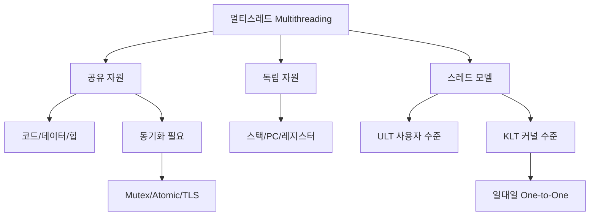

+++
title = "멀티스레드 유저모드 커널모드"
date = "2026-03-14"
weight = 693
+++

> **💡 Insight**
> - 스레드(Thread)는 프로세스 내의 실행 단위로, 같은 프로세스의 스레드들은 코드/데이터/힙/파일을 공유하고 각자 스택(Stack)과 레지스터를 독립적으로 가집니다.
> - 사용자 수준 스레드(User-level Thread)는 커널의 개입 없이 사용자 공간 라이브러리가 관리하며, 커널 수준 스레드(Kernel-level Thread)는 OS가 직접 스케줄링합니다.
> - 스레드 모델(다대일, 일대일, 다대다)에 따라 스케줄링 방식과 블로킹 동작이 달라집니다.

### Ⅰ. 스레드의 메모리 구조와 공유 자원

프로세스 내 스레드들은 **주소 공간을 공유**하면서 **실행 상태는 독립적**으로 유지합니다. 이 구조를 이해하는 것이 멀티스레딩의 핵심입니다.

```text
┌───────────────────────────────────────────────────────────────────┐
│          단일 프로세스 내 멀티스레드 메모리 구조                    │
├───────────────────────────────────────────────────────────────────┤
│                                                                   │
│  ┌─────────────────────────────────────────────────────────────┐ │
│  │                      프로세스 주소 공간                       │ │
│  │  ┌─────────────────────────────────────────────────────────┐│ │
│  │  │                    커널 영역 (공유)                      ││ │
│  │  └─────────────────────────────────────────────────────────┘│ │
│  │  ┌─────────────────────────────────────────────────────────┐│ │
│  │  │   스택 영역 (각 스레드 독립)                              ││ │
│  │  │  ┌──────────┐  ┌──────────┐  ┌──────────┐               ││ │
│  │  │  │Thread 1  │  │Thread 2  │  │Thread 3  │               ││ │
│  │  │  │ Stack    │  │ Stack    │  │ Stack    │               ││ │
│  │  │  │(지역변수)│  │(지역변수)│  │(지역변수)│               ││ │
│  │  │  │ PC, Reg  │  │ PC, Reg  │  │ PC, Reg  │ ◀ 독립       ││ │
│  │  │  └──────────┘  └──────────┘  └──────────┘               ││ │
│  │  ├─────────────────────────────────────────────────────────┤│ │
│  │  │   힙 영역 (공유) - malloc/new로 할당                     ││ │
│  │  │  ┌─────────────────────────────────────────────────────┐││ │
│  │  │  │ 동적 할당된 메모리 (모든 스레드 접근 가능)            │││ │
│  │  │  └─────────────────────────────────────────────────────┘││ │
│  │  ├─────────────────────────────────────────────────────────┤│ │
│  │  │   BSS/Data 영역 (공유) - 전역 변수, 정적 변수            ││ │
│  │  │  ┌─────────────────────────────────────────────────────┐││ │
│  │  │  │ int global_var; static int count;                   │││ │
│  │  │  └─────────────────────────────────────────────────────┘││ │
│  │  ├─────────────────────────────────────────────────────────┤│ │
│  │  │   코드/텍스트 영역 (공유) - 실행 명령어                   ││ │
│  │  │  ┌─────────────────────────────────────────────────────┐││ │
│  │  │  │ 함수 코드, 상수 (읽기 전용)                          │││ │
│  │  │  └─────────────────────────────────────────────────────┘││ │
│  │  └─────────────────────────────────────────────────────────┘│ │
│  │                                                             │ │
│  │  ┌─────────────────────────────────────────────────────────┐│ │
│  │  │  열린 파일 테이블, 시그널 핸들러 (공유)                   ││ │
│  │  └─────────────────────────────────────────────────────────┘│ │
│  └─────────────────────────────────────────────────────────────┘ │
│                                                                   │
│  ┌─────────────────────────────────────────────────────────────┐ │
│  │  공유 vs 독립 요약                                           │ │
│  ├─────────────────────────────────────────────────────────────┤ │
│  │  ✅ 공유: 코드, 전역변수, 힙, 열린 파일, 시그널 핸들러        │ │
│  │  🔒 독립: 스택, PC, 레지스터, 스레드 ID, errno               │ │
│  └─────────────────────────────────────────────────────────────┘ │
└───────────────────────────────────────────────────────────────────┘
```

**[다이어그램 해설]** 같은 프로세스의 스레드들은 코드, 데이터, 힙 영역을 공유하므로 통신 비용이 거의 없습니다. 반면 각 스레드는 독립적인 스택을 가지므로 지역 변수와 함수 호출 체인이 격리됩니다. PC(프로그램 카운터)와 레지스터도 각각 독립적이어서 다른 코드 위치를 실행할 수 있습니다. 이 구조 덕분에 스레드 생성과 문맥 교환이 프로세스보다 훨씬 가볍습니다.

> **📢 섹션 요약 비유:** 프로세스는 "독립된 하우스", 스레드는 "같은 집에 사는 가족 구성원"입니다. 거실과 주방(공유 자원)은 함께 쓰고, 각자 방(스택)은 따로 씁니다. 서로 소통하기도 쉽죠.

### Ⅱ. 사용자 수준 vs 커널 수준 스레드

스레드 관리 주체가 **사용자 공간 라이브러리**냐 **커널**이냐에 따라 동작이 크게 다릅니다.

```text
┌───────────────────────────────────────────────────────────────────┐
│          사용자 수준 스레드 vs 커널 수준 스레드                     │
├───────────────────────────────────────────────────────────────────┤
│                                                                   │
│  [사용자 수준 스레드 (User-Level Thread, ULT)]                    │
│  ┌─────────────────────────────────────────────────────────────┐ │
│  │                                                             │ │
│  │  사용자 공간                        커널 공간                │ │
│  │  ┌─────────────────────────┐        ┌─────────────────────┐ │ │
│  │  │ Thread Library          │        │                     │ │ │
│  │  │ (pthread, Greenlet)     │        │   단일 커널 스레드   │ │ │
│  │  │ ┌───┐┌───┐┌───┐┌───┐   │ ─────▶ │        [K1]        │ │ │
│  │  │ │T1 ││T2 ││T3 ││T4 │   │        │                     │ │ │
│  │  │ └───┘└───┘└───┘└───┘   │        │ 커널은 T1~T4 모를음 │ │ │
│  │  │                         │        └─────────────────────┘ │ │
│  │  │ 스케줄링: 라이브러리 수행 │                                │ │
│  │  │ 모드 전환: 없음          │                                │ │
│  │  └─────────────────────────┘                                │ │
│  │                                                             │ │
│  │  ⚠ 문제: T1이 블로킹 I/O → 전체 프로세스 블록               │ │
│  └─────────────────────────────────────────────────────────────┘ │
│                                                                   │
│  [커널 수준 스레드 (Kernel-Level Thread, KLT)]                    │
│  ┌─────────────────────────────────────────────────────────────┐ │
│  │                                                             │ │
│  │  사용자 공간                        커널 공간                │ │
│  │  ┌─────────────────────────┐        ┌─────────────────────┐ │ │
│  │  │                         │        │ ┌───┐┌───┐┌───┐     │ │ │
│  │  │      사용자 스레드       │ ◀───▶ │ │K1 ││K2 ││K3 │     │ │ │
│  │  │      (1:1 매핑)         │        │ └───┘└───┘└───┘     │ │ │
│  │  │                         │        │                     │ │ │
│  │  │                         │        │ 커널이 직접 스케줄링 │ │ │
│  │  └─────────────────────────┘        └─────────────────────┘ │ │
│  │                                                             │ │
│  │  ✅ 장점: T1 블록 → K2, K3 계속 실행                        │ │
│  │  ❌ 단점: 모드 전환 오버헤드 (시스템 콜 필요)                │ │
│  └─────────────────────────────────────────────────────────────┘ │
│                                                                   │
│  ┌─────────────────────────────────────────────────────────────┐ │
│  │  비교 요약                                                   │ │
│  ├─────────────────┬───────────────────┬───────────────────────┤ │
│  │  구분           │  ULT              │  KLT                  │ │
│  ├─────────────────┼───────────────────┼───────────────────────┤ │
│  │  관리 주체      │  사용자 라이브러리 │  커널                 │ │
│  │  모드 전환      │  없음             │  있음 (시스템 콜)     │ │
│  │  블로킹 I/O     │  전체 프로세스 블록│ 다른 스레드 계속 실행 │ │
│  │  멀티코어 활용  │  불가능           │  가능                 │ │
│  │  스케줄링       │  사용자 정의 가능  │  커널 정책            │ │
│  │  예시           │  Python GIL, Go   │  Linux pthread        │ │
│  └─────────────────┴───────────────────┴───────────────────────┘ │
└───────────────────────────────────────────────────────────────────┘
```

**[다이어그램 해설]** 사용자 수준 스레드(ULT)는 커널이 스레드의 존재를 모르기 때문에, 하나의 스레드가 블로킹 I/O를 수행하면 커널이 프로세스 전체를 대기시킵니다. 반면 커널 수준 스레드(KLT)는 각 스레드가 커널에 1:1로 매핑되어 하나가 블록되어도 다른 스레드가 계속 실행됩니다. 단 KLT는 스레드 생성, 스케줄링마다 시스템 콜이 필요하므로 오버헤드가 있습니다. Linux, Windows 등 현대 OS는 KLT를 기본으로 사용합니다.

> **📢 섹션 요약 비유:** ULT는 "직원 한 명이 여러 업무를 번갈아 처리"하는 것입니다. 한 업무가 막히면(블로킹) 전체가 멈추죠. KLT는 "여러 직원이 동시에 각자 업무 처리"입니다. 한 사람이 멈춰도 다른 사람은 계속 일합니다.

### Ⅲ. 스레드 모델 (다대일, 일대일, 다대다)

사용자 스레드와 커널 스레드의 매핑 관계를 **스레드 모델**이라고 합니다.

```text
┌───────────────────────────────────────────────────────────────────┐
│              스레드 모델 비교                                      │
├───────────────────────────────────────────────────────────────────┤
│                                                                   │
│  [모델 1] 다대일 (Many-to-One)                                    │
│  ┌─────────────────────────────────────────────────────────────┐ │
│  │  사용자 스레드              커널 스레드                      │ │
│  │  ┌───┐┌───┐┌───┐┌───┐               ┌─────────┐            │ │
│  │  │UT1││UT2││UT3││UT4│ ──────────▶   │   KT1   │            │ │
│  │  └───┘└───┘└───┘└───┘               └─────────┘            │ │
│  │                                                             │ │
│  │  장점: 효율적 (시스템 콜 없음), 이식성 좋음                   │ │
│  │  단점: 블로킹 시 전체 대기, 멀티코어 활용 불가                │ │
│  │  예시: 초기 POSIX pthread (LinuxThreads 이전)               │ │
│  └─────────────────────────────────────────────────────────────┘ │
│                                                                   │
│  [모델 2] 일대일 (One-to-One)                                     │
│  ┌─────────────────────────────────────────────────────────────┐ │
│  │  사용자 스레드              커널 스레드                      │ │
│  │  ┌───┐┌───┐┌───┐┌───┐    ┌───┐┌───┐┌───┐┌───┐            │ │
│  │  │UT1││UT2││UT3││UT4│ ──▶│KT1││KT2││KT3││KT4│            │ │
│  │  └───┘└───┘└───┘└───┘    └───┘└───┘└───┘└───┘            │ │
│  │                                                             │ │
│  │  장점: 진정한 병렬성, 블로킹 시 다른 스레드 실행              │ │
│  │  단점: 오버헤드 (매 스레드마다 커널 스레드 생성)              │ │
│  │  예시: Linux (NPTL), Windows, macOS                        │ │
│  └─────────────────────────────────────────────────────────────┘ │
│                                                                   │
│  [모델 3] 다대다 (Many-to-Many) / 두 수준 (Two-Level)             │
│  ┌─────────────────────────────────────────────────────────────┐ │
│  │  사용자 스레드              커널 스레드                      │ │
│  │  ┌───┐┌───┐┌───┐┌───┐┌───┐┌───┐  ┌───┐┌───┐┌───┐        │ │
│  │  │UT1││UT2││UT3││UT4││UT5││UT6│─▶│KT1││KT2││KT3│        │ │
│  │  └───┘└───┘└───┘└───┘└───┘└───┘  └───┘└───┘└───┘        │ │
│  │                                                             │ │
│  │  장점: 유연성, 오버헤드 조절 가능                            │ │
│  │  단점: 구현 복잡                                            │ │
│  │  예시: Solaris, IRIX (historical)                          │ │
│  │  + Two-Level: 특정 UT를 특정 KT에 바인딩 가능               │ │
│  └─────────────────────────────────────────────────────────────┘ │
│                                                                   │
│  ┌─────────────────────────────────────────────────────────────┐ │
│  │  모델 선택 기준                                              │ │
│  ├─────────────────────────────────────────────────────────────┤ │
│  │  Many-to-One: 단일 코어, 이식성 중시, 블로킹 적음            │ │
│  │  One-to-One: 멀티코어 활용, 현대 OS 표준 (Linux, Windows)   │ │
│  │  Many-to-Many: 유연성 필요, 복잡한 워크로드                  │ │
│  └─────────────────────────────────────────────────────────────┘ │
└───────────────────────────────────────────────────────────────────┘
```

**[다이어그램 해설]** 다대일(Many-to-One)은 효율적이지만 블로킹 문제와 멀티코어 활용 불가라는 치명적 단점이 있습니다. 일대일(One-to-One)은 현대 OS의 표준으로, 각 사용자 스레드가 독립적으로 커널에 의해 스케줄링됩니다. 다대다(Many-to-Many)는 이론적으로 최적이지만 구현이 매우 복잡하여 실제로는 거의 사용되지 않습니다. Linux NPTL(Native POSIX Thread Library)은 일대일 모델을 사용하며, clone() 시스템 콜로 커널 스레드를 생성합니다.

> **📢 섹션 요약 비유:** 다대일은 "한 명의 직원이 여러 업무 처리", 일대일은 "각 업무마다 전담 직원 배치", 다대다는 "여러 직원이 여러 업무를 유연하게 분담"하는 방식입니다.

### Ⅳ. 스레드 안전성과 동기화

멀티스레드 환경에서 공유 자원 접근 시 **경쟁 조건(Race Condition)**이 발생할 수 있습니다. 이를 방지하기 위한 동기화 메커니즘이 필수입니다.

```text
┌───────────────────────────────────────────────────────────────────┐
│              스레드 안전성 문제와 해결                              │
├───────────────────────────────────────────────────────────────────┤
│                                                                   │
│  [경쟁 조건 예시] - 전역 변수 증가                                 │
│  ┌─────────────────────────────────────────────────────────────┐ │
│  │  int counter = 0;   // 공유 변수                             │ │
│  │                                                             │ │
│  │  void increment() {                                         │ │
│  │      counter++;   // 겉보기엔 한 줄이지만 실제로는:          │ │
│  │  }                                                          │ │
│  │                                                             │ │
│  │  실제 어셈블리:                                              │ │
│  │  ┌─────────────────────────────────────────────────────────┐│ │
│  │  │  1. LOAD counter → R0     (메모리에서 레지스터로)       ││ │
│  │  │  2. ADD R0, #1            (레지스터에서 +1)             ││ │
│  │  │  3. STORE R0 → counter    (레지스터에서 메모리로)       ││ │
│  │  └─────────────────────────────────────────────────────────┘│ │
│  │                                                             │ │
│  │  Thread A: LOAD(0) ──▶ ADD(1) ──▶ STORE(1)                 │ │
│  │  Thread B: LOAD(0) ──▶ ADD(1) ──▶ STORE(1)                 │ │
│  │           ↑                                                 │ │
│  │        A와 B가 같은 시점에 LOAD → 최종값 1 (기대값 2)       │ │
│  └─────────────────────────────────────────────────────────────┘ │
│                                                                   │
│  [동기화 해결책]                                                  │
│  ┌─────────────────────────────────────────────────────────────┐ │
│  │  ① 뮤텍스 (Mutex): 상호 배제 잠금                            │ │
│  │     pthread_mutex_lock(&mutex);                             │ │
│  │     counter++;                                              │ │
│  │     pthread_mutex_unlock(&mutex);                           │ │
│  │                                                             │ │
│  │  ② 원자적 연산 (Atomic): 하드웨어 수준 보장                  │ │
│  │     __sync_fetch_and_add(&counter, 1);  // GCC builtin      │ │
│  │     atomic_fetch_add(&counter, 1);       // C11 stdatomic   │ │
│  │                                                             │ │
│  │  ③ 스레드 로컬 저장소 (TLS): 공유 회피                       │ │
│  │     __thread int counter;  // 각 스레드마다 독립적 복사본   │ │
│  └─────────────────────────────────────────────────────────────┘ │
└───────────────────────────────────────────────────────────────────┘
```

**[다이어그램 해설]** counter++ 같은 간단한 연산도 내부적으로는 로드-수정-스토어 3단계로 이루어집니다. 두 스레드가 동시에 같은 값을 로드하면, 각각 증가시켜도 한 번만 증가된 결과가 됩니다. 이것이 경쟁 조건(Race Condition)입니다. 해결책으로는 뮤텍스(Mutex)로 임계 구역 보호, 원자적 연산(Atomic Operation)으로 하드웨어 수준 보장, 스레드 로컬 저장소(TLS)로 공유 자체를 회피하는 방법이 있습니다.

> **📢 섹션 요약 비유:** 경쟁 조건은 "두 사람이 동시에 화이트보드의 숫자를 보고 각자 +1 해서 적는 상황"입니다. 10을 보고 둘 다 11을 적으면, 기대값 12가 아닌 11이 됩니다. "한 명만 적게 하는 것"(뮤텍스)이 해결책입니다.

### Ⅴ. 결론 및 핵심 요약

| 항목 | 특성 |
|:---|:---|
| **공유 자원** | 코드, 데이터, 힙, 파일 |
| **독립 자원** | 스택, PC, 레지스터, TID |
| **ULT** | 사용자 라이브러리 관리, 블로킹 시 전체 대기 |
| **KLT** | 커널 관리, 병렬성, 현대 OS 표준 |
| **일대일 모델** | Linux/Windows 표준, true parallelism |

**핵심 교훈:** 멀티스레딩은 공유 자원으로 인한 효율성과 경쟁 조건으로 인한 복잡성 사이의 트레이드오프입니다. 적절한 동기화가 필수적입니다.

> **📢 섹션 요약 비유:** 멀티스레드는 "같은 집에 사는 가족"입니다. 거실(공유 자원)은 함께 쓰니 효율적이지만, 동시에 청소기 쓰면 싸움(경쟁 조건)이 납니다. "청소기 예약제"(동기화)로 해결하죠.

---

### 💡 Knowledge Graph


### 👧 Child Analogy
멀티스레드는 같은 방을 쓰는 형제야! 거실이나 주방(공유 자원)은 같이 쓰고, 내 방(스택)은 나만 써. 사용자 스레드는 엄마가 형제들을 관리하는 거고, 커널 스레드는 선생님이 관리하는 거야. 엄마가 관리하면 형이 늦게 일어나면 동생도 늦고(블로킹), 선생님이 관리하면 각자 따따따!