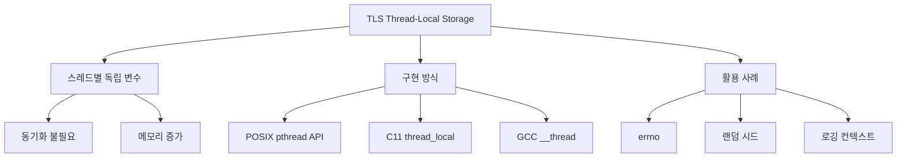

+++
title = "스레드 로컬 스토리지 (TLS)"
date = "2026-03-14"
weight = 694
+++

> **💡 Insight**
> - TLS (Thread-Local Storage)는 각 스레드가 자신만의 독립적인 변수 복사본을 가지는 메모리 영역입니다.
> - 전역 변수처럼 보이지만 실제로는 스레드마다 별도의 인스턴스가 존재하여 동기화 없이 안전하게 사용할 수 있습니다.
> - errno, 스레드 ID, 랜덤 시드, 로깅 컨텍스트 등이 TLS의 대표적 활용 사례입니다.

### Ⅰ. TLS의 필요성과 기본 개념

멀티스레드 환경에서 **전역 변수는 모든 스레드가 공유**하므로 경쟁 조건(Race Condition)이 발생합니다. 이를 해결하는 방법으로 동기화(Mutex)와 **TLS(Thread-Local Storage)**가 있습니다. TLS는 각 스레드마다 독립적인 변수 복사본을 제공합니다.

```text
┌───────────────────────────────────────────────────────────────────┐
│          일반 전역 변수 vs TLS 비교                                │
├───────────────────────────────────────────────────────────────────┤
│                                                                   │
│  [일반 전역 변수 - 공유됨]                                        │
│  ┌─────────────────────────────────────────────────────────────┐ │
│  │                                                             │ │
│  │  int global_var = 0;    // 모든 스레드가 공유                │ │
│  │                                                             │ │
│  │  ┌──────────────────────────────────────────────────────┐   │ │
│  │  │                 전역 변수 (1개)                       │   │ │
│  │  │                   global_var = 42                    │   │ │
│  │  └──────────────────────────────────────────────────────┘   │ │
│  │           ▲               ▲               ▲                │ │
│  │           │               │               │                │ │
│  │  ┌────────┴────┐  ┌──────┴──────┐  ┌─────┴───────┐        │ │
│  │  │  Thread 1   │  │  Thread 2   │  │  Thread 3   │        │ │
│  │  │  읽기/쓰기   │  │  읽기/쓰기   │  │  읽기/쓰기   │        │ │
│  │  └─────────────┘  └─────────────┘  └─────────────┘        │ │
│  │                                                             │ │
│  │  ⚠ 동시 접근 시 경쟁 조건 발생!                              │ │
│  │  ⚠ Mutex로 보호 필요!                                       │ │
│  └─────────────────────────────────────────────────────────────┘ │
│                                                                   │
│  [Thread-Local Storage - 스레드별 독립]                           │
│  ┌─────────────────────────────────────────────────────────────┐ │
│  │                                                             │ │
│  │  __thread int tls_var;  // 각 스레드마다 별도 복사본         │ │
│  │                                                             │ │
│  │  ┌────────────┐  ┌────────────┐  ┌────────────┐            │ │
│  │  │  Thread 1  │  │  Thread 2  │  │  Thread 3  │            │ │
│  │  │ tls_var=10 │  │ tls_var=20 │  │ tls_var=30 │            │ │
│  │  │ (독립)     │  │ (독립)     │  │ (독립)     │            │ │
│  │  └────────────┘  └────────────┘  └────────────┘            │ │
│  │                                                             │ │
│  │  ✅ 경쟁 조건 없음!                                          │ │
│  │  ✅ 동기화 불필요!                                           │ │
│  │  ✅ 성능 향상!                                               │ │
│  └─────────────────────────────────────────────────────────────┘ │
│                                                                   │
│  ┌─────────────────────────────────────────────────────────────┐ │
│  │  TLS 접근 메커니즘                                           │ │
│  ├─────────────────────────────────────────────────────────────┤ │
│  │                                                             │ │
│  │  TLS 변수 접근 시:                                          │ │
│  │  1. 현재 스레드 ID 확인                                     │ │
│  │  2. TLS 영역에서 해당 스레드의 슬롯 찾기                     │ │
│  │  3. 해당 슬롯의 값 반환                                      │ │
│  │                                                             │ │
│  │  구현 방식:                                                  │ │
│  │  • POSIX: pthread_getspecific() / pthread_setspecific()    │ │
│  │  • C11: thread_local 키워드                                │ │
│  │  • GCC: __thread 또는 __thread_local                       │ │
│  │  • MSVC: __declspec(thread)                                │ │
│  └─────────────────────────────────────────────────────────────┘ │
└───────────────────────────────────────────────────────────────────┘
```

**[다이어그램 해설]** 일반 전역 변수는 모든 스레드가 하나의 메모리 위치를 공유하므로 동시 접근 시 경쟁 조건이 발생합니다. 반면 TLS 변수는 스레드마다 독립적인 복사본을 가지므로 동기화 없이도 안전하게 사용할 수 있습니다. TLS 접근은 내부적으로 현재 스레드 ID를 기반으로 해당 스레드의 슬롯을 찾는 방식으로 구현됩니다.

> **📢 섹션 요약 비유:** 일반 전역 변수는 "공용 화이트보드"입니다. 여러 사람이 동시에 쓰려면 싸움이 나죠. TLS는 "각자의 수첩"입니다. 같은 이름표지만, 각자의 수첩에 각자의 내용을 적을 수 있죠.

### Ⅱ. TLS 구현 방식

TLS는 운영체제와 컴파일러가 협력하여 구현합니다. 주요 구현 방식을 살펴봅니다.

```text
┌───────────────────────────────────────────────────────────────────┐
│              TLS 구현 방식                                         │
├───────────────────────────────────────────────────────────────────┤
│                                                                   │
│  [방식 1] POSIX pthread API                                       │
│  ┌─────────────────────────────────────────────────────────────┐ │
│  │  #include <pthread.h>                                       │ │
│  │                                                             │ │
│  │  // 1. 키 생성 (한 번만)                                    │ │
│  │  pthread_key_t key;                                         │ │
│  │  pthread_key_create(&key, NULL);                            │ │
│  │                                                             │ │
│  │  // 2. 값 저장                                              │ │
│  │  int *value = malloc(sizeof(int));                          │ │
│  │  *value = 42;                                               │ │
│  │  pthread_setspecific(key, value);                           │ │
│  │                                                             │ │
│  │  // 3. 값 읽기                                              │ │
│  │  int *my_value = pthread_getspecific(key);                  │ │
│  │  printf("Value: %d\n", *my_value);                          │ │
│  │                                                             │ │
│  │  // 4. 키 삭제                                              │ │
│  │  pthread_key_delete(key);                                   │ │
│  └─────────────────────────────────────────────────────────────┘ │
│                                                                   │
│  [방식 2] C11 thread_local (컴파일러 지원)                         │
│  ┌─────────────────────────────────────────────────────────────┐ │
│  │  #include <threads.h>                                       │ │
│  │                                                             │ │
│  │  // C11 표준                                                │ │
│  │  thread_local int counter = 0;                              │ │
│  │  _Thread_local int buffer[1024];  // 대체 문법              │ │
│  │                                                             │ │
│  │  void increment() {                                         │ │
│  │      counter++;  // 각 스레드마다 독립적으로 증가             │ │
│  │  }                                                          │ │
│  └─────────────────────────────────────────────────────────────┘ │
│                                                                   │
│  [방식 3] GCC/Clang 확장 (__thread)                                │
│  ┌─────────────────────────────────────────────────────────────┐ │
│  │  // GCC/Clang 확장                                          │ │
│  │  __thread int errno;  // 실제 errno 구현                    │ │
│  │  __thread char* thread_name;                                │ │
│  │                                                             │ │
│  │  // C++11 thread_local                                      │ │
│  │  thread_local std::string local_data;                       │ │
│  └─────────────────────────────────────────────────────────────┘ │
│                                                                   │
│  [메모리 레이아웃]                                                │
│  ┌─────────────────────────────────────────────────────────────┐ │
│  │                                                             │ │
│  │  스레드 제어 블록 (TCB)                                      │ │
│  │  ┌─────────────────────────────────────────────────────────┐│ │
│  │  │  스레드 ID     │ 상태    │ 스택 포인터  │ ...            ││ │
│  │  ├─────────────────────────────────────────────────────────┤│ │
│  │  │  TLS 포인터 ─────────────────────┐                     ││ │
│  │  └──────────────────────────────────│──────────────────────┘│ │
│  │                                     │                       │ │
│  │                                     ▼                       │ │
│  │  TLS 영역                         ┌─────────────────────┐  │ │
│  │                                   │ tls_var (int)       │  │ │
│  │                                   │ thread_name (char*) │  │ │
│  │                                   │ counter (int)       │  │ │
│  │                                   │ ...                 │  │ │
│  │                                   └─────────────────────┘  │ │
│  └─────────────────────────────────────────────────────────────┘ │
└───────────────────────────────────────────────────────────────────┘
```

**[다이어그램 해설]** POSIX 방식은 런타임에 키를 생성하고 값을 연결하는 동적 방식입니다. C11 thread_local과 GCC __thread는 컴파일 타임에 TLS 변수를 선언하는 정적 방식으로 사용하기 더 간편합니다. TLS 변수는 각 스레드의 제어 블록(TCB)에서 TLS 영역을 가리키는 포인터를 통해 접근됩니다. x86-64에서는 FS/GS 세그먼트 레지스터를 사용하여 TLS 영역에 빠르게 접근합니다.

> **📢 섹션 요약 비유:** POSIX 방식은 "동적 할당 수첩"입니다. 필요할 때 수첩을 만들고 번호를 매기죠. C11 thread_local은 "이름표 붙은 수첩"입니다. 처음부터 이름표가 붙어 있어 찾기 쉽죠.

### Ⅲ. TLS 활용 사례

TLS는 실제 시스템에서 다양하게 활용됩니다. 대표적인 사례들을 살펴봅니다.

```text
┌───────────────────────────────────────────────────────────────────┐
│              TLS 활용 사례                                         │
├───────────────────────────────────────────────────────────────────┤
│                                                                   │
│  [사례 1] errno - 오류 코드                                       │
│  ┌─────────────────────────────────────────────────────────────┐ │
│  │  // errno는 TLS로 구현                                      │ │
│  │  extern __thread int errno;                                 │ │
│  │                                                             │ │
│  │  // 스레드 A                                                │ │
│  │  if (open("file1", O_RDONLY) < 0) {                         │ │
│  │      printf("Error A: %d\n", errno);  // A만의 errno        │ │
│  │  }                                                          │ │
│  │                                                             │ │
│  │  // 스레드 B (동시 실행)                                    │ │
│  │  if (open("file2", O_RDONLY) < 0) {                         │ │
│  │      printf("Error B: %d\n", errno);  // B만의 errno        │ │
│  │  }                                                          │ │
│  │                                                             │ │
│  │  // 각 스레드의 errno는 서로 영향 없음                       │ │
│  └─────────────────────────────────────────────────────────────┘ │
│                                                                   │
│  [사례 2] 랜덤 시드 - 난수 생성기                                  │
│  ┌─────────────────────────────────────────────────────────────┐ │
│  │  // 각 스레드마다 독립적인 랜덤 상태                         │ │
│  │  thread_local unsigned int random_seed;                     │ │
│  │                                                             │ │
│  │  void init_random(unsigned int seed) {                      │ │
│  │      random_seed = seed;  // 각 스레드가 다른 시드           │ │
│  │  }                                                          │ │
│  │                                                             │ │
│  │  unsigned int my_rand() {                                   │ │
│  │      random_seed = random_seed * 1103515245 + 12345;        │ │
│  │      return (random_seed / 65536) % 32768;                  │ │
│  │  }                                                          │ │
│  │                                                             │ │
│  │  // 병렬 난수 생성 시 시드 충돌 없음                         │ │
│  └─────────────────────────────────────────────────────────────┘ │
│                                                                   │
│  [사례 3] 로깅 컨텍스트                                           │
│  ┌─────────────────────────────────────────────────────────────┐ │
│  │  thread_local struct {                                      │ │
│  │      char request_id[64];                                   │ │
│  │      char user_id[64];                                      │ │
│  │      uint64_t start_time;                                   │ │
│  │  } log_context;                                             │ │
│  │                                                             │ │
│  │  void log_info(const char* msg) {                           │ │
│  │      printf("[%s][%s] %s\n",                                │ │
│  │             log_context.request_id,                         │ │
│  │             log_context.user_id,                            │ │
│  │             msg);                                           │ │
│  │  }                                                          │ │
│  │                                                             │ │
│  │  // 각 요청 스레드마다 별도 컨텍스트                         │ │
│  │  // 로그 추적 시 혼선 없음                                   │ │
│  └─────────────────────────────────────────────────────────────┘ │
│                                                                   │
│  [사례 4] 메모리 풀 / 캐시                                        │
│  ┌─────────────────────────────────────────────────────────────┐ │
│  │  // 스레드별 메모리 풀 (락 없음)                             │ │
│  │  thread_local MemoryPool local_pool;                        │ │
│  │                                                             │ │
│  │  void* fast_alloc(size_t size) {                            │ │
│  │      return local_pool.alloc(size);  // 락 없이 할당        │ │
│  │  }                                                          │ │
│  │                                                             │ │
│  │  void fast_free(void* ptr) {                                │ │
│  │      local_pool.free(ptr);  // 락 없이 해제                  │ │
│  │  }                                                          │ │
│  │                                                             │ │
│  │  // tcmalloc, jemalloc의 스레드 캐시와 유사                 │ │
│  └─────────────────────────────────────────────────────────────┘ │
└───────────────────────────────────────────────────────────────────┘
```

**[다이어그램 해설]** errno는 TLS의 가장 대표적인 사례입니다. 과거에는 전역 변수였으나 멀티스레드 환경에서 문제가 되어 TLS로 변경되었습니다. 랜덤 시드를 TLS로 저장하면 각 스레드가 독립적인 난수 시퀀스를 생성할 수 있습니다. 웹 서버에서는 요청 ID, 사용자 ID 등을 TLS에 저장하여 로깅 시 인자 전달 없이도 자동으로 포함할 수 있습니다. 메모리 할당자(tcmalloc, jemalloc)는 스레드별 로컬 캐시를 TLS에 저장하여 락 없이 빠른 할당을 제공합니다.

> **📢 섹션 요약 비유:** TLS 활용은 "각자의 작업 도구"입니다. errno는 각자의 "오류 노트", 로깅 컨텍스트는 "작업 배지", 메모리 풀은 "개인 도구 상자"입니다. 공용 도구보다 훨씬 효율적이죠.

### Ⅳ. TLS 장단점과 주의사항

TLS는 강력하지만 모든 상황에 적합한 것은 아닙니다.

```text
┌───────────────────────────────────────────────────────────────────┐
│              TLS 장단점 분석                                       │
├───────────────────────────────────────────────────────────────────┤
│                                                                   │
│  [장점]                                                           │
│  ┌─────────────────────────────────────────────────────────────┐ │
│  │  ✅ 동기화 오버헤드 없음 (락 불필요)                         │ │
│  │  ✅ 캐시 친화적 (각 스레드 전용 데이터)                      │ │
│  │  ✅ 확장성 높음 (스레드 추가 시 성능 선형 증가)              │ │
│  │  ✅ 코드 단순화 (인자 전달 감소)                             │ │
│  └─────────────────────────────────────────────────────────────┘ │
│                                                                   │
│  [단점]                                                           │
│  ┌─────────────────────────────────────────────────────────────┐ │
│  │  ❌ 메모리 사용량 증가 (스레드 수 × 변수 크기)               │ │
│  │  ❌ 스레드 간 데이터 공유 불가 (필요 시 별도 메커니즘)       │ │
│  │  ❌ 동적 초기화 복잡성 (C++ 생성자 호출 순서)                │ │
│  │  ❌ 플랫폼 의존적 구현 차이                                  │ │
│  └─────────────────────────────────────────────────────────────┘ │
│                                                                   │
│  [주의사항]                                                       │
│  ┌─────────────────────────────────────────────────────────────┐ │
│  │                                                             │ │
│  │  1. C++에서 동적 초기화 순서                                 │ │
│  │     thread_local std::string s = "hello";                   │ │
│  │     // 각 스레드 진입 시 생성자 호출                         │ │
│  │     // 스레드 종료 시 소멸자 호출                            │ │
│  │                                                             │ │
│  │  2. fork() 시 TLS 동작                                      │ │
│  │     fork() 후 자식 프로세스는 부모의 TLS 값 복사             │ │
│  │     // 하지만 새 단일 스레드 상태                            │ │
│  │                                                             │ │
│  │  3. DLL/SO 경계 문제                                        │ │
│  │     TLS 변수가 DLL 경계를 넘을 때 플랫폼별 차이              │ │
│  │                                                             │ │
│  │  4. 스레드 풀 환경                                          │ │
│  │     스레드 재사용 시 이전 TLS 값이 남을 수 있음              │ │
│  │     → 스레드 시작 시 TLS 초기화 필요                         │ │
│  │                                                             │ │
│  └─────────────────────────────────────────────────────────────┘ │
│                                                                   │
│  ┌─────────────────────────────────────────────────────────────┐ │
│  │  TLS vs 전역변수+뮤텍스 선택 기준                            │ │
│  ├─────────────────────────────────────────────────────────────┤ │
│  │  상황                    │ 권장                             │ │
│  │  ───────────────────────┼────────────────────────────────── │ │
│  │  스레드 독립 데이터      │ TLS                              │ │
│  │  스레드 간 공유 필요     │ 전역변수 + Mutex                 │ │
│  │  읽기 전용 설정          │ 전역변수 (동기화 불필요)          │ │
│  │  고빈도 업데이트        │ TLS (락 경합 회피)               │ │
│  │  스레드 수 많음         │ TLS (메모리 vs 성능 트레이드오프) │ │
│  └─────────────────────────────────────────────────────────────┘ │
└───────────────────────────────────────────────────────────────────┘
```

**[다이어그램 해설]** TLS의 가장 큰 장점은 동기화 없이 스레드 안전성을 확보할 수 있다는 점입니다. 각 스레드의 전용 데이터이므로 캐시 효율도 높습니다. 단점으로는 스레드 수만큼 변수 복사본이 생성되어 메모리 사용량이 증가합니다. 스레드 풀 환경에서는 스레드 재사용 시 이전 TLS 값이 남을 수 있으므로 초기화에 주의해야 합니다. 스레드 간 데이터 공유가 필요한 경우에는 전역 변수 + 뮤텍스를 사용해야 합니다.

> **📢 섹션 요약 비유:** TLS는 "개인 도시락"입니다. 각자 도시락을 싸니 줄 설 필요 없죠(동기화 없음). 하지만 100명이면 도시락 100개가 필요하죠(메모리 증가). 식사 공유가 필요하면 "공동 파티"를 해야 합니다(전역 변수 + 뮤텍스).

### Ⅴ. 결론 및 핵심 요약

| 항목 | TLS 특성 |
|:---|:---|
| **정의** | 스레드별 독립 변수 저장소 |
| **구현** | pthread API, C11 thread_local, GCC __thread |
| **장점** | 동기화 없음, 캐시 친화적, 확장성 |
| **단점** | 메모리 증가, 공유 불가 |
| **사례** | errno, 랜덤 시드, 로깅 컨텍스트, 메모리 풀 |

**핵심 교훈:** TLS는 **불필요한 동기화를 제거**하여 성능을 향상시키는 강력한 도구입니다. 스레드 간 공유가 필요 없는 데이터에 적극 활용하세요.

> **📢 섹션 요약 비유:** TLS는 "각자의 도구" 철학입니다. 공용 도구(전역 변수)는 줄 서서 써야 하지만, 각자의 도구(TLS)는 즉시 사용 가능합니다. 상황에 맞게 선택하세요.

---

### 💡 Knowledge Graph


### 👧 Child Analogy
TLS는 각자의 이름표 같은 거야! "내 이름은"이라고 적힌 이름표는 모두 같아 보이지만, 실제 이름은 각자 달라. errno 같은 전역 변수도 TLS라서 스레드마다 각자의 오류 번호를 가질 수 있어. 내 오류가 네 오류가 되지 않는 거지!