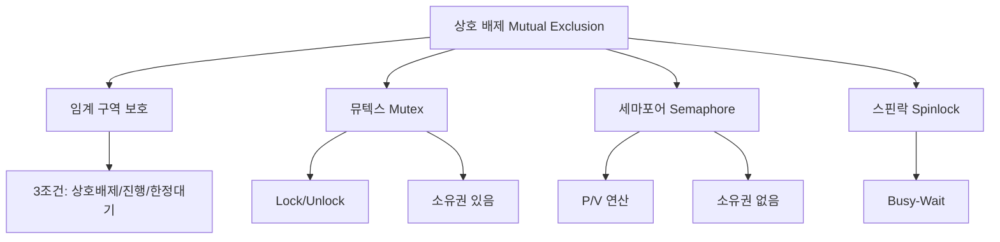

+++
title = "스레드 동기화 상호 배제"
date = "2026-03-14"
weight = 695
+++

> **💡 Insight**
> - 상호 배제(Mutual Exclusion)는 임계 구역(Critical Section)에 한 번에 하나의 스레드만 진입할 수 있게 보장하는 동기화 원칙입니다.
> - 뮤텍스(Mutex), 세마포어(Semaphore), 스핀락(Spinlock) 등이 대표적인 상호 배제 구현 메커니즘입니다.
> - 상호 배제는 경쟁 조건(Race Condition)을 방지하고 데이터 일관성을 보장하기 위한 필수 기법입니다.

### Ⅰ. 상호 배제의 필요성과 임계 구역 문제

상호 배제(Mutual Exclusion)는 **임계 구역(Critical Section)** 문제를 해결하기 위한 핵심 원칙입니다. 임계 구역은 공유 자원에 접근하는 코드 영역으로, 여러 스레드가 동시에 실행하면 데이터 무결성이 깨집니다.

```text
┌───────────────────────────────────────────────────────────────────┐
│          임계 구역 문제와 상호 배제 필요성                          │
├───────────────────────────────────────────────────────────────────┤
│                                                                   │
│  [임계 구역(Critical Section) 정의]                               │
│  ┌─────────────────────────────────────────────────────────────┐ │
│  │  • 공유 자원에 접근하는 코드 영역                            │ │
│  │  • 여러 스레드가 동시 실행 시 잘못된 결과 발생 가능          │ │
│  │  • 반드시 한 번에 하나의 스레드만 실행해야 함                 │ │
│  └─────────────────────────────────────────────────────────────┘ │
│                                                                   │
│  [임계 구역 문제 해결의 3가지 조건]                                │
│  ┌─────────────────────────────────────────────────────────────┐ │
│  │                                                             │ │
│  │  ① 상호 배제 (Mutual Exclusion)                             │ │
│  │     • 임계 구역에는 항상 최대 1개의 스레드만 존재             │ │
│  │     • 다른 스레드는 대기해야 함                              │ │
│  │                                                             │ │
│  │  ② 진행 (Progress)                                          │ │
│  │     • 임계 구역이 비어 있으면 진입하려는 스레드가 진입 가능   │ │
│  │     • 진입 선택은 무한히 미뤄지지 않음                       │ │
│  │                                                             │ │
│  │  ③ 한정된 대기 (Bounded Waiting)                            │ │
│  │     • 스레드가 임계 구역 진입을 무한히 대기하지 않음          │ │
│  │     • 기아 상태(Starvation) 방지                             │ │
│  │                                                             │ │
│  └─────────────────────────────────────────────────────────────┘ │
│                                                                   │
│  [상호 배제 없이 발생하는 문제 예시]                               │
│  ┌─────────────────────────────────────────────────────────────┐ │
│  │  int balance = 1000;   // 공유 계좌 잔고                     │ │
│  │                                                             │ │
│  │  void withdraw(int amount) {                                │ │
│  │      // ┌────────────────────────────────────────┐          │ │
│  │      // │ 临界区 - Critical Section             │          │ │
│  │      if (balance >= amount) {  // ① 잔액 확인   │          │ │
│  │          balance = balance - amount;  // ② 출금  │          │ │
│  │      }                                         │          │ │
│  │      // └────────────────────────────────────────┘          │ │
│  │  }                                                          │ │
│  │                                                             │ │
│  │  [동시 출금 시나리오] balance = 1000, 출금 800               │ │
│  │                                                             │ │
│  │  Thread A               Thread B                            │ │
│  │  if(1000>=800) ✓       if(1000>=800) ✓   ← 둘 다 통과!      │ │
│  │  balance=1000-800       balance=1000-800  ← 각각 200 저장   │ │
│  │                                                             │ │
│  │  결과: balance = 200 (1600 출금했어야 200 남음)              │ │
│  │        ⚠ 데이터 무결성 위반!                                 │ │
│  └─────────────────────────────────────────────────────────────┘ │
└───────────────────────────────────────────────────────────────────┘
```

**[다이어그램 해설]** 임계 구역 문제는 공유 자원 접근 시 발생합니다. 위 예시에서 두 스레드가 동시에 출금을 시도하면, 둘 다 잔액 확인(if 조건)을 통과한 후 각자 출금을 수행합니다. 결과적으로 800원씩 두 번 출금했어도 잔액은 200원만 차감됩니다. 이것이 경쟁 조건(Race Condition)입니다. 상호 배제를 통해 한 스레드가 임계 구역에 진입하면 다른 스레드는 대기하게 만들어야 합니다.

> **📢 섹션 요약 비유:** 임계 구역은 "1인용 화장실"입니다. 한 사람이 들어가면 다른 사람은 문이 열릴 때까지 기다려야 하죠. 문을 잠그는 것이 상호 배제입니다.

### Ⅱ. 뮤텍스(Mutex)를 이용한 상호 배제

뮤텍스(Mutex, Mutual Exclusion)는 가장 널리 사용되는 상호 배제 메커니즘입니다. **잠금(Lock)**과 **잠금 해제(Unlock)** 연산으로 임계 구역을 보호합니다.

```text
┌───────────────────────────────────────────────────────────────────┐
│              뮤텍스(Mutex) 동작 원리                               │
├───────────────────────────────────────────────────────────────────┤
│                                                                   │
│  [뮤텍스 상태 다이어그램]                                          │
│  ┌─────────────────────────────────────────────────────────────┐ │
│  │                                                             │ │
│  │  Mutex State: unlocked (0)  ←→  locked (1)                 │ │
│  │                                                             │ │
│  │  ┌───────────────────┐          ┌───────────────────┐      │ │
│  │  │                   │  lock()  │                   │      │ │
│  │  │    Unlocked       │ ───────▶ │     Locked        │      │ │
│  │  │    (사용 가능)     │          │   (Thread A 소유)  │      │ │
│  │  │                   │ ◀─────── │                   │      │ │
│  │  └───────────────────┘ unlock() └───────────────────┘      │ │
│  │                                                             │ │
│  └─────────────────────────────────────────────────────────────┘ │
│                                                                   │
│  [뮤텍스로 보호된 출금 코드]                                       │
│  ┌─────────────────────────────────────────────────────────────┐ │
│  │  pthread_mutex_t mutex = PTHREAD_MUTEX_INITIALIZER;         │ │
│  │  int balance = 1000;                                        │ │
│  │                                                             │ │
│  │  void withdraw(int amount) {                                │ │
│  │      pthread_mutex_lock(&mutex);    // ┌ 진입 구역          │ │
│  │      // ──────────────────────────────┘                    │ │
│  │      // ┌ 임계 구역 (Critical Section) ┐                    │ │
│  │      if (balance >= amount) {                                │ │
│  │          balance = balance - amount;                         │ │
│  │      }                                                       │ │
│  │      // └────────────────────────────────┘                   │ │
│  │      pthread_mutex_unlock(&mutex);  // ┌ 퇴출 구역           │ │
│  │      // ─────────────────────────────┘                      │ │
│  │  }                                                          │ │
│  │                                                             │ │
│  │  [안전한 동시 출금]                                           │ │
│  │  Thread A               Thread B                            │ │
│  │  lock() ✓              lock() ❌ (대기)                     │ │
│  │  if(1000>=800) ✓                                       │ │
│  │  balance=200                                          │ │
│  │  unlock()              lock() ✓ (진입)                     │ │
│  │                         if(200>=800) ❌                     │ │
│  │                         balance=200 (변화 없음)             │ │
│  │                         unlock()                            │ │
│  │                                                             │ │
│  │  결과: 정확한 동작! 800 출금 성공, 잔액 200                  │ │
│  └─────────────────────────────────────────────────────────────┘ │
│                                                                   │
│  [뮤텍스 연산 원리]                                                │
│  ┌─────────────────────────────────────────────────────────────┐ │
│  │  lock():                                                    │ │
│  │    while (test_and_set(&mutex) == 1) {                      │ │
│  │        // busy-wait or sleep                                │ │
│  │    }                                                        │ │
│  │                                                             │ │
│  │  unlock():                                                  │ │
│  │    mutex = 0;  // 원자적 쓰기                               │ │
│  │    // 대기 중인 스레드 깨움 (wake-up)                       │ │
│  └─────────────────────────────────────────────────────────────┘ │
└───────────────────────────────────────────────────────────────────┘
```

**[다이어그램 해설]** 뮤텍스는 이진 상태(0=잠금 해제, 1=잠금)를 가집니다. lock()은 뮤텍스가 해제 상태면 잠그고 진입, 이미 잠겨 있으면 대기합니다. unlock()은 잠금을 해제하고 대기 중인 스레드를 깨웁니다. 핵심은 test_and_set 같은 **원자적 연산**을 사용하여 lock() 연산 자체가 분할되지 않음을 보장하는 것입니다. 이를 통해 경쟁 조건을 방지합니다.

> **📢 섹션 요약 비유:** 뮤텍스는 "화장실 열쇠"입니다. 열쇠를 가진 사람만 화장실에 들어갈 수 있죠. 열쇠가 없으면 문 앞에서 기다려야 합니다. 나올 때 열쇠를 돌려놓으면 다음 사람이 쓸 수 있죠.

### Ⅲ. 세마포어(Semaphore)를 이용한 상호 배제

세마포어(Semaphore)는 정수 변수와 P(wait)/V(signal) 연산을 사용하는 동기화 메커니즘입니다. **이진 세마포어(Binary Semaphore)**는 뮤텍스와 유사하게 상호 배제에 사용됩니다.

```text
┌───────────────────────────────────────────────────────────────────┐
│              세마포어(Semaphore) 동작 원리                          │
├───────────────────────────────────────────────────────────────────┤
│                                                                   │
│  [세마포어 정의와 연산]                                            │
│  ┌─────────────────────────────────────────────────────────────┐ │
│  │  세마포어 S: 정수 변수 (초기값 ≥ 0)                          │ │
│  │                                                             │ │
│  │  P(S) / wait(S):           V(S) / signal(S):                │ │
│  │  ┌─────────────────────┐   ┌─────────────────────┐          │ │
│  │  │ while (S ≤ 0) {     │   │ S = S + 1;          │          │ │
│  │  │   wait;  // 대기    │   │ // 대기 스레드 깨움  │          │ │
│  │  │ }                   │   └─────────────────────┘          │ │
│  │  │ S = S - 1;          │                                     │ │
│  │  └─────────────────────┘                                     │ │
│  │                                                             │ │
│  │  P/V 연산은 원자적(atomic)으로 실행됨                        │ │
│  └─────────────────────────────────────────────────────────────┘ │
│                                                                   │
│  [이진 세마포어로 상호 배제 구현]                                   │
│  ┌─────────────────────────────────────────────────────────────┐ │
│  │  semaphore mutex = 1;  // 초기값 1 (자원 1개 사용 가능)      │ │
│  │                                                             │ │
│  │  void withdraw(int amount) {                                │ │
│  │      P(mutex);    // wait - 자원 획득                       │ │
│  │      // ─────────────────────────────                       │ │
│  │      // 임계 구역                                            │ │
│  │      if (balance >= amount) {                                │ │
│  │          balance = balance - amount;                         │ │
│  │      }                                                       │ │
│  │      // ─────────────────────────────                       │ │
│  │      V(mutex);    // signal - 자원 해제                     │ │
│  │  }                                                          │ │
│  │                                                             │ │
│  │  [상태 변화]                                                 │ │
│  │  초기: mutex = 1                                             │ │
│  │  Thread A: P(mutex) → mutex=0 → 진입                        │ │
│  │  Thread B: P(mutex) → mutex≤0 → 대기                        │ │
│  │  Thread A: V(mutex) → mutex=1 → Thread B 깨움               │ │
│  │  Thread B: P(mutex) → mutex=0 → 진입                        │ │
│  └─────────────────────────────────────────────────────────────┘ │
│                                                                   │
│  [뮤텍스 vs 이진 세마포어 비교]                                     │
│  ┌─────────────────────────────────────────────────────────────┐ │
│  │  구분              │ 뮤텍스              │ 이진 세마포어     │ │
│  │  ──────────────────┼────────────────────┼───────────────── │ │
│  │  소유권            │ 있음 (잠근 스레드만 해제) │ 없음 (누구나 해제 가능) │
│  │  재귀 잠금         │ 가능 (recursive mutex) │ 불가능          │ │
│  │  우선순위 상속     │ 지원 가능          │ 일반적으로 미지원  │ │
│  │  용도              │ 상호 배제 전용      │ 상호 배제 + 동기화 │ │
│  └─────────────────────────────────────────────────────────────┘ │
└───────────────────────────────────────────────────────────────────┘
```

**[다이어그램 해설]** 세마포어는 정수 변수로, P(wait) 연산은 값을 감소시키고 0 이하면 대기, V(signal) 연산은 값을 증가시키고 대기 스레드를 깨웁니다. 이진 세마포어(초기값 1)는 뮤텍스와 유사하게 상호 배제에 사용할 수 있습니다. 핵심 차이는 뮤텍스는 소유권 개념이 있어 잠근 스레드만 해제할 수 있지만, 세마포어는 누구나 V 연산으로 해제할 수 있습니다. 세마포어는 상호 배제 외에도 스레드 간 실행 순서 동기화에도 사용할 수 있습니다.

> **📢 섹션 요약 비유:** 세마포어는 "주차장 빈자리 표시판"입니다. 빈자리가 1개면(초기값 1) 들어갈 수 있죠. 들어가면 0으로 바뀌고, 나가면 1로 바뀝니다. 이진 세마포어는 1자리 주차장과 같습니다.

### Ⅳ. 스핀락(Spinlock)과 다른 동기화 메커니즘

스핀락(Spinlock)은 잠금을 얻을 때까지 **바쁜 대기(Busy Waiting)**를 수행하는 동기화 메커니즘입니다. 짧은 대기에 효율적입니다.

```text
┌───────────────────────────────────────────────────────────────────┐
│              스핀락과 동기화 메커니즘 비교                           │
├───────────────────────────────────────────────────────────────────┤
│                                                                   │
│  [스핀락(Spinlock)]                                               │
│  ┌─────────────────────────────────────────────────────────────┐ │
│  │  void spinlock_lock(int *lock) {                            │ │
│  │      while (test_and_set(lock) == 1) {                      │ │
│  │          // 바쁜 대기 (Busy Wait)                            │ │
│  │          // CPU 계속 사용하며 락 확인                        │ │
│  │      }                                                      │ │
│  │  }                                                          │ │
│  │                                                             │ │
│  │  장점:                                                      │ │
│  │  • 문맥 교환 없음 (대기 시 짧을 때 효율적)                    │ │
│  │  • 멀티코어에서 효과적                                       │ │
│  │  • 인터럽트 컨텍스트에서 사용 가능                           │ │
│  │                                                             │ │
│  │  단점:                                                      │ │
│  │  • 대기 시 CPU 낭비                                         │ │
│  │  • 단일 코어에서 비효율적                                    │ │
│  │  • 긴 대기 시 성능 저하                                      │ │
│  └─────────────────────────────────────────────────────────────┘ │
│                                                                   │
│  [동기화 메커니즘 비교표]                                          │
│  ┌─────────────────────────────────────────────────────────────┐ │
│  │  메커니즘 │ 대기 방식 │ 문맥교환 │ 적합한 용도               │ │
│  │  ────────┼──────────┼──────────┼───────────────────────── │ │
│  │  Mutex   │ Sleep    │ 있음     │ 일반적 상호 배제          │ │
│  │  Spinlock│ Busy-wait│ 없음     │ 짧은 임계 구역, 커널      │ │
│  │  Semaphore│ Sleep   │ 있음     │ 자원 카운팅, 동기화       │ │
│  │  RWLock  │ Sleep    │ 있음     │ 읽기 많고 쓰기 적음       │ │
│  │  RCU     │ 없음     │ 없음     │ 읽기 전용 다중 접근       │ │
│  └─────────────────────────────────────────────────────────────┘ │
│                                                                   │
│  [사용 가이드라인]                                                 │
│  ┌─────────────────────────────────────────────────────────────┐ │
│  │  상황                          │ 권장 메커니즘               │ │
│  │  ─────────────────────────────┼─────────────────────────── │ │
│  │  임계 구역 짧음 (< 100ns)     │ 스핀락                      │ │
│  │  임계 구역 보통 (~수μs)       │ 뮤텍스                      │ │
│  │  임계 구역 김 (~ms)           │ 뮤텍스                      │ │
│  │  자원 개수 제한 (N개)         │ 카운팅 세마포어             │ │
│  │  읽기 많고 쓰기 적음          │ 읽기-쓰기 락                │ │
│  │  실시간 시스템               │ 우선순위 상속 뮤텍스         │ │
│  │  인터럽트 핸들러              │ 스핀락                      │ │
│  └─────────────────────────────────────────────────────────────┘ │
└───────────────────────────────────────────────────────────────────┘
```

**[다이어그램 해설]** 스핀락은 잠금을 얻을 때까지 루프를 돌며 확인하므로 CPU를 계속 사용합니다. 문맥 교환 비용이 없어 짧은 대기에 효율적이지만, 긴 대기에는 CPU 낭비가 심합니다. 일반적으로 임계 구역이 수십 나노초~수백 나노초 정도면 스핀락이, 더 길면 뮤텍스가 효율적입니다. Linux 커널은 대부분 스핀락을 사용하며, 사용자 공간에서는 뮤텍스가 일반적입니다.

> **📢 섹션 요약 비유:** 스핀락은 "문 앞에서 계속 노크하는 것"입니다. 빨리 열리면 효율적이지만, 오래 걸리면 팔만 아프죠(CPU 낭비). 뮤텍스는 "번호표 뽑고 대기석에서 기다리는 것"입니다. CPU를 다른 일에 쓸 수 있죠.

### Ⅴ. 결론 및 핵심 요약

| 메커니즘 | 대기 방식 | 소유권 | 주 용도 |
|:---|:---|:---|:---|
| **Mutex** | Sleep | 있음 | 일반 상호 배제 |
| **Binary Semaphore** | Sleep | 없음 | 상호 배제 + 순서 제어 |
| **Spinlock** | Busy-wait | 없음 | 짧은 구역, 커널 |
| **Counting Semaphore** | Sleep | 없음 | 자원 풀 관리 |

**핵심 교훈:** 상호 배제는 **임계 구역 보호**를 위한 필수 기법입니다. 상황에 맞는 동기화 메커니즘을 선택하여 성능과 안전성의 균형을 맞춰야 합니다.

> **📢 섹션 요약 비유:** 상호 배제는 "한 번에 한 명만"의 규칙입니다. 화장실(뮤텍스), 주차장(세마포어), 번호표(스핀락) 등 다양한 방식으로 구현할 수 있지만, 핵심은 "동시 접근 금지"입니다.

---

### 💡 Knowledge Graph


### 👧 Child Analogy
상호 배제는 화장실 줄서기야! 한 명만 들어갈 수 있으니까(상호 배제), 들어간 사람은 문을 잠그고(뮤텍스 lock), 나올 때 문을 열어(unlock). 다른 사람들은 문이 열릴 때까지 기다려야 해. 세마포어는 주차장이랑 비슷해. 빈자리가 있어야 들어갈 수 있지!