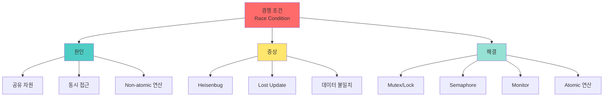

+++
title = "경쟁 조건 Race Condition"
date = "2026-03-14"
weight = 696
+++

# 경쟁 조건 (Race Condition)

## 🎯 핵심 인사이트

경쟁 조건은 **여러 프로세스/스레드가 공유 자원에 동시 접근할 때, 실행 순서에 따라 결과가 달라지는 버그**다. 재현 어렵고 디버깅이 골치 아픈 "Heisenbug"의 대표적 원인이다.

---

## Ⅰ. 경쟁 조건의 정의와 본질

### 1-1. 정의

```
┌─────────────────────────────────────────────────────────────────────┐
│                     Race Condition (경쟁 조건)                       │
├─────────────────────────────────────────────────────────────────────┤
│                                                                     │
│  "Two or more processes reading/writing shared data, and the       │
│   final result depends on the order of execution."                 │
│                                                                     │
│  ┌─────────┐     ┌─────────┐     ┌─────────┐                       │
│  │Process A│────▶│ SHARED  │◀────│Process B│                       │
│  │ (Read)  │     │  DATA   │     │ (Write) │                       │
│  └─────────┘     │ counter │     └─────────┘                       │
│        │         └────┬────┘           │                           │
│        │              │                │                           │
│        ▼              ▼                ▼                           │
│   ┌─────────────────────────────────────────────┐                  │
│   │  누가 먼저? 순서에 따라 결과가 다름!         │                  │
│   │                                             │                  │
│   │  Case 1: A→B = 100 → 101 (정상)            │                  │
│   │  Case 2: B→A = 100 → 100  (Lost Update!)   │                  │
│   └─────────────────────────────────────────────┘                  │
│                                                                     │
└─────────────────────────────────────────────────────────────────────┘
```

### 1-2. 발생 3요소

```
     ┌──────────────┐
     │   Race       │
     │  Condition   │
     │    발생      │
     └──────┬───────┘
            │
    ┌───────┼───────┐
    ▼       ▼       ▼
┌───────┐┌───────┐┌───────┐
│공유   ││동시   ││쓰기   │
│자원   ││접근   ││연산   │
│Shared ││Concur ││Write  │
└───────┘└───────┘└───────┘
    │       │       │
    ▼       ▼       ▼
 counter  Thread  count++
 variable  A, B   count--
```

> **📢 섹션 요약 비유**: 경쟁 조건은 두 요리사가 동시에 같은 냄비에 재료를 넣을 때, 누가 먼저 넣느냐에 따라 맛이 달라지는 상황과 같다. 순서가 보장되지 않으면 예상치 못한 결과가 나온다.

---

## Ⅱ. 전형적인 사례: Counter Increment

### 2-1. Lost Update 문제

```
┌─────────────────────────────────────────────────────────────────────┐
│                    Lost Update 시나리오                              │
├─────────────────────────────────────────────────────────────────────┤
│                                                                     │
│  초기값: counter = 100                                              │
│  목표: 두 스레드가 각각 +1 → 최종 102?                              │
│                                                                     │
│  Time ──────────────────────────────────────────────────────▶      │
│                                                                     │
│  ┌────────┬────────────────────────────────────────────────────┐    │
│  │Thread A│  READ(100) ─────────────── WRITE(101)              │    │
│  └────────┘      │                        ▲                    │    │
│                  │                        │                    │    │
│  ┌────────┬──────┼────────────────────────┼───────────────────┐│    │
│  │Thread B│      └─ READ(100) ─ WRITE(101)┘                   ││    │
│  └────────┴───────────────────────────────────────────────────┘│    │
│                                                                     │
│  ┌────────┬────────────────────────────────────────────────────┐    │
│  │ Memory │     100 ──────────────────────── 101               │    │
│  └────────┴────────────────────────────────────────────────────┘    │
│                                                                     │
│  ❌ 최종값: 101 (102가 아님!)                                       │
│     → Thread B의 +1이 덮어써짐 (Lost Update)                        │
│                                                                     │
└─────────────────────────────────────────────────────────────────────┘
```

### 2-2. 어셈블리 레벨 분석

```
┌─────────────────────────────────────────────────────────────────────┐
│             High-Level Code vs Assembly (x86)                       │
├─────────────────────────────────────────────────────────────────────┤
│                                                                     │
│  C 코드:                     x86 Assembly:                          │
│                                                                     │
│  counter++;                  mov  eax, [counter]   ; LOAD          │
│                              inc  eax              ; INCREMENT      │
│                              mov  [counter], eax   ; STORE          │
│                                                                     │
│  ════════════════════════════════════════════════════════════════  │
│                                                                     │
│  ⚠️ 문제: 3개의 명령어 사이에 Context Switch 발생 가능!             │
│                                                                     │
│  T1: mov eax, [counter]  ────┐                                      │
│  T2: mov eax, [counter]  ◀───┼─ Preemption!                         │
│  T1: inc eax             ◀───┘                                      │
│  T1: mov [counter], eax                                           │
│  T2: inc eax                                                       │
│  T2: mov [counter], eax  ───▶ 같은 값으로 덮어쓰기!                │
│                                                                     │
└─────────────────────────────────────────────────────────────────────┘
```

> **📢 섹션 요약 비유**: Lost Update는 출석부에 학생 두 명이 동시에 "번호 21번"을 썼는데, 한 명이 먼저 쓰고 다른 한 명이 덮어써서 결국 21번만 남는 상황이다. 22번이 되어야 하는데 말이다.

---

## Ⅲ. 경쟁 조건의 위험성

### 3-1. Heisenbug 특성

```
┌─────────────────────────────────────────────────────────────────────┐
│                     Heisenbug (하이젠버그)                          │
├─────────────────────────────────────────────────────────────────────┤
│                                                                     │
│  "관찰하면 사라지는 버그" - 독일 물리학자 하이젠베르크에서 유래     │
│                                                                     │
│  ┌─────────────────────────────────────────────────────────────┐    │
│  │              일반 실행         │       디버깅/로그          │    │
│  ├─────────────────────────────────────────────────────────────┤    │
│  │  실행 속도    │    빠름        │        느려짐             │    │
│  │  타이밍      │    랜덤         │        변화                │    │
│  │  버그 발생   │    O           │        X (사라짐!)         │    │
│  │  재현       │    어려움       │        안됨                │    │
│  └─────────────────────────────────────────────────────────────┘    │
│                                                                     │
│  ┌─────────────────────────────────────────────────────────────┐    │
│  │  디버거가 코드를 느리게 실행시키면                           │    │
│  │  → Context Switch 타이밍이 바뀜                              │    │
│  │  → Race Condition이 발생하지 않음                            │    │
│  │  → "내 코드에서는 되는데?" 현상                               │    │
│  └─────────────────────────────────────────────────────────────┘    │
│                                                                     │
└─────────────────────────────────────────────────────────────────────┘
```

### 3-2. 실제 사례들

```
┌─────────────────────────────────────────────────────────────────────┐
│                    Race Condition 실제 사례                         │
├─────────────────────────────────────────────────────────────────────┤
│                                                                     │
│  1. Therac-25 방사선 치료기 (1985-1987)                             │
│     ┌──────────────────────────────────────────────────────────┐    │
│     │ • 6명 사망, 수십명 부상                                   │    │
│     │ • Race Condition으로 모드 설정이 꼬임                    │    │
│     │ • 고립된 하드웨어 세이프티 스위치 없음                    │    │
│     └──────────────────────────────────────────────────────────┘    │
│                                                                     │
│  2. Northeast Blackout (2003)                                       │
│     ┌──────────────────────────────────────────────────────────┐    │
│     │ • 5,500만 명 정전                                         │    │
│     │ • 알람 시스템의 Race Condition으로 경고 미작동            │    │
│     └──────────────────────────────────────────────────────────┘    │
│                                                                     │
│  3. MySQL 복제 (과거 버전)                                          │
│     ┌──────────────────────────────────────────────────────────┐    │
│     │ • AUTO_INCREMENT 동시성 문제                              │    │
│     │ • 동시 INSERT 시 중복 키 발생 가능                        │    │
│     └──────────────────────────────────────────────────────────┘    │
│                                                                     │
└─────────────────────────────────────────────────────────────────────┘
```

> **📢 섹션 요약 비유**: Heisenbug는 속도 위반 카메라 앞에서만 속도를 줄이는 운전자 같다. 감시(디버깅)할 때는 문제가 없다가, 혼자 달릴 때만 과속하는 것이다.

---

## Ⅳ. 해결 방법: 동기화 메커니즘

### 4-1. 상호 배제 (Mutual Exclusion)

```
┌─────────────────────────────────────────────────────────────────────┐
│                  Mutual Exclusion (상호 배제)                       │
├─────────────────────────────────────────────────────────────────────┤
│                                                                     │
│  "한 번에 하나의 스레드만 임계 구역에 진입 가능"                    │
│                                                                     │
│  ┌─────────────────────────────────────────────────────────────┐    │
│  │                                                             │    │
│  │   Thread A                Critical                 Thread B │    │
│  │   ┌─────┐                 Section                 ┌─────┐   │    │
│  │   │     │    ┌───────────────────────────┐       │     │   │    │
│  │   │     │    │     counter++             │       │     │   │    │
│  │   │     │    │     (한 번에 하나만!)      │       │     │   │    │
│  │   │     │───▶│                           │◀──────│     │   │    │
│  │   │Wait │    │    Lock / Unlock          │       │Wait │   │    │
│  │   │Queue│    └───────────────────────────┘       │Queue│   │    │
│  │   └─────┘                 ▲                       └─────┘   │    │
│  │                           │                                  │    │
│  │                     Mutex/Lock                                 │    │
│  │                                                             │    │
│  └─────────────────────────────────────────────────────────────┘    │
│                                                                     │
└─────────────────────────────────────────────────────────────────────┘
```

### 4-2. 주요 동기화 도구

```
         ┌────────────────────────────────────────┐
         │     Synchronization Mechanisms        │
         └───────────────────┬────────────────────┘
                             │
      ┌──────────────────────┼──────────────────────┐
      │                      │                      │
      ▼                      ▼                      ▼
┌──────────┐          ┌──────────┐          ┌──────────┐
│  Mutex   │          │Semaphore │          │ Monitor  │
│  (Lock)  │          │  (P/V)   │          │(Abstract)│
└────┬─────┘          └────┬─────┘          └────┬─────┘
     │                     │                     │
     ▼                     ▼                     ▼
┌──────────┐          ┌──────────┐          ┌──────────┐
│이진 세마포어│         │카운팅 가능│          │언어 차원  │
│1개만 접근 │          │N개 자원   │          │지원(Java) │
└──────────┘          └──────────┘          └──────────┘
```

> **📢 섹션 요약 비유**: 동기화 메커니즘은 화장실 키 하나를 두고 줄 서는 것과 같다. 키를 가진 사람만 화장실(임계 구역)에 들어갈 수 있고, 나올 때 키를 반납해야 다음 사람이 들어갈 수 있다.

---

## Ⅴ. 사례별 분석

### 5-1. 은행 계좌 이체

```
┌─────────────────────────────────────────────────────────────────────┐
│                     은행 계좌 이체 Race Condition                    │
├─────────────────────────────────────────────────────────────────────┤
│                                                                     │
│  시나리오: 계좌 A(100만원) → B(50만원) 10만원 이체                  │
│            동시에 계좌 A → C(30만원) 10만원 이체                    │
│                                                                     │
│  ┌──────────────────────────────────────────────────────────────┐   │
│  │          Thread 1 (A→B)      │      Thread 2 (A→C)          │   │
│  ├──────────────────────────────────────────────────────────────┤   │
│  │ 1. READ A = 100만원          │                              │   │
│  │                              │ 2. READ A = 100만원          │   │
│  │ 3. A = 100 - 10 = 90만원     │                              │   │
│  │ 4. WRITE A = 90만원          │                              │   │
│  │                              │ 5. A = 100 - 10 = 90만원     │   │
│  │                              │ 6. WRITE A = 90만원          │   │
│  │ 7. B = 50 + 10 = 60만원      │                              │   │
│  │                              │ 8. C = 30 + 10 = 40만원      │   │
│  └──────────────────────────────────────────────────────────────┘   │
│                                                                     │
│  ❌ 결과: A = 90만원 (원래 80만원이어야 함!)                        │
│     → 10만원이 사라진 셈                                            │
│                                                                     │
│  ✅ 해결: 계좌 A에 대한 모든 연산을 Atomic하게 처리                  │
│     → BEGIN TRANSACTION → LOCK A → 연산 → UNLOCK → COMMIT          │
│                                                                     │
└─────────────────────────────────────────────────────────────────────┘
```

### 5-2. 연결 리스트 삽입

```
┌─────────────────────────────────────────────────────────────────────┐
│                    Linked List Insertion Race                        │
├─────────────────────────────────────────────────────────────────────┤
│                                                                     │
│  초기 상태: HEAD → [A] → [B] → NULL                                 │
│                                                                     │
│  두 스레드가 동시에 Insert("X"), Insert("Y") 실행                    │
│                                                                     │
│  ┌──────────────────────────────────────────────────────────────┐   │
│  │  Thread 1: Insert("X")    │    Thread 2: Insert("Y")        │   │
│  ├──────────────────────────────────────────────────────────────┤   │
│  │ newNode->next = head      │                                 │   │
│  │                           │ newNode->next = head             │   │
│  │ head = newNode(X)         │                                 │   │
│  │                           │ head = newNode(Y)                │   │
│  └──────────────────────────────────────────────────────────────┘   │
│                                                                     │
│  ❌ 결과: HEAD → [Y] → [A] → [B]                                    │
│           [X] 노드가 Lost!                                          │
│                                                                     │
│  초기: HEAD ─▶ [A] ─▶ [B] ─▶ NULL                                   │
│               ▲    ▲                                                │
│    T1: [X]───┘    T2: [Y]───┘                                       │
│                                                                     │
│  T1이 먼저 연결 → T2가 덮어쓰기 → [X]이 고아 노드가 됨              │
│                                                                     │
└─────────────────────────────────────────────────────────────────────┘
```

> **📢 섹션 요약 비유**: 연결 리스트 경쟁 조건은 두 사람이 동시에 줄의 맨 앞에 서려고 할 때, 먼저 온 사람이 밀려나는 상황과 같다. 줄에는 한 명만 보이지만, 실제로는 두 명이 서려고 했다.

---

## 📊 개념 맵



---

## 👧 Child Analogy

경쟁 조건은 **두 친구가 동시에 장난감 상자에서 같은 장난감을 꺼내려 할 때** 생기는 문제와 같아요!

```
┌─────────────────────────────────────────────────────────┐
│                   🧸 장난감 상자 🧸                      │
│                                                         │
│   철수: "나부터!" ──┐                                    │
│                     ├──▶ 💥 충돌! 장난감이 부서질 뻔!    │
│   영희: "아냐, 나부터!" ──┘                              │
│                                                         │
│   해결책: 번호표 뽑기! 🎫                                │
│   - 철수가 먼저 번호표 뽑으면 철수 먼저                   │
│   - 영희는 철수가 나올 때까지 기다림                      │
│   - 이렇게 하면 장난감이 안전! 🧸✨                       │
└─────────────────────────────────────────────────────────┘
```

컴퓨터에서도 마찬가지예요! 여러 프로그램이 같은 데이터를 쓰려고 하면, **"Lock"이라는 번호표 시스템**으로 한 번에 하나만 접근하게 해요!