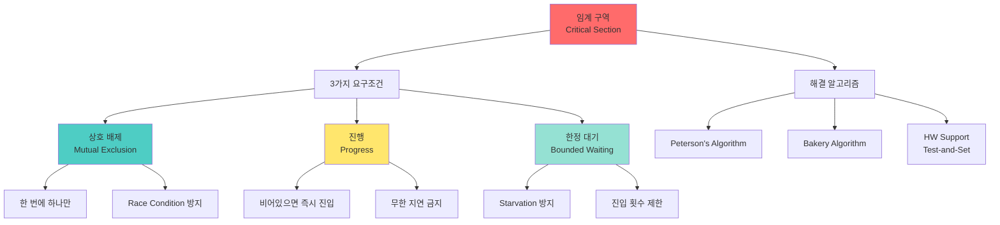

+++
title = "임계 구역 3가지 요구조건"
date = "2026-03-14"
weight = 697
+++

# 임계 구역 3가지 요구조건

## 🎯 핵심 인사이트

임계 구역(Critical Section)은 **공유 자원에 접근하는 코드 영역**으로, 동시 실행을 막기 위해 **상호 배제(Mutual Exclusion), 진행(Progress), 한정 대기(Bounded Waiting)** 3가지 조건을 반드시 만족해야 한다.

---

## Ⅰ. 임계 구역의 정의

### 1-1. 개념

```
┌─────────────────────────────────────────────────────────────────────┐
│                  Critical Section (임계 구역)                       │
├─────────────────────────────────────────────────────────────────────┤
│                                                                     │
│  "공유 자원에 접근하는 코드 영역으로,                               │
│   한 번에 하나의 프로세스만 실행할 수 있음"                         │
│                                                                     │
│  Process Structure:                                                 │
│  ┌─────────────────────────────────────────────────────────────┐    │
│  │  Entry Section │ Critical │ Exit Section │ Remainder       │    │
│  │  (진입 코드)    │ Section │ (퇴장 코드)   │ Section         │    │
│  │                │ (임계구역)│              │ (나머지)         │    │
│  │   lock()       │ count++  │  unlock()    │  ...            │    │
│  └─────────────────────────────────────────────────────────────┘    │
│         │              ▲              │                             │
│         │              │              │                             │
│         └──────────────┴──────────────┘                             │
│               진입/퇴장으로 보호                                     │
│                                                                     │
└─────────────────────────────────────────────────────────────────────┘
```

### 1-2. 구조 분석

```
┌─────────────────────────────────────────────────────────────────────┐
│                     Critical Section 구조                           │
├─────────────────────────────────────────────────────────────────────┤
│                                                                     │
│  ┌────────────┐  ┌────────────┐  ┌────────────┐  ┌────────────┐    │
│  │   Entry    │  │  Critical  │  │   Exit     │  │ Remainder  │    │
│  │  Section   │──▶│  Section   │──▶│  Section   │──▶│  Section   │    │
│  │            │  │            │  │            │  │            │    │
│  │ "들어가도  │  │ "공유 자원 │  │ "나갈 때   │  │ "상관없는  │    │
│  │  되나?"    │  │  접근!"    │  │  자원 해제"│  │  코드"     │    │
│  └────────────┘  └────────────┘  └────────────┘  └────────────┘    │
│       │               │               │                             │
│       ▼               ▼               ▼                             │
│    lock 획득     count++ 등      lock 해제                          │
│                                                                     │
│  ════════════════════════════════════════════════════════════════  │
│                                                                     │
│  Entry Section: 진입 허가 요청 (Lock 획득 시도)                     │
│  Critical Section: 공유 자원에 접근하는 코드 (보호 대상)            │
│  Exit Section: 임계 구역 종료 알림 (Lock 해제)                      │
│  Remainder Section: 나머지 코드 (임계 구역 외부)                    │
│                                                                     │
└─────────────────────────────────────────────────────────────────────┘
```

> **📢 섹션 요약 비유**: 임계 구역은 1인용 화장실과 같다. Entry는 문을 열고 들어가는 것, Critical Section은 화장실 안에서의 일, Exit는 나와서 문을 여는 것, Remainder는 화장실 밖에서의 다른 활동이다.

---

## Ⅱ. 3가지 요구조건 상세

### 2-1. 상호 배제 (Mutual Exclusion)

```
┌─────────────────────────────────────────────────────────────────────┐
│            Mutual Exclusion (상호 배제) - 조건 1                     │
├─────────────────────────────────────────────────────────────────────┤
│                                                                     │
│  "임계 구역에 이미 프로세스가 있으면, 다른 프로세스는 진입 불가"    │
│                                                                     │
│  ┌─────────────────────────────────────────────────────────────┐    │
│  │                                                             │    │
│  │   Process A ────▶ ┌──────────────┐                         │    │
│  │   (IN CS)         │   Critical   │ ◀─── Process B          │    │
│  │                   │   Section    │     (BLOCKED!)          │    │
│  │                   │   🚫 입장금지 │                         │    │
│  │                   └──────────────┘                         │    │
│  │                         │                                  │    │
│  │                         ▼                                  │    │
│  │                    한 번에 하나만!                          │    │
│  │                                                             │    │
│  └─────────────────────────────────────────────────────────────┘    │
│                                                                     │
│  ✅ if (process_i in critical_section)                             │
│         then (process_j cannot enter)                              │
│                                                                     │
│  구현 방법: Mutex, Semaphore, Spinlock, Test-and-Set              │
│                                                                     │
└─────────────────────────────────────────────────────────────────────┘
```

### 2-2. 진행 (Progress)

```
┌─────────────────────────────────────────────────────────────────────┐
│                Progress (진행) - 조건 2                              │
├─────────────────────────────────────────────────────────────────────┤
│                                                                     │
│  "임계 구역이 비어있으면, 진입하고 싶은 프로세스가 반드시 진입"     │
│  "진입 결정은 무한히 미루어지지 않음"                               │
│                                                                     │
│  ┌─────────────────────────────────────────────────────────────┐    │
│  │                                                             │    │
│  │   Critical Section Empty?                                   │    │
│  │         │                                                   │    │
│  │    ┌────┴────┐                                              │    │
│  │    ▼         ▼                                              │    │
│  │   YES        NO ──▶ Wait                                    │    │
│  │    │                                                        │    │
│  │    ▼                                                        │    │
│  │   Anyone wants to enter?                                    │    │
│  │         │                                                   │    │
│  │    ┌────┴────┐                                              │    │
│  │    ▼         ▼                                              │    │
│  │   YES        NO ──▶ Stay Empty                              │    │
│  │    │                                                        │    │
│  │    ▼                                                        │    │
│  │   Select one ──▶ Enter immediately!                         │    │
│  │   (no infinite delay)                                       │    │
│  │                                                             │    │
│  └─────────────────────────────────────────────────────────────┘    │
│                                                                     │
│  ❌ 위배 예시: while(turn != 0 && turn != 1) { /* busy wait */ }   │
│     → turn이 0도 1도 아니면 무한 대기 (Progress 위배)              │
│                                                                     │
└─────────────────────────────────────────────────────────────────────┘
```

### 2-3. 한정 대기 (Bounded Waiting)

```
┌─────────────────────────────────────────────────────────────────────┐
│             Bounded Waiting (한정 대기) - 조건 3                     │
├─────────────────────────────────────────────────────────────────────┤
│                                                                     │
│  "대기하는 프로세스가 무한히 기다리지 않음"                         │
│  "다른 프로세스가 임계 구역에 진입하는 횟수에 상한이 있음"          │
│                                                                     │
│  ┌─────────────────────────────────────────────────────────────┐    │
│  │                                                             │    │
│  │   Process P_i 대기 시작                                     │    │
│  │         │                                                   │    │
│  │         ▼                                                   │    │
│  │   ┌───────────────────────────────────────────┐            │    │
│  │   │  다른 프로세스들이 Critical Section 진입  │            │    │
│  │   │                                           │            │    │
│  │   │  P_j 진입 → P_k 진입 → P_l 진입 → ...    │            │    │
│  │   │                                           │            │    │
│  │   │  최대 (n-1)번만! 그 다음은 P_i 차례!     │            │    │
│  │   └───────────────────────────────────────────┘            │    │
│  │         │                                                   │    │
│  │         ▼                                                   │    │
│  │   P_i 반드시 진입 보장                                      │    │
│  │                                                             │    │
│  └─────────────────────────────────────────────────────────────┘    │
│                                                                     │
│  ✅ waiting_limit = n - 1  (n = 프로세스 개수)                     │
│                                                                     │
│  ❌ 위배 예시: 단순 Spinlock (들어가는 순서 보장 없음)              │
│     → 특정 프로세스만 계속 빠르게 진입 가능 (Starvation)           │
│                                                                     │
└─────────────────────────────────────────────────────────────────────┘
```

> **📢 섹션 요약 비유**: 3가지 조건은 놀이공원 대기줄과 같다. (1) 상호 배제: 롤러코스터는 한 팀씩만 탈 수 있음 (2) 진행: 비었으면 다음 팀이 바로 타야 함 (3) 한정 대기: 아무리 많이 기다려도 내 차례는 반드시 옴

---

## Ⅲ. 조건별 위배 사례

### 3-1. 상호 배제 위배

```
┌─────────────────────────────────────────────────────────────────────┐
│                    Mutual Exclusion 위배 사례                       │
├─────────────────────────────────────────────────────────────────────┤
│                                                                     │
│  잘못된 코드: flag 없이 turn만 사용                                 │
│                                                                     │
│  // Process 0                  // Process 1                        │
│  while(turn != 0);            while(turn != 1);                    │
│  /* Critical Section */       /* Critical Section */               │
│  turn = 1;                    turn = 0;                            │
│                                                                     │
│  ⚠️ 문제점: turn 초기값이 0이면 Process 0만 진입 가능              │
│            Process 1은 turn이 1이 될 때까지 무한 대기              │
│            둘 다 동시에 진입할 수는 없지만...                       │
│                                                                     │
│  ════════════════════════════════════════════════════════════════  │
│                                                                     │
│  더 나쁜 예: 아무런 보호 없이 직접 접근                             │
│                                                                     │
│  // Thread A                   // Thread B                         │
│  counter++;                   counter++;                           │
│                                                                     │
│  ❌ 둘 다 동시에 진입 → Race Condition → Mutual Exclusion 위배!    │
│                                                                     │
└─────────────────────────────────────────────────────────────────────┘
```

### 3-2. 진행 위배

```
┌─────────────────────────────────────────────────────────────────────┐
│                       Progress 위배 사례                            │
├─────────────────────────────────────────────────────────────────────┤
│                                                                     │
│  Peterson's Algorithm 변형 (잘못된 구현)                            │
│                                                                     │
│  // Process 0                  // Process 1                        │
│  flag[0] = true;              flag[1] = true;                      │
│  turn = 1;                    turn = 0;                            │
│  while(flag[1] && turn==1);   while(flag[0] && turn==0);           │
│  /* Critical Section */       /* Critical Section */               │
│                                                                     │
│  시나리오: Process 0이 Critical Section에 있고, Process 1은 대기   │
│           Process 0이 Exit하지 않고 Remainder에서 멈춤             │
│           Process 1은 여전히 진입 불가                              │
│                                                                     │
│  ┌──────────────────────────────────────────────────────────────┐   │
│  │  Process 0: [CS] ──▶ [Remainder에서 멈춤/종료]               │   │
│  │  Process 1: [Wait...] ◀── 언제 들어가나요?                   │   │
│  └──────────────────────────────────────────────────────────────┘   │
│                                                                     │
│  ❌ Exit Section에서 flag[0] = false; 를 안 하면 Progress 위배!    │
│                                                                     │
└─────────────────────────────────────────────────────────────────────┘
```

### 3-3. 한정 대기 위배

```
┌─────────────────────────────────────────────────────────────────────┐
│                    Bounded Waiting 위배 사례                        │
├─────────────────────────────────────────────────────────────────────┤
│                                                                     │
│  Simple Spinlock (Starvation 가능)                                  │
│                                                                     │
│  while(!test_and_set(&lock));  // 기다림의 순서 보장 없음           │
│  /* Critical Section */                                             │
│  lock = false;                                                      │
│                                                                     │
│  ┌──────────────────────────────────────────────────────────────┐   │
│  │                                                             │    │
│  │  Process A, B, C, D 모두 대기 중                            │    │
│  │                                                             │    │
│  │  A 진입 → A 나감 → B, C, D 경쟁                             │    │
│  │                  │                                          │    │
│  │     ┌────────────┼────────────┐                            │    │
│  │     ▼            ▼            ▼                            │    │
│  │   A가 다시!    C 운좋음      D 대기                         │    │
│  │   (너무 빠름!)                                            │    │
│  │                                                             │    │
│  │  반복... → D는 Starvation! (Bounded Waiting 위배)          │    │
│  │                                                             │    │
│  └──────────────────────────────────────────────────────────────┘    │
│                                                                     │
│  ✅ 해결: Ticket Lock, Bakery Algorithm 등으로 순서 보장           │
│                                                                     │
└─────────────────────────────────────────────────────────────────────┘
```

> **📢 섹션 요약 비유**: 한정 대기 위배는 식당에서 줄을 섰는데, 계속 새로 오는 손님들이 먼저 들어가는 상황이다. "제가 언제 들어가나요?" 하고 물어도 "조금만 더 기다려세요"만 반복된다.

---

## Ⅳ. 조건을 만족하는 알고리즘

### 4-1. Peterson's Algorithm (2 Process)

```
┌─────────────────────────────────────────────────────────────────────┐
│                   Peterson's Algorithm                              │
├─────────────────────────────────────────────────────────────────────┤
│                                                                     │
│  int turn;                                                          │
│  boolean flag[2] = {false, false};                                 │
│                                                                     │
│  // Process i (i = 0 또는 1)                                       │
│  flag[i] = true;        // "나 들어가고 싶어!"                     │
│  turn = j;             // "너 먼저 해!"                             │
│  while(flag[j] && turn == j);  // 너가 들어가고 싶고 너 차례면 대기 │
│                                                                     │
│  /* Critical Section */                                             │
│                                                                     │
│  flag[i] = false;       // "나 나왔어!"                             │
│                                                                     │
│  ════════════════════════════════════════════════════════════════  │
│                                                                     │
│  ✅ Mutual Exclusion: flag와 turn으로 이중 보장                    │
│  ✅ Progress: flag[i]=false면 while 루프 탈출 가능                 │
│  ✅ Bounded Waiting: turn 변수로 번갈아 진입 보장                  │
│                                                                     │
│  ┌──────────────────────────────────────────────────────────────┐   │
│  │  Process 0: flag[0]=T, turn=1, wait... → CS → flag[0]=F     │   │
│  │  Process 1: flag[1]=T, turn=0, wait... → CS → flag[1]=F     │   │
│  │                                                             │   │
│  │  서로에게 기회를 양보하다 보니 공평하게 진입!                │   │
│  └──────────────────────────────────────────────────────────────┘    │
│                                                                     │
└─────────────────────────────────────────────────────────────────────┘
```

### 4-2. Bakery Algorithm (N Process)

```
┌─────────────────────────────────────────────────────────────────────┐
│                  Lamport's Bakery Algorithm                         │
├─────────────────────────────────────────────────────────────────────┤
│                                                                     │
│  "빵집에서 번호표 뽑는 방식" - Leslie Lamport, 1974                 │
│                                                                     │
│  int number[n] = {0};   // 각 프로세스의 번호표                    │
│  boolean choosing[n] = {false};  // 번호표 뽑는 중인지             │
│                                                                     │
│  // Process i                                                       │
│  choosing[i] = true;                                               │
│  number[i] = max(number) + 1;  // 가장 큰 번호 + 1                 │
│  choosing[i] = false;                                              │
│                                                                     │
│  for(j = 0; j < n; j++) {                                          │
│      while(choosing[j]);  // j가 번호표 뽑는 중이면 대기           │
│      while(number[j] != 0 &&                                       │
│            (number[j], j) < (number[i], i));  // 더 작은 번호 대기 │
│  }                                                                  │
│                                                                     │
│  /* Critical Section */                                             │
│                                                                     │
│  number[i] = 0;  // 번호표 반납                                     │
│                                                                     │
│  ════════════════════════════════════════════════════════════════  │
│                                                                     │
│  ✅ Mutual Exclusion: 가장 작은 번호만 진입                        │
│  ✅ Progress: 번호표 뽑기 완료하면 진입 결정 가능                  │
│  ✅ Bounded Waiting: 번호표 순서대로 진입 (FIFO 보장)              │
│                                                                     │
└─────────────────────────────────────────────────────────────────────┘
```

> **📢 섹션 요약 비유**: Bakery Algorithm은 빵집에서 줄 서는 방식이다. 번호표를 뽑고(choosing=true), 가장 큰 번호 다음 번호를 받는다. 그리고 자신보다 작은 번호를 가진 사람이 빵을 다 사갈 때까지 기다린다. 완벽한 공평성!

---

## Ⅴ. 조건 검증 체크리스트

### 5-1. 알고리즘 평가표

```
┌─────────────────────────────────────────────────────────────────────┐
│                 Critical Section 조건 검증표                        │
├─────────────────────────────────────────────────────────────────────┤
│                                                                     │
│  ┌──────────────┬─────────┬──────────┬───────────────┐            │
│  │   알고리즘    │  ME     │ Progress │ Bounded Wait  │            │
│  ├──────────────┼─────────┼──────────┼───────────────┤            │
│  │ Simple Flag  │   ❌    │    ❌    │      ❌       │            │
│  │ (단일 변수)   │         │          │               │            │
│  ├──────────────┼─────────┼──────────┼───────────────┤            │
│  │ Alternating  │   ✅    │    ❌    │      ✅       │            │
│  │ (교대 진입)   │         │          │               │            │
│  ├──────────────┼─────────┼──────────┼───────────────┤            │
│  │ Peterson's   │   ✅    │    ✅    │      ✅       │            │
│  │ (2 Process)  │         │          │               │            │
│  ├──────────────┼─────────┼──────────┼───────────────┤            │
│  │ Bakery       │   ✅    │    ✅    │      ✅       │            │
│  │ (N Process)  │         │          │               │            │
│  ├──────────────┼─────────┼──────────┼───────────────┤            │
│  │ Spinlock     │   ✅    │    ✅    │      ❌       │            │
│  │ (HW support) │         │          │               │            │
│  ├──────────────┼─────────┼──────────┼───────────────┤            │
│  │ Mutex Lock   │   ✅    │    ✅    │      ✅       │            │
│  │ (OS support) │         │          │               │            │
│  └──────────────┴─────────┴──────────┴───────────────┘            │
│                                                                     │
│  ME = Mutual Exclusion (상호 배제)                                  │
│                                                                     │
└─────────────────────────────────────────────────────────────────────┘
```

### 5-2. 시험 팁

```
┌─────────────────────────────────────────────────────────────────────┐
│                     📝 시험 핵심 포인트                              │
├─────────────────────────────────────────────────────────────────────┤
│                                                                     │
│  1. 3가지 조건 이름과 정의 암기                                     │
│     • Mutual Exclusion: 한 번에 하나만                              │
│     • Progress: 비어있으면 바로 진입                                │
│     • Bounded Waiting: 무한 대기 금지                               │
│                                                                     │
│  2. 위배 사례 식별                                                  │
│     • ME 위배 → Race Condition                                     │
│     • Progress 위배 → Deadlock 가능성                              │
│     • BW 위배 → Starvation                                         │
│                                                                     │
│  3. Peterson's Algorithm 동작 원리                                  │
│     • flag[i] = true (진입 의사)                                   │
│     • turn = j (상대방에게 양보)                                   │
│     • 두 조건 모두 확인 후 진입                                    │
│                                                                     │
│  4. Bakery Algorithm의 번호표 방식                                  │
│     • max + 1로 번호 할당                                          │
│     • (번호, 프로세스ID) 튜플 비교                                 │
│     • 가장 작은 번호부터 진입                                      │
│                                                                     │
└─────────────────────────────────────────────────────────────────────┘
```

> **📢 섹션 요약 비유**: 3가지 조건은 "안전한 임계 구역"의 삼각형이다. 세 조건이 모두 모여야 완벽한 동기화가 이루어진다. 하나라도 부족하면 버그, 교착, 기아 중 하나가 발생한다.

---

## 📊 개념 맵



---

## 👧 Child Analogy

임계 구역의 3가지 조건은 **학교 급식실에서 한 줄로 서서 밥을 받는 규칙**과 같아요!

```
┌─────────────────────────────────────────────────────────┐
│              🍛 급식실 3가지 규칙 🍛                      │
├─────────────────────────────────────────────────────────┤
│                                                         │
│  1️⃣ 상호 배제: "배식대에는 한 명만!"                    │
│     🧑‍🍳 ──▶ [배식대] ◀── 🧑‍🍳                             │
│              "한 명씩만 와요!"                           │
│                                                         │
│  2️⃣ 진행: "앞 사람이 없으면 바로 가세요"                │
│     [배식대 비었음] ──▶ "자, 다음!" ──▶ 🏃 바로 갑니다!  │
│                                                         │
│  3️⃣ 한정 대기: "아무리 늦어도 내 차례는 와요"           │
│     🧍🧍🧍🧍 나 🧍🧍 ──▶ "최대 7명만 기다리면 돼요!"      │
│                                                         │
│  이 3가지가 다 지켜져야 모두가 공평하게 밥을 먹어요! 🍚✨│
└─────────────────────────────────────────────────────────┘
```

컴퓨터에서도 프로그램들이 같은 자료를 쓸 때, 이 3가지 규칙을 지켜서 한 번에 하나씩만 접근하게 해요!