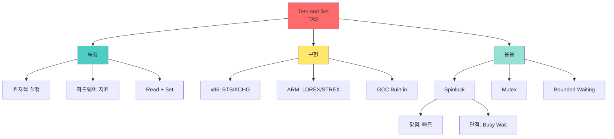

+++
title = "Test and Set 연산 하드웨어"
date = "2026-03-14"
weight = 698
+++

# Test-and-Set 연산 하드웨어

## 🎯 핵심 인사이트

Test-and-Set (TAS)은 **하드웨어 차원에서 원자적으로 실행되는 명령어**로, 변수의 값을 읽고(Read) 1로 설정(Set)하는 연산이 인터럽트 없이 한 번에 이루어진다. 소프트웨어만으로는 불가능한 진정한 동기화를 가능케 한다.

---

## Ⅰ. Test-and-Set의 필요성

### 1-1. 소프트웨어만의 한계

```
┌─────────────────────────────────────────────────────────────────────┐
│                  소프트웨어 동기화의 문제점                          │
├─────────────────────────────────────────────────────────────────────┤
│                                                                     │
│  일반 변수를 이용한 Lock 시도:                                      │
│                                                                     │
│  // 잘못된 코드!                                                    │
│  while(lock == 1);  // 1. 읽기                                      │
│  lock = 1;          // 2. 설정                                      │
│  /* Critical Section */                                             │
│  lock = 0;          // 3. 해제                                      │
│                                                                     │
│  문제: 1번과 2번 사이에 Context Switch 발생 가능!                   │
│                                                                     │
│  ┌──────────────────────────────────────────────────────────────┐   │
│  │  Thread A: while(lock==0)  ──▶ [여기서 Interrupt!]           │   │
│  │  Thread B: while(lock==0)  ──▶ lock=1 ──▶ CS 진입!          │   │
│  │  Thread A: lock=1          ──▶ CS 진입! (B와 동시!)          │   │
│  │                                                             │   │
│  │  ❌ 두 스레드가 동시에 CS 진입 → Mutual Exclusion 위배!      │   │
│  └──────────────────────────────────────────────────────────────┘   │
│                                                                     │
│  해결: Read와 Set을 "원자적(Atomic)"으로 수행해야 함!               │
│       → 하드웨어 지원 필요 (Test-and-Set)                          │
│                                                                     │
└─────────────────────────────────────────────────────────────────────┘
```

### 1-2. Atomic Operation의 개념

```
┌─────────────────────────────────────────────────────────────────────┐
│                    Atomic Operation (원자 연산)                     │
├─────────────────────────────────────────────────────────────────────┤
│                                                                     │
│  "더 이상 나눌 수 없는 연산" - 중간에 인터럽트 불가능              │
│                                                                     │
│  Non-Atomic (나누어짐):          Atomic (안 나누어짐):              │
│  ┌───────────────────────┐      ┌───────────────────────┐          │
│  │ 1. READ lock          │      │ ┌───────────────────┐ │          │
│  │    ──[interrupt 가능]──│      │ │ Test-and-Set     │ │          │
│  │ 2. SET lock = 1       │      │ │   READ & SET     │ │          │
│  │                       │      │ │   in ONE step    │ │          │
│  │ ❌ Race Condition     │      │ └───────────────────┘ │          │
│  │                       │      │                       │          │
│  │                       │      │ ✅ No Race Condition  │          │
│  └───────────────────────┘      └───────────────────────┘          │
│                                                                     │
│  하드웨어가 보장:                                                   │
│  • CPU가 TAS 명령어를 실행하는 동안 Memory Bus를 Lock              │
│  • 다른 CPU/코어가 같은 주소 접근 불가                              │
│  • 한 클럭 사이클 내에 완료                                        │
│                                                                     │
└─────────────────────────────────────────────────────────────────────┘
```

> **📢 섹션 요약 비유**: Test-and-Set은 자판기의 동전 투입구와 같다. 동전을 넣으면 (1) 동전 감지 (2) 음료 나옴이 동시에 일어난다. 중간에 뺏을 수 없다!

---

## Ⅱ. Test-and-Set 명령어 정의

### 2-1. 의사코드(Pseudocode) 정의

```
┌─────────────────────────────────────────────────────────────────────┐
│                    Test-and-Set Definition                          │
├─────────────────────────────────────────────────────────────────────┤
│                                                                     │
│  // Test-and-Set: 원자적으로 실행됨 (Atomic)                        │
│  boolean TestAndSet(boolean *target) {                             │
│      boolean rv = *target;   // 1. 현재 값 저장 (Read)             │
│      *target = true;         // 2. 항상 true로 설정 (Set)          │
│      return rv;              // 3. 이전 값 반환                     │
│  }                                                                  │
│                                                                     │
│  ════════════════════════════════════════════════════════════════  │
│                                                                     │
│  특징:                                                              │
│  • 항상 target을 true로 만듦 (Set)                                 │
│  • 반환값은 이전 값 (Test)                                         │
│  • 이 두 동작이 나누어지지 않음 (Atomic)                           │
│                                                                     │
│  ┌──────────────────────────────────────────────────────────────┐   │
│  │  호출 전: target = false                                     │   │
│  │  TAS(&target) → false 반환, target = true                    │   │
│  │                                                             │   │
│  │  호출 전: target = true                                      │   │
│  │  TAS(&target) → true 반환, target = true (변화 없음)         │   │
│  └──────────────────────────────────────────────────────────────┘   │
│                                                                     │
└─────────────────────────────────────────────────────────────────────┘
```

### 2-2. x86 어셈블리 구현

```
┌─────────────────────────────────────────────────────────────────────┐
│                   x86 BTS (Bit Test and Set)                        │
├─────────────────────────────────────────────────────────────────────┤
│                                                                     │
│  x86 명령어: BTS (Bit Test and Set)                                 │
│                                                                     │
│  ; BTS dest, bit_index                                             │
│  ; CF = dest[bit_index]    ; Copy bit to Carry Flag (Test)         │
│  ; dest[bit_index] = 1     ; Set the bit (Set)                     │
│                                                                     │
│  ; Lock Prefix (멀티코어에서 원자성 보장)                           │
│  lock bts [lock_var], 0                                             │
│  jc   already_locked     ; CF=1이면 이미 잠김                      │
│                                                                     │
│  ════════════════════════════════════════════════════════════════  │
│                                                                     │
│  ; C 스타일 인라인 어셈블리                                         │
│  int tas(int *lock) {                                               │
│      int old = 1;                                                   │
│      __asm__ volatile (                                            │
│          "xchg %0, %1"    // Exchange (atomic on x86)              │
│          : "=r"(old), "+m"(*lock)                                  │
│          : "0"(old)                                                 │
│          : "memory"                                                 │
│      );                                                             │
│      return old;                                                    │
│  }                                                                  │
│                                                                     │
│  ; 또는 GCC Built-in                                                │
│  bool tas(bool *ptr) {                                              │
│      return __atomic_test_and_set(ptr, __ATOMIC_SEQ_CST);          │
│  }                                                                  │
│                                                                     │
└─────────────────────────────────────────────────────────────────────┘
```

> **📢 섹션 요약 비유**: Test-and-Set은 "집어던지기" 게임과 같다. 공을 던지면 (1) 던진다 (2) 상대방이 잡는다가 동시에 일어난다. 중간에 멈출 수 없다!

---

## Ⅲ. Spinlock 구현 with TAS

### 3-1. 기본 Spinlock

```
┌─────────────────────────────────────────────────────────────────────┐
│              Spinlock using Test-and-Set                            │
├─────────────────────────────────────────────────────────────────────┤
│                                                                     │
│  boolean lock = false;   // 전역 변수                               │
│                                                                     │
│  // Lock 획득 (Spinlock)                                            │
│  void acquire() {                                                   │
│      while(TestAndSet(&lock))                                      │
│          ;  // busy wait: lock가 true면 계속 회전                  │
│  }                                                                  │
│                                                                     │
│  // Lock 해제                                                       │
│  void release() {                                                   │
│      lock = false;                                                  │
│  }                                                                  │
│                                                                     │
│  ════════════════════════════════════════════════════════════════  │
│                                                                     │
│  동작 분석:                                                         │
│  ┌──────────────────────────────────────────────────────────────┐   │
│  │                                                             │    │
│  │  lock = false (초기상태)                                    │    │
│  │                                                             │    │
│  │  Thread A: TAS(&lock) → false 반환, lock=true               │    │
│  │            while(false) → 탈출! CS 진입!                    │    │
│  │                                                             │    │
│  │  Thread B: TAS(&lock) → true 반환 (lock 이미 true)          │    │
│  │            while(true) → 계속 회전...                       │    │
│  │                                                             │    │
│  │  Thread A: CS 완료, release() → lock=false                  │    │
│  │                                                             │    │
│  │  Thread B: TAS(&lock) → false 반환, lock=true               │    │
│  │            while(false) → 탈출! CS 진입!                    │    │
│  │                                                             │    │
│  └──────────────────────────────────────────────────────────────┘   │
│                                                                     │
└─────────────────────────────────────────────────────────────────────┘
```

### 3-2. Spinlock의 특성 분석

```
┌─────────────────────────────────────────────────────────────────────┐
│                    Spinlock 특성 분석                               │
├─────────────────────────────────────────────────────────────────────┤
│                                                                     │
│  ✅ 장점:                                                           │
│  ┌──────────────────────────────────────────────────────────────┐   │
│  │ • 구현이 단순함                                              │   │
│  │ • Context Switch 오버헤드 없음 (사용자 모드 유지)            │   │
│  │ • 짧은 대기에 유리 (lock이 금방 풀릴 때)                     │   │
│  │ • 멀티코어에서 효율적                                        │   │
│  └──────────────────────────────────────────────────────────────┘   │
│                                                                     │
│  ❌ 단점:                                                           │
│  ┌──────────────────────────────────────────────────────────────┐   │
│  │ • Busy Waiting: CPU를 계속 사용 (전력 낭비)                  │   │
│  │ • 단일 코어에서 비효율: 다른 스레드가 실행될 수 없음         │   │
│  │ • Priority Inversion 위험                                    │   │
│  │ • Bounded Waiting 보장 안됨 (Starvation 가능)                │   │
│  └──────────────────────────────────────────────────────────────┘   │
│                                                                     │
│  언제 사용?                                                         │
│  ┌──────────────────────────────────────────────────────────────┐   │
│  │ • Lock 보유 시간이 매우 짧을 때 (수 microsecond)             │   │
│  │ • 멀티코어/멀티프로세서 환경                                 │   │
│  │ • 인터럽트 핸들러에서 (Sleep 불가)                           │   │
│  │ • 커널 내부 동기화                                           │   │
│  └──────────────────────────────────────────────────────────────┘   │
│                                                                     │
└─────────────────────────────────────────────────────────────────────┘
```

> **📢 섹션 요약 비유**: Spinlock은 화장실 문 앞에서 계속 두드리는 것과 같다. 문이 열릴 때까지 계속 두드린다. 짧으면 괜찮지만, 오래 기다려야 하면 팔이 아프다(CPU 낭비)!

---

## Ⅳ. TAS 기반 알고리즘 확장

### 4-1. Bounded Waiting 보장

```
┌─────────────────────────────────────────────────────────────────────┐
│          TAS with Bounded Waiting (Starvation 방지)                 │
├─────────────────────────────────────────────────────────────────────┤
│                                                                     │
│  boolean lock = false;                                              │
│  boolean waiting[n] = {false};  // 각 프로세스의 대기 상태         │
│                                                                     │
│  void acquire(int i) {  // Process i                               │
│      waiting[i] = true;                                            │
│      boolean key = true;                                           │
│      while(waiting[i] && key) {                                    │
│          key = TestAndSet(&lock);                                  │
│      }                                                              │
│      waiting[i] = false;                                           │
│  }                                                                  │
│                                                                     │
│  void release(int i) {  // Process i                               │
│      int j = (i + 1) % n;                                          │
│      while((j != i) && !waiting[j])                                │
│          j = (j + 1) % n;                                          │
│      if (j == i)                                                    │
│          lock = false;  // 대기 중인 프로세스 없음                 │
│      else                                                           │
│          waiting[j] = false;  // 다음 프로세스에게 순서 넘김       │
│  }                                                                  │
│                                                                     │
│  ════════════════════════════════════════════════════════════════  │
│                                                                     │
│  ✅ Mutual Exclusion: TAS로 보장                                   │
│  ✅ Progress: waiting[j]=false면 while 탈출                        │
│  ✅ Bounded Waiting: 순환 순서로 다음 대기자에게 기회 부여         │
│                                                                     │
└─────────────────────────────────────────────────────────────────────┘
```

### 4-2. Compare-and-Swap (CAS)

```
┌─────────────────────────────────────────────────────────────────────┐
│               Compare-and-Swap (CAS) - TAS의 변형                   │
├─────────────────────────────────────────────────────────────────────┤
│                                                                     │
│  // CAS: 조건부 원자 교체                                           │
│  int CompareAndSwap(int *ptr, int expected, int new_val) {         │
│      int original = *ptr;                                          │
│      if (original == expected)                                     │
│          *ptr = new_val;                                           │
│      return original;                                               │
│  }                                                                  │
│                                                                     │
│  // 사용 예: Lock-free 카운터                                       │
│  void increment(int *counter) {                                    │
│      int old_val;                                                   │
│      do {                                                           │
│          old_val = *counter;                                       │
│      } while (CompareAndSwap(counter, old_val, old_val + 1)       │
│               != old_val);                                          │
│  }                                                                  │
│                                                                     │
│  ════════════════════════════════════════════════════════════════  │
│                                                                     │
│  TAS vs CAS:                                                        │
│  ┌──────────────┬────────────────────┬────────────────────┐        │
│  │   특성       │       TAS          │        CAS         │        │
│  ├──────────────┼────────────────────┼────────────────────┤        │
│  │ 동작         │ 읽고 항상 1로 설정 │ 읽고 조건부 교체   │        │
│  │ 조건         │ 없음               │ expected과 비교    │        │
│  │ 용도         │ Lock 구현          │ Lock-free 자료구조 │        │
│  │ ABA 문제     │ 해당 없음          │ 발생 가능          │        │
│  └──────────────┴────────────────────┴────────────────────┘        │
│                                                                     │
└─────────────────────────────────────────────────────────────────────┘
```

> **📢 섹션 요약 비유**: CAS는 "내가 생각한 값이 맞으면 교체해줘"라는 것이다. 예를 들어 "지금 100원이면 200원으로 바꿔줘"라고 하면, 정말 100원일 때만 바뀐다. 아니면 다시 시도!

---

## Ⅴ. 하드웨어 지원의 종류

### 5-1. 주요 원자 명령어들

```
┌─────────────────────────────────────────────────────────────────────┐
│                   Hardware Atomic Instructions                      │
├─────────────────────────────────────────────────────────────────────┤
│                                                                     │
│  ┌──────────────┬──────────────────────────────────────────────┐   │
│  │   명령어     │   설명                                      │   │
│  ├──────────────┼──────────────────────────────────────────────┤   │
│  │ TAS          │ Test-and-Set: 읽고 1로 설정                 │   │
│  │              │ Spinlock 구현에 사용                        │   │
│  ├──────────────┼──────────────────────────────────────────────┤   │
│  │ CAS          │ Compare-and-Swap: 비교 후 조건부 교체       │   │
│  │              │ Lock-free 자료구조에 사용                   │   │
│  ├──────────────┼──────────────────────────────────────────────┤   │
│  │ LL/SC        │ Load-Linked / Store-Conditional             │   │
│  │              │ MIPS, ARM에서 사용                          │   │
│  │              │ LL로 읽고, SC로 조건부 쓰기                 │   │
│  ├──────────────┼──────────────────────────────────────────────┤   │
│  │ XCHG         │ Exchange: 두 값을 원자적으로 교환           │   │
│  │              │ x86에서 TAS 대용                            │   │
│  ├──────────────┼──────────────────────────────────────────────┤   │
│  │ FETCH-ADD    │ 원자적으로 읽고 더하기                      │   │
│  │              │ 카운터 증가에 사용                          │   │
│  └──────────────┴──────────────────────────────────────────────┘   │
│                                                                     │
│  Memory Barrier / Fence:                                            │
│  • 원자성 + 가시성(Visibility) 보장                                 │
│  • 컴파일러/CPU 최적화에 의한 재배치 방지                          │
│  • Multi-core 환경에서 필수                                        │
│                                                                     │
└─────────────────────────────────────────────────────────────────────┘
```

### 5-2. 아키텍처별 구현

```
┌─────────────────────────────────────────────────────────────────────┐
│               Architecture-specific Implementations                 │
├─────────────────────────────────────────────────────────────────────┤
│                                                                     │
│  x86/x64:                                                           │
│  ┌──────────────────────────────────────────────────────────────┐   │
│  │ • lock prefix: lock xchg, lock cmpxchg                       │   │
│  │ • BTS, BTR (Bit Test and Set/Reset)                          │   │
│  │ • XCHG (Exchange) - 자동으로 lock                            │   │
│  └──────────────────────────────────────────────────────────────┘   │
│                                                                     │
│  ARM:                                                               │
│  ┌──────────────────────────────────────────────────────────────┐   │
│  │ • LDREX/STREX (Load/Store Exclusive)                         │   │
│  │ • LL/SC 패턴 구현                                            │   │
│  │ • DMB (Data Memory Barrier)                                  │   │
│  └──────────────────────────────────────────────────────────────┘   │
│                                                                     │
│  MIPS:                                                              │
│  ┌──────────────────────────────────────────────────────────────┐   │
│  │ • LL/SC (Load Linked / Store Conditional)                    │   │
│  │ • SC는 LL 이후 다른 쓰기가 없을 때만 성공                    │   │
│  └──────────────────────────────────────────────────────────────┘   │
│                                                                     │
│  POWER/PowerPC:                                                     │
│  ┌──────────────────────────────────────────────────────────────┐   │
│  │ • lwarx/stwcx. (Load/Store Word Reserve Indexed)             │   │
│  │ • 동기화 명령어: sync, lwsync, eieio                         │   │
│  └──────────────────────────────────────────────────────────────┘   │
│                                                                     │
└─────────────────────────────────────────────────────────────────────┘
```

> **📢 섹션 요약 비유**: 하드웨어 원자 명령어는 CPU 제조사마다 "특수 기술" 같은 것이다. Intel은 lock을, ARM은 Exclusive를, MIPS는 Linked를 사용한다. 목적은 같지만 기술은 다르다!

---

## 📊 개념 맵



---

## 👧 Child Analogy

Test-and-Set은 **게임기의 동전 투입 방식**과 같아요!

```
┌─────────────────────────────────────────────────────────┐
│            🎮 오락실 게임기 🎮                          │
├─────────────────────────────────────────────────────────┤
│                                                         │
│  [동전 투입구]                                          │
│       │                                                 │
│       ▼                                                 │
│  ┌─────────────────────────────────────────┐           │
│  │  1️⃣ 동전이 있는지 확인 (Test)          │           │
│  │                +                        │           │
│  │  2️⃣ 동전을 넣음 (Set)                  │           │
│  │                                         │           │
│  │  이 두 가지가 동시에! ⚡                 │           │
│  └─────────────────────────────────────────┘           │
│       │                                                 │
│       ▼                                                 │
│  게임 시작! 🎮                                          │
│                                                         │
│  중요: 누군가 동전을 넣고 있으면                       │
│        다른 사람은 넣을 수 없어요! 🚫                   │
│                                                         │
│  컴퓨터에서도 마찬가지!                                 │
│  TAS는 "확인하고 설정하기"를 한 번에 해요!              │
└─────────────────────────────────────────────────────────┘
```

CPU도 게임기처럼, 자원을 쓸 때 "확인하고 설정하기"를 한 번에 해서 아무도 끼어들 수 없게 해요!