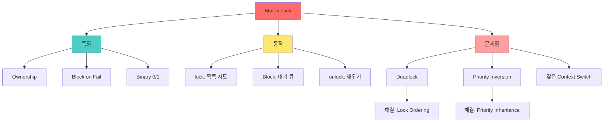

+++
title = "뮤텍스 락 Mutex Lock"
date = "2026-03-14"
weight = 699
+++

# 뮤텍스 락 (Mutex Lock)

## 🎯 핵심 인사이트

뮤텍스(Mutex, Mutual Exclusion)는 **한 번에 하나의 스레드만 임계 구역에 진입할 수 있게 하는 동기화 객체**다. Spinlock과 달리 Lock을 얻지 못하면 대기 상태로 전환(Block)되어 CPU를 양보한다.

---

## Ⅰ. 뮤텍스의 정의와 개념

### 1-1. 기본 개념

```
┌─────────────────────────────────────────────────────────────────────┐
│                     Mutex (Mutual Exclusion)                        │
├─────────────────────────────────────────────────────────────────────┤
│                                                                     │
│  "상호 배제를 위한 동기화 메커니즘 - Lock 획득 실패 시 Block"      │
│                                                                     │
│  ┌─────────────────────────────────────────────────────────────┐    │
│  │                                                             │    │
│  │   Thread A ──▶ lock() ──▶ [Critical Section] ──▶ unlock()  │    │
│  │                               │                             │    │
│  │                               ▼                             │    │
│  │   Thread B ──▶ lock() ──▶ [BLOCKED!] ──▶ wait... ──▶       │    │
│  │                                            │                │    │
│  │                                            ▼                │    │
│  │                              (A가 unlock하면 깨어남)        │    │
│  │                                                             │    │
│  └─────────────────────────────────────────────────────────────┘    │
│                                                                     │
│  특징:                                                              │
│  • Binary Semaphore (값 0 또는 1)                                  │
│  • Lock을 소유한 스레드만 Unlock 가능 (Ownership)                  │
│  • Lock 실패 시 Sleep → CPU 양보                                   │
│                                                                     │
└─────────────────────────────────────────────────────────────────────┘
```

### 1-2. Spinlock vs Mutex

```
┌─────────────────────────────────────────────────────────────────────┐
│                    Spinlock vs Mutex 비교                           │
├─────────────────────────────────────────────────────────────────────┤
│                                                                     │
│         Spinlock                    Mutex                          │
│  ┌─────────────────────┐     ┌─────────────────────┐               │
│  │                     │     │                     │               │
│  │  while(!lock);      │     │  if(!lock)          │               │
│  │  // 계속 회전!      │     │    sleep();  💤     │               │
│  │  // CPU 계속 사용   │     │  // CPU 양보        │               │
│  │                     │     │                     │               │
│  └─────────────────────┘     └─────────────────────┘               │
│                                                                     │
│  ┌──────────────┬─────────────────┬─────────────────┐              │
│  │    특성      │    Spinlock     │     Mutex       │              │
│  ├──────────────┼─────────────────┼─────────────────┤              │
│  │ 대기 방식    │ Busy Waiting    │ Block/Sleep     │              │
│  │ CPU 사용     │ 계속 사용       │ 양보함          │              │
│  │ Context Sw   │ 없음            │ 있음            │              │
│  │ 대기 시간    │ 짧을 때 유리    │ 길 때 유리      │              │
│  │ 구현 위치    │ 사용자 모드     │ 커널 모드       │              │
│  │ Ownership    │ 없음            │ 있음            │              │
│  └──────────────┴─────────────────┴─────────────────┘              │
│                                                                     │
│  선택 기준:                                                         │
│  • Lock 보유 시간 < Context Switch 시간 → Spinlock                 │
│  • Lock 보유 시간 > Context Switch 시간 → Mutex                    │
│  • 단일 코어 → Mutex (Spinlock는 의미 없음)                        │
│                                                                     │
└─────────────────────────────────────────────────────────────────────┘
```

> **📢 섹션 요약 비유**: Spinlock은 택시 기사가 손님을 기다리며 계속 운전하는 것이고, Mutex는 주차하고 잠시 쉬는 것이다. 짧은 대기면 계속 운전(Spinlock)이 낫고, 긴 대기면 주차(Mutex)가 낫다.

---

## Ⅱ. 뮤텍스의 동작 원리

### 2-1. 상태 전이도

```
┌─────────────────────────────────────────────────────────────────────┐
│                     Mutex State Transition                          │
├─────────────────────────────────────────────────────────────────────┤
│                                                                     │
│  Mutex States: UNLOCKED (1) ↔ LOCKED (0)                           │
│                                                                     │
│  ┌─────────────────────────────────────────────────────────────┐    │
│  │                                                             │    │
│  │         ┌───────────────┐                                   │    │
│  │         │   UNLOCKED    │                                   │    │
│  │         │    (value=1)  │                                   │    │
│  │         └───────┬───────┘                                   │    │
│  │                 │                                           │    │
│  │       lock()    │                                           │    │
│  │       (성공)    │                                           │    │
│  │                 ▼                                           │    │
│  │         ┌───────────────┐                                   │    │
│  │         │    LOCKED     │                                   │    │
│  │         │    (value=0)  │                                   │    │
│  │         └───────┬───────┘                                   │    │
│  │                 │                                           │    │
│  │       unlock()  │                                           │    │
│  │                 │                                           │    │
│  │                 └───────────────────┐                       │    │
│  │                                     │                       │    │
│  │                     wait queue에서 하나 깨움                │    │
│  │                                                             │    │
│  └─────────────────────────────────────────────────────────────┘    │
│                                                                     │
│  Wait Queue:                                                        │
│  ┌─────────────────────────────────────────────────────────────┐    │
│  │  lock() 실패한 스레드들이 대기                              │    │
│  │                                                             │    │
│  │  [Thread B] → [Thread C] → [Thread D] → NULL               │    │
│  │                                                             │    │
│  │  unlock() 시 wake-up → 하나가 깨어나서 lock 재시도          │    │
│  └─────────────────────────────────────────────────────────────┘    │
│                                                                     │
└─────────────────────────────────────────────────────────────────────┘
```

### 2-2. lock() 동작

```
┌─────────────────────────────────────────────────────────────────────┐
│                      mutex_lock() 동작                              │
├─────────────────────────────────────────────────────────────────────┤
│                                                                     │
│  void mutex_lock(mutex_t *m) {                                     │
│      // 1. 빠른 경로: Try to acquire without blocking              │
│      if (atomic_decrement(&m->value) == 1)                        │
│          return;  // Lock 획득 성공!                               │
│                                                                     │
│      // 2. 느린 경로: Kernel에 의한 block                         │
│      else {                                                         │
│          // 이미 Lock이 걸려 있음                                  │
│          enqueue(&m->wait_queue, current_thread);                  │
│          current_thread->state = BLOCKED;                          │
│          schedule();  // Context Switch!                           │
│      }                                                              │
│  }                                                                  │
│                                                                     │
│  ┌──────────────────────────────────────────────────────────────┐   │
│  │                                                             │    │
│  │  lock() 호출                                                │    │
│  │      │                                                      │    │
│  │      ▼                                                      │    │
│  │  atomic_dec(&value)                                         │    │
│  │      │                                                      │    │
│  │      ├──▶ 결과 == 1? ──[YES]──▶ Lock 획득! 반환            │    │
│  │      │                                                      │    │
│  │      └──▶ 결과 <= 0? ──[YES]──▶ 대기큐에 추가              │    │
│  │                              BLOCKED 상태로 변경            │    │
│  │                              schedule() 호출                │    │
│  │                                                             │    │
│  └──────────────────────────────────────────────────────────────┘   │
│                                                                     │
└─────────────────────────────────────────────────────────────────────┘
```

### 2-3. unlock() 동작

```
┌─────────────────────────────────────────────────────────────────────┐
│                      mutex_unlock() 동작                            │
├─────────────────────────────────────────────────────────────────────┤
│                                                                     │
│  void mutex_unlock(mutex_t *m) {                                   │
│      // Owner 검증 (필요 시)                                       │
│      if (m->owner != current_thread)                              │
│          panic("Not the owner!");                                  │
│                                                                     │
│      // 1. 빠른 경로: No waiters                                  │
│      if (atomic_increment(&m->value) == 1)                        │
│          return;  // 그냥 해제, 기다리는 사람 없음                │
│                                                                     │
│      // 2. 느린 경로: Wake up one waiter                          │
│      else {                                                         │
│          thread_t *waiter = dequeue(&m->wait_queue);              │
│          waiter->state = READY;                                    │
│      }                                                              │
│  }                                                                  │
│                                                                     │
│  ┌──────────────────────────────────────────────────────────────┐   │
│  │                                                             │    │
│  │  unlock() 호출                                              │    │
│  │      │                                                      │    │
│  │      ▼                                                      │    │
│  │  atomic_inc(&value)                                         │    │
│  │      │                                                      │    │
│  │      ├──▶ 결과 == 1? ──[YES]──▶ 대기자 없음, 완료          │    │
│  │      │                                                      │    │
│  │      └──▶ 결과 > 1? ──[YES]──▶ 대기큐에서 하나 꺼내기      │    │
│  │                              READY 상태로 변경              │    │
│  │                                                             │    │
│  └──────────────────────────────────────────────────────────────┘   │
│                                                                     │
└─────────────────────────────────────────────────────────────────────┘
```

> **📢 섹션 요약 비유**: Mutex의 lock/unlock은 식당 자리 예약과 같다. lock()은 "자리 있나요?" 물어보고 없으면 대기명단에 이름 올리는 것, unlock()은 식사 후 나오면서 "다음 손님!" 외치는 것이다.

---

## Ⅲ. Ownership과 규칙

### 3-1. Mutex Ownership

```
┌─────────────────────────────────────────────────────────────────────┐
│                    Mutex Ownership (소유권)                         │
├─────────────────────────────────────────────────────────────────────┤
│                                                                     │
│  "Lock을 건 스레드만 Unlock 할 수 있음"                            │
│                                                                     │
│  ┌─────────────────────────────────────────────────────────────┐    │
│  │                                                             │    │
│  │  Thread A: lock(mutex) ──▶ Owner = A                       │    │
│  │                                                             │    │
│  │  Thread B: unlock(mutex) ──▶ ❌ ERROR!                      │    │
│  │           (Owner가 B가 아님)                                │    │
│  │                                                             │    │
│  │  Thread A: unlock(mutex) ──▶ ✅ OK!                         │    │
│  │           (Owner가 A이므로)                                 │    │
│  │                                                             │    │
│  └─────────────────────────────────────────────────────────────┘    │
│                                                                     │
│  이것이 Semaphore와의 핵심 차이!                                   │
│                                                                     │
│  ┌──────────────┬─────────────────┬─────────────────┐              │
│  │    특성      │     Mutex       │   Semaphore     │              │
│  ├──────────────┼─────────────────┼─────────────────┤              │
│  │ Ownership    │ 있음 (Owner)    │ 없음            │              │
│  │ Unlock       │ Owner만 가능    │ 누구나 가능     │              │
│  │ 값 범위      │ 0 또는 1        │ 0 이상 정수     │              │
│  │ 용도         │ 상호 배제       │ 자원 카운팅     │              │
│  └──────────────┴─────────────────┴─────────────────┘              │
│                                                                     │
└─────────────────────────────────────────────────────────────────────┘
```

### 3-2. 재귀적 뮤텍스 (Recursive Mutex)

```
┌─────────────────────────────────────────────────────────────────────┐
│                  Recursive Mutex (재귀적 뮤텍스)                    │
├─────────────────────────────────────────────────────────────────────┤
│                                                                     │
│  "같은 스레드가 여러 번 lock 가능"                                 │
│                                                                     │
│  // 일반 Mutex - Deadlock 발생!                                    │
│  void funcA() {                                                     │
│      lock(mutex);                                                   │
│      funcB();        // 내부에서 또 lock 시도 → Deadlock!          │
│      unlock(mutex);                                                 │
│  }                                                                  │
│  void funcB() {                                                     │
│      lock(mutex);    // 이미 A가 lock 보유 중 → Deadlock!          │
│      ...                                                            │
│      unlock(mutex);                                                 │
│  }                                                                  │
│                                                                     │
│  // Recursive Mutex - OK!                                          │
│  ┌──────────────────────────────────────────────────────────────┐   │
│  │  recursive_mutex_t rm;                                       │   │
│  │  int lock_count = 0;  // 재귀 깊이 추적                     │   │
│  │                                                             │   │
│  │  lock(rm);    // lock_count = 1, owner = A                  │   │
│  │  lock(rm);    // lock_count = 2, same owner OK!             │   │
│  │  lock(rm);    // lock_count = 3                             │   │
│  │  unlock(rm);  // lock_count = 2                             │   │
│  │  unlock(rm);  // lock_count = 1                             │   │
│  │  unlock(rm);  // lock_count = 0, 실제 해제                  │   │
│  └──────────────────────────────────────────────────────────────┘   │
│                                                                     │
│  주의: unlock 횟수 == lock 횟수여야 완전히 해제됨                  │
│                                                                     │
└─────────────────────────────────────────────────────────────────────┘
```

> **📢 섹션 요약 비유**: Recursive Mutex는 같은 사람이 여러 개의 화장실 키를 가질 수 있는 것과 같다. 다만 나올 때는 가진 키 개수만큼 반납해야 한다.

---

## Ⅳ. POSIX pthread_mutex 사용법

### 4-1. 기본 API

```
┌─────────────────────────────────────────────────────────────────────┐
│                    pthread_mutex API                                │
├─────────────────────────────────────────────────────────────────────┤
│                                                                     │
│  // 1. 초기화                                                       │
│  pthread_mutex_t mutex = PTHREAD_MUTEX_INITIALIZER;                │
│  // 또는                                                            │
│  pthread_mutex_init(&mutex, NULL);                                 │
│                                                                     │
│  // 2. Lock / Unlock                                                │
│  pthread_mutex_lock(&mutex);     // Block until acquired           │
│  pthread_mutex_trylock(&mutex);  // Non-blocking, returns EBUSY    │
│  pthread_mutex_timedlock(&mutex, &timeout);  // Timeout 지정       │
│  pthread_mutex_unlock(&mutex);                                     │
│                                                                     │
│  // 3. 정리                                                         │
│  pthread_mutex_destroy(&mutex);                                    │
│                                                                     │
│  ════════════════════════════════════════════════════════════════  │
│                                                                     │
│  // 사용 예시                                                       │
│  pthread_mutex_t counter_mutex = PTHREAD_MUTEX_INITIALIZER;        │
│  int counter = 0;                                                   │
│                                                                     │
│  void* increment(void* arg) {                                      │
│      for(int i = 0; i < 100000; i++) {                             │
│          pthread_mutex_lock(&counter_mutex);                       │
│          counter++;                                                 │
│          pthread_mutex_unlock(&counter_mutex);                     │
│      }                                                              │
│      return NULL;                                                   │
│  }                                                                  │
│                                                                     │
└─────────────────────────────────────────────────────────────────────┘
```

### 4-2. Mutex 속성 (Attributes)

```
┌─────────────────────────────────────────────────────────────────────┐
│                    pthread_mutexattr_t                              │
├─────────────────────────────────────────────────────────────────────┤
│                                                                     │
│  pthread_mutexattr_t attr;                                         │
│  pthread_mutexattr_init(&attr);                                    │
│                                                                     │
│  // 1. Type 속성                                                   │
│  ┌──────────────────────────────────────────────────────────────┐   │
│  │ PTHREAD_MUTEX_NORMAL     - 기본 (Deadlock 감지 안함)        │   │
│  │ PTHREAD_MUTEX_ERRORCHECK - 에러 체크                        │   │
│  │ PTHREAD_MUTEX_RECURSIVE  - 재귀 Lock 허용                   │   │
│  │ PTHREAD_MUTEX_DEFAULT    - NORMAL과 동일                    │   │
│  └──────────────────────────────────────────────────────────────┘   │
│                                                                     │
│  pthread_mutexattr_settype(&attr, PTHREAD_MUTEX_RECURSIVE);        │
│                                                                     │
│  // 2. 프로세스 공유 속성                                          │
│  ┌──────────────────────────────────────────────────────────────┐   │
│  │ PTHREAD_PROCESS_PRIVATE - 같은 프로세스 내 스레드만         │   │
│  │ PTHREAD_PROCESS_SHARED  - 다른 프로세스와 공유 가능         │   │
│  └──────────────────────────────────────────────────────────────┘   │
│                                                                     │
│  pthread_mutexattr_setpshared(&attr, PTHREAD_PROCESS_SHARED);      │
│                                                                     │
│  // Mutex 생성                                                      │
│  pthread_mutex_t mutex;                                            │
│  pthread_mutex_init(&mutex, &attr);                                │
│                                                                     │
└─────────────────────────────────────────────────────────────────────┘
```

> **📢 섹션 요약 비유**: Mutex 속성은 화장실 잠금장치의 종류와 같다. 기본형(NORMAL), 재귀형(RECURSIVE - 같은 사람 여러 번 가능), 에러체크형(ERRORCHECK) 등이 있다.

---

## Ⅴ. 뮤텍스와 문제 상황

### 5-1. Deadlock

```
┌─────────────────────────────────────────────────────────────────────┐
│                       Mutex Deadlock                                │
├─────────────────────────────────────────────────────────────────────┤
│                                                                     │
│  시나리오: Thread A는 mutex1 → mutex2 순서,                        │
│           Thread B는 mutex2 → mutex1 순서로 lock 시도              │
│                                                                     │
│  ┌──────────────────────────────────────────────────────────────┐   │
│  │  Thread A              │  Thread B                           │   │
│  ├──────────────────────────────────────────────────────────────┤   │
│  │  lock(mutex1) ✓        │                                     │   │
│  │                        │  lock(mutex2) ✓                     │   │
│  │  lock(mutex2) ...대기  │                                     │   │
│  │                        │  lock(mutex1) ...대기               │   │
│  │                                                             │   │
│  │  💀 서로가 서로를 기다리는 영원한 대기! (Deadlock)          │   │
│  └──────────────────────────────────────────────────────────────┘   │
│                                                                     │
│  해결 방법:                                                         │
│  1. Lock 순서 통일 (Lock Ordering)                                 │
│  2. trylock 사용 후 실패 시 이미 보유한 lock 해제                  │
│  3. Deadlock Detection & Recovery                                  │
│                                                                     │
└─────────────────────────────────────────────────────────────────────┘
```

### 5-2. Priority Inversion

```
┌─────────────────────────────────────────────────────────────────────┐
│                    Priority Inversion                               │
├─────────────────────────────────────────────────────────────────────┤
│                                                                     │
│  시나리오: L(낮은 우선순위)가 mutex 보유 중                        │
│           H(높은 우선순위)가 대기 중                               │
│           M(중간 우선순위)가 CPU 선점                               │
│                                                                     │
│  우선순위: H > M > L                                                │
│                                                                     │
│  ┌──────────────────────────────────────────────────────────────┐   │
│  │  Time ──────────────────────────────────────────────────▶   │   │
│  │                                                             │   │
│  │  L: [lock(mutex)]──[CS]──[preempted by M]──[...대기...]    │   │
│  │                                                             │   │
│  │  M:                 [CPU 사용]────────────────────[완료]    │   │
│  │                                                             │   │
│  │  H:                          [lock 대기...영원히?]          │   │
│  │                                                             │   │
│  │  문제: H가 M보다 우선순위가 높은데도                        │   │
│  │        L → M → H 순서로 실행됨 (우선순위 역전!)             │   │
│  └──────────────────────────────────────────────────────────────┘   │
│                                                                     │
│  해결: Priority Inheritance Protocol (PIP)                         │
│  ┌──────────────────────────────────────────────────────────────┐   │
│  │ L이 mutex 보유 중 H가 대기하면                              │   │
│  │ L의 우선순위를 H 수준으로 상승                              │   │
│  │ → M이 L를 preempt 못 함                                     │   │
│  │ → L가 빨리 CS 완료 → H가 진입                               │   │
│  └──────────────────────────────────────────────────────────────┘   │
│                                                                     │
└─────────────────────────────────────────────────────────────────────┘
```

> **📢 섹션 요약 비유**: Priority Inversion은 응급환자(H)가 일반환자(L)가 쓰던 진료실을 기다리는데, 건강검진(M) 환자가 계속 진료받는 상황이다. 응급환자가 제일 급한데!

---

## 📊 개념 맵



---

## 👧 Child Analogy

뮤텍스는 **학교 컴퓨터실의 이용권**과 같아요!

```
┌─────────────────────────────────────────────────────────┐
│              💻 컴퓨터실 이용권 💻                       │
├─────────────────────────────────────────────────────────┤
│                                                         │
│  🔑 이용권 (Mutex)                                      │
│     │                                                   │
│     ├─▶ 철수: "이용권 주세요!"                          │
│     │        [이용권 있음] → "네, 여기요!" ✅          │
│     │        [이용권 없음] → "대기하세요..." 💤        │
│     │                                                   │
│     └─▶ 영희: (철수가 쓰는 중) "이용권 주세요!"        │
│              "죄송, 대기 명단에 올리겠습니다" 📋        │
│              ... 철수가 반납할 때까지 잠시 자요 😴      │
│                                                         │
│  ⭐ 중요: 이용권 받은 사람만 반납 가능!                 │
│     철수가 받았으면 영희가 대신 반납 ❌                  │
│     철수가 직접 반납해야 함 ✅                          │
│                                                         │
│  이게 바로 Mutex의 "Ownership"이에요!                   │
└─────────────────────────────────────────────────────────┘
```

컴퓨터에서도 프로그램들이 자원을 쓸 때, 한 번에 하나만 쓰게 하고 다른 건 대기시켜요!