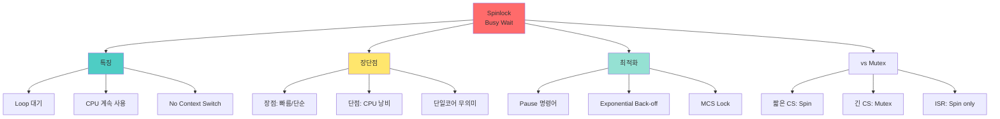

+++
title = "스핀락 바쁜 대기 Busy Wait"
date = "2026-03-14"
weight = 700
+++

# 스핀락 바쁜 대기 (Busy Wait)

## 🎯 핵심 인사이트

스핀락(Spinlock)은 **Lock을 얻을 때까지 반복문(Loop)에서 대기**하는 방식이다. CPU를 계속 사용하며 "회전"하기 때문에 바쁜 대기(Busy Wait)라고도 한다. 짧은 대기에는 효율적이지만, 긴 대기에는 CPU 낭비가 심하다.

---

## Ⅰ. 바쁜 대기의 개념

### 1-1. 정의와 원리

```
┌─────────────────────────────────────────────────────────────────────┐
│                  Busy Waiting (바쁜 대기)                           │
├─────────────────────────────────────────────────────────────────────┤
│                                                                     │
│  "Lock 획득까지 계속 Loop를 돌며 확인 - CPU를 놓지 않음"           │
│                                                                     │
│  ┌─────────────────────────────────────────────────────────────┐    │
│  │                                                             │    │
│  │  while (lock == 1) {                                        │    │
│  │      // 아무것도 안 함... 그냥 계속 확인만!                 │    │
│  │      // CPU는 계속 돌아감 🔥                                │    │
│  │  }                                                          │    │
│  │                                                             │    │
│  │  // Lock 풀리면 즉시 진입!                                  │    │
│  │  critical_section();                                        │    │
│  │                                                             │    │
│  └─────────────────────────────────────────────────────────────┘    │
│                                                                     │
│  비유:                                                              │
│  ┌─────────────────────────────────────────────────────────────┐    │
│  │  🚪 화장실 문 앞에서 계속 두드리기                          │    │
│  │                                                             │    │
│  │  "비었나요?" → "아뇨" → "비었나요?" → "아뇨" → ...         │    │
│  │                                                             │    │
│  │  vs. 번호표 뽑고 자리에 앉아 대기 (Block/Sleep)             │    │
│  └─────────────────────────────────────────────────────────────┘    │
│                                                                     │
└─────────────────────────────────────────────────────────────────────┘
```

### 1-2. Spinlock 구현

```
┌─────────────────────────────────────────────────────────────────────┐
│                    Spinlock Implementation                          │
├─────────────────────────────────────────────────────────────────────┤
│                                                                     │
│  // Basic Spinlock                                                  │
│  typedef struct {                                                   │
│      int locked;                                                    │
│  } spinlock_t;                                                      │
│                                                                     │
│  void spin_lock(spinlock_t *lock) {                                │
│      while (atomic_test_and_set(&lock->locked)) {                  │
│          // Busy wait - 계속 회전                                   │
│      }                                                              │
│  }                                                                  │
│                                                                     │
│  void spin_unlock(spinlock_t *lock) {                              │
│      lock->locked = 0;                                             │
│  }                                                                  │
│                                                                     │
│  ════════════════════════════════════════════════════════════════  │
│                                                                     │
│  실행 흐름:                                                         │
│  ┌──────────────────────────────────────────────────────────────┐   │
│  │  Time ──────────────────────────────────────────────────▶   │   │
│  │                                                             │   │
│  │  Thread A: [TAS] → [CS] ──────────────▶ [unlock]            │   │
│  │                                                             │   │
│  │  Thread B: [TAS-fail] [TAS-fail] [TAS-fail] [TAS-OK] [CS]   │   │
│  │            └─── Busy Waiting (Spinning) ───┘                │   │
│  │                                                             │   │
│  └──────────────────────────────────────────────────────────────┘   │
│                                                                     │
└─────────────────────────────────────────────────────────────────────┘
```

> **📢 섹션 요약 비유**: Spinlock은 택시 기다릴 때 계속 왔다 갔다 하는 것이다. 자리에 앉아 있으면(Sleep) 택시가 와도 놓칠 수 있지만, 계속 서 있으면(Spin) 바로 탈 수 있다. 단, 오래 기다리면 다리 아프다(CPU 낭비).

---

## Ⅱ. Spinlock의 장단점

### 2-1. 장점

```
┌─────────────────────────────────────────────────────────────────────┐
│                       Spinlock 장점                                 │
├─────────────────────────────────────────────────────────────────────┤
│                                                                     │
│  ✅ 1. Context Switch 오버헤드 없음                                │
│  ┌──────────────────────────────────────────────────────────────┐   │
│  │                                                             │    │
│  │  Mutex:      Thread A ──[CS]──▶ [Block] ──▶ Thread B       │    │
│  │                          ↑ Context Switch 비용 ↑             │    │
│  │                                                             │    │
│  │  Spinlock:   Thread A ──[CS]──▶ Thread B                    │    │
│  │              (Block 없이 바로 전환!)                        │    │
│  │                                                             │    │
│  │  Context Switch 비용 ≈ 수천 클럭 사이클                     │    │
│  │  짧은 CS라면 Spinlock이 더 빠름!                            │    │
│  └──────────────────────────────────────────────────────────────┘   │
│                                                                     │
│  ✅ 2. 구현 단순                                                   │
│  ┌──────────────────────────────────────────────────────────────┐   │
│  │  • 몇 줄 안 되는 코드                                       │    │
│  │  • 커널 호출 불필요 (사용자 모드에서 동작)                  │    │
│  │  • 별도 자료구조 불필요                                     │    │
│  └──────────────────────────────────────────────────────────────┘   │
│                                                                     │
│  ✅ 3. 멀티코어에서 효율적                                         │
│  ┌──────────────────────────────────────────────────────────────┐   │
│  │  Core 0: [CS] ──▶ unlock                                    │    │
│  │  Core 1: [Spin...] ──▶ [lock!] ──▶ [CS]                     │    │
│  │                                                             │    │
│  │  • 다른 코어가 CS에서 나오면 바로 lock 획득 가능            │    │
│  │  • 단일 코어에서는 의미 없음 (다른 스레드 실행 불가)        │    │
│  └──────────────────────────────────────────────────────────────┘   │
│                                                                     │
│  ✅ 4. 인터럽트 핸들러에서 사용 가능                               │
│  ┌──────────────────────────────────────────────────────────────┐   │
│  │  • ISR에서는 Sleep 불가 → Mutex 사용 불가                   │    │
│  │  • Spinlock만 사용 가능                                     │    │
│  └──────────────────────────────────────────────────────────────┘   │
│                                                                     │
└─────────────────────────────────────────────────────────────────────┘
```

### 2-2. 단점

```
┌─────────────────────────────────────────────────────────────────────┐
│                       Spinlock 단점                                 │
├─────────────────────────────────────────────────────────────────────┤
│                                                                     │
│  ❌ 1. CPU 낭비 (Busy Waiting)                                     │
│  ┌──────────────────────────────────────────────────────────────┐   │
│  │                                                             │    │
│  │  Lock 대기 중인 스레드가 CPU 100% 사용!                     │    │
│  │                                                             │    │
│  │  Core 0: [CS (길게)] ──────────────────────────────────────  │    │
│  │  Core 1: [Spin!🔥][Spin!🔥][Spin!🔥][Spin!🔥][Spin!🔥]      │    │
│  │          CPU를 계속 쓰면서 아무것도 안 함!                  │    │
│  │                                                             │    │
│  └──────────────────────────────────────────────────────────────┘   │
│                                                                     │
│  ❌ 2. 단일 코어에서 무의미                                        │
│  ┌──────────────────────────────────────────────────────────────┐   │
│  │                                                             │    │
│  │  단일 코어: CS에 있는 스레드가 CPU 독점                     │    │
│  │            → 대기 스레드가 실행될 수 없음                   │    │
│  │            → Spin이 끝나지 않음 → 무한 루프!                │    │
│  │                                                             │    │
│  │  해결: Spin 중에 Preemptive Scheduling 필요                 │    │
│  │                                                             │    │
│  └──────────────────────────────────────────────────────────────┘   │
│                                                                     │
│  ❌ 3. Priority Inversion 위험                                     │
│  ┌──────────────────────────────────────────────────────────────┐   │
│  │                                                             │    │
│  │  Low Priority: [lock 획득] ──[CS]──▶ preempted!             │    │
│  │                                         ↓                   │    │
│  │  High Priority:           [Spin...] 영원히?                 │    │
│  │                                                             │    │
│  │  높은 우선순위가 낮은 것을 기다리는데,                       │    │
│  │  낮은 것이 CPU를 못 받아 실행 못 함                         │    │
│  │                                                             │    │
│  └──────────────────────────────────────────────────────────────┘   │
│                                                                     │
│  ❌ 4. Cache Coherence 부하                                        │
│  ┌──────────────────────────────────────────────────────────────┐   │
│  │  여러 코어가 같은 변수를 반복 읽기                          │    │
│  │  → Cache line bouncing                                      │    │
│  │  → Memory bus 부하                                          │    │
│  └──────────────────────────────────────────────────────────────┘   │
│                                                                     │
└─────────────────────────────────────────────────────────────────────┘
```

> **📢 섹션 요약 비유**: Spinlock의 단점은 공짜 점심을 기다리며 식당에서 계속 서성거리는 것이다. 자리에 앉아 기다리면(Mutex) 다른 일을 할 수 있는데, 계속 서 있으면(Spin) 다리만 아프다.

---

## Ⅲ. Spinlock 최적화 기법

### 3-1. Back-off 전략

```
┌─────────────────────────────────────────────────────────────────────┐
│                    Back-off Strategies                             │
├─────────────────────────────────────────────────────────────────────┤
│                                                                     │
│  // 1. Pause 명령어 (x86)                                          │
│  while (atomic_test_and_set(&lock)) {                              │
│      __asm__ volatile("pause");  // CPU에 힌트: spin-wait 중      │
│  }                                                                  │
│                                                                     │
│  // pause의 효과:                                                   │
│  // • CPU 파이프라인 플러시 방지                                   │
│  // • 전력 소모 감소                                                │
│  // • Hyper-Threading 시 다른 스레드에 CPU 양보                    │
│                                                                     │
│  ════════════════════════════════════════════════════════════════  │
│                                                                     │
│  // 2. Exponential Back-off                                        │
│  int delay = 1;                                                     │
│  while (atomic_test_and_set(&lock)) {                              │
│      for (int i = 0; i < delay; i++) {                             │
│          __asm__ volatile("pause");                                │
│      }                                                              │
│      delay = min(delay * 2, MAX_DELAY);  // 지수적으로 증가        │
│  }                                                                  │
│                                                                     │
│  // 3. Read Before TAS (Test-and-Test-and-Set)                     │
│  while (1) {                                                        │
│      while (lock->locked) {  // 먼저 읽기만 (cheap)                │
│          __asm__ volatile("pause");                                │
│      }                                                              │
│      if (!atomic_test_and_set(&lock->locked))  // 그 다음 TAS      │
│          break;                                                     │
│  }                                                                  │
│                                                                     │
│  // 효과: Cache line bouncing 감소                                 │
│                                                                     │
└─────────────────────────────────────────────────────────────────────┘
```

### 3-2. MCS Lock (Queue-based Spinlock)

```
┌─────────────────────────────────────────────────────────────────────┐
│                    MCS Lock (John Mellor-Crummey, Michael Scott)   │
├─────────────────────────────────────────────────────────────────────┤
│                                                                     │
│  "각 스레드가 자신만의 노드에서 Spin - Cache 경합 감소"            │
│                                                                     │
│  typedef struct mcs_node {                                         │
│      struct mcs_node *next;                                        │
│      int locked;                                                    │
│  } mcs_node_t;                                                      │
│                                                                     │
│  // Lock 획득                                                       │
│  void mcs_lock(mcs_node_t **lock, mcs_node_t *my_node) {           │
│      my_node->next = NULL;                                         │
│      mcs_node_t *prev = atomic_exchange(lock, my_node);            │
│      if (prev != NULL) {                                           │
│          my_node->locked = 1;                                      │
│          prev->next = my_node;                                     │
│          while (my_node->locked) { /* spin on local! */ }          │
│      }                                                              │
│  }                                                                  │
│                                                                     │
│  // Lock 해제                                                       │
│  void mcs_unlock(mcs_node_t **lock, mcs_node_t *my_node) {         │
│      if (my_node->next == NULL) {                                  │
│          if (atomic_compare_exchange(lock, my_node, NULL))         │
│              return;                                                │
│          while (my_node->next == NULL) { /* wait for next */ }     │
│      }                                                              │
│      my_node->next->locked = 0;  // 다음 노드 깨우기               │
│  }                                                                  │
│                                                                     │
│  장점:                                                              │
│  • 각 스레드가 자신의 캐시 라인에서만 Spin                        │
│  • Cache coherence 트래픽 대폭 감소                                │
│  • FIFO 순서 보장 (Bounded Waiting)                                │
│                                                                     │
└─────────────────────────────────────────────────────────────────────┘
```

> **📢 섹션 요약 비유**: MCS Lock은 각 사람이 자신의 자리에서 대기표를 보며 기다리는 것이다. 모두가 식당 입구(공유 변수)에 몰려 있는 것보다 훨씬 질서가 있다.

---

## Ⅳ. Spinlock vs Mutex 선택 기준

### 4-1. 의사결정 트리

```
┌─────────────────────────────────────────────────────────────────────┐
│                  Spinlock vs Mutex 선택                             │
├─────────────────────────────────────────────────────────────────────┤
│                                                                     │
│                        ┌─────────────────┐                          │
│                        │ Lock이 필요함   │                          │
│                        └────────┬────────┘                          │
│                                 │                                   │
│                    ┌────────────┴────────────┐                      │
│                    ▼                         ▼                      │
│           ┌────────────────┐        ┌────────────────┐             │
│           │   단일 코어?    │        │   멀티코어?     │             │
│           └────────┬───────┘        └────────┬───────┘             │
│                    │                         │                      │
│            ┌───────┴───────┐          ┌─────┴──────┐               │
│            ▼               ▼          ▼            ▼               │
│     ┌───────────┐  ┌───────────┐ ┌─────────┐ ┌─────────┐          │
│     │Preemptive │  │Non-Preemp │ │CS < 2×  │ │CS > 2×  │          │
│     │ Scheduler │  │  Kernel   │ │CtxSw   │ │CtxSw   │          │
│     └─────┬─────┘  └─────┬─────┘ └────┬────┘ └────┬────┘          │
│           │              │            │           │                │
│           ▼              ▼            ▼           ▼                │
│        Mutex          Spinlock    Spinlock     Mutex               │
│        (Spin 무의미)   (OK)        (빠름)       (낭비 적음)        │
│                                                                     │
│  ════════════════════════════════════════════════════════════════  │
│                                                                     │
│  일반적 가이드라인:                                                 │
│  ┌──────────────────────────────────────────────────────────────┐   │
│  │ • CS < 100 cycles → Spinlock                                 │   │
│  │ • CS < Context Switch (약 1000-10000 cycles) → Spinlock      │   │
│  │ • CS > 100 μs → Mutex                                        │   │
│  │ • ISR/Interrupt Context → Spinlock (only option)             │   │
│  │ • I/O 작업 포함 → Mutex (절대 Spinlock ❌)                   │   │
│  └──────────────────────────────────────────────────────────────┘   │
│                                                                     │
└─────────────────────────────────────────────────────────────────────┘
```

### 4-2. 실제 사용 사례

```
┌─────────────────────────────────────────────────────────────────────┐
│                    Real-world Use Cases                             │
├─────────────────────────────────────────────────────────────────────┤
│                                                                     │
│  Spinlock 적합:                                                     │
│  ┌──────────────────────────────────────────────────────────────┐   │
│  │ • Linux 커널: 짧은 구간 보호                                 │   │
│  │ • Interrupt Handler: Sleep 불가                              │   │
│  │ • Reference Count: atomic_dec_and_test                       │   │
│  │ • RCU (Read-Copy-Update): 읽기 쪽                            │   │
│  │ • Per-CPU 변수: 거의 대기 없음                               │   │
│  └──────────────────────────────────────────────────────────────┘   │
│                                                                     │
│  Mutex 적합:                                                        │
│  ┌──────────────────────────────────────────────────────────────┐   │
│  │ • 파일 I/O: read/write                                       │   │
│  │ • 네트워크: socket 연산                                      │   │
│  │ • 데이터베이스: 트랜잭션                                     │   │
│  │ • 사용자 입력: 키보드/마우스                                 │   │
│  │ • 긴 연산: 이미지 처리, 암호화                               │   │
│  └──────────────────────────────────────────────────────────────┘   │
│                                                                     │
│  Linux 하이브리드:                                                  │
│  ┌──────────────────────────────────────────────────────────────┐   │
│  │ mutex_timedlock() + adaptive spinning                        │   │
│  │ → 일단 Spin 해보고, 안 되면 Sleep                            │   │
│  └──────────────────────────────────────────────────────────────┘   │
│                                                                     │
└─────────────────────────────────────────────────────────────────────┘
```

> **📢 섹션 요약 비유**: Spinlock vs Mutex는 "버스 정류장에서 서서 기다리기 vs 앉아서 기다리기"다. 버스가 금방 오면 서 있는 게 낫다(Spinlock). 오래 기다려야 하면 앉아서 쉬는 게 낫다(Mutex).

---

## Ⅴ. 시험 핵심 정리

### 5-1. 암기 포인트

```
┌─────────────────────────────────────────────────────────────────────┐
│                     📝 시험 암기 포인트                             │
├─────────────────────────────────────────────────────────────────────┤
│                                                                     │
│  1. 정의                                                            │
│     • Busy Wait: Lock 획득까지 Loop에서 대기                       │
│     • Spinlock: TAS 등을 이용한 Busy Wait 구현                     │
│                                                                     │
│  2. Spinlock 특징                                                   │
│     • 장점: Context Switch 없음, 구현 단순, ISR 사용 가능          │
│     • 단점: CPU 낭비, 단일코어 무의미, Cache 부하                  │
│                                                                     │
│  3. Spinlock vs Mutex                                               │
│     • Spinlock: Busy Wait, 짧은 CS, 멀티코어                       │
│     • Mutex: Block/Sleep, 긴 CS, 단일코어도 OK                     │
│                                                                     │
│  4. 최적화 기법                                                     │
│     • Pause 명령어: 전력 절감, HT 지원                             │
│     • Exponential Back-off: 대기 시간 점진적 증가                  │
│     • TTAS: Read 후 TAS로 Cache 부하 감소                          │
│     • MCS Lock: Local spin, FIFO 보장                              │
│                                                                     │
│  5. 사용 시나리오                                                   │
│     • CS < Context Switch → Spinlock                               │
│     • ISR/Interrupt → Spinlock only                                │
│     • I/O 포함 → Mutex only                                        │
│                                                                     │
└─────────────────────────────────────────────────────────────────────┘
```

> **📢 섹션 요약 비유**: 시험에서 Spinlock이 나오면 "회전하는 자판기 앞"을 떠올려라. 계속 버튼 누르며 기다리는 것이다. 빨리 나오면 좋지만, 오래 걸리면 팔만 아프다!

---

## 📊 개념 맵



---

## 👧 Child Analogy

스핀락은 **엘리베이터 버튼을 계속 누르는 것**과 같아요!

```
┌─────────────────────────────────────────────────────────┐
│            🛗 엘리베이터 기다리기 🛗                      │
├─────────────────────────────────────────────────────────┤
│                                                         │
│  방법 1: 스핀락 (Busy Wait) 🔘                          │
│  ┌─────────────────────────────────────────┐           │
│  │  "왔나?" → "아니"                       │           │
│  │  "왔나?" → "아니"                       │           │
│  │  "왔나?" → "아니"                       │           │
│  │  "왔나?" → "왔어요!" 🛗                  │           │
│  │                                         │           │
│  │  장점: 엘리베이터 오자마자 탈 수 있어요! │           │
│  │  단점: 계속 누르느라 손가락이 아파요 😫  │           │
│  └─────────────────────────────────────────┘           │
│                                                         │
│  방법 2: 뮤텍스 (Block/Sleep) 🪑                        │
│  ┌─────────────────────────────────────────┐           │
│  │  "알림 신청하고 자리에 앉아요" 💤        │           │
│  │  ...                                     │           │
│  │  "띠링! 엘리베이터 왔어요!" 🛗            │           │
│  │                                         │           │
│  │  장점: 기다리는 동안 다른 일 해요! 📱    │           │
│  │  단점: 알림 듣고 가는 게 늦을 수 있어요  │           │
│  └─────────────────────────────────────────┘           │
│                                                         │
│  짧게 기다릴 땐 버튼 누르기!                            │
│  오래 기다릴 땐 앉아서 기다리기!                        │
└─────────────────────────────────────────────────────────┘
```

컴퓨터도 짧게 기다릴 땐 계속 확인하고(Spinlock), 오래 기다릴 땐 잠깐 쉬어요(Mutex)!