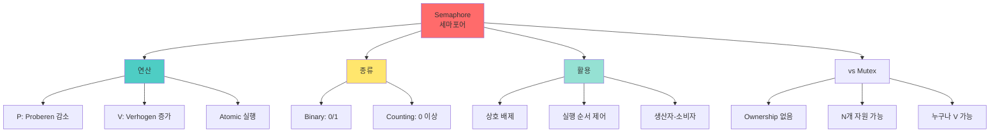

+++
title = "세마포어 P V 연산"
date = "2026-03-14"
weight = 701
+++

# 세마포어 P, V 연산

## 🎯 핵심 인사이트

세마포어(Semaphore)는 **정수형 변수와 P(Proberen)/V(Verhogen) 두 연산으로 구성된 동기화 도구**다. Dijkstra가 제안했으며, P는 감소(자원 요청), V는 증가(자원 반납)를 의미한다. Binary(0/1)와 Counting(0 이상) 두 가지 타입이 있다.

---

## Ⅰ. 세마포어의 정의

### 1-1. 기본 개념

```
┌─────────────────────────────────────────────────────────────────────┐
│                     Semaphore (세마포어)                            │
├─────────────────────────────────────────────────────────────────────┤
│                                                                     │
│  "정수 변수 + 두 개의 원자적 연산 (P, V)"                          │
│   - Edsger Dijkstra, 1965                                          │
│                                                                     │
│  ┌─────────────────────────────────────────────────────────────┐    │
│  │                                                             │    │
│  │  struct semaphore {                                         │    │
│  │      int value;           // 사용 가능한 자원 개수          │    │
│  │      queue wait_queue;    // 대기 중인 프로세스 큐          │    │
│  │  }                                                          │    │
│  │                                                             │    │
│  │  P(semaphore S):  // Proberen (시도/감소)                   │    │
│  │      S.value--;                                             │    │
│  │      if (S.value < 0) {                                     │    │
│  │          // 자원 없음 → Block                               │    │
│  │          add current process to S.wait_queue;               │    │
│  │          block();                                           │    │
│  │      }                                                      │    │
│  │                                                             │    │
│  │  V(semaphore S):  // Verhogen (증가)                        │    │
│  │      S.value++;                                             │    │
│  │      if (S.value <= 0) {                                    │    │
│  │          // 대기자 있음 → Wake up                           │    │
│  │          remove a process P from S.wait_queue;              │    │
│  │          wakeup(P);                                         │    │
│  │      }                                                      │    │
│  │                                                             │    │
│  └─────────────────────────────────────────────────────────────┘    │
│                                                                     │
│  네덜란드어: Proberen(시도), Verhogen(증가)                         │
│  대체 명칭: wait()/signal(), down()/up(), acquire()/release()      │
│                                                                     │
└─────────────────────────────────────────────────────────────────────┘
```

### 1-2. P, V 연산의 의미

```
┌─────────────────────────────────────────────────────────────────────┐
│                    P/V 연산 상세 분석                               │
├─────────────────────────────────────────────────────────────────────┤
│                                                                     │
│  P 연산 (Proberen / Wait / Down):                                  │
│  ┌─────────────────────────────────────────────────────────────┐    │
│  │                                                             │    │
│  │  "자원 하나 달라!"                                          │    │
│  │                                                             │    │
│  │  S.value = S.value - 1                                      │    │
│  │                                                             │    │
│  │  if S.value >= 0:                                           │    │
│  │      ✅ 자원 획득 성공! 진행 가능                           │    │
│  │                                                             │    │
│  │  if S.value < 0:                                            │    │
│  │      ❌ 자원 없음! 대기 큐로 이동 → Block                   │    │
│  │      |S.value| = 대기 중인 프로세스 개수                    │    │
│  │                                                             │    │
│  └─────────────────────────────────────────────────────────────┘    │
│                                                                     │
│  V 연산 (Verhogen / Signal / Up):                                  │
│  ┌─────────────────────────────────────────────────────────────┐    │
│  │                                                             │    │
│  │  "자원 하나 반납해요!"                                      │    │
│  │                                                             │    │
│  │  S.value = S.value + 1                                      │    │
│  │                                                             │    │
│  │  if S.value > 0:                                            │    │
│  │      ✅ 자원 여유 있음! 대기자 없음                         │    │
│  │                                                             │    │
│  │  if S.value <= 0:                                           │    │
│  │      ✅ 대기자 있음! 하나 깨우기 (Wake up)                  │    │
│  │                                                             │    │
│  └─────────────────────────────────────────────────────────────┘    │
│                                                                     │
└─────────────────────────────────────────────────────────────────────┘
```

> **📢 섹션 요약 비유**: 세마포어는 주차장 표시판과 같다. P는 "자리 하나 쓸게요"(남은 자리 -1), V는 "자리 하나 났어요"(남은 자리 +1). 자리가 없으면(-1 이하) 입구에서 대기해야 한다.

---

## Ⅱ. 세마포어의 종류

### 2-1. Binary Semaphore (이진 세마포어)

```
┌─────────────────────────────────────────────────────────────────────┐
│                  Binary Semaphore (이진 세마포어)                   │
├─────────────────────────────────────────────────────────────────────┤
│                                                                     │
│  "값이 0 또는 1만 가능 - Mutex와 유사"                             │
│                                                                     │
│  초기값: S.value = 1                                                │
│                                                                     │
│  ┌─────────────────────────────────────────────────────────────┐    │
│  │                                                             │    │
│  │  Process A                S.value               Process B   │    │
│  │  ┌──────┐                 ┌───┐                  ┌──────┐   │    │
│  │  │      │    P(S) ──────▶ │ 1 │ ──────▶ P(S)    │      │   │    │
│  │  │ CS   │                 ├───┤        (대기)   │ Wait │   │    │
│  │  │      │    V(S) ──────▶ │ 0 │                  │      │   │    │
│  │  └──────┘                 ├───┤ ◀───── V(S)     └──────┘   │    │
│  │                           │ 1 │ ← wake up!                   │    │
│  │                           └───┘                             │    │
│  │                                                             │    │
│  └─────────────────────────────────────────────────────────────┘    │
│                                                                     │
│  Binary Semaphore vs Mutex:                                        │
│  ┌──────────────┬─────────────────┬─────────────────┐              │
│  │    특성      │ Binary Semaphore│     Mutex       │              │
│  ├──────────────┼─────────────────┼─────────────────┤              │
│  │ Ownership    │ 없음            │ 있음            │              │
│  │ Unlock 가능  │ 누구나          │ Owner만         │              │
│  │ 용도         │ 동기화/신호     │ 상호 배제       │              │
│  │ 재귀 Lock    │ 불가            │ 가능(Recursive)│              │
│  └──────────────┴─────────────────┴─────────────────┘              │
│                                                                     │
└─────────────────────────────────────────────────────────────────────┘
```

### 2-2. Counting Semaphore (카운팅 세마포어)

```
┌─────────────────────────────────────────────────────────────────────┐
│               Counting Semaphore (카운팅 세마포어)                  │
├─────────────────────────────────────────────────────────────────────┤
│                                                                     │
│  "값이 0 이상 정수 - N개 자원 관리"                                │
│                                                                     │
│  예: 5개의 프린터 자원                                              │
│  초기값: S.value = 5                                                │
│                                                                     │
│  ┌─────────────────────────────────────────────────────────────┐    │
│  │                                                             │    │
│  │  P1: P(S) → value=4 → ✅ 프린터 1 사용                     │    │
│  │  P2: P(S) → value=3 → ✅ 프린터 2 사용                     │    │
│  │  P3: P(S) → value=2 → ✅ 프린터 3 사용                     │    │
│  │  P4: P(S) → value=1 → ✅ 프린터 4 사용                     │    │
│  │  P5: P(S) → value=0 → ✅ 프린터 5 사용                     │    │
│  │  P6: P(S) → value=-1 → ❌ 대기! (프린터 없음)              │    │
│  │  P7: P(S) → value=-2 → ❌ 대기!                            │    │
│  │                                                             │    │
│  │  P1: V(S) → value=-1 → Wake up P6!                         │    │
│  │  P6: 프린터 1 사용 시작                                     │    │
│  │                                                             │    │
│  └─────────────────────────────────────────────────────────────┘    │
│                                                                     │
│  value 해석:                                                        │
│  ┌──────────────────────────────────────────────────────────────┐   │
│  │  value > 0  : 사용 가능한 자원 개수                         │   │
│  │  value = 0  : 자원 전부 사용 중, 대기자 없음                │   │
│  │  value < 0  : |value|개의 프로세스가 대기 중                │   │
│  └──────────────────────────────────────────────────────────────┘   │
│                                                                     │
└─────────────────────────────────────────────────────────────────────┘
```

> **📢 섹션 요약 비유**: Counting Semaphore는 N개의 자전거 대여소와 같다. 초기값 N=10이면 10대까지 빌려갈 수 있다. 다 빌려가면(value=0) 대기해야 한다.

---

## Ⅲ. 세마포어의 활용

### 3-1. 상호 배제 (Mutual Exclusion)

```
┌─────────────────────────────────────────────────────────────────────┐
│               Semaphore for Mutual Exclusion                        │
├─────────────────────────────────────────────────────────────────────┤
│                                                                     │
│  semaphore mutex = 1;  // Binary Semaphore                         │
│                                                                     │
│  // Process i                                                       │
│  while (true) {                                                     │
│      P(mutex);           // Entry Section                          │
│      /* Critical Section */                                        │
│      V(mutex);           // Exit Section                           │
│      /* Remainder Section */                                       │
│  }                                                                  │
│                                                                     │
│  ════════════════════════════════════════════════════════════════  │
│                                                                     │
│  ┌──────────────────────────────────────────────────────────────┐   │
│  │  Time ──────────────────────────────────────────────────▶   │   │
│  │                                                             │   │
│  │  Process A: P(mutex)─[CS]─V(mutex)                          │   │
│  │                │          │                                 │   │
│  │                ▼          ▼                                 │   │
│  │  mutex:      1→0        0→1                                 │   │
│  │                                                             │   │
│  │  Process B:     P(mutex)─[Wait...]─[CS]─V(mutex)            │   │
│  │                   │              │                          │   │
│  │                   ▼              ▼                          │   │
│  │  mutex:          0 (wait)      0→1 (wakeup)                │   │
│  │                                                             │   │
│  └──────────────────────────────────────────────────────────────┘   │
│                                                                     │
└─────────────────────────────────────────────────────────────────────┘
```

### 3-2. 실행 순서 제어 (Ordering)

```
┌─────────────────────────────────────────────────────────────────────┐
│                Semaphore for Execution Ordering                     │
├─────────────────────────────────────────────────────────────────────┤
│                                                                     │
│  "Process B가 A보다 먼저 실행되어야 함"                            │
│                                                                     │
│  semaphore sync = 0;  // 초기값 0!                                 │
│                                                                     │
│  // Process A                    // Process B                      │
│  statement_A1;                  P(sync);  // 먼저 도착해도 대기!   │
│  V(sync);   // A 완료 알림       statement_B1;                      │
│  statement_A2;                                                     │
│                                                                     │
│  ┌──────────────────────────────────────────────────────────────┐   │
│  │                                                             │    │
│  │  Case 1: A가 먼저 실행                                      │    │
│  │  ────────────────────────────────────────────────────────   │    │
│  │  A: statement_A1 → V(sync) → statement_A2                   │    │
│  │  B: P(sync) [value=0→-1, 대기] ... [깨어남] → statement_B1  │    │
│  │                        ↑                                    │    │
│  │                   A의 V(sync)                               │    │
│  │                                                             │    │
│  │  Case 2: B가 먼저 실행                                      │    │
│  │  ────────────────────────────────────────────────────────   │    │
│  │  B: P(sync) [value=0→-1, 대기] ... [깨어남] → statement_B1  │    │
│  │  A: statement_A1 → V(sync) → statement_A2                   │    │
│  │             ↓                                               │    │
│  │        B를 깨움!                                             │    │
│  │                                                             │    │
│  │  항상 B가 A의 statement_A1 이후에 실행됨                    │    │
│  │                                                             │    │
│  └──────────────────────────────────────────────────────────────┘    │
│                                                                     │
└─────────────────────────────────────────────────────────────────────┘
```

### 3-3. 생산자-소비자 문제

```
┌─────────────────────────────────────────────────────────────────────┐
│              Producer-Consumer with Semaphores                      │
├─────────────────────────────────────────────────────────────────────┤
│                                                                     │
│  semaphore mutex = 1;    // 버퍼 접근 보호                         │
│  semaphore empty = N;    // 빈 슬롯 개수                           │
│  semaphore full = 0;     // 찬 슬롯 개수                           │
│                                                                     │
│  // Producer                       // Consumer                     │
│  while (true) {                    while (true) {                  │
│      produce(item);                    P(full);  // 찬 슬롯 대기   │
│      P(empty);  // 빈 슬롯 대기        P(mutex);                   │
│      P(mutex);                         item = buffer[out];         │
│      buffer[in] = item;               out = (out+1) % N;          │
│      in = (in+1) % N;                 V(mutex);                    │
│      V(mutex);                         V(empty);  // 빈 슬롯 증가  │
│      V(full);  // 찬 슬롯 증가         consume(item);              │
│  }                                  }                              │
│                                                                     │
│  ════════════════════════════════════════════════════════════════  │
│                                                                     │
│  상태 변화 (N=3인 버퍼):                                           │
│  ┌──────────────────────────────────────────────────────────────┐   │
│  │  초기: empty=3, full=0                                      │   │
│  │                                                             │   │
│  │  Producer P(empty) → empty=2, full=0                        │   │
│  │  Producer 아이템 추가                                       │   │
│  │  Producer V(full)  → empty=2, full=1                        │   │
│  │                                                             │   │
│  │  Consumer P(full)  → empty=2, full=0                        │   │
│  │  Consumer 아이템 제거                                       │   │
│  │  Consumer V(empty) → empty=3, full=0                        │   │
│  │                                                             │   │
│  │  empty + full = N (항상)                                    │   │
│  └──────────────────────────────────────────────────────────────┘   │
│                                                                     │
└─────────────────────────────────────────────────────────────────────┘
```

> **📢 섹션 요약 비유**: 생산자-소비자는 식당 주방과 홀과 같다. 주방(Producer)은 빈 그릇(empty)을 받아 요리하고 완성 그릇(full)을 내보낸다. 홀(Consumer)은 완성 그릇을 받아 손님에게 서빙하고 빈 그릇을 돌려보낸다.

---

## Ⅳ. POSIX 세마포어 API

### 4-1. Named Semaphore

```
┌─────────────────────────────────────────────────────────────────────┐
│                   POSIX Named Semaphore                             │
├─────────────────────────────────────────────────────────────────────┤
│                                                                     │
│  #include <fcntl.h>                                                │
│  #include <semaphore.h>                                            │
│                                                                     │
│  // 생성/열기                                                       │
│  sem_t *sem = sem_open("/mysem", O_CREAT, 0644, 1);                │
│  //                 이름    생성    권한  초기값                    │
│                                                                     │
│  // P 연산 (wait)                                                   │
│  sem_wait(sem);       // Block                                      │
│  sem_trywait(sem);    // Non-blocking                               │
│  sem_timedwait(sem, &timeout);  // Timeout                          │
│                                                                     │
│  // V 연산 (post)                                                   │
│  sem_post(sem);                                                     │
│                                                                     │
│  // 값 확인                                                          │
│  int val;                                                           │
│  sem_getvalue(sem, &val);                                          │
│                                                                     │
│  // 닫기/삭제                                                       │
│  sem_close(sem);                                                    │
│  sem_unlink("/mysem");                                             │
│                                                                     │
│  ════════════════════════════════════════════════════════════════  │
│                                                                     │
│  Named Semaphore 특징:                                              │
│  • 이름으로 식별 ("/name" 형식)                                    │
│  • 프로세스 간 공유 가능 (IPC)                                     │
│  • 파일 시스템에 존재 (일반적으로 /dev/shm)                        │
│  • sem_unlink로 삭제할 때까지 존속                                 │
│                                                                     │
└─────────────────────────────────────────────────────────────────────┘
```

### 4-2. Unnamed (Memory-based) Semaphore

```
┌─────────────────────────────────────────────────────────────────────┐
│                POSIX Unnamed Semaphore                              │
├─────────────────────────────────────────────────────────────────────┤
│                                                                     │
│  #include <semaphore.h>                                            │
│                                                                     │
│  sem_t sem;                                                         │
│                                                                     │
│  // 초기화                                                          │
│  sem_init(&sem, pshared, 1);                                       │
│  //          │   │                                                  │
│  //          │   └── 초기값                                         │
│  //          └── pshared: 0=스레드 간, 1=프로세스 간               │
│                                                                     │
│  // 사용 (Named와 동일)                                            │
│  sem_wait(&sem);                                                    │
│  /* Critical Section */                                            │
│  sem_post(&sem);                                                    │
│                                                                     │
│  // 정리                                                            │
│  sem_destroy(&sem);                                                 │
│                                                                     │
│  ════════════════════════════════════════════════════════════════  │
│                                                                     │
│  Unnamed Semaphore 특징:                                            │
│  • 메모리에 존재 (전역 변수 또는 공유 메모리)                      │
│  • pshared=0: 같은 프로세스의 스레드 간 공유                       │
│  • pshared=1: 공유 메모리를 통해 프로세스 간 공유                  │
│  • 프로세스/스레드 종료 시 사라짐                                  │
│                                                                     │
└─────────────────────────────────────────────────────────────────────┘
```

> **📢 섹션 요약 비유**: Named 세마포어는 공용 게시판에 이름 붙인 표지판이다. 누구든 이름으로 찾을 수 있다. Unnamed 세마포어는 우리 집 안의 표지판이다. 같은 집에 사는 사람만(같은 메모리) 볼 수 있다.

---

## Ⅴ. 세마포어 vs Mutex 비교

### 5-1. 상세 비교

```
┌─────────────────────────────────────────────────────────────────────┐
│                   Semaphore vs Mutex 비교                           │
├─────────────────────────────────────────────────────────────────────┤
│                                                                     │
│  ┌──────────────┬─────────────────┬─────────────────┐              │
│  │    특성      │    Semaphore    │     Mutex       │              │
│  ├──────────────┼─────────────────┼─────────────────┤              │
│  │ 값 범위      │ 정수 (음수 가능)│ 0 또는 1        │              │
│  │ 자원 관리    │ N개 자원 가능   │ 1개 자원만      │              │
│  │ Ownership    │ 없음            │ 있음            │              │
│  │ Unlock       │ 누구나 가능     │ Owner만 가능    │              │
│  │ 용도         │ 동기화 + 배제   │ 상호 배제       │              │
│  │ Signal 대기  │ 대기 큐 존재    │ 대기 큐 존재    │              │
│  │ 재귀 Lock    │ 불가            │ 가능            │              │
│  └──────────────┴─────────────────┴─────────────────┘              │
│                                                                     │
│  시나리오별 선택:                                                   │
│  ┌──────────────────────────────────────────────────────────────┐   │
│  │ 1. 상호 배제만 필요 → Mutex (Ownership로 안전)              │   │
│  │ 2. N개 자원 관리 → Counting Semaphore                       │   │
│  │ 3. 실행 순서 제어 → Semaphore (초기값 0)                    │   │
│  │ 4. 이벤트 신호 → Binary Semaphore                           │   │
│  │ 5. 생산자-소비자 → Semaphore 조합                           │   │
│  └──────────────────────────────────────────────────────────────┘   │
│                                                                     │
└─────────────────────────────────────────────────────────────────────┘
```

### 5-2. 시험 핵심 포인트

```
┌─────────────────────────────────────────────────────────────────────┐
│                     📝 시험 암기 포인트                             │
├─────────────────────────────────────────────────────────────────────┤
│                                                                     │
│  1. P, V 의미                                                       │
│     • P (Proberen): 시도, 감소, 자원 요청                          │
│     • V (Verhogen): 증가, 자원 반납                                │
│     • 네덜란드어에서 유래 (Dijkstra)                               │
│                                                                     │
│  2. Binary vs Counting                                              │
│     • Binary: 값 0/1, 상호 배제용                                  │
│     • Counting: 값 0 이상, N개 자원 관리                           │
│                                                                     │
│  3. value 해석                                                      │
│     • value > 0: 사용 가능 자원 수                                 │
│     • value < 0: |value|개 대기 중                                 │
│                                                                     │
│  4. Semaphore vs Mutex                                              │
│     • Semaphore: Ownership 없음, 누구나 V 가능                     │
│     • Mutex: Ownership 있음, Owner만 unlock                        │
│                                                                     │
│  5. 대표 문제                                                       │
│     • 생산자-소비자: empty, full, mutex                            │
│     • 식사하는 철학자: 포크 세마포어 5개                           │
│     • Readers-Writers: read_count, mutex, wrt                      │
│                                                                     │
└─────────────────────────────────────────────────────────────────────┘
```

> **📢 섹션 요약 비유**: 시험에서 P, V가 나오면 "빼기, 더하기"로 기억하라. P는 자원 하나 빼기(감소), V는 자원 하나 더하기(증가). 음수면 대기자가 있다는 뜻!

---

## 📊 개념 맵



---

## 👧 Child Analogy

세마포어는 **주차장 전광판**과 같아요!

```
┌─────────────────────────────────────────────────────────┐
│              🅿️ 주차장 전광판 🅿️                        │
├─────────────────────────────────────────────────────────┤
│                                                         │
│  [빈 자리: 5]  ← 이게 세마포어 값이에요!               │
│       │                                                 │
│       │  P 연산 (차 들어가기)                           │
│       │  ─────────────────                              │
│       ▼                                                 │
│  [빈 자리: 4]  ✅ 자리 있어서 들어감!                   │
│                                                         │
│       │  P 연산 (또 들어가기)                           │
│       │  ─────────────────                              │
│       ▼                                                 │
│  [빈 자리: 0]  ✅ 마지막 자리!                          │
│                                                         │
│       │  P 연산 (또 들어가려고?)                        │
│       │  ─────────────────                              │
│       ▼                                                 │
│  [빈 자리: -1] ❌ 대기! (1명 대기 중)                   │
│               입구에서 기다려요 😢                      │
│                                                         │
│       │  V 연산 (차 나가기)                             │
│       │  ─────────────────                              │
│       ▼                                                 │
│  [빈 자리: 0]  ✅ 기다리던 분 들어가세요!               │
│                                                         │
│  이렇게 P는 "빼기", V는 "더하기"예요!                   │
└─────────────────────────────────────────────────────────┘
```

컴퓨터에서도 세마포어로 자원(주차 자리)을 관리해요!