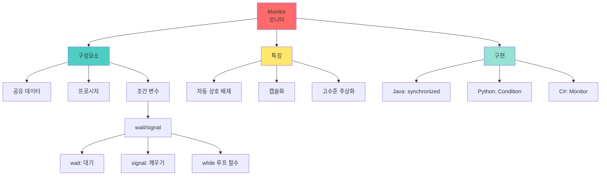

# 모니터 (Monitor) 동기화 추상화

## 🎯 핵심 인사이트

모니터는 **데이터와 연산을 캡슐화한 고수준 동기화 추상화**다. 내부적으로 Mutex와 Condition Variable을 사용하지만, 프로그래머는 모니터 진입/탈출만 신경 쓰면 된다. Java의 `synchronized`, Python의 `Condition`이 대표적 구현이다.

---

## Ⅰ. 모니터의 정의

### 1-1. 기본 개념

```
┌─────────────────────────────────────────────────────────────────────┐
│                     Monitor (모니터)                                │
├─────────────────────────────────────────────────────────────────────┤
│                                                                     │
│  "데이터 + 연산 + 동기화를 캡슐화한 고수준 동기화 메커니즘"        │
│   - C.A.R. Hoare & Per Brinch Hansen, 1974                         │
│                                                                     │
│  ┌─────────────────────────────────────────────────────────────┐    │
│  │                      MONITOR                                │    │
│  │  ┌─────────────────────────────────────────────────────┐   │    │
│  │  │  Private Data (공유 데이터)                          │   │    │
│  │  │  - variables                                         │   │    │
│  │  │  - condition variables                               │   │    │
│  │  └─────────────────────────────────────────────────────┘   │    │
│  │                      │                                     │    │
│  │  ┌───────────────────┴───────────────────────┐            │    │
│  │  │  Public Procedures (진입점)                │            │    │
│  │  │  - procedure1()                           │            │    │
│  │  │  - procedure2()                           │            │    │
│  │  │  - ...                                    │            │    │
│  │  └───────────────────────────────────────────┘            │    │
│  │                                                             │    │
│  │  Entry Queue: [P1] → [P2] → [P3]  (진입 대기)             │    │
│  │                                                             │    │
│  └─────────────────────────────────────────────────────────────┘    │
│         ▲                                           │              │
│         │ Only one at a time                        │              │
│         └───────────────────────────────────────────┘              │
│                                                                     │
│  특징:                                                              │
│  • 한 번에 하나의 프로세스만 모니터 내부 실행                      │
│  • 자동으로 Mutual Exclusion 보장                                  │
│  • Condition Variable로 세밀한 동기화 가능                         │
│                                                                     │
└─────────────────────────────────────────────────────────────────────┘
```

### 1-2. 세마포어 vs 모니터

```
┌─────────────────────────────────────────────────────────────────────┐
│                 Semaphore vs Monitor 비교                           │
├─────────────────────────────────────────────────────────────────────┤
│                                                                     │
│  Semaphore (저수준):                                               │
│  ┌──────────────────────────────────────────────────────────────┐   │
│  │  // 프로그래머가 직접 P/V 호출 순서 관리                     │   │
│  │  P(mutex);                                                    │   │
│  │  /* Critical Section */                                       │   │
│  │  if (condition) {                                             │   │
│  │      V(mutex);    // 잊으면 Deadlock!                         │   │
│  │      ...                                                      │   │
│  │  }                                                            │   │
│  │  V(mutex);        // 잊으면 Deadlock!                         │   │
│  │                                                             │   │
│  │  ❌ 실수 가능성 높음                                         │   │
│  └──────────────────────────────────────────────────────────────┘   │
│                                                                     │
│  Monitor (고수준):                                                 │
│  ┌──────────────────────────────────────────────────────────────┐   │
│  │  monitor Example {                                            │   │
│  │      // 데이터 (자동 보호됨)                                  │   │
│  │      int count = 0;                                           │   │
│  │      condition notFull, notEmpty;                            │   │
│  │                                                             │   │
│  │      // 프로시저 (자동 상호 배제)                             │   │
│  │      void add(item) {                                        │   │
│  │          if (count == N) wait(notFull);  // 자동 unlock      │   │
│  │          ...                                                 │   │
│  │          signal(notEmpty);  // 조건 충족 알림                │   │
│  │      }                                                       │   │
│  │  }                                                           │   │
│  │                                                             │   │
│  │  ✅ 실수 가능성 낮음, 구조적                                 │   │
│  └──────────────────────────────────────────────────────────────┘   │
│                                                                     │
└─────────────────────────────────────────────────────────────────────┘
```

> **📢 섹션 요약 비유**: 세마포어는 수동 변속 기어차다. P/V를 정확한 순서로 넣어야 한다. 모니터는 자동 변속차다. 운전자는 운전만 하면 되고, 기어는 자동으로 바뀐다.

---

## Ⅱ. Condition Variable

### 2-1. 정의와 연산

```
┌─────────────────────────────────────────────────────────────────────┐
│                  Condition Variable (조건 변수)                     │
├─────────────────────────────────────────────────────────────────────┤
│                                                                     │
│  "특정 조건이 만족될 때까지 대기하는 메커니즘"                     │
│                                                                     │
│  두 가지 연산:                                                      │
│  ┌─────────────────────────────────────────────────────────────┐    │
│  │                                                             │    │
│  │  wait(c):                                                   │    │
│  │  1. 모니터 Lock 해제                                        │    │
│  │  2. 조건 변수 c의 대기 큐에서 Block                         │    │
│  │  3. 깨어나면 Lock 재획득 후 리턴                            │    │
│  │                                                             │    │
│  │  signal(c) / notify(c):                                     │    │
│  │  1. 조건 변수 c의 대기 큐에서 하나를 깨움                   │    │
│  │  2. 깨어난 프로세스는 Lock 획득 후 계속                     │    │
│  │                                                             │    │
│  └─────────────────────────────────────────────────────────────┘    │
│                                                                     │
│  ┌─────────────────────────────────────────────────────────────┐    │
│  │                                                             │    │
│  │  Monitor Entry Queue    Condition Queue (c)                │    │
│  │  ┌───┐ ┌───┐           ┌───┐ ┌───┐ ┌───┐                  │    │
│  │  │ P1│ │ P2│           │ P3│ │ P4│ │ P5│                  │    │
│  │  └───┘ └───┘           └───┘ └───┘ └───┘                  │    │
│  │       │                      ▲                             │    │
│  │       ▼                      │                             │    │
│  │    [MONITOR] ────────────────┘                             │    │
│  │    실행 중인 P signal(c)                                   │    │
│  │                                                             │    │
│  └─────────────────────────────────────────────────────────────┘    │
│                                                                     │
└─────────────────────────────────────────────────────────────────────┘
```

### 2-2. Signal 후 동작 방식

```
┌─────────────────────────────────────────────────────────────────────┐
│               Signal Semantics (신호 의미론)                        │
├─────────────────────────────────────────────────────────────────────┤
│                                                                     │
│  signal(c) 호출 후 무슨 일이 일어나나?                             │
│                                                                     │
│  1. Hoare Semantics (Hoare 스타일):                                │
│  ┌──────────────────────────────────────────────────────────────┐   │
│  │  • signaler 즉시 정지, waiter 즉시 실행                      │   │
│  │  • waiter가 우선권                                           │   │
│  │  • 조건 검사 불필요 (while 대신 if 가능)                     │   │
│  │  • 구현 복잡, Context Switch 많음                            │   │
│  └──────────────────────────────────────────────────────────────┘   │
│                                                                     │
│  2. Mesa Semantics (Mesa 스타일) - 대부분 사용:                    │
│  ┌──────────────────────────────────────────────────────────────┐   │
│  │  • signaler 계속 실행, waiter는 Ready 상태로                │   │
│  │  • waiter는 나중에 Lock 획득 후 실행                         │   │
│  │  • 조건 재검사 필수 (while 루프 사용!)                       │   │
│  │  • 구현 단순, 실용적 (Java, Python 등)                       │   │
│  └──────────────────────────────────────────────────────────────┘   │
│                                                                     │
│  Mesa Semantics 예시:                                               │
│  ┌──────────────────────────────────────────────────────────────┐   │
│  │  // ❌ 잘못된 코드 (if 사용)                                 │   │
│  │  if (count == N) wait(notFull);  // 깨어난 후 재검사 안 함  │   │
│  │  buffer[in] = item;  // Race Condition 가능!                │   │
│  │                                                             │   │
│  │  // ✅ 올바른 코드 (while 사용)                              │   │
│  │  while (count == N) wait(notFull);  // 깨어난 후 재검사     │   │
│  │  buffer[in] = item;  // 안전!                               │   │
│  └──────────────────────────────────────────────────────────────┘   │
│                                                                     │
└─────────────────────────────────────────────────────────────────────┘
```

> **📢 섹션 요약 비유**: Hoare는 "자리 바꾸기"다. 신호 보내면 즉시 자리를 비켜준다. Mesa는 "알림 보내기"다. 신호를 보내고 나도 계속 일하고, 알림 받은 사람은 나중에 온다.

---

## Ⅲ. 모니터 구현 예시

### 3-1. 생산자-소비자 모니터

```
┌─────────────────────────────────────────────────────────────────────┐
│           Producer-Consumer Monitor (유사코드)                      │
├─────────────────────────────────────────────────────────────────────┤
│                                                                     │
│  monitor ProducerConsumer {                                        │
│      // 공유 데이터                                                 │
│      Item buffer[N];                                               │
│      int count = 0, in = 0, out = 0;                              │
│                                                                     │
│      // 조건 변수                                                   │
│      condition notFull;   // 버퍼가 가득 찼을 때 대기              │
│      condition notEmpty;  // 버퍼가 비었을 때 대기                 │
│                                                                     │
│      // 아이템 추가                                                 │
│      void insert(Item item) {                                      │
│          while (count == N)            // 버퍼 가득 참?            │
│              wait(notFull);            // 대기                     │
│          buffer[in] = item;                                        │
│          in = (in + 1) % N;                                        │
│          count++;                                                  │
│          signal(notEmpty);             // 소비자에게 알림          │
│      }                                                              │
│                                                                     │
│      // 아이템 제거                                                 │
│      Item remove() {                                               │
│          while (count == 0)             // 버퍼 비었음?             │
│              wait(notEmpty);           // 대기                     │
│          Item item = buffer[out];                                  │
│          out = (out + 1) % N;                                      │
│          count--;                                                  │
│          signal(notFull);              // 생산자에게 알림          │
│          return item;                                              │
│      }                                                              │
│  }                                                                  │
│                                                                     │
│  // 사용                                                            │
│  ProducerConsumer.insert(item);  // 자동으로 상호 배제!            │
│  item = ProducerConsumer.remove();                                  │
│                                                                     │
└─────────────────────────────────────────────────────────────────────┘
```

### 3-2. 식사하는 철학자 모니터

```
┌─────────────────────────────────────────────────────────────────────┐
│            Dining Philosophers Monitor (유사코드)                   │
├─────────────────────────────────────────────────────────────────────┤
│                                                                     │
│  monitor DiningPhilosophers {                                      │
│      enum { THINKING, HUNGRY, EATING } state[5];                   │
│      condition self[5];  // 각 철학자의 조건 변수                  │
│                                                                     │
│      void test(int i) {                                            │
│          // 양옆 철학자가 안 먹고 있으면 먹어도 됨                 │
│          if (state[(i+4)%5] != EATING &&                           │
│              state[i] == HUNGRY &&                                 │
│              state[(i+1)%5] != EATING) {                           │
│              state[i] = EATING;                                    │
│              signal(self[i]);                                      │
│          }                                                          │
│      }                                                              │
│                                                                     │
│      void take_forks(int i) {                                      │
│          state[i] = HUNGRY;                                        │
│          test(i);                      // 포크 집을 수 있나?       │
│          if (state[i] != EATING)       // 못 집었으면              │
│              wait(self[i]);            // 대기                     │
│      }                                                              │
│                                                                     │
│      void put_forks(int i) {                                       │
│          state[i] = THINKING;                                      │
│          test((i+4)%5);                // 왼쪽 철학자 확인         │
│          test((i+1)%5);                // 오른쪽 철학자 확인       │
│      }                                                              │
│  }                                                                  │
│                                                                     │
│  // 철학자 i의 행동                                                 │
│  while (true) {                                                     │
│      think();                                                       │
│      DiningPhilosophers.take_forks(i);                             │
│      eat();                                                         │
│      DiningPhilosophers.put_forks(i);                              │
│  }                                                                  │
│                                                                     │
└─────────────────────────────────────────────────────────────────────┘
```

> **📢 섹션 요약 비유**: 모니터의 식사하는 철학자 해결은 "중재자"가 있는 것이다. 중재자(모니터)가 "이제 먹어도 돼요"라고 할 때만 포크를 집는다. 이웃끼리 다툴 일이 없다.

---

## Ⅳ. 언어별 모니터 구현

### 4-1. Java synchronized

```
┌─────────────────────────────────────────────────────────────────────┐
│                    Java Monitor Implementation                      │
├─────────────────────────────────────────────────────────────────────┤
│                                                                     │
│  // 모든 Java 객체는 내부적으로 모니터를 가짐                      │
│  // synchronized 키워드로 진입/탈출 자동 관리                      │
│                                                                     │
│  public class BoundedBuffer<T> {                                   │
│      private final T[] buffer;                                     │
│      private int count = 0, in = 0, out = 0;                       │
│                                                                     │
│      public BoundedBuffer(int size) {                              │
│          buffer = (T[]) new Object[size];                          │
│      }                                                              │
│                                                                     │
│      // synchronized = 모니터 진입 (자동 Lock)                     │
│      public synchronized void put(T item) throws InterruptedException { │
│          while (count == buffer.length)                            │
│              wait();  // Condition Variable 대기                   │
│          buffer[in] = item;                                        │
│          in = (in + 1) % buffer.length;                           │
│          count++;                                                  │
│          notify();    // Condition Variable 신호                   │
│          // 메서드 종료 = 모니터 탈출 (자동 Unlock)               │
│      }                                                              │
│                                                                     │
│      public synchronized T take() throws InterruptedException {     │
│          while (count == 0)                                        │
│              wait();                                               │
│          T item = buffer[out];                                     │
│          out = (out + 1) % buffer.length;                         │
│          count--;                                                  │
│          notify();                                                 │
│          return item;                                              │
│      }                                                              │
│  }                                                                  │
│                                                                     │
│  // wait() = 모니터 Lock 해제 + Condition 대기                     │
│  // notify() = Condition에서 하나 깨우기                           │
│  // notifyAll() = Condition의 모든 대기자 깨우기                   │
│                                                                     │
└─────────────────────────────────────────────────────────────────────┘
```

### 4-2. Python threading.Condition

```
┌─────────────────────────────────────────────────────────────────────┐
│                  Python Monitor Pattern                             │
├─────────────────────────────────────────────────────────────────────┤
│                                                                     │
│  import threading                                                   │
│                                                                     │
│  class BoundedBuffer:                                               │
│      def __init__(self, size):                                     │
│          self.buffer = [None] * size                               │
│          self.size = size                                          │
│          self.count = 0                                            │
│          self.in_idx = 0                                           │
│          self.out_idx = 0                                          │
│          # Lock + Condition Variable                               │
│          self.lock = threading.Lock()                              │
│          self.not_full = threading.Condition(self.lock)            │
│          self.not_empty = threading.Condition(self.lock)           │
│                                                                     │
│      def put(self, item):                                          │
│          with self.lock:  # 모니터 진입                            │
│              while self.count == self.size:                        │
│                  self.not_full.wait()  # Condition 대기            │
│              self.buffer[self.in_idx] = item                       │
│              self.in_idx = (self.in_idx + 1) % self.size           │
│              self.count += 1                                       │
│              self.not_empty.notify()  # Condition 신호             │
│                                                                     │
│      def take(self):                                               │
│          with self.lock:  # 모니터 진입                            │
│              while self.count == 0:                                │
│                  self.not_empty.wait()                             │
│              item = self.buffer[self.out_idx]                      │
│              self.out_idx = (self.out_idx + 1) % self.size         │
│              self.count -= 1                                       │
│              self.not_full.notify()                                │
│              return item                                           │
│                                                                     │
└─────────────────────────────────────────────────────────────────────┘
```

> **📢 섹션 요약 비유**: Java의 synchronized는 "VIP룸" 입장권이다. 들어갈 때 자동으로 문이 잠기고, 나갈 때 자동으로 열린다. wait()는 "잠시 대기실로"이고, notify()는 "대기실에서 한 명 나오세요"다.

---

## Ⅴ. 시험 핵심 정리

### 5-1. 암기 포인트

```
┌─────────────────────────────────────────────────────────────────────┐
│                     📝 시험 암기 포인트                             │
├─────────────────────────────────────────────────────────────────────┤
│                                                                     │
│  1. 모니터 정의                                                     │
│     • 데이터 + 연산 + 동기화 캡슐화                                │
│     • 자동으로 Mutual Exclusion 보장                               │
│     • Hoare & Hansen이 제안 (1974)                                 │
│                                                                     │
│  2. Condition Variable                                              │
│     • wait(): Lock 해제 + 대기                                     │
│     • signal()/notify(): 대기자 하나 깨우기                        │
│     • Mesa 방식: while 루프로 조건 재검사 필수                     │
│                                                                     │
│  3. 세마포어 vs 모니터                                              │
│     • 세마포어: 저수준, P/V 직접 관리                              │
│     • 모니터: 고수준, 자동 Lock/Unlock                             │
│                                                                     │
│  4. 대표 구현                                                       │
│     • Java: synchronized, wait(), notify()                         │
│     • Python: threading.Condition                                  │
│     • C#: lock, Monitor.Wait(), Monitor.Pulse()                    │
│                                                                     │
│  5. 해결 가능한 문제                                                │
│     • 생산자-소비자                                                 │
│     • 식사하는 철학자                                               │
│     • Readers-Writers                                               │
│                                                                     │
└─────────────────────────────────────────────────────────────────────┘
```

> **📢 섹션 요약 비유**: 모니터는 "자동문"이 달린 방이다. 들어가면 자동으로 잠기고, 나오면 자동으로 열린다. 세마포어는 수동문이다. P로 잠그고 V로 풀어야 한다. 깜빡하면 큰일 난다!

---

## 📊 개념 맵



---

## 👧 Child Analogy

모니터는 **은행 창구**와 같아요!

```
┌─────────────────────────────────────────────────────────┐
│              🏦 은행 창구 시스템 🏦                      │
├─────────────────────────────────────────────────────────┤
│                                                         │
│  대기표 뽑는 곳 (Entry Queue)                           │
│  ┌───┐ ┌───┐ ┌───┐                                     │
│  │ 1 │ │ 2 │ │ 3 │  ...                                │
│  └───┘ └───┘ └───┘                                     │
│     │                                                   │
│     ▼                                                   │
│  ┌─────────────────────────────────────────┐           │
│  │         🏧 은행 창구 (MONITOR) 🏧        │           │
│  │                                         │           │
│  │  [한 명만 들어갈 수 있어요!]            │           │
│  │                                         │           │
│  │  창구 안에 있는 사람만                  │           │
│  │  데이터(계좌 정보)를 볼 수 있어요!      │           │
│  │                                         │           │
│  │  조건 변수 (Condition Variable):       │           │
│  │  • "서류 준비되면 불러드려요" (wait)    │           │
│  │  • "손님, 준비됐습니다!" (notify)       │           │
│  │                                         │           │
│  └─────────────────────────────────────────┘           │
│     │                                                   │
│     ▼                                                   │
│  일 다 봤으면 나오세요!                                 │
│  (자동으로 다음 사람 호출!)                             │
│                                                         │
│  이게 바로 모니터예요!                                  │
│  한 명씩만 들어가고, 자동으로 관리돼요!                 │
└─────────────────────────────────────────────────────────┘
```

컴퓨터에서도 모니터로 프로그램들이 한 번에 하나씩만 데이터에 접근하게 해요!
