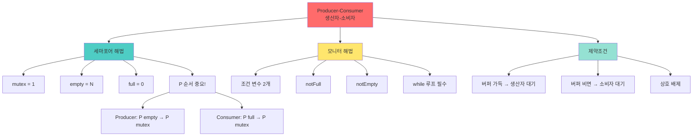

+++
title = "생산자 소비자 유한 버퍼"
date = "2026-03-14"
weight = 703
+++

# 생산자 소비자 유한 버퍼

## 🎯 핵심 인사이트

생산자-소비자 문제는 **생산자가 데이터를 생성하고 소비자가 처리하는 전형적인 동기화 문제**다. 유한 버퍼(Bounded Buffer)를 사용할 때, 버퍼가 가득 차면 생산자가 대기하고, 버퍼가 비면 소비자가 대기해야 한다.

---

## Ⅰ. 문제 정의

### 1-1. 시나리오

```
┌─────────────────────────────────────────────────────────────────────┐
│              Producer-Consumer Problem (생산자-소비자 문제)         │
├─────────────────────────────────────────────────────────────────────┤
│                                                                     │
│  생산자 (Producer): 데이터 생성 → 버퍼에 추가                      │
│  소비자 (Consumer): 버퍼에서 데이터 꺼내기 → 처리                  │
│                                                                     │
│  ┌─────────────────────────────────────────────────────────────┐    │
│  │                                                             │    │
│  │  Producer 1 ──┐                                             │    │
│  │  Producer 2 ──┼──▶ ┌───────────────────┐ ──▶ Consumer 1    │    │
│  │  Producer 3 ──┘    │  Bounded Buffer   │     Consumer 2    │    │
│  │                     │   [ ][ ][ ][ ]   │     Consumer 3    │    │
│  │                     │   N개 슬롯        │                   │    │
│  │                     └───────────────────┘                   │    │
│  │                                                             │    │
│  └─────────────────────────────────────────────────────────────┘    │
│                                                                     │
│  제약 조건:                                                         │
│  1. 버퍼 크기 유한 (N개 슬롯)                                      │
│  2. 동시 접근 금지 (상호 배제)                                     │
│  3. 버퍼 가득 참 → 생산자 대기                                     │
│  4. 버퍼 비어 있음 → 소비자 대기                                   │
│                                                                     │
└─────────────────────────────────────────────────────────────────────┘
```

### 1-2. 문제 상황

```
┌─────────────────────────────────────────────────────────────────────┐
│                     동기화 없이 발생하는 문제                       │
├─────────────────────────────────────────────────────────────────────┤
│                                                                     │
│  1. Race Condition (버퍼 인덱스 오류)                              │
│  ┌──────────────────────────────────────────────────────────────┐   │
│  │  Producer A: in = 3 → item 저장 → in = 4                    │   │
│  │  Producer B: in = 3 → item 저장 → in = 4  (A과 충돌!)       │   │
│  │                                                             │   │
│  │  ❌ 같은 위치에 두 번 저장, in이 4로 두 번 증가              │   │
│  └──────────────────────────────────────────────────────────────┘   │
│                                                                     │
│  2. Buffer Overflow (버퍼 초과)                                    │
│  ┌──────────────────────────────────────────────────────────────┐   │
│  │  Buffer: [■][■][■][■] (가득 참)                             │   │
│  │  Producer: 그냥 추가! → [■][■][■][■][■?]                    │   │
│  │                                                             │   │
│  │  ❌ 버퍼 크기 초과, 데이터 손실                             │   │
│  └──────────────────────────────────────────────────────────────┘   │
│                                                                     │
│  3. Buffer Underflow (빈 버퍼 읽기)                                │
│  ┌──────────────────────────────────────────────────────────────┐   │
│  │  Buffer: [ ][ ][ ][ ] (비어 있음)                           │   │
│  │  Consumer: 그냥 꺼내기! → 쓰레기 데이터 반환                │   │
│  │                                                             │   │
│  │  ❌ 없는 데이터를 읽음, 프로그램 오류                       │   │
│  └──────────────────────────────────────────────────────────────┘   │
│                                                                     │
└─────────────────────────────────────────────────────────────────────┘
```

> **📢 섹션 요약 비유**: 생산자-소비자는 식당 주방과 홀의 관계다. 주방(생산자)에서 요리를 만들고, 홀(소비자)에서 손님에게 서빙한다. 찬장(버퍼)이 꽉 차면 주방은 멈추고, 비면 홀은 기다린다.

---

## Ⅱ. 세마포어를 이용한 해결

### 2-1. 세 개의 세마포어

```
┌─────────────────────────────────────────────────────────────────────┐
│               Semaphore Solution (세마포어 해법)                    │
├─────────────────────────────────────────────────────────────────────┤
│                                                                     │
│  semaphore mutex = 1;    // 버퍼 접근 보호 (Binary)                │
│  semaphore empty = N;    // 빈 슬롯 개수 (Counting)                │
│  semaphore full = 0;     // 찬 슬롯 개수 (Counting)                │
│                                                                     │
│  // Buffer 초기 상태 (N = 5)                                       │
│  // [ ][ ][ ][ ][ ]  empty=5, full=0                               │
│                                                                     │
│  Producer:                       Consumer:                         │
│  ┌─────────────────────────┐    ┌─────────────────────────┐        │
│  │ while(true) {           │    │ while(true) {           │        │
│  │   item = produce();     │    │   P(full);  // 꽉 찬 것 │        │
│  │   P(empty); // 빈 것 대기│   │   P(mutex); // Lock     │        │
│  │   P(mutex); // Lock     │    │   item = buffer[out];   │        │
│  │   buffer[in] = item;    │    │   out = (out+1) % N;    │        │
│  │   in = (in+1) % N;      │    │   V(mutex); // Unlock   │        │
│  │   V(mutex); // Unlock   │    │   V(empty); // 빈 것++  │        │
│  │   V(full);  // 꽉 찬 것++│   │   consume(item);        │        │
│  │ }                       │    │ }                       │        │
│  └─────────────────────────┘    └─────────────────────────┘        │
│                                                                     │
│  ⚠️ 중요: Producer에서 P(empty)가 P(mutex)보다 먼저!               │
│          Consumer에서 P(full)가 P(mutex)보다 먼저!                 │
│          → 순서가 바뀌면 Deadlock 발생 가능                        │
│                                                                     │
└─────────────────────────────────────────────────────────────────────┘
```

### 2-2. 실행 시나리오

```
┌─────────────────────────────────────────────────────────────────────┐
│                    실행 예시 (N = 3)                                │
├─────────────────────────────────────────────────────────────────────┤
│                                                                     │
│  초기: mutex=1, empty=3, full=0, buffer=[ ][ ][ ]                  │
│                                                                     │
│  Time ─────────────────────────────────────────────────────────▶   │
│                                                                     │
│  P1: P(empty)→empty=2 → P(mutex)→mutex=0 → [A저장] → V(mutex)→    │
│      mutex=1 → V(full)→full=1                                      │
│      Buffer: [A][ ][ ]                                             │
│                                                                     │
│  P2: P(empty)→empty=1 → P(mutex)→mutex=0 → [B저장] → V(mutex)→    │
│      mutex=1 → V(full)→full=2                                      │
│      Buffer: [A][B][ ]                                             │
│                                                                     │
│  C1: P(full)→full=1 → P(mutex)→mutex=0 → [A꺼냄] → V(mutex)→      │
│      mutex=1 → V(empty)→empty=2                                    │
│      Buffer: [ ][B][ ]                                             │
│                                                                     │
│  P3: P(empty)→empty=1 → P(mutex)→mutex=0 → [C저장] → ...          │
│      Buffer: [C][B][ ]                                             │
│                                                                     │
│  P4: P(empty)→empty=0 → P(mutex)→mutex=0 → [D저장] → ...          │
│      Buffer: [C][B][D]  (가득 참)                                  │
│                                                                     │
│  P5: P(empty)→empty=-1 → Block! (대기)                             │
│      Buffer: [C][B][D]                                             │
│                                                                     │
│  C2: P(full)→full=2 → ... → [C꺼냄] → V(empty)→empty=0            │
│      Buffer: [ ][B][D]                                             │
│      P5 깨어남! → P(mutex) → [E저장] → ...                         │
│      Buffer: [E][B][D]                                             │
│                                                                     │
└─────────────────────────────────────────────────────────────────────┘
```

> **📢 섹션 요약 비유**: 세마포어 방식은 주차장 출입구의 두 직원과 같다. 한 직원(empty)은 "빈 자리 있어요?", 다른 직원(full)은 "차가 있어요?"를 관리한다. 세 번째 직원(mutex)은 주차장 내부를 지킨다.

---

## Ⅲ. 모니터를 이용한 해결

### 3-1. 모니터 구현

```
┌─────────────────────────────────────────────────────────────────────┐
│                  Monitor Solution (모니터 해법)                     │
├─────────────────────────────────────────────────────────────────────┤
│                                                                     │
│  monitor BoundedBuffer {                                           │
│      // 공유 데이터                                                 │
│      Item buffer[N];                                               │
│      int count = 0;                                                │
│      int in = 0, out = 0;                                          │
│                                                                     │
│      // 조건 변수                                                   │
│      condition notFull;   // 버퍼 가득 찼을 때 대기                │
│      condition notEmpty;  // 버퍼 비었을 때 대기                   │
│                                                                     │
│      void insert(Item item) {                                      │
│          // 모니터 진입 (자동 Lock)                                │
│          while (count == N)        // 가득 찼으면                  │
│              wait(notFull);        // 대기 (Lock 자동 해제)        │
│          buffer[in] = item;                                        │
│          in = (in + 1) % N;                                        │
│          count++;                                                  │
│          signal(notEmpty);         // 소비자 깨우기                │
│          // 모니터 탈출 (자동 Unlock)                              │
│      }                                                              │
│                                                                     │
│      Item remove() {                                               │
│          // 모니터 진입 (자동 Lock)                                │
│          while (count == 0)        // 비었으면                     │
│              wait(notEmpty);       // 대기                         │
│          Item item = buffer[out];                                  │
│          out = (out + 1) % N;                                      │
│          count--;                                                  │
│          signal(notFull);          // 생산자 깨우기                │
│          return item;                                              │
│          // 모니터 탈출 (자동 Unlock)                              │
│      }                                                              │
│  }                                                                  │
│                                                                     │
└─────────────────────────────────────────────────────────────────────┘
```

### 3-2. 세마포어 vs 모니터 비교

```
┌─────────────────────────────────────────────────────────────────────┐
│            Semaphore vs Monitor for Producer-Consumer               │
├─────────────────────────────────────────────────────────────────────┤
│                                                                     │
│  ┌──────────────┬─────────────────┬─────────────────┐              │
│  │    측면      │    Semaphore    │     Monitor     │              │
│  ├──────────────┼─────────────────┼─────────────────┤              │
│  │ 코드 복잡도  │ 높음 (P/V 직접) │ 낮음 (자동)     │              │
│  │ 실수 가능성  │ 높음            │ 낮음            │              │
│  │ P/V 순서     │ 중요 (Deadlock) │ 신경 안 써도 됨 │              │
│  │ 추상화 수준  │ 저수준          │ 고수준          │              │
│  │ 언어 지원    │ POSIX, System V │ Java, C# 등     │              │
│  └──────────────┴─────────────────┴─────────────────┘              │
│                                                                     │
│  세마포어 실수 예시:                                                │
│  ┌──────────────────────────────────────────────────────────────┐   │
│  │  // ❌ Wrong Order - Deadlock!                               │   │
│  │  P(mutex);   // Lock 먼저                                    │   │
│  │  P(empty);   // empty가 0이면? mutex를 가진 채 대기!         │   │
│  │  // Consumer도 mutex를 기다림 → 서로 기다림 → Deadlock!      │   │
│  │                                                             │   │
│  │  // ✅ Correct Order                                         │   │
│  │  P(empty);   // 먼저 자원 확인                               │   │
│  │  P(mutex);   // 그 다음 Lock                                 │   │
│  └──────────────────────────────────────────────────────────────┘   │
│                                                                     │
└─────────────────────────────────────────────────────────────────────┘
```

> **📢 섹션 요약 비유**: 세마포어는 수동 키보드, 모니터는 자동 완성 기능이다. 세마포어는 P/V를 직접 써야 하지만, 모니터는 wait/signal만 하면 나머지는 자동이다.

---

## Ⅳ. 변형 문제들

### 4-1. 무한 버퍼 (Unbounded Buffer)

```
┌─────────────────────────────────────────────────────────────────────┐
│              Unbounded Buffer Solution                              │
├─────────────────────────────────────────────────────────────────────┤
│                                                                     │
│  "버퍼 크기 제한 없음 - 생산자는 항상 진행 가능"                   │
│                                                                     │
│  semaphore mutex = 1;    // 상호 배제                               │
│  semaphore full = 0;     // 찬 슬롯 개수                           │
│  // empty 필요 없음!                                               │
│                                                                     │
│  Producer:                       Consumer:                         │
│  while(true) {                   while(true) {                     │
│      item = produce();               P(full);                      │
│      P(mutex);                       P(mutex);                     │
│      // 리스트에 추가 (무한)         item = buffer.remove();       │
│      buffer.add(item);               V(mutex);                     │
│      V(mutex);                       consume(item);                │
│      V(full);                                                     │
│  }                               }                                 │
│                                                                     │
│  특징:                                                              │
│  • 생산자는 절대 대기 안 함                                        │
│  • 소비자만 대기 가능                                              │
│  • 메모리 무제한 필요 → 실제로는 드묾                             │
│                                                                     │
└─────────────────────────────────────────────────────────────────────┘
```

### 4-2. 다중 생산자/소비자

```
┌─────────────────────────────────────────────────────────────────────┐
│            Multiple Producers and Consumers                         │
├─────────────────────────────────────────────────────────────────────┤
│                                                                     │
│  "여러 생산자와 여러 소비자가 동시에 작동"                         │
│                                                                     │
│  semaphore mutex = 1;                                              │
│  semaphore empty = N;                                              │
│  semaphore full = 0;                                               │
│                                                                     │
│  // 같은 코드가 여러 스레드에서 실행                               │
│  Producer_i:                     Consumer_j:                       │
│  while(true) {                   while(true) {                     │
│      item = produce();               P(full);                      │
│      P(empty);                       P(mutex);                     │
│      P(mutex);                       item = buffer[out];           │
│      buffer[in] = item;             out = (out+1) % N;            │
│      in = (in+1) % N;               V(mutex);                      │
│      V(mutex);                       V(empty);                      │
│      V(full);                       consume(item);                 │
│  }                               }                                 │
│                                                                     │
│  주의: in, out 변수도 보호됨 (mutex 내부)                          │
│        각 생산자/소비자는 독립적으로 실행                          │
│                                                                     │
└─────────────────────────────────────────────────────────────────────┘
```

### 4-3. 생산자-소비자 with 우선순위

```
┌─────────────────────────────────────────────────────────────────────┐
│            Priority Producer-Consumer                               │
├─────────────────────────────────────────────────────────────────────┤
│                                                                     │
│  "긴급 생산자가 일반 생산자보다 우선"                              │
│                                                                     │
│  semaphore mutex = 1;                                              │
│  semaphore empty = N;                                              │
│  semaphore full = 0;                                               │
│  semaphore urgent_empty = N;  // 긴급용 추가                       │
│                                                                     │
│  Urgent Producer:                Normal Producer:                   │
│  P(urgent_empty);                P(empty);                          │
│  P(empty);                       P(mutex);                          │
│  P(mutex);                       ...                                │
│  ...                                                                │
│                                                                     │
│  Consumer:                                                          │
│  P(full);                                                           │
│  P(mutex);                                                          │
│  ...                                                                │
│  V(empty);                                                          │
│  V(urgent_empty);  // 둘 다 해제                                   │
│                                                                     │
└─────────────────────────────────────────────────────────────────────┘
```

> **📢 섹션 요약 비유**: 다중 생산자/소비자는 공장의 여러 조립 라인과 여러 포장 라인이다. 여러 곳에서 동시에 물건이 만들어지고 여러 곳에서 동시에 포장된다.

---

## Ⅴ. 시험 핵심 정리

### 5-1. 암기 포인트

```
┌─────────────────────────────────────────────────────────────────────┐
│                     📝 시험 암기 포인트                             │
├─────────────────────────────────────────────────────────────────────┤
│                                                                     │
│  1. 세 개의 세마포어                                                │
│     • mutex = 1: 상호 배제                                         │
│     • empty = N: 빈 슬롯 개수                                      │
│     • full = 0: 찬 슬롯 개수                                       │
│                                                                     │
│  2. P 연산 순서 (Deadlock 방지)                                    │
│     • Producer: P(empty) → P(mutex)                                │
│     • Consumer: P(full) → P(mutex)                                 │
│     ⚠️ 반드시 자원 세마포어를 먼저!                               │
│                                                                     │
│  3. V 연산 순서                                                     │
│     • 순서 상관없음 (자원 반납만 하면 됨)                          │
│                                                                     │
│  4. 모니터에서의 while 루프                                        │
│     • while (count == N) wait(notFull);                            │
│     • Mesa semantics 때문에 재검사 필수                            │
│                                                                     │
│  5. in/out 인덱스                                                   │
│     • in = (in + 1) % N  (원형 버퍼)                               │
│     • out = (out + 1) % N                                          │
│                                                                     │
│  6. 불변식                                                          │
│     • empty + full = N (항상)                                      │
│     • count = full (항상)                                          │
│                                                                     │
└─────────────────────────────────────────────────────────────────────┘
```

> **📢 섹션 요약 비유**: 시험에서 생산자-소비자가 나오면 "식당 찬장"을 떠올려라. 찬장(버퍼)이 꽉 차면 요리사(생산자)가 대기하고, 비면 서빙(소비자)이 대기한다. 세마포어 3개가 찬장의 관리자들이다.

---

## 📊 개념 맵



---

## 👧 Child Analogy

생산자-소비자 문제는 **피자 가게**와 같아요!

```
┌─────────────────────────────────────────────────────────┐
│              🍕 피자 가게 시스템 🍕                      │
├─────────────────────────────────────────────────────────┤
│                                                         │
│  요리사 (Producer)                                      │
│     │                                                   │
│     │ 피자 만들기                                       │
│     ▼                                                   │
│  ┌─────────────────────────────────────────┐           │
│  │           보관함 (Buffer) 📦            │           │
│  │                                         │           │
│  │   [🍕][🍕][ ][ ][ ]  5칸 중 2칸 사용   │           │
│  │                                         │           │
│  │   empty = 3 (빈 칸)                     │           │
│  │   full = 2 (찬 칸)                      │           │
│  └─────────────────────────────────────────┘           │
│     │                                                   │
│     │ 피자 꺼내기                                       │
│     ▼                                                   │
│  배달원 (Consumer)                                      │
│                                                         │
│  규칙:                                                  │
│  1. 보관함이 꽉 차면 요리사 대기! 😴                   │
│  2. 보관함이 비면 배달원 대기! 😴                       │
│  3. 한 번에 한 명만 보관함 열기! 🔒                     │
│                                                         │
│  이게 바로 생산자-소비자 문제예요!                      │
└─────────────────────────────────────────────────────────┘
```

컴퓨터에서도 데이터를 만드는 프로그램과 쓰는 프로그램이 보관함을 공유할 때, 이 규칙들을 지켜요!