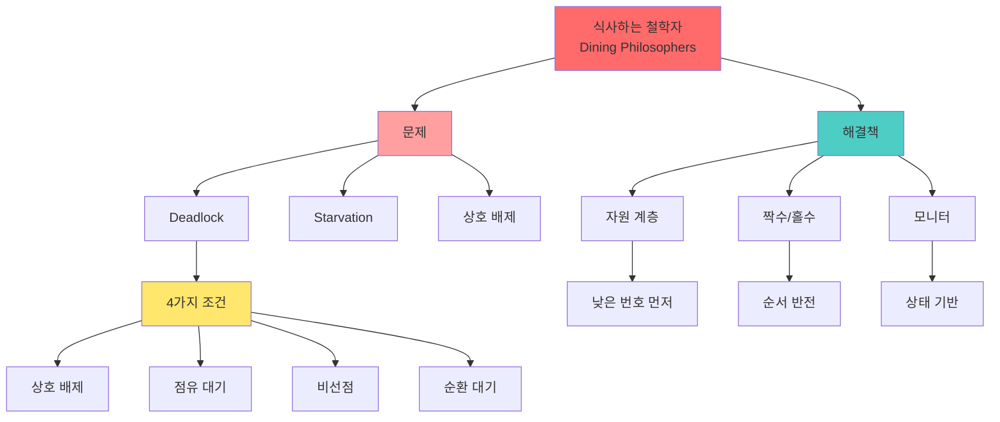

+++
title = "식사하는 철학자 교착 문제"
date = "2026-03-14"
weight = 704
+++

# 식사하는 철학자 교착 문제

## 🎯 핵심 인사이트

식사하는 철학자 문제는 **N명의 철학자가 N개의 포크를 공유하며 식사하는 동기화 문제**다. 각 철학자는 양옆의 두 포크를 모두 집어야 식사할 수 있어, **교착 상태(Deadlock)와 기아(Starvation)** 발생 가능성이 핵심 이슈다.

---

## Ⅰ. 문제 정의

### 1-1. 시나리오

```
┌─────────────────────────────────────────────────────────────────────┐
│          Dining Philosophers Problem (식사하는 철학자 문제)         │
├─────────────────────────────────────────────────────────────────────┤
│                                                                     │
│  "Edsger Dijkstra, 1965 - 동기화 문제의 고전"                      │
│                                                                     │
│  설정:                                                              │
│  • 5명의 철학자가 원형 테이블에 앉음                               │
│  • 5개의 포크가 철학자 사이사이에 놓임                             │
│  • 스파게티를 먹으려면 양옆의 포크 2개 필요                        │
│  • 먹지 않을 때는 생각함 (Thinking)                                │
│                                                                     │
│  ┌─────────────────────────────────────────────────────────────┐    │
│  │                                                             │    │
│  │                        Fork 2                               │    │
│  │                          🍴                                 │    │
│  │                       /     \                               │    │
│  │                  P1 /         \ P2                         │    │
│  │                   /    식사    \                            │    │
│  │             Fork 1              Fork 3                     │    │
│  │               🍴                 🍴                         │    │
│  │              /                   \                          │    │
│  │         P5 /                      \ P3                      │    │
│  │           \                      /                          │    │
│  │            \                    /                           │    │
│  │       Fork 5 \                / Fork 4                     │    │
│  │            🍴\              /🍴                             │    │
│  │                \          /                                 │    │
│  │                 \        /                                  │    │
│  │                  P4 생각                                    │    │
│  │                                                             │    │
│  └─────────────────────────────────────────────────────────────┘    │
│                                                                     │
│  각 철학자 i의 행동:                                               │
│  while(true) {                                                      │
│      think();            // 생각                                    │
│      take_fork(i);       // 왼쪽 포크 집기                         │
│      take_fork((i+1)%5); // 오른쪽 포크 집기                       │
│      eat();              // 식사                                    │
│      put_fork(i);        // 왼쪽 포크 내려놓기                     │
│      put_fork((i+1)%5);  // 오른쪽 포크 내려놓기                   │
│  }                                                                  │
│                                                                     │
└─────────────────────────────────────────────────────────────────────┘
```

### 1-2. 문제의 본질

```
┌─────────────────────────────────────────────────────────────────────┐
│                    문제의 본질과 요구사항                           │
├─────────────────────────────────────────────────────────────────────┤
│                                                                     │
│  핵심 문제:                                                         │
│  ┌──────────────────────────────────────────────────────────────┐   │
│  │  1. 상호 배제: 포크는 한 번에 한 명만 사용                   │   │
│  │  2. 교착 상태: 모두가 왼쪽 포크만 집으면?                    │   │
│  │  3. 기아 상태: 특정 철학자가 계속 못 먹으면?                 │   │
│  └──────────────────────────────────────────────────────────────┘   │
│                                                                     │
│  Deadlock 시나리오:                                                 │
│  ┌──────────────────────────────────────────────────────────────┐   │
│  │                                                             │    │
│  │  모든 철학자가 동시에 왼쪽 포크를 집음!                      │    │
│  │                                                             │    │
│  │  P0: 왼쪽 포크(Fork 0) 집음 ✓ → 오른쪽 포크(Fork 1) 대기    │    │
│  │  P1: 왼쪽 포크(Fork 1) 집음 ✓ → 오른쪽 포크(Fork 2) 대기    │    │
│  │  P2: 왼쪽 포크(Fork 2) 집음 ✓ → 오른쪽 포크(Fork 3) 대기    │    │
│  │  P3: 왼쪽 포크(Fork 3) 집음 ✓ → 오른쪽 포크(Fork 4) 대기    │    │
│  │  P4: 왼쪽 포크(Fork 4) 집음 ✓ → 오른쪽 포크(Fork 0) 대기    │    │
│  │                                                             │    │
│  │  💀 모두가 서로의 포크를 기다림 → 아무도 못 먹음!            │    │
│  │                                                             │    │
│  └──────────────────────────────────────────────────────────────┘   │
│                                                                     │
│  Deadlock 4가지 조건 (Coffman) 모두 만족:                          │
│  1. 상호 배제: 포크은 한 명만 사용                                 │
│  2. 점유 대기: 포크 1개를 들고 다른 1개 대기                       │
│  3. 비선점: 남의 포크을 뺏을 수 없음                               │
│  4. 순환 대기: P0→P1→P2→P3→P4→P0 대기                             │
│                                                                     │
└─────────────────────────────────────────────────────────────────────┘
```

> **📢 섹션 요약 비유**: 식사하는 철학자 문제는 5명이 식탁에 앉아 5개의 젓가락을 공유하는 것이다. 양손에 젓가락이 있어야 밥을 먹는데, 모두가 왼쪽 젓가락만 집으면 아무도 밥을 못 먹는다!

---

## Ⅱ. 세마포어를 이용한 해법

### 2-1. 단순 세마포어 (Deadlock 발생!)

```
┌─────────────────────────────────────────────────────────────────────┐
│              Naive Semaphore Solution (Deadlock!)                   │
├─────────────────────────────────────────────────────────────────────┤
│                                                                     │
│  semaphore fork[5] = {1, 1, 1, 1, 1};  // 각 포크 = 세마포어       │
│                                                                     │
│  void philosopher(int i) {                                         │
│      while(true) {                                                  │
│          think();                                                   │
│          P(fork[i]);           // 왼쪽 포크 집기                   │
│          P(fork[(i+1)%5]);     // 오른쪽 포크 집기                 │
│          eat();                                                     │
│          V(fork[i]);           // 왼쪽 포크 내려놓기               │
│          V(fork[(i+1)%5]);     // 오른쪽 포크 내려놓기             │
│      }                                                              │
│  }                                                                  │
│                                                                     │
│  ⚠️ Deadlock 발생!                                                 │
│  • 모든 철학자가 동시에 P(fork[i])를 실행                          │
│  • 각자 왼쪽 포크을 집고 오른쪽을 기다림                           │
│  • 서로가 서로의 포크을 기다림 → 영원히 대기                       │
│                                                                     │
└─────────────────────────────────────────────────────────────────────┘
```

### 2-2. 해결책 1: 자원 계층 (Resource Hierarchy)

```
┌─────────────────────────────────────────────────────────────────────┐
│               Resource Hierarchy Solution                           │
├─────────────────────────────────────────────────────────────────────┤
│                                                                     │
│  "포크에 번호를 매기고, 항상 낮은 번호부터 집기"                   │
│                                                                     │
│  void philosopher(int i) {                                         │
│      int first = min(i, (i+1)%5);     // 낮은 번호                 │
│      int second = max(i, (i+1)%5);    // 높은 번호                 │
│                                                                     │
│      while(true) {                                                  │
│          think();                                                   │
│          P(fork[first]);    // 항상 낮은 번호 먼저!                │
│          P(fork[second]);   // 그 다음 높은 번호                   │
│          eat();                                                     │
│          V(fork[first]);                                            │
│          V(fork[second]);                                           │
│      }                                                              │
│  }                                                                  │
│                                                                     │
│  분석:                                                              │
│  ┌──────────────────────────────────────────────────────────────┐   │
│  │  P0: fork[0] → fork[1]  (0 < 1)                              │   │
│  │  P1: fork[1] → fork[2]  (1 < 2)                              │   │
│  │  P2: fork[2] → fork[3]  (2 < 3)                              │   │
│  │  P3: fork[3] → fork[4]  (3 < 4)                              │   │
│  │  P4: fork[0] → fork[4]  (0 < 4)  ← P0과 경쟁!               │   │
│  │                                                             │   │
│  │  순환 대기 불가능! P4는 P0과 같은 fork[0]을 먼저 시도       │   │
│  │  → Deadlock 방지! ✅                                        │   │
│  └──────────────────────────────────────────────────────────────┘   │
│                                                                     │
│  장점: Deadlock 완전 방지                                          │
│  단점: 포크 번호가 필요, 구현 복잡                                 │
│                                                                     │
└─────────────────────────────────────────────────────────────────────┘
```

### 2-3. 해결책 2: 짝수/홀수

```
┌─────────────────────────────────────────────────────────────────────┐
│                Even/Odd Philosopher Solution                        │
├─────────────────────────────────────────────────────────────────────┤
│                                                                     │
│  "짝수 철학자는 왼쪽→오른쪽, 홀수 철학자는 오른쪽→왼쪽"           │
│                                                                     │
│  void philosopher(int i) {                                         │
│      while(true) {                                                  │
│          think();                                                   │
│          if (i % 2 == 0) {  // 짝수: 왼쪽→오른쪽                   │
│              P(fork[i]);                                            │
│              P(fork[(i+1)%5]);                                      │
│          } else {             // 홀수: 오른쪽→왼쪽                  │
│              P(fork[(i+1)%5]);                                      │
│              P(fork[i]);                                            │
│          }                                                          │
│          eat();                                                     │
│          V(fork[i]);                                                │
│          V(fork[(i+1)%5]);                                          │
│      }                                                              │
│  }                                                                  │
│                                                                     │
│  분석:                                                              │
│  ┌──────────────────────────────────────────────────────────────┐   │
│  │  P0 (짝수): fork[0] → fork[1]                                │   │
│  │  P1 (홀수): fork[2] → fork[1]  ← P0과 반대 순서!            │   │
│  │  P2 (짝수): fork[2] → fork[3]                                │   │
│  │  P3 (홀수): fork[4] → fork[3]  ← P2와 반대 순서!            │   │
│  │  P4 (짝수): fork[4] → fork[0]                                │   │
│  │                                                             │   │
│  │  인접한 철학자가 같은 포크를 먼저 시도하지 않음              │   │
│  │  → Deadlock 방지! ✅                                        │   │
│  └──────────────────────────────────────────────────────────────┘   │
│                                                                     │
│  장점: 간단한 구현                                                 │
│  단점: 기아(Starvation) 가능성 있음                                │
│                                                                     │
└─────────────────────────────────────────────────────────────────────┘
```

> **📢 섹션 요약 비유**: 자원 계층 해법은 "번호표 순서로 줄 서기"다. 항상 낮은 번호부터 집으니까, 모두가 1번을 기다리는 상황이 벌어지지 않는다. 짝수/홀수 해법은 "왼손잡이와 오른손잡이로 나누기"다.

---

## Ⅲ. 모니터를 이용한 해법

### 3-1. 상태 기반 모니터

```
┌─────────────────────────────────────────────────────────────────────┐
│                  Monitor Solution (Hoare Style)                     │
├─────────────────────────────────────────────────────────────────────┤
│                                                                     │
│  monitor DiningPhilosophers {                                      │
│      enum { THINKING, HUNGRY, EATING } state[5];                   │
│      condition self[5];  // 각 철학자의 조건 변수                  │
│                                                                     │
│      void test(int i) {                                            │
│          // 양옆 철학자가 안 먹고 있으면 먹어도 됨                 │
│          if (state[(i+4)%5] != EATING &&  // 왼쪽 안 먹음          │
│              state[i] == HUNGRY &&        // 나 배고픔            │
│              state[(i+1)%5] != EATING) {   // 오른쪽 안 먹음       │
│                                                                     │
│              state[i] = EATING;                                    │
│              signal(self[i]);  // 내 차례 알림                     │
│          }                                                          │
│      }                                                              │
│                                                                     │
│      void take_forks(int i) {                                      │
│          state[i] = HUNGRY;                                        │
│          test(i);                      // 바로 먹을 수 있나?       │
│          if (state[i] != EATING)       // 못 먹으면                │
│              wait(self[i]);            // 대기                     │
│      }                                                              │
│                                                                     │
│      void put_forks(int i) {                                       │
│          state[i] = THINKING;                                      │
│          test((i+4)%5);                // 왼쪽 철학자 확인         │
│          test((i+1)%5);                // 오른쪽 철학자 확인       │
│      }                                                              │
│  }                                                                  │
│                                                                     │
│  // 철학자의 행동                                                   │
│  void philosopher(int i) {                                         │
│      while(true) {                                                  │
│          think();                                                   │
│          DiningPhilosophers.take_forks(i);                         │
│          eat();                                                     │
│          DiningPhilosophers.put_forks(i);                          │
│      }                                                              │
│  }                                                                  │
│                                                                     │
└─────────────────────────────────────────────────────────────────────┘
```

### 3-2. 동작 분석

```
┌─────────────────────────────────────────────────────────────────────┐
│                    모니터 동작 분석                                 │
├─────────────────────────────────────────────────────────────────────┤
│                                                                     │
│  시나리오: P0, P1, P2이 동시에 배고파짐                            │
│                                                                     │
│  초기 상태:                                                         │
│  state = [T, T, T, T, T]  (모두 THINKING)                          │
│                                                                     │
│  Step 1: P0 take_forks(0)                                          │
│  ┌──────────────────────────────────────────────────────────────┐   │
│  │  state[0] = HUNGRY                                           │   │
│  │  test(0): 왼쪽(P4)=T, 나=H, 오른쪽(P1)=T → 조건 만족!        │   │
│  │  state[0] = EATING ✅                                        │   │
│  │  state = [E, H, T, T, T]                                     │   │
│  └──────────────────────────────────────────────────────────────┘   │
│                                                                     │
│  Step 2: P1 take_forks(1)                                          │
│  ┌──────────────────────────────────────────────────────────────┐   │
│  │  state[1] = HUNGRY                                           │   │
│  │  test(1): 왼쪽(P0)=E → 조건 불만족!                          │   │
│  │  state[1] != EATING → wait(self[1])  // 대기 💤              │   │
│  │  state = [E, H, T, T, T]                                     │   │
│  └──────────────────────────────────────────────────────────────┘   │
│                                                                     │
│  Step 3: P0 put_forks(0)                                           │
│  ┌──────────────────────────────────────────────────────────────┐   │
│  │  state[0] = THINKING                                         │   │
│  │  test(4): 왼쪽(P3)=T, P4=T, 오른쪽(P0)=T → 조건 불만족(P4!=H)│   │
│  │  test(1): 왼쪽(P0)=T, P1=H, 오른쪽(P2)=T → 조건 만족!        │   │
│  │  state[1] = EATING, signal(self[1])  // P1 깨움!             │   │
│  │  state = [T, E, T, T, T]                                     │   │
│  └──────────────────────────────────────────────────────────────┘   │
│                                                                     │
│  ✅ Deadlock 없음, Starvation 없음!                                │
│                                                                     │
└─────────────────────────────────────────────────────────────────────┘
```

> **📢 섹션 요약 비유**: 모니터 해법은 "웨이터"가 있는 것이다. 웨이터가 "양옆 분이 안 드시면 드세요"라고 확인해 준다. 포크을 들고 기다리는 일이 없다!

---

## Ⅳ. 기아 문제 해결

### 4-1. 기아 발생 가능성

```
┌─────────────────────────────────────────────────────────────────────┐
│                       Starvation 문제                               │
├─────────────────────────────────────────────────────────────────────┤
│                                                                     │
│  시나리오: P0, P2이 번갈아 먹으면 P1이 계속 대기                   │
│                                                                     │
│  Time ─────────────────────────────────────────────────────────▶   │
│                                                                     │
│  P0: [EAT] ────────────▶ [DONE] ──────────▶ [EAT] ────▶ ...       │
│                          ↓                                          │
│  P1:           [HUNGRY]────────────────────────────────────▶ 계속 대기!
│                          ↑                                          │
│  P2:              [EAT]──────────▶ [DONE] ────▶ [EAT] ────▶ ...    │
│                                                                     │
│  P0이 끝나면 P2가 먹고, P2가 끝나면 P0이 먹고...                   │
│  P1은 언제 먹나요? 😢                                               │
│                                                                     │
└─────────────────────────────────────────────────────────────────────┘
```

### 4-2. 기아 방지: 대기 큐 (FCFS)

```
┌─────────────────────────────────────────────────────────────────────┐
│                  Starvation-Free Solution                           │
├─────────────────────────────────────────────────────────────────────┤
│                                                                     │
│  "오래 기다린 철학자부터 먹이기 (FIFO Queue)"                      │
│                                                                     │
│  monitor DiningPhilosophers {                                      │
│      enum { THINKING, HUNGRY, EATING } state[5];                   │
│      condition self[5];                                            │
│      int wait_count[5] = {0};  // 각 철학자의 대기 횟수            │
│      int global_order = 0;     // 전체 순서                        │
│      int my_turn[5];           // 내 차례 번호                     │
│                                                                     │
│      void take_forks(int i) {                                      │
│          state[i] = HUNGRY;                                        │
│          my_turn[i] = global_order++;  // 번호표 뽑기              │
│          while (!can_eat(i))                                       │
│              wait(self[i]);                                        │
│          state[i] = EATING;                                        │
│      }                                                              │
│                                                                     │
│      boolean can_eat(int i) {                                      │
│          // 양옆 안 먹음 + 내 차례가 가장 빠름                     │
│          if (state[(i+4)%5] == EATING) return false;               │
│          if (state[(i+1)%5] == EATING) return false;               │
│          // 더 오래 기다린 이웃이 있으면 양보                     │
│          if (state[(i+4)%5] == HUNGRY &&                           │
│              my_turn[(i+4)%5] < my_turn[i]) return false;          │
│          if (state[(i+1)%5] == HUNGRY &&                           │
│              my_turn[(i+1)%5] < my_turn[i]) return false;          │
│          return true;                                               │
│      }                                                              │
│  }                                                                  │
│                                                                     │
│  ✅ 기아 방지: 번호표 순서대로 먹을 기회 보장                      │
│                                                                     │
└─────────────────────────────────────────────────────────────────────┘
```

> **📢 섹션 요약 비유**: 기아 방지는 식당 줄 서기와 같다. 먼저 온 사람이 먼저 먹는다. 늦게 온 사람이 계속 끼어들 수는 없다.

---

## Ⅴ. 시험 핵심 정리

### 5-1. 암기 포인트

```
┌─────────────────────────────────────────────────────────────────────┐
│                     📝 시험 암기 포인트                             │
├─────────────────────────────────────────────────────────────────────┤
│                                                                     │
│  1. 문제 설정                                                       │
│     • 5명 철학자, 5개 포크, 원형 테이블                            │
│     • 식사하려면 양옆 2개 포크 필요                                │
│                                                                     │
│  2. Deadlock 조건 4가지 (모두 만족)                                │
│     • 상호 배제: 포크은 한 명만                                    │
│     • 점유 대기: 한 쪽 들고 다른 쪽 대기                          │
│     • 비선점: 뺏을 수 없음                                         │
│     • 순환 대기: P0→P1→P2→P3→P4→P0                                │
│                                                                     │
│  3. Deadlock 해결책                                                 │
│     • 자원 계층: 항상 낮은 번호 포크부터                           │
│     • 짝수/홀수: 짝수은 왼→오, 홀수은 오→왼                       │
│     • 모니터: 상태 확인 후 조건부 대기                             │
│                                                                     │
│  4. Starvation 해결                                                 │
│     • FIFO 대기 큐                                                 │
│     • 번호표 시스템                                                │
│                                                                     │
│  5. 모니터 해법 핵심                                                │
│     • state[i] = {THINKING, HUNGRY, EATING}                        │
│     • test(i): 양옆 체크 후 EATING 전이                           │
│     • put_forks: 이웃들에게 기회 양보                             │
│                                                                     │
└─────────────────────────────────────────────────────────────────────┘
```

> **📢 섹션 요약 비유**: 시험에서 식사하는 철학자가 나오면 "5명이 5개 젓가락 쓰기"를 떠올려라. Deadlock은 모두가 왼쪽만 집는 것, 해결책은 "번호 순서"나 "왼/오 구분"이다.

---

## 📊 개념 맵



---

## 👧 Child Analogy

식사하는 철학자 문제는 **5명이 5개의 젓가락으로 밥 먹기**와 같아요!

```
┌─────────────────────────────────────────────────────────┐
│              🥢 젓가락 게임 🥢                          │
├─────────────────────────────────────────────────────────┤
│                                                         │
│              젓가락 2                                   │
│                 🥢                                      │
│               /    \                                    │
│         철수 /      \ 영희                              │
│             /  밥  \                                    │
│    젓가락 1          젓가락 3                           │
│       🥢              🥢                                │
│      /                  \                               │
│   민수                    철민                          │
│      \                  /                               │
│       🥢              🥢                                │
│    젓가락 5          젓가락 4                           │
│         \            /                                  │
│          \    수지   /                                  │
│                                                         │
│  규칙:                                                  │
│  1. 양손에 젓가락이 있어야 밥 먹기! 🍚                 │
│  2. 젓가락은 한 명만 쓸 수 있어요! 🚫                   │
│  3. 밥 다 먹으면 젓가락 내려놓기!                       │
│                                                         │
│  문제: 모두가 왼쪽 젓가락만 집으면?                     │
│        → 아무도 밥을 못 먹어요! 💀                      │
│                                                         │
│  해결: 번호 순서대로 집기! ✅                           │
└─────────────────────────────────────────────────────────┘
```

컴퓨터에서도 여러 프로그램이 자원을 공유할 때, 이런 문제가 생길 수 있어요!