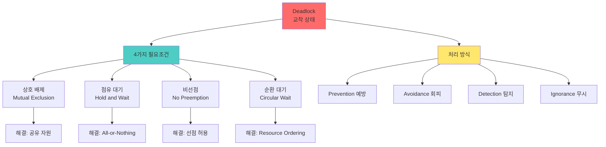

# 교착 상태 4가지 조건

## 🎯 핵심 인사이트

교착 상태(Deadlock)는 **둘 이상의 프로세스가 서로의 자원을 기다리며 영원히 진행하지 못하는 상태**다. Coffman이 정의한 4가지 필요조건(상호 배제, 점유 대기, 비선점, 순환 대기)이 **모두 만족해야만** 교착 상태가 발생한다.

---

## Ⅰ. 교착 상태의 정의

### 1-1. 개념

```
┌─────────────────────────────────────────────────────────────────────┐
│                   Deadlock (교착 상태)                              │
├─────────────────────────────────────────────────────────────────────┤
│                                                                     │
│  "둘 이상의 프로세스가 서로가 가진 자원을 기다리며                 │
│   영원히 blocked 되는 상태"                                        │
│                                                                     │
│  ┌─────────────────────────────────────────────────────────────┐    │
│  │                                                             │    │
│  │  Process A              Resource X              Process B   │    │
│  │  ┌──────┐                ┌──────┐               ┌──────┐   │    │
│  │  │      │◀───────────────│      │──────────────▶│      │   │    │
│  │  │ Holds│                │      │               │ Holds│   │    │
│  │  │   X  │───────────────▶│      │◀──────────────│   Y  │   │    │
│  │  │      │   wants Y      └──────┘   wants X     │      │   │    │
│  │  └──────┘                                ┌──────┐└──────┘   │    │
│  │                                          │      │           │    │
│  │                                          │   Y  │           │    │
│  │                                          └──────┘           │    │
│  │                                                             │    │
│  │  A: X 가짐 → Y 원함 → B가 Y을 안 놓음 → 대기               │    │
│  │  B: Y 가짐 → X 원함 → A가 X을 안 놓음 → 대기               │    │
│  │                                                             │    │
│  │  💀 서로가 서로를 기다림 → 영원히 진행 불가!                │    │
│  │                                                             │    │
│  └─────────────────────────────────────────────────────────────┘    │
│                                                                     │
│  유사 개념:                                                         │
│  • Livelock: 서로 양보만 하다가 아무도 진행 못 함                  │
│  • Starvation: 특정 프로세스만 계속 자원을 못 얻음                 │
│                                                                     │
└─────────────────────────────────────────────────────────────────────┘
```

### 1-2. 교착 상태 발생 예시

```
┌─────────────────────────────────────────────────────────────────────┐
│                    Deadlock 발생 예시                               │
├─────────────────────────────────────────────────────────────────────┤
│                                                                     │
│  예시: 두 스레드가 두 개의 Mutex 사용                              │
│                                                                     │
│  pthread_mutex_t mutexA, mutexB;                                   │
│                                                                     │
│  // Thread 1                        // Thread 2                    │
│  pthread_mutex_lock(&mutexA);       pthread_mutex_lock(&mutexB);   │
│  pthread_mutex_lock(&mutexB);       pthread_mutex_lock(&mutexA);   │
│  /* Critical Section */             /* Critical Section */         │
│  pthread_mutex_unlock(&mutexB);     pthread_mutex_unlock(&mutexA); │
│  pthread_mutex_unlock(&mutexA);     pthread_mutex_unlock(&mutexB); │
│                                                                     │
│  시간 순서:                                                         │
│  ┌──────────────────────────────────────────────────────────────┐   │
│  │  T1: lock(mutexA) ✓                                          │   │
│  │  T2: lock(mutexB) ✓                                          │   │
│  │  T1: lock(mutexB) ... 대기 (T2가 가짐)                       │   │
│  │  T2: lock(mutexA) ... 대기 (T1이 가짐)                       │   │
│  │                                                             │   │
│  │  💀 Deadlock! 서로가 서로의 mutex를 기다림                   │   │
│  └──────────────────────────────────────────────────────────────┘   │
│                                                                     │
└─────────────────────────────────────────────────────────────────────┘
```

> **📢 섹션 요약 비유**: Deadlock은 두 자동차가 좁은 다리에서 마주친 것이다. 한 쪽이 후진해야 하는데, 둘 다 "너 먼저"라며 기다린다. 결국 아무도 못 지나간다.

---

## Ⅱ. 교착 상태 4가지 필요조건 (Coffman)

### 2-1. 조건 개요

```
┌─────────────────────────────────────────────────────────────────────┐
│          Coffman's Four Necessary Conditions (1971)                │
├─────────────────────────────────────────────────────────────────────┤
│                                                                     │
│  "교착 상태는 다음 4가지 조건이 모두 만족해야 발생"                │
│  "하나라도 제거하면 교착 상태 발생 안 함!"                         │
│                                                                     │
│  ┌─────────────────────────────────────────────────────────────┐    │
│  │                                                             │    │
│  │     ┌──────────────┐                                        │    │
│  │     │   Mutual     │                                        │    │
│  │     │  Exclusion   │──────────────────┐                     │    │
│  │     └──────────────┘                  │                     │    │
│  │             │                         │                     │    │
│  │             ▼                         │                     │    │
│  │     ┌──────────────┐                  │                     │    │
│  │     │   Hold and   │                  │                     │    │
│  │     │    Wait      │────────────┐     │                     │    │
│  │     └──────────────┘            │     │                     │    │
│  │             │                   │     │                     │    │
│  │             ▼                   │     │                     │    │
│  │     ┌──────────────┐            │     │                     │    │
│  │     │ No Preemption│            │     │                     │    │
│  │     └──────────────┘            │     │                     │    │
│  │             │                   │     │                     │    │
│  │             ▼                   ▼     ▼                     │    │
│  │     ┌──────────────┐     ┌──────────────┐                  │    │
│  │     │   Circular   │────▶│   DEADLOCK   │                  │    │
│  │     │    Wait      │     └──────────────┘                  │    │
│  │     └──────────────┘                                        │    │
│  │                                                             │    │
│  └─────────────────────────────────────────────────────────────┘    │
│                                                                     │
│  4가지 모두 AND 조건 → 하나라도 없으면 Deadlock 없음              │
│                                                                     │
└─────────────────────────────────────────────────────────────────────┘
```

### 2-2. 조건 1: 상호 배제 (Mutual Exclusion)

```
┌─────────────────────────────────────────────────────────────────────┐
│           Condition 1: Mutual Exclusion (상호 배제)                 │
├─────────────────────────────────────────────────────────────────────┤
│                                                                     │
│  "자원은 한 번에 한 프로세스만 사용 가능"                          │
│                                                                     │
│  ┌─────────────────────────────────────────────────────────────┐    │
│  │                                                             │    │
│  │   Resource (자원)                                           │    │
│  │   ┌─────────────┐                                           │    │
│  │   │   Printer   │◀─── Only One ───▶ Process A              │    │
│  │   │   File      │                                           │    │
│  │   │   Mutex     │     Process B는 대기해야 함               │    │
│  │   └─────────────┘                                           │    │
│  │                                                             │    │
│  └─────────────────────────────────────────────────────────────┘    │
│                                                                     │
│  공유 가능 자원은 Deadlock 발생 안 함:                             │
│  • Read-only 파일                                                  │
│  • 공유 메모리 (읽기만)                                            │
│  • 코드 영역                                                       │
│                                                                     │
│  공유 불가능 자원만 Deadlock 가능:                                 │
│  • 프린터                                                          │
│  • 쓰기 파일                                                       │
│  • Mutex/Lock                                                      │
│                                                                     │
└─────────────────────────────────────────────────────────────────────┘
```

### 2-3. 조건 2: 점유 대기 (Hold and Wait)

```
┌─────────────────────────────────────────────────────────────────────┐
│             Condition 2: Hold and Wait (점유 대기)                  │
├─────────────────────────────────────────────────────────────────────┤
│                                                                     │
│  "자원을 가진 상태에서 다른 자원을 기다림"                         │
│                                                                     │
│  ┌─────────────────────────────────────────────────────────────┐    │
│  │                                                             │    │
│  │  Process A                                                  │    │
│  │  ┌──────────────────────────────────────────────────────┐   │    │
│  │  │                                                      │   │    │
│  │  │   Holds: Resource X  ───┐                            │   │    │
│  │  │                         │                            │   │    │
│  │  │   Waits for: Resource Y ◀┘  (다른 자원 기다림)       │   │    │
│  │  │                                                      │   │    │
│  │  │   자원을 보유한 채 대기 = Hold and Wait              │   │    │
│  │  │                                                      │   │    │
│  │  └──────────────────────────────────────────────────────┘   │    │
│  │                                                             │    │
│  └─────────────────────────────────────────────────────────────┘    │
│                                                                     │
│  점유 대기가 없는 경우:                                            │
│  • 모든 자원을 한 번에 요청 (All-or-Nothing)                       │
│  • 자원 없으면 아무것도 안 가짐                                    │
│  → Deadlock 발생 안 함                                             │
│                                                                     │
└─────────────────────────────────────────────────────────────────────┘
```

### 2-4. 조건 3: 비선점 (No Preemption)

```
┌─────────────────────────────────────────────────────────────────────┐
│              Condition 3: No Preemption (비선점)                    │
├─────────────────────────────────────────────────────────────────────┤
│                                                                     │
│  "자원을 강제로 뺏을 수 없음"                                      │
│                                                                     │
│  ┌─────────────────────────────────────────────────────────────┐    │
│  │                                                             │    │
│  │  Process A (자원 X 보유)                                    │    │
│  │       │                                                     │    │
│  │       │ 선점 시도 ❌                                        │    │
│  │       ▼                                                     │    │
│  │  Process B "줘봐!" → "안돼! 내가 쓰고 있어!"               │    │
│  │                                                             │    │
│  │  자원 반납은 자발적으로만 가능                              │    │
│  │  강제로 뺏을 수 없음                                        │    │
│  │                                                             │    │
│  └─────────────────────────────────────────────────────────────┘    │
│                                                                     │
│  선점 가능한 경우:                                                  │
│  • CPU (Time Slice)                                                │
│  • 메모리 (Swapping)                                               │
│  → 이런 자원은 Deadlock 발생 안 함                                 │
│                                                                     │
│  비선점 자원:                                                       │
│  • 프린터 (인쇄 중에는 못 뺏음)                                    │
│  • Mutex (Lock 가진 스레드만 Unlock)                               │
│  • 데이터베이스 Lock                                               │
│                                                                     │
└─────────────────────────────────────────────────────────────────────┘
```

### 2-5. 조건 4: 순환 대기 (Circular Wait)

```
┌─────────────────────────────────────────────────────────────────────┐
│              Condition 4: Circular Wait (순환 대기)                 │
├─────────────────────────────────────────────────────────────────────┤
│                                                                     │
│  "대기 그래프에 사이클이 존재"                                     │
│                                                                     │
│  ┌─────────────────────────────────────────────────────────────┐    │
│  │                                                             │    │
│  │           Process A                                         │    │
│  │              │                                              │    │
│  │   holds R1 ▲││ ▼ waits for R2                              │    │
│  │             ││                                              │    │
│  │     ┌───────┴┴───────┐                                      │    │
│  │     │                 │                                      │    │
│  │  R1 │                 │ R2                                   │    │
│  │     │                 │                                      │    │
│  │     │    ◀───────▶    │                                      │    │
│  │     │                 │                                      │    │
│  │  R4 │                 │ R3                                   │    │
│  │     │                 │                                      │    │
│  │     └───────┬┬───────┘                                      │    │
│  │             ││                                              │    │
│  │   waits for ▼││ ▲ holds R4                                  │    │
│  │              │                                              │    │
│  │           Process D                                         │    │
│  │                                                             │    │
│  │  사이클: A → R2 → B → R3 → C → R4 → D → R1 → A             │    │
│  │                                                             │    │
│  └─────────────────────────────────────────────────────────────┘    │
│                                                                     │
│  순환 대기가 없는 경우:                                            │
│  • 자원에 번호를 매겨 오름차순으로만 요청                          │
│  • 사이클 불가능                                                   │
│  → Deadlock 발생 안 함                                             │
│                                                                     │
└─────────────────────────────────────────────────────────────────────┘
```

> **📢 섹션 요약 비유**: 4가지 조건은 Deadlock의 "4가지 재료"다. 요리에 밀가루, 물, 소금, 불이 모두 필요하듯, Deadlock도 4가지가 다 있어야 한다. 하나라도 없으면 Deadlock 없다!

---

## Ⅲ. 조건 분석과 Deadlock 해결 전략

### 3-1. 조건별 해결 전략

```
┌─────────────────────────────────────────────────────────────────────┐
│             Deadlock 해결 전략 (조건 제거)                          │
├─────────────────────────────────────────────────────────────────────┤
│                                                                     │
│  ┌──────────────┬─────────────────┬─────────────────────────────┐  │
│  │   제거할 조건 │    전략         │        구현 방법            │  │
│  ├──────────────┼─────────────────┼─────────────────────────────┤  │
│  │ 상호 배제    │ 자원 공유       │ Read-only 자원, Spooling   │  │
│  │              │                 │ (어렵거나 불가능)          │  │
│  ├──────────────┼─────────────────┼─────────────────────────────┤  │
│  │ 점유 대기    │ All-or-Nothing │ 한 번에 모든 자원 요청     │  │
│  │              │                 │ 자원 없으면 아무것도 안 가짐│  │
│  ├──────────────┼─────────────────┼─────────────────────────────┤  │
│  │ 비선점       │ 선점 허용       │ 자원 뺏기 (Rollback)       │  │
│  │              │                 │ CPU, Memory는 가능         │  │
│  ├──────────────┼─────────────────┼─────────────────────────────┤  │
│  │ 순환 대기    │ 자원 순서화     │ 자원 번호 매기기           │  │
│  │              │                 │ 오름차순으로만 요청        │  │
│  └──────────────┴─────────────────┴─────────────────────────────┘  │
│                                                                     │
│  가장 실용적인 전략: 순환 대기 제거 (자원 계층)                    │
│                                                                     │
└─────────────────────────────────────────────────────────────────────┘
```

### 3-2. All-or-Nothing Request

```
┌─────────────────────────────────────────────────────────────────────┐
│               Hold and Wait 제거 (All-or-Nothing)                   │
├─────────────────────────────────────────────────────────────────────┤
│                                                                     │
│  // Before (Deadlock 가능)                                         │
│  lock(mutexA);                                                      │
│  // ... 뭔가 함 ...                                                │
│  lock(mutexB);  // 여기서 대기 중에 mutexA 계속 보유               │
│  // Critical Section                                               │
│  unlock(mutexB);                                                    │
│  unlock(mutexA);                                                    │
│                                                                     │
│  // After (Hold and Wait 제거)                                     │
│  // 모든 자원을 한 번에 요청                                       │
│  bool acquire_all() {                                               │
│      if (trylock(mutexA)) {                                        │
│          if (trylock(mutexB)) {                                    │
│              return true;  // 둘 다 성공!                          │
│          }                                                          │
│          unlock(mutexA);  // B 실패 → A도 반납                    │
│      }                                                              │
│      return false;  // 하나라도 실패 → 아무것도 안 가짐            │
│  }                                                                  │
│                                                                     │
│  while (!acquire_all()) {                                           │
│      // backoff 또는 다른 일                                       │
│  }                                                                  │
│  // Critical Section                                               │
│  unlock(mutexB);                                                    │
│  unlock(mutexA);                                                    │
│                                                                     │
│  ✅ 점유하면서 대기하지 않음 → Deadlock 불가능!                    │
│  ❌ 자원 효율성 떨어짐, 기아 가능성                                │
│                                                                     │
└─────────────────────────────────────────────────────────────────────┘
```

### 3-3. Resource Ordering (순환 대기 제거)

```
┌─────────────────────────────────────────────────────────────────────┐
│                Circular Wait 제거 (Resource Ordering)               │
├─────────────────────────────────────────────────────────────────────┤
│                                                                     │
│  // 자원에 번호 부여                                                │
│  // mutexA = 1, mutexB = 2, mutexC = 3                              │
│                                                                     │
│  // 항상 낮은 번호부터 Lock!                                        │
│  void safe_lock(pthread_mutex_t *a, pthread_mutex_t *b) {           │
│      if (a < b) {                                                   │
│          pthread_mutex_lock(a);                                     │
│          pthread_mutex_lock(b);                                     │
│      } else {                                                       │
│          pthread_mutex_lock(b);                                     │
│          pthread_mutex_lock(a);                                     │
│      }                                                              │
│  }                                                                  │
│                                                                     │
│  // 모든 스레드가 이 규칙을 따르면 사이클 불가능!                  │
│                                                                     │
│  ┌──────────────────────────────────────────────────────────────┐   │
│  │  T1: lock(A) → lock(B)  (1 → 2)                              │   │
│  │  T2: lock(B) → lock(C)  (2 → 3)                              │   │
│  │  T3: lock(A) → lock(C)  (1 → 3)                              │   │
│  │                                                             │   │
│  │  모든 Lock 순서가 오름차순 → 사이클 불가능! ✅               │   │
│  │                                                             │   │
│  │  증명: 역방향 Edge (높은 → 낮은)이 없으므로 사이클 없음     │   │
│  └──────────────────────────────────────────────────────────────┘   │
│                                                                     │
│  ✅ 가장 실용적이고 널리 쓰이는 방법                               │
│  ⚠️ 모든 코드가 규칙을 지켜야 함                                   │
│                                                                     │
└─────────────────────────────────────────────────────────────────────┘
```

> **📢 섹션 요약 비유**: Resource Ordering은 "줄 서기 규칙"이다. 번호표 순서로만 줄을 서면, 아무도 서로를 앞지르려다 막히는 일이 없다. 항상 앞번호부터 처리된다.

---

## Ⅳ. Deadlock 처리 방식 비교

### 4-1. 세 가지 접근법

```
┌─────────────────────────────────────────────────────────────────────┐
│                Deadlock 처리 방식 비교                              │
├─────────────────────────────────────────────────────────────────────┤
│                                                                     │
│  ┌──────────────┬───────────────────────────────────────────────┐  │
│  │    방식      │                 설명                          │  │
│  ├──────────────┼───────────────────────────────────────────────┤  │
│  │ Prevention   │ 4가지 조건 중 하나를 미리 제거               │  │
│  │ (예방)       │ - 가장 확실하지만 제약이 많음                │  │
│  │              │ - Resource Ordering이 가장 실용적             │  │
│  ├──────────────┼───────────────────────────────────────────────┤  │
│  │ Avoidance    │ 실행 중 상태를 보고 Deadlock 회피             │  │
│  │ (회피)       │ - Banker's Algorithm                         │  │
│  │              │ - 안전 상태인 경우만 자원 할당                │  │
│  ├──────────────┼───────────────────────────────────────────────┤  │
│  │ Detection    │ Deadlock 발생 후 탐지하고 복구               │  │
│  │ & Recovery   │ - 주기적으로 사이클 검사                     │  │
│  │ (탐지/복구)  │ - 프로세스 종료 또는 자원 선점                │  │
│  ├──────────────┼───────────────────────────────────────────────┤  │
│  │ Ignorance    │ Deadlock 무시 (타조 알고리즘)                │  │
│  │ (무시)       │ - "가끔 일어나니까 그냥 재부팅"              │  │
│  │              │ - Linux, Windows 등 대부분의 OS              │  │
│  └──────────────┴───────────────────────────────────────────────┘  │
│                                                                     │
│  실제 OS에서는 주로 Ignorance 사용                                 │
│  • Deadlock는 드묾                                                 │
│  • 예방/회피 비용이 큼                                             │
│  • 사용자가 알아서 처리 (재시작)                                   │
│                                                                     │
└─────────────────────────────────────────────────────────────────────┘
```

### 4-2. 타조 알고리즘 (Ostrich Algorithm)

```
┌─────────────────────────────────────────────────────────────────────┐
│                Ostrich Algorithm (타조 알고리즘)                    │
├─────────────────────────────────────────────────────────────────────┤
│                                                                     │
│  "Deadlock? 모르는 척하자! 🦃"                                     │
│                                                                     │
│  ┌──────────────────────────────────────────────────────────────┐   │
│  │                                                             │    │
│  │  타조가 위험을 보면 모래에 머리를 묻는다는 속설에서 유래    │    │
│  │  (실제로는 그렇지 않지만...)                                │    │
│  │                                                             │    │
│  │  철학:                                                      │    │
│  │  • Deadlock은 매우 드물게 발생                             │    │
│  │  • 예방/회피/탐지 비용이 발생 빈도보다 큼                   │    │
│  │  • 발생하면 사용자가 재부팅하면 됨                          │    │
│  │                                                             │    │
│  │  사용처:                                                    │    │
│  │  • Linux, Windows, macOS 등 대부분의 OS                    │    │
│  │  • 대부분의 데이터베이스 (Lock timeout으로 일부 방어)       │    │
│  │  • 대부분의 애플리케이션                                    │    │
│  │                                                             │    │
│  └──────────────────────────────────────────────────────────────┘    │
│                                                                     │
│  언제 다른 방법 쓰나?                                               │
│  • 미션 크리티컬 시스템 (원자력, 항공, 의료)                       │
│  • 실시간 시스템                                                   │
│  • Deadlock 발생이 잦은 환경                                       │
│                                                                     │
└─────────────────────────────────────────────────────────────────────┘
```

> **📢 섹션 요약 비유**: 타조 알고리즘은 "가끔 꺼지는 전등" 같다. 꺼지면 다시 켜면 된다. 전등을 항상 켜두기 위해 복잡한 장치를 설치하는 것보다 낫다.

---

## Ⅴ. 시험 핵심 정리

### 5-1. 암기 포인트

```
┌─────────────────────────────────────────────────────────────────────┐
│                     📝 시험 암기 포인트                             │
├─────────────────────────────────────────────────────────────────────┤
│                                                                     │
│  1. 4가지 필요조건 (모두 만족해야 Deadlock)                        │
│     • Mutual Exclusion (상호 배제)                                 │
│     • Hold and Wait (점유 대기)                                    │
│     • No Preemption (비선점)                                       │
│     • Circular Wait (순환 대기)                                    │
│                                                                     │
│  2. 각 조건 제거 방법                                               │
│     • 상호 배제: 공유 자원 사용 (어려움)                           │
│     • 점유 대기: All-or-Nothing 요청                               │
│     • 비선점: 선점 가능 자원 사용                                  │
│     • 순환 대기: Resource Ordering (가장 실용적)                   │
│                                                                     │
│  3. Deadlock 처리 방식                                              │
│     • Prevention: 조건 미리 제거                                   │
│     • Avoidance: Banker's Algorithm                                │
│     • Detection & Recovery: 탐지 후 복구                           │
│     • Ignorance: 타조 알고리즘 (실제 OS)                           │
│                                                                     │
│  4. AND vs OR                                                       │
│     • 4가지 조건: AND (모두 만족해야 Deadlock)                     │
│     • 해결책: OR (하나만 제거해도 Deadlock 방지)                   │
│                                                                     │
│  5. Resource Ordering                                               │
│     • 자원에 번호 부여                                              │
│     • 항상 오름차순으로 요청                                        │
│     • 사이클 불가능 → Deadlock 방지                                │
│                                                                     │
└─────────────────────────────────────────────────────────────────────┘
```

> **📢 섹션 요약 비유**: 시험에서 Deadlock 4가지 조건이 나오면 "4가지 열쇠"를 떠올려라. 문을 열려면(Deadlock이 되려면) 4개 다 있어야 한다. 하나라도 없으면 문이 안 열린다(Deadlock 안 됨)!

---

## 📊 개념 맵



---

## 👧 Child Analogy

교착 상태 4가지 조건은 **4명이 4개의 자전거를 타고 교차로에서 서로를 막은 상황**과 같아요!

```
┌─────────────────────────────────────────────────────────┐
│              🚲 교차로 교착 상태 🚲                      │
├─────────────────────────────────────────────────────────┤
│                                                         │
│            철수 ▶                                        │
│              │                                          │
│              │     ▼ 영희                               │
│              │    ◀─────                                │
│              │                                          │
│   민수 ◀─────┼──────────                                │
│              │                                          │
│              │     ▶ 수지                               │
│              ▼                                          │
│                                                         │
│  4가지 조건:                                            │
│  1️⃣ 상호 배제: 길은 한 명만 지나갈 수 있어요          │
│  2️⃣ 점유 대기: 각자 길을 막은 채 앞을 기다려요        │
│  3️⃣ 비선점: 앞 사람을 밀어낼 수 없어요                 │
│  4️⃣ 순환 대기: 철수→영희→수지→민수→철수 기다림        │
│                                                         │
│  해결책:                                                │
│  • 신호등 만들기 (순서 정하기) ✅                       │
│  • 한 명이 양보하기 (비선점 깨기)                       │
│  • 모두 한 번에 지나가기 (점유 대기 없애기)             │
│                                                         │
│  이게 바로 Deadlock이에요!                              │
└─────────────────────────────────────────────────────────┘
```

컴퓨터에서도 프로그램들이 서로 자원을 가진 채 기다리면, 이렇게 다 막혀버려요!
