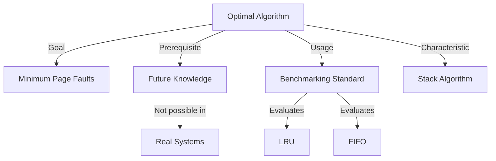

+++
weight = 402
title = "402. 최적 교체 알고리즘 (OPT, Optimal)"
+++

## 핵심 인사이트 (3줄 요약)
> 1. **본질**: 최적 교체 알고리즘(OPT, Optimal)은 향후 가장 오랫동안 사용되지 않을 페이지를 교체 대상으로 선정하여 이론상 최저의 페이지 부재율을 달성하는 알고리즘이다.
> 2. **이론적 가치**: 미래의 페이지 참조 정보를 미리 알아야 한다는 전제 조건 때문에 실제 구현은 불가능하나, 다른 알고리즘들의 성능을 평가하는 절대적인 비교 척도(Benchmark)로 활용된다.
> 3. **특징**: Belady의 모순(Belady's Anomaly)이 발생하지 않으며, 고정된 프레임 수 내에서 달성할 수 있는 최적의 효율성을 증명한다.

---

### Ⅰ. 개요 (Context & Background)

- **概念**: **최적 교체 알고리즘 (OPT, Optimal)**은 '미래 예측'에 기반한 페이지 교체 전략이다. 물리 메모리의 모든 프레임이 가득 찼을 때, 현재 상주하는 페이지들 중 가장 먼 미래에 다시 쓰일(혹은 영영 쓰이지 않을) 페이지를 골라 내보낸다.

- **💡 비유**: 이것은 **"예언자의 장바구니 정리"**와 같다. 냉장고가 꽉 찼을 때, 앞으로 일주일 동안 절대 먹지 않을 음식을 정확히 알고 그것부터 버리는 것과 같다. 예언자가 아니라면 불가능한 일이지만, 결과적으로는 가장 효율적인 냉장고 관리가 된다.

- **등장 배경**:
  1. **한계 측정**: FIFO 등 초기 알고리즘의 비효율성을 발견한 후, "과연 어디까지 성능을 높일 수 있는가?"에 대한 답이 필요했다.
  2. **성능 상한선(Upper Bound)**: 모든 운영체제 설계자들에게 목표 지향점을 제시하기 위해 정의되었다.

- **📢 섹션 요약 비유**: 미래를 보는 거울이 있다면 선택할 수 있는 가장 완벽한 한 수입니다.

---

### Ⅱ. 아키텍처 및 핵심 원리 (Deep Dive)

#### OPT 알고리즘 작동 메커니즘 (ASCII Diagram)

참조열: `1, 2, 3, 4, 1, 2, 5, 1, 2, 3, 4, 5` (3 Frames 기준)

```text
  [ Time ]   T1   T2   T3   T4   T5   T6   T7   T8   T9   T10  T11  T12
  [ Ref  ]    1    2    3    4    1    2    5    1    2    3    4    5
             ───  ───  ───  ───  ───  ───  ───  ───  ───  ───  ───  ───
  [ F1   ]   [1]  [1]  [1]  [4]  [4]  [4]  [4]  [4]  [4]  [3]  [3]  [3]
  [ F2   ]        [2]  [2]  [2]  [1]  [1]  [1]  [1]  [1]  [1]  [4]  [4]
  [ F3   ]             [3]  [3]  [2]  [2]  [5]  [5]  [5]  [5]  [5]  [5]
             ───  ───  ───  ───  ───  ───  ───  ───  ───  ───  ───  ───
  [ Fault]    F    F    F    F              F              F    F
```

**[다이어그램 해설]** 
- T4 시점에 페이지 4가 필요하지만 프레임이 꽉 찼다. 
- 현재 메모리에는 {1, 2, 3}이 있다. 
- 미래를 보니 1은 T5에, 2는 T6에 쓰이지만, 3은 한참 뒤인 T10에 쓰인다. 
- 따라서 가장 나중에 쓰일 **페이지 3을 희생자(Victim)**로 선정하여 교체한다.

#### OPT의 주요 특징 (표)

| 항목 | 내용 | 비유 |
|:---|:---|:---|
| **실현 가능성** | 낮음 (미래 참조열 예측 불가) | 신의 영역 |
| **성능 (부재율)** | 최저 (Optimal) | 만점 성적표 |
| **스택 알고리즘** | 해당됨 (Belady's Anomaly 없음) | 프레임이 많으면 무조건 유리 |
| **주요 용도** | 비교 연구, 벤치마킹 기준 | 금본위제의 '금' |

- **📢 섹션 요약 비유**: 앞날을 미리 알고 가장 늦게 필요한 물건을 창고 깊숙이 넣거나 내다 버리는 지혜로운 관리법입니다.

---

### Ⅲ. 융합 비교 및 다각도 분석

#### OPT vs FIFO vs LRU

| 구분 | OPT (Optimal) | FIFO (First-In) | LRU (Least Recently) |
|:---|:---|:---|:---|
| **판단 기준** | 미래 참조 시간 | 과거 적재 시간 | 과거 참조 시간 |
| **구현 난이도** | 불가 | 매우 쉬움 | 보통/어려움 |
| **효율성** | 최상 | 낮음 | 상 |
| **철학** | "나중에 쓸 건 버리자" | "오래된 건 버리자" | "최근에 안 쓴 건 버리자" |

- **📢 섹션 요약 비유**: 시험 문제를 미리 알고 공부하는 것(OPT)과, 그냥 교과서 순서대로 공부하는 것(FIFO), 최근에 안 나온 문제 위주로 공부하는 것(LRU)의 차이입니다.

---

### Ⅳ. 실무 적용 및 기술사적 판단

#### 왜 OPT는 구현할 수 없는가?
컴퓨터 시스템에서 프로세스가 미래에 어떤 주소를 참조할지는 사용자 입력, 데이터 조건 등에 따라 동적으로 변하기 때문에 100% 예측이 불가능하다. 이는 **정지 문제(Halting Problem)**와 유사한 맥락에서 결정 불가능한 영역에 가깝다. 기술사적 관점에서 OPT는 실무용 기술이 아니라, 우리가 만든 알고리즘이 "얼마나 이상적인 상태에 근접했는가"를 측정하는 **상향선(Upper Bound)**으로서의 의미를 가진다.

- **📢 섹션 요약 비유**: 100m 달리기에서 '빛의 속도'라는 한계가 있듯이, 소프트웨어 공학에서 페이지 교체의 성능 한계를 규정하는 기준점입니다.

---

### Ⅴ. 기대효과 및 결론

#### OPT 알고리즘의 존재 이유
1. **평가 척도 제공**: 새로운 알고리즘을 제안할 때 OPT 대비 성능을 제시하여 객관성을 확보한다.
2. **이론적 토대**: '미래 예측'이라는 관점이 나중에 '과거 기록을 통한 미래 예측(LRU)'으로 발전하는 계기가 되었다.
3. **최적화 방향성**: 시스템 설계 시 불필요한 자원 낭비를 줄이는 가장 완벽한 시나리오를 시뮬레이션할 수 있게 한다.

- **📢 섹션 요약 비유**: 비록 현실에서 도달할 수는 없지만, 북극성처럼 우리가 나아가야 할 최적의 방향을 알려주는 이정표입니다.

---

### 📌 관련 개념 맵
- **페이지 참조열 (Reference String)**: OPT 연산의 입력값.
- **Belady의 모순 (Belady's Anomaly)**: OPT가 극복한 FIFO의 문제점.
- **LRU (Least Recently Used)**: OPT를 현실적으로 모사하려는 시도.

---

### 👶 어린이를 위한 3줄 비유 설명
1. 최적 교체는 내일 어떤 장난감을 가지고 놀지 미리 다 알고 있는 **"마법사 규칙"**이에요.
2. 내일 안 가지고 놀 장난감만 쏙쏙 골라서 정리함에 넣으니까, 장난감을 다시 꺼내러 갈 일이 제일 적어요.
3. 실제로는 내일 마음이 어떻게 변할지 모르니까 마법사가 아니면 따라 하기 힘들답니다!

---

### 🚀 지식 그래프 (Knowledge Graph)

