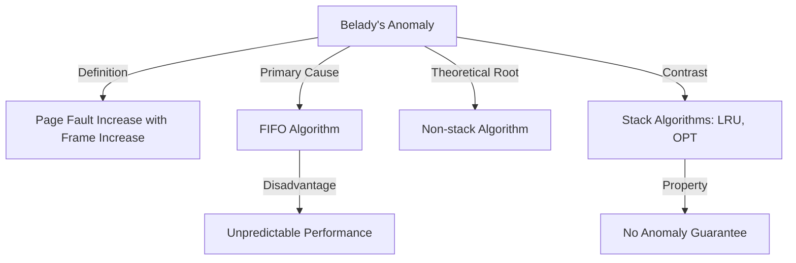

+++
weight = 403
title = "403. 벨라디의 모순 (Belady's Anomaly)"
+++

## 핵심 인사이트 (3줄 요약)
> 1. **본질**: 벨라디의 모순(Belady's Anomaly)은 페이지 교체 알고리즘(특히 FIFO)에서 가용 프레임 수가 늘어났음에도 불구하고 오히려 페이지 부재율이 증가하는 기현상을 의미한다.
> 2. **원인**: FIFO와 같이 과거의 참조 기록이나 미래의 필요성을 고려하지 않는 비스택(Non-stack) 알고리즘에서 발생하며, 할당된 자원의 증가가 성능 향상을 보장하지 않음을 보여준다.
> 3. **의의**: 알고리즘 설계 시 '프레임 수의 증가 = 부재율 감소'라는 상식을 깨뜨림으로써, 스택 알고리즘(LRU, OPT 등)의 중요성을 입증하는 이론적 근거가 된다.

---

### Ⅰ. 개요 (Context & Background)

- **概念**: **벨라디의 모순 (Belady's Anomaly)**은 1969년 라즐로 벨라디(Laszlo Belady)가 발견한 현상이다. 상식적으로 메모리(프레임)를 더 많이 주면 페이지 부재가 줄어들어야 하지만, 특정 알고리즘과 특정 참조열의 조합에서는 정반대의 결과가 나타난다.

- **💡 비유**: 이것은 **"서랍을 늘렸는데 물건 찾기가 더 힘들어지는 상황"**과 같다. 책상 서랍을 3개에서 4개로 늘렸는데, 물건을 정리하는 규칙(FIFO)이 엉뚱해서 예전보다 원하는 물건을 찾지 못해 계속 창고에 다녀와야 하는 모순적인 상황이다.

- **발생 조건**:
  1. **알고리즘**: 주로 FIFO(First-In, First-Out) 알고리즘에서 관찰된다.
  2. **참조열**: 특정 패턴의 페이지 요청이 반복될 때 발생한다. (예: `1, 2, 3, 4, 1, 2, 5, 1, 2, 3, 4, 5`)

- **📢 섹션 요약 비유**: 돈(자원)을 더 많이 투자했는데 오히려 성적이 떨어지는 투자의 역설과 같습니다.

---

### Ⅱ. 아키텍처 및 핵심 원리 (Deep Dive)

#### Belady's Anomaly 증명 (ASCII Diagram)

참조열: `1, 2, 3, 4, 1, 2, 5, 1, 2, 3, 4, 5`

**[ Case 1: 3 Frames ]**
```text
  Ref: 1 2 3 4 1 2 5 1 2 3 4 5
  F1:  1 1 1 4 4 4 5 5 5 3 3 3
  F2:    2 2 2 1 1 1 2 2 2 4 4
  F3:      3 3 3 2 2 2 1 1 1 5
  F/H: F F F F F F F F F F F F (Total: 9 Faults)
  *실제 계산 시 9회 발생 (일부 Hit 제외)*
```

**[ Case 2: 4 Frames ]**
```text
  Ref: 1 2 3 4 1 2 5 1 2 3 4 5
  F1:  1 1 1 1 1 1 5 5 5 5 4 4
  F2:    2 2 2 2 2 2 1 1 1 1 5
  F3:      3 3 3 3 3 3 2 2 2 2
  F4:        4 4 4 4 4 4 3 3 3
  F/H: F F F F H H F F F F F F (Total: 10 Faults)
```

**[다이어그램 해설]** 프레임이 3개일 때는 부재가 9번 발생했는데, 프레임을 4개로 늘리니 오히려 10번으로 늘어났다. 이는 FIFO가 현재 필요한 페이지가 무엇인지 상관없이 단순히 '가장 오래된 것'을 내보내기 때문에 발생하는 문제다.

#### 왜 발생하는가? (스택 알고리즘 vs 비스택 알고리즘)

| 구분 | 스택 알고리즘 (Stack Algorithm) | 비스택 알고리즘 (Non-stack) |
|:---|:---|:---|
| **정의** | n개 프레임에 있는 페이지가 n+1개 프레임에 항상 포함됨 | 포함 관계를 보장하지 않음 |
| **종류** | LRU, OPT | FIFO |
| **모순 발생** | 절대 발생하지 않음 | 발생 가능성 있음 |

- **📢 섹션 요약 비유**: 작은 상자에 든 내용물이 큰 상자에도 반드시 들어있다는 보장(Stack)이 깨질 때 생기는 이상 현상입니다.

---

### Ⅲ. 융합 비교 및 다각도 분석

#### FIFO의 한계와 모순의 함의

1. **단순함의 대가**: FIFO는 구현이 가장 쉽지만, 메모리 증설이라는 하드웨어적 해결책이 통하지 않을 수 있다는 치명적 단점이 있다.
2. **예측 불가능성**: 부하가 늘어날 때 자원을 추가 투입해도 성능이 개선되지 않으므로 시스템 안정성 예측이 어렵다.
3. **학습의 필요성**: 과거의 참조 패턴을 기억하거나(LRU) 미래를 예측하는(OPT) 지능적인 교체 알고리즘이 왜 필요한지를 역설적으로 보여준다.

- **📢 섹션 요약 비유**: 무조건 줄을 선 순서대로만 처리하는 고집불통 행정이 자원이 늘어나도 비효율적인 것과 같습니다.

---

### Ⅳ. 실무 적용 및 기술사적 판단

#### 실무적 시사점: 자원 할당 정책의 수립
기술사적 관점에서 벨라디의 모순은 "자원의 양(Quantity)보다 관리의 질(Quality)이 중요하다"는 것을 시사한다. 가상 메모리 시스템을 튜닝할 때 단순히 RAM을 늘리는 것에 그치지 않고, 현재 운영체제가 어떤 페이지 교체 알고리즘을 사용하는지, 워크로드의 특성이 FIFO에 취약한 패턴은 아닌지를 분석해야 한다. 현대 운영체제는 대부분 LRU 근사 알고리즘을 사용하여 이 모순을 회피한다.

- **📢 섹션 요약 비유**: 엔진 성능을 높이는 것(RAM 증설)보다 운전 습관을 고치는 것(알고리즘 최적화)이 연비 향상에 더 큰 도움이 될 때가 있습니다.

---

### Ⅴ. 기대효과 및 결론

#### 벨라디의 모순 연구를 통한 발전
1. **스택 알고리즘의 발전**: 이 모순을 겪지 않는 LRU 등의 알고리즘이 연구되는 기폭제가 되었다.
2. **알고리즘 검증 표준**: 새로운 교체 알고리즘이 개발될 때 'Belady's Anomaly로부터 자유로운가'는 필수 검증 항목이다.
3. **시스템 최적화 지침**: 무조건적인 자원 증설 대신 지능적인 자원 스케줄링의 중요성을 인식하게 되었다.

- **📢 섹션 요약 비유**: '다다익선'이 항상 정답은 아니라는 것을 알려주는, 전산학의 가장 흥미로운 경고 중 하나입니다.

---

### 📌 관련 개념 맵
- **FIFO (First-In First-Out)**: 모순의 주범이 되는 알고리즘.
- **스택 알고리즘 (Stack Algorithm)**: 모순을 극복한 알고리즘의 분류.
- **LRU (Least Recently Used)**: 모순이 발생하지 않는 대표적 알고리즘.

---

### 👶 어린이를 위한 3줄 비유 설명
1. 벨라디의 모순은 가방을 더 큰 걸로 바꿨는데, 오히려 물건을 담기가 더 불편해지는 이상한 일이에요.
2. 무조건 먼저 넣은 물건부터 빼는 규칙 때문에, 지금 꼭 필요한 물건을 실수로 빼버려서 생기는 일이죠.
3. 물건을 정리할 때는 상자의 크기보다 **"어떤 물건을 뺄지"** 정하는 규칙이 더 중요하다는 걸 가르쳐준답니다!

---

### 🚀 지식 그래프 (Knowledge Graph)

