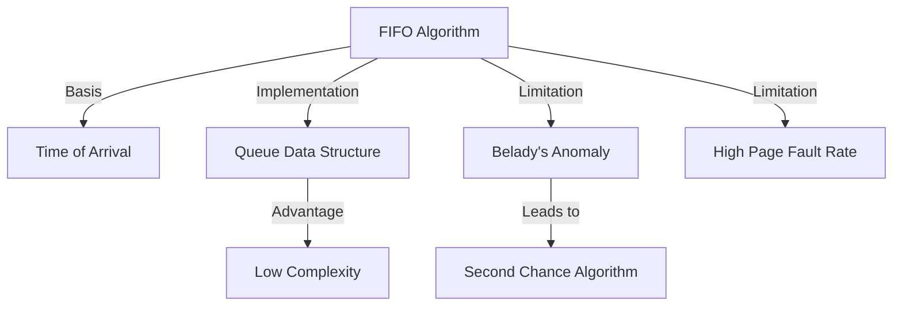

+++
weight = 404
title = "404. FIFO (First-In, First-Out) 교체"
+++

## 핵심 인사이트 (3줄 요약)
> 1. **본질**: FIFO(First-In, First-Out) 교체 알고리즘은 메모리에 적재된 시간이 가장 오래된 페이지를 우선적으로 교체 대상으로 선정하는 방식이다.
> 2. **구현**: 각 페이지가 적재된 시간을 기록하거나 큐(Queue) 자료구조를 사용하여 순차적으로 관리하므로 구현이 매우 단순하고 오버헤드가 적다.
> 3. **한계**: 페이지의 실제 사용 빈도나 중요도를 전혀 고려하지 않으며, 프레임 수가 늘어나도 부재율이 증가하는 Belady의 모순(Belady's Anomaly)이 발생할 수 있다.

---

### Ⅰ. 개요 (Context & Background)

- **概念**: **FIFO (First-In, First-Out)**는 가장 먼저 들어온 페이지가 가장 먼저 나간다는 단순한 논리에 기반한다. 페이지가 메모리에 들어온 순서를 기억하고, 교체가 필요할 때 '최고참' 페이지를 희생자(Victim)로 삼는다.

- **💡 비유**: 이것은 **"선입선출 대기열"**과 같다. 은행 창구에 먼저 온 손님이 먼저 업무를 보고 나가는 것처럼, 메모리라는 한정된 공간에 먼저 자리를 잡은 페이지가 나갈 때도 1순위가 되는 방식이다.

- **특징**:
  1. **단순성**: 복잡한 계산이나 하드웨어적 참조 기록 없이도 동작 가능하다.
  2. **공정성(?)**: 먼저 온 데이터를 먼저 처리한다는 측면에서는 논리적이지만, 메모리 관리 효율성 측면에서는 '무식한' 방식에 가깝다.
  3. **비효율성**: 자주 사용되는 페이지라도 단순히 '일찍 들어왔다'는 이유만으로 쫓겨날 수 있다.

- **📢 섹션 요약 비유**: 들어온 날짜만 따지는 엄격한 연공서열 위주의 인사 관리 시스템입니다.

---

### Ⅱ. 아키텍처 및 핵심 원리 (Deep Dive)

#### FIFO 작동 메커니즘 (ASCII Diagram)

참조열: `1, 2, 3, 4, 1, 2, 5, 1, 2, 3, 4, 5` (3 Frames)

```text
  [ Time ]   T1   T2   T3   T4   T5   T6   T7   T8   T9   T10  T11  T12
  [ Ref  ]    1    2    3    4    1    2    5    1    2    3    4    5
             ───  ───  ───  ───  ───  ───  ───  ───  ───  ───  ───  ───
  [ F1   ]   [1]  [1]  [1]  [4]  [4]  [4]  [5]  [5]  [5]  [5]  [5]  [5]
  [ F2   ]        [2]  [2]  [2]  [1]  [1]  [1]  [1]  [1]  [3]  [3]  [3]
  [ F3   ]             [3]  [3]  [3]  [2]  [2]  [2]  [2]  [2]  [4]  [4]
             ───  ───  ───  ───  ───  ───  ───  ───  ───  ───  ───  ───
  [ Fault]    F    F    F    F    F    F    F              F    F
```

**[다이어그램 해설]**
- T4 시점: 페이지 4가 들어올 때, 가장 먼저 들어왔던 **페이지 1**이 제거된다.
- T5 시점: 방금 나갔던 **페이지 1**이 다시 필요해졌다. FIFO는 이를 전혀 예측하지 못하고 다시 부재를 일으키며 페이지 2를 내보낸다.
- 이처럼 '빈번하게 사용되는 페이지'를 보존하지 못하는 것이 FIFO의 치명적 약점이다.

#### FIFO의 구조적 특징 (표)

| 항목 | 상세 내용 | 비유 |
|:---|:---|:---|
| **관리 기법** | FIFO Queue 또는 Timestamp | 출석부 |
| **시간 복잡도** | O(1) (큐의 head만 확인) | 순식간에 결정 |
| **공간 복잡도** | O(N) (프레임 수만큼의 포인터) | 가벼운 장부 |
| **성능 변동성** | 매우 큼 (참조열에 민감) | 운에 맡기는 관리 |

- **📢 섹션 요약 비유**: 줄 서 있는 사람 중 맨 앞사람을 기계적으로 내보내는 단순하고 빠른 자동문과 같습니다.

---

### Ⅲ. 융합 비교 및 다각도 분석

#### FIFO의 문제점과 변형들

1. **Belady의 모순**: 프레임을 3개에서 4개로 늘렸을 때 오히려 성능이 떨어질 수 있는 논리적 결함이 있다.
2. **초기 로드 페이지의 수난**: 프로그램 실행 초기 필수적인 라이브러리나 전역 변수가 담긴 페이지들이 '오래되었다'는 이유로 계속 쫓겨나 성능을 저하시킨다.
3. **대안의 등장**: 이러한 문제를 해결하기 위해 FIFO에 '참조 비트'를 추가한 **Second-Chance 알고리즘(Clock Algorithm)**이 등장하게 되었다.

- **📢 섹션 요약 비유**: 무조건 낡았다고 골동품을 버리는 바람에, 정작 귀중한 가보까지 잃어버리는 우를 범할 수 있습니다.

---

### Ⅳ. 실무 적용 및 기술사적 판단

#### 왜 아직도 FIFO를 배우는가?
실제 범용 OS(Windows, Linux 등)의 메인 교체 알고리즘으로 FIFO가 단독 사용되는 경우는 거의 없다. 하지만 **(1) 시스템 오버헤드가 극도로 제한된 임베디드 환경**, **(2) 알고리즘의 초기 모델로서의 교육적 가치**, **(3) 다른 알고리즘의 기초 모듈(예: 버퍼 관리)**로서의 의미가 크다. 기술사는 FIFO의 한계를 명확히 인지하고, 이를 보완한 변형 알고리즘들이 어떤 트레이드오프를 통해 성능을 개선했는지 설명할 수 있어야 한다.

- **📢 섹션 요약 비유**: 덧셈 뺄셈(FIFO)을 알아야 미분 적분(LRU 근사)을 이해할 수 있는 것과 같은 기초 체력입니다.

---

### Ⅴ. 기대효과 및 결론

#### FIFO의 정성적 가치
1. **예측 가능성(구현 측면)**: 어떤 페이지가 나갈지 코드로 짜기가 매우 명확하다.
2. **낮은 유지비용**: 페이지를 참조할 때마다 기록을 갱신할 필요가 없어 CPU 시간을 절약한다.
3. **발전의 디딤돌**: FIFO의 실패 사례를 분석함으로써 운영체제 이론이 더욱 견고해졌다.

- **📢 섹션 요약 비유**: 완벽하지는 않지만 가장 정직하고 투명하게 순서를 지키는, 관제 시스템의 최소 기준선입니다.

---

### 📌 관련 개념 맵
- **페이지 부재 (Page Fault)**: FIFO가 해결해야 할 문제.
- **Belady의 모순 (Belady's Anomaly)**: FIFO의 가장 유명한 약점.
- **2차 기회 알고리즘 (Second-Chance)**: FIFO의 진화 형태.

---

### 👶 어린이를 위한 3줄 비유 설명
1. FIFO는 장난감 상자가 꽉 찼을 때, **"가장 옛날에 산 장난감"**부터 버리는 규칙이에요.
2. 어제 산 장난감이 오늘 꼭 필요해도, 그냥 오래됐다는 이유로 버려질 수 있어서 조금 속상할 때가 있죠.
3. 하지만 누가 제일 오래됐는지만 보면 되니까 규칙이 아주 단순해서 지키기 쉽답니다!

---

### 🚀 지식 그래프 (Knowledge Graph)

